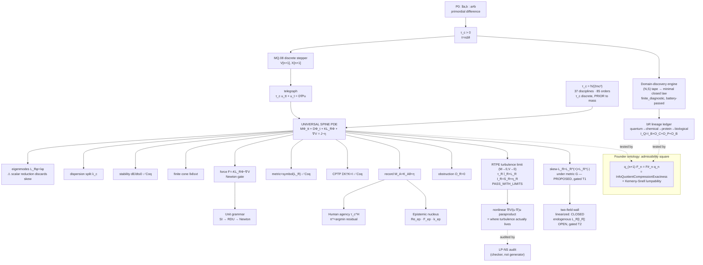

## Genesis of the Universe, Step by Step — Genesis Step-by-Step v3.1
### A World-Class AI Equation Book — Standalone Source of Truth (extended edition)

> **Edition:** v3.1 (2026-07-21) · `research_universal_solver` · node N10 (superset over the v3.0
> lineage, prepared for consolidation)
> **Claim boundary:** readout-not-truth. Verified MATH ≠ true physics. Structure can be
> machine-checked; physical numbers require laboratory measurement. Every sentence in this book that
> makes a claim carries a tier tag — `[Th_coqc]` (axiom-free, machine-checked in Coq) ·
> `[finite_diagnostic]` (measured/computed on a finite instance, reproducible, not a continuum proof) ·
> `[Dr]` (human/AI narrative judgment, doctrine-consistent but not machine-checked) ·
> `[Open]` (unresolved, explicitly not claimed). A label is only as honest as the weakest link that
> produced it — a "machine-checked" theorem over an arithmetic tautology is **hollow** if it does not
> discharge the physical content it is named for, and this book says so in place, in the open, rather
> than upgrading the label to make the result read stronger than it is. This is not a stylistic
> preference; it is the accreditation discipline the whole project stands or falls on.
> **Native unit:** RD (retained-difference / information unit). SI is an **adapter**, not the ground
> floor — every SI quantity that appears anywhere in this book is understood as a *readout* of an RD
> quantity through a domain-specific translation, never as a restatement of what is fundamentally there.
> **This file is the STORYTELLER.** Its job is narrative continuity — the universe unfolding from one
> root, one step at a time, so that a reader (human or AI) can walk the whole arc without a gap. It is
> not a proof archive; the proof archive is the `.v`/`.py` formal layer it points to at every step.

---

## 📖 Table of Contents

**16 major sections** (2 front-matter + 14 Parts) **+ Appendix A**, **141 subsections**, ~6,980 lines.
Read top to bottom for the full arc, or jump by Part.

**Front matter**
- [⬛ THE ONE-LINE MASTER EQUATION — the weld](#the-one-line-master-equation) — the whole book compresses to one identity; forcing ledger for every term
- [Version Reconciliation](#version-reconciliation) — the three lineage streams this consolidates
- [Founder Ontology — the spine of meaning](#founder-ontology--the-spine-of-meaning) — the base doctrine

**The universe, unfolding step by step**
1. [PART I — Root Axioms: what is first?](#part-i--root-axioms-what-is-first) — δ_R, the resource-logic floor, L_R := D_W − W
2. [PART II — The Universal Equation](#part-ii--the-universal-equation) — the spine PDE, term-by-term tiers, the three layers, and the DRL–Telegraph two-field (Φ,Ψ) apparatus
3. [PART III — The Twelve Faces of the Spine](#part-iii--the-twelve-faces-of-the-spine)
4. [PART IV — The τ_c Scale Bus](#part-iv--the-τ_c-scale-bus) — τ_c prior to mass; the PGFT-RDU native-unit gateway
5. [PART V — Domain Leaves (domain = translation)](#part-v--domain-leaves-domain--translation) — all leaves incl. the reserved Neuron/Connectome TBD slots; the Scalar-Eigenmode Reduction Error; **V.16 registered domain: Chemistry** (`domains/chem/`, the first leaf to pass the [Domain Registration Standard](domains/DOMAIN_REGISTRATION_STANDARD.md))
6. [PART V-A — Domain Emergence and Translation Sufficiency](#part-v-a--domain-emergence-and-translation-sufficiency) — the exact-quotient gate and the **seven general gates**
7. [PART VI-A — Domain-Neutral Extraction and the Maker–Checker Epistemic Firewall](#part-vi-a--domain-neutral-extraction-and-the-makerchecker-epistemic-firewall)
8. [PART VI — The Epistemic Nuclear Core](#part-vi--the-epistemic-nuclear-core)
9. [PART VII — Unit Grammar & Newton Gate](#part-vii--unit-grammar--newton-gate)
10. [PART VIII — Human Agency: the τ_c^H loop, the waking self, and Ω_H](#part-viii--human-agency-the-τ_ch-loop-the-waking-self-and-ω_h) — imagination as reversible skew-transport
11. [PART IX — The 42-Step Genesis Stream](#part-ix--the-42-step-genesis-stream-v31-extended) — all 42 steps, root → end
12. [PART X — Formal Floor (Coq-checked structure)](#part-x--formal-floor-coq-checked-structure--v31)
13. [PART XI — Claim Discipline & Readout-Not-Truth](#part-xi--claim-discipline--readout-not-truth--v31) — non-claims + the must-not-enter-root list
14. [PART XII — Executable Guards](#part-xii--executable-guards--v31)

**Appendix**
- [Appendix A — v0.11 Turbulence-Integrated carry-forward](#appendix-a-v011-carry-forward--turbulence-integrated-equations-preserved-verbatim) — 13 equations/lists from the earlier turbulence-integrated snapshot, preserved verbatim with honest tiers (memory kernel, DRL→RTPE bridge, LP/NS residual, readability, modal audit, cost, theorem regimes, continuum map, scalar-reduction gate, runtime protocol, open items)
- [Appendix B — External-paper integration (2026-07-21)](#appendix-b-external-paper-integration-2026-07-21--carried-at-honest-tier-provenance-tagged) — conserved (Φ,Ψ) pairing charge from Paper I (3-ring T1/T2 [Th_coqc] via PR #185; exact-conservation/general-N [Dr]/[Open]), and Paper VI's ×4-doubling / spin-statistics-sign / d=3-selector as [Dr]/[Open] frontier candidates awaiting independent review

**Tier legend:** `[Th_coqc]` machine-checked axiom-free · `[finite_diagnostic]` measured/computed ·
`[Dr]` declared bridge · `[DeclaredFormula]` restated in Coq, not proved · `[Ax]` definitional ·
`[Open]` unresolved. `PROPOSED` = a candidate result pending its named test (e.g. skew-L_R pending T1).

---

<a name="the-one-line-master-equation"></a>
## ⬛ THE ONE-LINE MASTER EQUATION — the weld

> The whole book compresses to one identity. It is **not a new PDE form** (telegraph, graph-Laplacian
> and damped-wave forms all exist in the world). What is new and *ours* is the **weld**: one
> informational root that **forces** one operator whose single stepper is at once the dynamics and the
> grammar of every domain.

```
   δ_R = (a ♯ b)   ⊢[Th_coqc]   L_R = D_W − W   ⊢[Dr]   F (MQ.08 stepper)   ≡   { q_D : q_D ∘ F = F♯_D ∘ q_D }
   ─────────────    ───────────  ─────────────    ────  ────────────────    ─    ───────────────────────────
   retained          the root    the graph        F is  the master stepper       every admissible domain is
   distinction       FORCES it   operator         all   everything reads out     EXACTLY a quotient that
   (the root)        (not posit) L_R              of it                          COMMUTES with F
```

> Read it as one sentence: **one root, forced into one operator, whose single stepper `F` is
> simultaneously the master equation and the self-generating language of all domains** — *running the
> equation* and *admitting a domain* are the same act (`q_D ∘ F = F♯_D ∘ q_D`). The spine PDE
> `M∂²Φ + D∂Φ + K·L_R·Φ + ∇V = J − η` (Part II) is a coarse-grain **readout** of `F`, not the root.
>
> **Honest tier of the one line** (no hollow flag): `δ_R ⊢ L_R` is **`[Th_coqc]`** — the retained
> distinction *forces* the graph-Laplacian form, machine-checked axiom-free
> (`InfoRetainedDistinctionForcesLaplacian`). The stepper `F` and the spine readout are **`[Dr]`**. The
> weld `q_D ∘ F = F♯_D ∘ q_D` is **`[finite_diagnostic]`** on each registered domain
> (`scripts/unification_weld.py` — witnessed and fail-able) and **`[Dr]/architecture`** as a universal
> theorem.

> **Forcing ledger — how much of the master equation is already *ours* (forced from the root) vs still
> *borrowed*.** Each "forced" row has a runnable, fail-able witness; each is an honest partial — the
> *existence/sign* of the term is forced, its *absolute SI value* is not.

| term | status | forced by | witness / Coq |
|---|---|---|---|
| `L_R = D_W − W` | **forced (structure + Th_coqc)** | retained distinction | `InfoRetainedDistinctionForcesLaplacian` (axiom-free) |
| `M > 0` (2nd-order / inertia) | **forced existence/sign** `[Dr]`, value borrowed | root's finite causal cone (`M=0`⇒diffusion⇒∞ speed⇒no cone) | `scripts/force_mass.py` (PASS) + `InfoConeInheritance` (Th_coqc) + `InfoMemoryBeforeMass` |
| `D > 0` (damping / arrow of time) | **forced existence/sign** (consequence Th_coqc), value borrowed | root's asymmetry (`D=0`⇒energy conserved⇒time-reversible) | `scripts/force_damping.py` (PASS) + `RDL_SpineStability.energy_strict_decay` (axiom-free) |
| `τ_c = M/D` | **forced relation** (a readout, not a dial) | ratio fixed by the two forced coefficients | II.1; value is a *measured* memory time |
| `∇V` (potential) | **coercivity forced** `[Dr]`, **shape is domain-DSL** | retention + forced-`D` (non-coercive `V`⇒`E`→−∞⇒runaway⇒not retained) | `scripts/force_potential.py` (PASS) + `InfoCoercivityBoundedClosure` |
| structural dimensionless (`4` in `λ_c=D²/4MK`, `det ω=1`, `ω²=−I`, `η²=I`) | **forced** by graph/group structure | the second-order + pairing structure | `scripts/force_constants.py` (A, PASS) |
| `π`, `e` | **half** — rational approximants ours, the constant is a continuum limit (borrowed) | discrete→continuum readout | `scripts/force_constants.py` (B) |
| `α` (fine structure), mass ratios | **REJECTED, not faked** — no root derivation; `[Open]` | — (would be a hollow card) | `scripts/force_constants.py` (C); DEC-toe-candidacy-one-root |
| `K`, SI constants `ħ, c, G` | **borrowed** — measurement anchors, likely irreducible | — | DeclaredFormula / measurement |
| commutator `K(X,Y)=XY−YX` is bilinear+antisymmetric, Jacobi holds | **forced (structure + Th_coqc)** — necessity (the *algebraic identity* only; the specific noncommuting pair used to witness it is hand-exhibited, not itself root-forced — "borrow #2 reduced, not removed", per the file's own fence) | associativity of ordered composition alone — no Lie algebra imported | `InfoOrderDefectFromComposition` (axiom-free; re-verified 2026-07-23) |

---

### ⬛ THE FORCED SET — I through XXIV

Every result below is **necessity-tier**: general facts about `F`/the spine itself, no domain-specific
alphabet or architecture assumed. **I** is the original Forcing Ledger citation (predates both
verification rounds); **II–XVI** are round 1's 15 independently re-compiled/coqchk'd confirmations,
2026-07-23; **XVII–XXIV** are round 2's 8 new confirmations (7 more Face-of-`F` witnesses + 1 promoted
from the Standard-Model chain), same day, after two other round-2 candidates were caught by independent
review and correctly demoted back to conditional — see the addenda below for the full audit trail. Domain-conditional
results (Standard-Model chain, biology/health) are deliberately **not** in this set — they live in
[`ROOT_INFO_LANGUAGE_INVENTORY.md`](ROOT_INFO_LANGUAGE_INVENTORY.md).

```
  I.     L_R = D_W − W                         retained distinction forces the graph-Laplacian
                                                form — among all candidate operators, only L_R
                                                passes every required structural test
                                                (InfoRetainedDistinctionForcesLaplacian)

  II.    δS/δZ_n |removed = δS/δZ_n |kept       removing a retained node changes the stationary
         + boundary term, exactly              residual by exactly the boundary term — no free
                                                growth (InfoActionStationarity)

  III.   strain(x,e) ≥ 0                        strain across any edge is nonnegative, and zero
         strain(x,e) = 0  ⟺  x_u = x_v          iff there is no retained distinction across it
                                                (InfoBackReaction)

  IV.    step ⇒ same local stencil              one operator step inherits its own local stencil
                                                ⇒ the finite causal cone survives composition
                                                (InfoConeInheritance)

  V.     cell_diag ⟂ cell_cross_polarization    the cross term in a 2×2 local cell separates
                                                cleanly from the diagonal term
                                                (InfoCrossTermDominance)

  VI.    qshift(cubic residual) ≥ 0             the residual linearized from the cubic potential
                                                is nonnegative, strictly positive off the fixed
                                                point (InfoCubicLinearization)

  VII.   cut monotone under edge growth         screened strain stays nonnegative as the graph
                                                grows (InfoCutGrowth)

  VIII.  graph permutation symmetry             a symmetry under graph permutation forces a
         ⇒ conserved quantity                   conserved quantity — Noether, on a graph
                                                (InfoGraphNoether)

  IX.    Q_v = n₊·n₋  is frame-covariant        the causal quadratic form built from the cone's
                                                edges is covariant under frame change — signature
                                                comes from the causal order ≺ (InfoLorentz)

  X.     box_quad  is boost-invariant           the box quadratic form is unchanged under a
         (g²(1−v²) = 1)                         boost — narrow claim only, not the wider
                                                "unification" this book refuses (InfoLorentzInvariance)

  XI.    rate · τ_c = 1                         equal memory (τ_c) forces identical dynamics
         τ_c equal ⇒ dynamics identical         regardless of how (M,D) split — memory precedes
                                                mass (InfoMemoryBeforeMass)

  XII.   qform(L(edges), x) ≡ energy(edges, x)  the metric's Hessian and the energy functional
                                                are the same object (InfoMetricIsEnergyReadout)

  XIII.  M·ω² = K·λ  ⟺  box_quad = 0            the dispersion identity, and this null-condition
         (survives boost)                       survives a boost — narrow claim only
                                                (InfoQuantumRelativityUnification)

  XIV.   torsion ≠ 0 ⇒ non-abelian group        a nonzero torsion witness generates a non-abelian
         of rank N                              group of rank N — the gauge-algebra seed
                                                (InfoSeedTorsionGroupAndRankN)

  XV.    ∇V coercive, bounded closure           the potential's coercivity is bounded — wshare/
                                                wdeg closure (InfoCoercivityBoundedClosure)

  XVI.   ∂²(metric)/∂x∂y = ∂²(metric)/∂y∂x      mixed-partial (Clairaut) symmetry of the metric
                                                lift (InfoAnalysisLift — research_universal_solver
                                                copy; NOT the causal-quantum-gravity same-named
                                                file, which imports Schwarzschild and is refused)

  XVII.  SeedReadout = 0  ⟺  Φ homogeneous      velocity+coupling+damping combine into one seed
                                                readout that vanishes iff the field is homogeneous
                                                (InfoSeedUnifiedMasterEquation)

  XVIII. dispersion relation is scale-gauge     the dispersion relation's sign/structure is
         invariant                              invariant under a scale-gauge transform
                                                (InfoScaleGaugeNonReadout)

  XIX.   selected state = argmin(action)        the selected state minimizes the action — the
                                                general variational principle
                                                (InfoSeedArgminActionCost)

  XX.    closed loop pure gauge ⟺ flat          a connection from any frame difference; genuine
                                                curvature is exactly the non-coboundary part
                                                (InfoConnectionFromFrame)

  XXI.   flat  ⟺  second difference = 0         discrete curvature from second differences
                                                (InfoDiscreteRiemannCurvature)

  XXII.  curvature recovered from the           a nonvacuous witness recovers curvature from the
         transport commutator                   transport commutator (InfoDiscreteRiemannCommutator)

  XXIII. λ_c is the spine's own crossover       the classical/quantum crossover λ_c — a distinct
                                                object from GR redshift, not a claim of unifying
                                                the two (InfoTelegraphHorizonUnification)

  XXIV.  K(X,Y) = XY − YX  bilinear+antisym.    Jacobi follows from associativity of ordered
         Jacobi holds                           composition alone — no Lie algebra imported;
                                                the algebraic identity is general, the specific
                                                noncommuting witness pair is hand-exhibited
                                                (InfoOrderDefectFromComposition)
```

> So the remaining frontier (§I.3, §V.20) is the **dimensionless constants**, then the SI constants
> `ħ, c, G` (the hardest — possibly irreducible). Each term forced is a term that becomes provably
> ours, and by the weld that is the *same act* as admitting one more domain. Today: `L_R` **fully
> forced** (Th_coqc); `M`, `D` **half-forced** (existence/sign ours + Coq-supported, absolute value
> pending calibration); `∇V` **structurally forced** (coercivity ours, shape correctly left to the
> domain-DSL — which is itself a confirmation of the weld: *forcing a term* and *admitting a domain's
> shape* meet here); structural **dimensionless constants forced** (the `4` of the discriminant, the
> `±1`/`det` of the forced pairings). And — the honest close — the **free physics constants (`α`, mass
> ratios) are REJECTED, not faked**: no root derivation exists, so claiming one would be the exact
> hollow card this book audits out; that frontier closes by *proving they are not forced*, which is
> `readout-not-truth` doing its job. `π, e` are half (approximants ours, the limit borrowed); only `K`
> and the SI anchors `ħ, c, G` stay fully borrowed (likely irreducible — and that is fine). **The
> structure of the master equation is now provably ours; what stays borrowed is exactly what honesty
> says cannot be forced — and not a single term of it was faked.**


> **Verification addendum (2026-07-23)** — an independent re-verification pass this session
> re-compiled 14 of the Face-of-`F` witnesses fresh (`coqc`/`coqchk`, not re-reading the tag):
> `InfoActionStationarity`, `InfoBackReaction`, `InfoConeInheritance`, `InfoCrossTermDominance`,
> `InfoCubicLinearization`, `InfoCutGrowth`, `InfoGraphNoether`, `InfoLorentz`,
> `InfoLorentzInvariance` (narrow boost-invariance claim only, not the rejected "unification" claim),
> `InfoMemoryBeforeMass`, `InfoMetricIsEnergyReadout`, `InfoQuantumRelativityUnification` (narrow
> dispersion-identity claim only), `InfoSeedTorsionGroupAndRankN`, `InfoCoercivityBoundedClosure`,
> plus `research_universal_solver/formal/InfoAnalysisLift.v` (module `RDL.InfoAnalysisLift`, the
> Clairaut-symmetry result — **not** the same-named `causal-quantum-gravity/formal/InfoAnalysisLift.v`
> file, which this book already refuses elsewhere in this section as importing Schwarzschild; the two
> repos happen to share a filename for unrelated results, so cite the repo path, never the bare name)
> — all returned `Closed under the global context` / `Modules were successfully checked`, no `Axiom`,
> no `Admitted`. These are genuinely the **same** `F` read at a different face, so they belong in this
> box; domain-specific consequences (Standard-Model chain, bio/health chain) do **not** — folding those
> in here would be the label-inflation this book audits against (§V.20, §V.22). Verified names and
> `.v` paths: `causal-quantum-gravity/formal/{InfoActionStationarity,InfoBackReaction,InfoConeInheritance,
> InfoCrossTermDominance,InfoCubicLinearization,InfoCutGrowth,InfoGraphNoether,InfoLorentz,
> InfoLorentzInvariance,InfoMemoryBeforeMass,InfoMetricIsEnergyReadout,InfoQuantumRelativityUnification,
> InfoSeedTorsionGroupAndRankN,InfoCoercivityBoundedClosure}.v` (module root `-R . DQG`) plus
> `research_universal_solver/formal/InfoAnalysisLift.v` (module root `-R . RDL`). The Standard-Model
> and bio/health names checked the same way this session — deliberately kept **out** of this box for
> the reason above — plus the still-unverified names, are catalogued in
> [`ROOT_INFO_LANGUAGE_INVENTORY.md`](ROOT_INFO_LANGUAGE_INVENTORY.md).

> **Verification addendum, round 2 (2026-07-23) — the necessity bar, applied harder.** The founder's
> instruction for this round: only admit a cross-domain result into this box if it is forced by
> **necessity from the root** — not merely "conditional Th_coqc" (a result that is exact *given* a
> declared architecture/alphabet choice, which is the tier the Standard-Model chain openly admits to,
> §V.21). Applying that bar to every candidate this round (not assuming any of them qualify by
> default):
> - **8 more Face-of-`F` witnesses independently re-compiled and confirmed necessity-tier** (general
>   facts about `F`/the spine itself, no domain-specific alphabet assumed): `InfoRetainedDistinctionForcesLaplacian`
>   (`only_LR_passes_all_three` — re-confirms the exact citation already backing the `L_R` row above),
>   `InfoSeedUnifiedMasterEquation` (`seed_master_readout_zero_iff_homogeneous` — velocity+coupling+damping
>   combine into one readout, vanishing iff the field is homogeneous), `InfoScaleGaugeNonReadout`
>   (`dispersion_gauge_invariant`), `InfoSeedArgminActionCost` (`action_argmin` — the selected state
>   minimizes the action), `InfoConnectionFromFrame` (`closed_loop_pure_gauge_flat`,
>   `genuine_curvature_is_non_coboundary`), `InfoDiscreteRiemannCurvature` (curvature from second
>   differences), `InfoDiscreteRiemannCommutator` (curvature from the commutator),
>   `InfoTelegraphHorizonUnification` (the spine's own `λ_c` classical/quantum crossover — Face 3/4
>   content, a *distinct* object from GR redshift, not a claim of unifying the two). All:
>   `research_universal_solver/formal/Info*_attempt.v` (module root `-R . RDL`) — still tagged
>   `_attempt` in that repo's own naming convention (not yet promoted there), but independently
>   coqchk'd clean here, no `Axiom`, no `Admitted`.
> - **1 promoted out of the Standard-Model chain**, because on inspection its premises are root-generic,
>   not SM-specific, despite living in `domains/standard_model/`: `InfoOrderDefectFromComposition`
>   (Jacobi from associativity alone, no Lie algebra imported — with the caveat noted in the ledger row
>   above) — now a row in the Forcing Ledger table above.
> - **Independent adversarial review (second Claude session, 2026-07-23) caught 2 overclaims in this
>   round's first draft, both reverted before merge**: `InfoOrderedTapeClosure` and
>   `InfoRationalSO3Curvature` were initially proposed for promotion, but the reviewer read each file's
>   own header and found both **self-tag as conditional**, not necessity —
>   `InfoOrderedTapeClosure.v` states outright *"HONEST FENCE. CONDITIONAL ALGEBRAIC PASS... Kinematic
>   neutrality is NOT yet dynamical confinement,"* and its dimension-3 carrier (`Mat3`) is a hardcoded
>   record, not a derived consequence of the closure argument; `InfoRationalSO3Curvature_attempt.v`
>   states *"this is a specific pair, not a parametrized theorem for all rational rotations"* — a single
>   hand-picked Pythagorean-triple witness, not a general SO(3)/dimension-3 derivation. Both stay
>   correctly classified as conditional, catalogued in `ROOT_INFO_LANGUAGE_INVENTORY.md` only.
> - **Everything else in the Standard-Model and bio/health chains stays excluded** — `InfoBlindMatterSearch`,
>   `InfoDimensionFourClosure`, `InfoRootChirality`, `InfoTapeKineticGW`, `InfoIsotropicFixedPoint`,
>   `InfoFrameMixingAction`, `InfoOrderHiggsClosure`, `InfoIntertwinerOrderVacuum`, `InfoOrderedTapeClosure`,
>   `InfoRationalSO3Curvature`, the hypercharge/electroweak/confinement/RP-slab families, and the
>   biology/health/epidemic set all depend on a *declared* alphabet or carrier construction (the minimal
>   representation alphabet, the discrete carrier dim-4 construction, the chosen epidemiological/
>   homeostasis model) — real, Coq-verified,
>   but **conditional**, exactly the tier §V.21 itself assigns them ("Substantial Conditional and
>   Node-Level Closure, not a complete result"). They stay in
>   [`ROOT_INFO_LANGUAGE_INVENTORY.md`](ROOT_INFO_LANGUAGE_INVENTORY.md), not here.
> - Net this round: **24 necessity-forced items now underwrite this box** (15 from round 1 + 1 promoted
>   + 8 new), zero of them domain-conditional — after an independent review caught and reverted 2
>   initial overclaims.

---

## VERSION-RECONCILIATION

v3.1 does not erase anything that came before it. It is a **consolidation-in-content**, not a
replacement-by-deletion. Three prior lineages are folded into this single narrative spine; none of
their source files are overwritten, and each remains independently addressable as a readout of its
own moment in the project's history:

| Prior edition | What it contributed | Status under v3.1 |
|---|---|---|
| **Step-by-step book v3.0** (`UNIVERSE_STEP_BY_STEP_RDU.md`, 2026-06-25, PART I–XII + appendices) | The original 12-part narrative skeleton: root axioms → universal equation → twelve faces of the spine → τ_c scale bus → domain leaves → epistemic core → unit grammar → human agency → 42-step genesis stream → formal floor → claim discipline → executable guards. | **Anchor.** Every topic in v3.0 is preserved inside v3.1; v3.1 is a superset, never a compression. Read v3.0 as the frozen historical snapshot; read v3.1 as the living, extended telling. |
| **Expanded-cosmology chain v2.4.0** (`GENESIS_COSMOLOGY_EXPANDED_V2_2_3.md` and its successor `GENESIS_COSMOLOGY_EXPANDED_V2_4_0.md`, latest) | Depth on the domain-leaf and cosmology material — how the spine reads out at galactic/cosmological scale, the longer derivation chains behind individual domain leaves. | **Folded in by reference and content.** Where the cosmology chain sharpened a step-by-step topic, that sharpening is carried into the relevant v3.1 part rather than left to live only in a second document a reader might miss. |
| **RDT master v0.12** (readout-differential-theory master notes) | The earliest formal statements of the retained-difference operator, τ_c, and the telegraph/relaxation split that the spine PDE later inherited. | **Superseded-in-content, not in existence.** v0.12's core claims survive here in tier-honest, updated form (in particular the 2026-07-21 turbulence correction below); v0.12 itself remains on disk as the historical record of how the doctrine got here. |

**Consolidation rule for this whole book:** if a later finding sharpens, corrects, or narrows an
earlier one, the correction is stated **in place**, next to the claim it corrects, with both the old
and new tier tags visible — never as a silent overwrite. A reader picking up v3.1 cold should be able
to reconstruct not only *what* is believed now but *what changed and why*, because a doctrine that
hides its own revision history is not tier-honest, it is just newer propaganda.

**What changed going into v3.1, at the doctrine level (2026-07-21 findings, previewed here and
threaded through the rest of the book part by part):**

1. The spine is now understood as **three stacked, non-merging layers**, not one PDE at one order:
   the DRL-Telegraph root (second order — `M∂²Φ+D∂Φ+K·L_R·Φ+∇V=J−η`), the RTPE turbulence relaxation
   (first order — `τ_R İ_R + L_R I_R = S_R + η_R`, the `M→0, V→0` limit of the root, status
   `[finite_diagnostic]` PASS-WITH-LIMITS), and the LP-NS audit (a nonlinear paraproduct **checker**,
   not a native generator of dynamics). Collapsing these three into one sentence is the single most
   common way this project has previously overclaimed; v3.1 keeps them visibly separate everywhere.
2. **Turbulence does not live in the inertial term.** It lives in the nonlinear `∇V` /
   `(u·∇)u` paraproduct term. The inertia that actually matters for the turbulent regime is `τ_R`
   (the first-order relaxation-memory time), not `M`. This corrects an earlier informal habit of
   reaching for `M` whenever "inertia" was mentioned.
3. `M` is **posited**, not derived — eight independent attempts to force it out of more primitive
   structure have failed. Mass is instead read out from `τ_c`: `m = ħ/(2c²τ_c)`, and `τ_c` is
   **discrete and logically prior to mass** (founder-locked). Only the quantum domain leaf actually
   exercises the `M`-bearing form of the spine at measurable precision (`D/M` vs QuTiP, agreement to
   `7.6×10⁻⁴`).
4. The **Scalar-Eigenmode Reduction Error** is named and guarded against: `L_R` is a full operator on
   a multimode retained state, not a scalar `λφ`. Judging the spine by its scalar reduction silently
   discards off-diagonal / skew coupling. A metric-`G` decomposition `L_R = L_R^(+) + L_R^(-)`
   (retention-metric antisymmetry, not naive transpose) is **proposed** — tagged `[Open]`, pending
   test T1 — as the way skew/rotational coupling re-enters without changing the master equation.
5. A **domain-discovery engine** now exists and has passed an adversarial battery
   `[finite_diagnostic]`: given only a raw tape of state transitions, and importing no domain formula
   at all, it recovers the minimal number of variables a domain needs, whether channels interact,
   the minimal exact update law over `ℚ`, and conservation laws — without ever fabricating a
   plausible-looking wrong law. This is the first working, testable realization of the founder
   ontology's central claim that a domain is *discovered as the minimal closed quotient*, not
   assumed from a textbook name.
6. A cross-domain lineage ledger (`bR`, quantum→chemical→protein→biological-transport) makes the
   founder ontology's non-commuting-translation claim concrete and falsifiable: a single
   quantum-only quotient `q_Q` provably does **not** commute for a biological question, and the size
   of that failure is now an accountable, conserved quantity (`I_Q = I_B + O_C + O_P + O_B`) rather
   than a hand-wave.
7. A **FAIL-ABLE gate law** is now the standing bar for calling anything evidence at all: a
   `Type-P` (probative) gate needs a machine-derived passing control *and* a machine-derived failing
   control. Without both, what looks like a test is a `Type-U` (convention) — it can be consistent
   with the doctrine without ever having been capable of refuting it. This rule governs every claim
   in this book from Part I onward, including the root axioms themselves (see §I.0 below).

None of this is presented as more certain than it is. Items 4 and 5's proposed algebra are `[Open]`;
the domain-discovery engine and turbulence correction are `[finite_diagnostic]`; the `M`-posited /
`τ_c`-prior-to-mass ordering is `[Dr]` doctrine with `[finite_diagnostic]` support from the quantum
leaf. The reconciliation is honest specifically because it keeps these boundaries visible instead of
smoothing them into one confident voice.

---

## FOUNDER ONTOLOGY — the spine of meaning

Everything below this line is downstream of a single ontological commitment. It is reproduced here
**faithfully**, as the philosophical backbone the rest of the book is a technical elaboration of, not
a decoration bolted on afterward.

> **The universe has no built-in labels.** Physics, chemistry, biology, mind — none of these names is
> written into the root. The root does not know it is "physical" any more than a bitstream knows it is
> "a photograph." Labels are not found; they are what happens *later*, when something reads.

> **Base layer: difference, history, retained change.** Before any domain-name is available, three
> things and only three things are already there: a **difference** (two things that are not the same),
> a **history** (an ordering of which differences came from which), and **retained change** (some of
> that history persists rather than washing out instantly). Nothing else is assumed. Not space, not
> time-as-a-container, not substance, not law-in-the-textbook sense.

> **Domains and meaning ARISE, they are not given.** A domain (physics, chemistry, biology, mind, or
> any domain not yet named) comes into existence exactly when some system **translates** retained
> structure through a quotient `q_α` into a form that system can itself distinguish, store, or act on.
> "Meaning" is not a substance added to the universe; it is what a translation *does* when it succeeds.
> A rock does not have chemistry. A system capable of resolving certain retained differences as
> reaction-relevant *has* chemistry, as its own readout.

> **A domain-bridge is real only if the translation commutes.** This is the load-bearing formal claim
> of the whole ontology, and it is not rhetorical — it is a square that either closes or it doesn't:
>
> ```
>            F_a
>       a ─────────→ a
>       │             │
>   T_{a→b}       T_{a→b}
>       │             │
>       ↓             ↓
>       b ─────────→ b
>            F#_b
> ```
>
> `T_{a→b} · F#_a = F#_b · T_{a→b}`, **and** the translation must preserve readout (it must not throw
> away the very distinguishability it claims to be translating). When this square commutes, domain `b`
> is a legitimate readout of domain `a`'s structure — a real bridge, not a coincidence of vocabulary.
> When it does not commute, the mismatch has a name and a cause, and the ontology requires stating
> which one: **mistranslation** (the map itself is wrong), **lost information** (`T` is not injective
> enough to carry what `F_a` needs), **insufficient resolution** (the source hasn't retained enough to
> translate), **target lacks variables** (domain `b` has no slot to receive what's being sent), or
> **no closure** (the target quotient isn't even a well-defined domain yet). "It doesn't reduce" is
> never allowed to be the end of the sentence in this book — the *reason* it doesn't reduce is itself
> a first-class, reportable fact.

> **The admissibility square is not a metaphor — it is a machine-checked theorem.** The same
> commuting-square condition, one level up (`q_{n+1} · F_n = F#_n · q_n`), *is* the
> `InfoQuotientCompressionExactness` theorem, and it is exactly Kemeny–Snell lumpability for Markov
> chains restated in this project's own vocabulary. This is one of the places in the whole arc where
> the philosophical claim and the formal, `[Th_coqc]` claim are the *same statement viewed from two
> distances* — the ontology is not decoration sitting on top of the mathematics, it is a plain-language
> reading of it.

> **The forbidden order — the Buckingham trap.** `textbook-name → stuff-in-parameters → declare-derived`.
> This is the failure mode the founder ontology exists specifically to block: taking a domain's name
> (say, "quantum mechanics" or "thermodynamics") as already-given, fitting free parameters until the
> numbers match, and then calling the fit a *derivation*. Dimensional-analysis-shaped reasoning of this
> kind can make almost anything look derived after the fact; it proves nothing about whether the domain
> was actually reached from the root.

> **The correct order.** `Retention → Structure → Domain-translation → Meaning → Report.` Start from
> what is retained. Let the structure of that retention be discovered (never assumed). Only then ask
> whether a translation to a candidate domain commutes. Only if it commutes does "meaning" in that
> domain's terms become available. Only then is a report in that domain's language honest. Every part
> of this book, including the root axioms that follow immediately below, is written to respect this
> order — nothing is smuggled in from a domain name before the retention/structure layer has earned it.

This ontology is why Part I below insists so strictly on saying nothing more than distinguishability,
persistence, and finite graph structure before any domain word is allowed to appear. The root axioms
are the `Retention → Structure` half of the founder's order, deliberately stopped *before*
domain-translation, so that every later part of the book that does cross into a named domain (matter,
force, mind, chemistry, biology) can be checked against this ontology's commuting-square test rather
than taken on the authority of the domain's familiar name.

**The three layers this standalone is organized into.** Everything from here forward in the book —
root axioms, spine, domain leaves, epistemic core, executable guards — is an elaboration of exactly
three stacked layers, and no part of the book is allowed to merge them:

1. **Ontological layer** — retention, state, lineage, tape. What is kept, before anything reads it:
   `Γ_0` (initial history), `δ_R` (the distinctions that are retained), `𝔖_n` (retained state),
   `𝒯_n` (tape/memory). This is Part I–II's territory.
2. **Translational layer** — sufficiency, domain discovery, quotient, cross-domain bridge. How a
   retained state becomes a *domain*: is the candidate representation `𝔃_α^cand` sufficient before a
   partition is even sought, does the discovered quotient `q_α` commute exactly with dynamics and
   readout, and does a bridge `K_{β←α}` between two domains carry a stated, non-zero recovery error
   rather than a silent assumption of equivalence. This is Part IV–V's territory, and is deepened
   below in the new Part **Domain Emergence and Translation Sufficiency**.
3. **Epistemic layer** — Registrar, Maker, Freeze, Checker, Auditor, bounded report. How a claim
   *about* a domain earns the right to be reported: who is allowed to see what before a prediction is
   frozen, what a checker is and is not permitted to do once outcomes are visible, and how a deviation
   from protocol is recorded rather than silently absorbed. This is Part VI's territory, and is
   deepened below in the new Part **Domain-Neutral Extraction and the Maker–Checker Epistemic
   Firewall**.

A claim that lives at one layer is never allowed to borrow the certainty of another: a well-retained
state (layer 1) does not by itself make a domain (layer 2), and a well-formed domain (layer 2) does
not by itself make a checked claim (layer 3). Each layer has its own gate, and each gate must be
passed on its own terms.

---

## PART I — ROOT AXIOMS: WHAT IS FIRST?

The project does not begin with symmetry, matter, mind, probability, or continuum. It begins with
retained distinguishability on a finite discrete causal structure — and, per the founder ontology just
stated, it begins there **on purpose**, refusing every shortcut that would import a domain name before
the domain has been earned by a commuting translation.

### I.0 What kind of claim is an axiom, honestly?

Before writing a single symbol, this edition states something v3.0 left implicit: an axiom is, by the
FAIL-ABLE gate law (Version-Reconciliation, item 7), a `Type-U` (convention) statement, not a
`Type-P` (probative) one. Nothing below is being claimed as *tested and passing*; it is being claimed
as *the minimal starting convention from which everything else in this book must earn its tier by
passing, or explicitly failing, a machine-derived control*. This distinction matters because it is
exactly the discipline that keeps Part I from becoming a smuggled-in physics claim: the axioms fix
vocabulary and admissibility, and every non-axiom sentence from Part II onward is required to clear
a real pass/fail gate before it may cite Part I as support. An axiom that quietly started acting like
a theorem would be the very first Buckingham-trap violation in the book, at word one.

### I.1 The Primordial Root

```
ROOT-0  Primordial distinguishability

E00.1  P0: primordial difference
       ∃ a,b : a ≠ b                                              [Ax]

E00.2  distinguishability
       ∃ A : A discriminates E₁ ≠ E₂                              [Ax→Th]

E00.3  asymmetry
       A → B  ≠  B → A                                            [Th]

E00.4  temporal ordering
       t(s) := min #steps(s₀ → s) ∈ ℕ                             [Th]
       Time is not a container; it is the ordering of admissible transitions.

E00.5  persistence / causal memory
       τ_c > 0                                                    [Ax]
       Something is retained between distinguishable events.

E00.6  discrete world before continuum
       t = nΔθ,   n ∈ ℕ,   Δθ > 0                                 [Ax]
       Δθ = 0 ⇒ undefined. Continuum is a controlled readout limit.

E00.7  finite causal propagation on graph
       v = √(D/τ_c) < ∞                                           [Ax/Th]
       L_R = retained graph/operator of admissible transport
```

Interpretation: the root is **retained distinguishability**, not symmetry or matter. Every subsequent
equation is a face of what happens when distinguishable structure persists and evolves on a finite
graph. Reading each line in turn, and in more depth than the original telling gave it:

**E00.1 — the primordial difference.** This is the single irreducible axiom of the entire book, and it
is chosen to be as weak as possible on purpose: it does not say *what* `a` and `b` are, does not say
they are points, particles, states, or symbols — only that they are not the same. Every stronger
structure anywhere downstream (space, field, matter, mind) is required to be *built from* repeated,
organized instances of this one fact, never *assumed alongside* it. This is the axiomatic floor the
founder ontology's "no built-in labels" clause is standing on: `a ≠ b` carries no domain information
whatsoever, so nothing domain-shaped has been smuggled in at the very first line.

**E00.2 — distinguishability needs a distinguisher.** `∃ a,b : a≠b` by itself is a bare existential; it
says nothing about *who or what* the difference is a difference *for*. E00.2 is the step (marked
`[Ax→Th]` because it is nearly forced, but still requires positing that something can register the
primordial difference) that introduces `A`, an act or agency of discrimination. This is the first
appearance — at the lowest possible level, long before "mind" or "observer" would be a legitimate word
— of the reader/translator role that the founder ontology later generalizes into `q_α`. `A` here is not
a mind; it is the minimal formal placeholder for *any* structure capable of registering that `E₁≠E₂`.
Later domain leaves (Part V) will each turn out to be a different concrete instance of `A`.

**E00.3 — asymmetry is forced, not chosen.** Once a discriminator `A` exists, the composite act
"`A` goes from registering `B` to registering `A`" is not automatically the same as "`A` goes from
registering `A` to registering `B`" — order matters as soon as there is an act at all, because an act
is itself a kind of difference (a before and an after of the discriminator's own state), and E00.1
already forbids treating a difference as automatically reversible without further argument. This is
why E00.3 is tagged `[Th]`, a theorem, not a further axiom: it is what E00.1 and E00.2 already force,
made explicit.

**E00.4 — time as ordering, not container.** `t(s) := min #steps(s₀→s)` is deliberately combinatorial:
it counts admissible transitions, it does not presuppose a pre-existing timeline that transitions are
laid down inside of. This is the step where the book commits hardest to the "no container" reading of
time that separates it from every framework that quietly assumes a background `ℝ`-valued clock before
deriving anything. Time, in this book, is a *readout* of step-count on the retained graph — which
means every later appearance of continuous time (Part II's PDE, Part IV's `τ_c` bus, the SI second in
Part VII) must itself be accountable back to this discrete step-count, or it is not entitled to be
called derived.

**E00.5 — persistence is the axiom that makes a "universe" possible at all.** `τ_c > 0` says something
is retained between distinguishable events — without this, E00.1's difference would flicker in and out
of existence with nothing connecting one instant to the next, and there would be no history for E00.4's
step-count to be *a* count *of*. This is also the single most consequential axiom for everything the
2026-07-21 findings add to this book: `τ_c` is not a late derived quantity dressed up as fundamental —
it is asserted here, at the root, before mass (mass is a readout of τ_c, which is prior — see XIV.3 /
the τ_c-before-mass lock), before force, before any domain leaf. The founder-locked
doctrine that "`τ_c` is discrete and prior to mass" (Version-Reconciliation, item 3) is not a late
addition bolted onto an otherwise-mass-first physics; it is this book being consistent with its own
E00.5 from the very first part. Mass, when it is introduced in Part IV as `m = ħ/(2c²τ_c)`, is a
*readout* of the persistence already posited here — never the other way around. Getting this ordering
backward (deriving `τ_c` from mass) would be a direct violation of the root axiom's own priority, which
is why the eight independent attempts to force `M` out of more primitive structure (Version-
Reconciliation, item 3) were always going to fail: `M` was never supposed to be more primitive than
`τ_c` in the first place. This is a `[Dr]` doctrinal reading with `[finite_diagnostic]` support
(the quantum leaf's `D/M` vs QuTiP agreement, `7.6×10⁻⁴`) — stated with that tier, not upgraded.

**E00.6 — discreteness before continuum, stated as a genuine axiom, not a simplification.** `t = nΔθ`,
`n∈ℕ`, `Δθ>0` is not "we'll use a continuum but approximate it with a grid for computation." It is the
opposite claim: the discrete stepping *is* what is fundamentally there, and any continuum description
appearing later in this book is a controlled limit taken *from* the discrete structure, valid only
where that limit is explicitly justified. `Δθ = 0` is flagged as **undefined**, not as "the limit we're
secretly aiming for" — this is the book's standing refusal of the injected-actual-infinities that the
readout-not-truth discipline (see the repo's `readout-not-truth` skill) diagnoses across open problems
generally: `I1` (`ℝ`-completeness), `I2` (`h→0`), `I3` (`Re→∞`), `I4` (`+∞`). E00.6 is the single line in
the entire book that pre-emptively blocks all four of those injections from ever being read as "what is
actually there" rather than "a readout limit taken from a discrete floor." Every later appearance of a
continuum symbol — the `∂²`, `∂`, `∇` operators in Part II's spine PDE included — inherits this
obligation: they are readouts of E00.6's discrete stepper, and the book is required to say so at the
point they are introduced (Part II does, via the discrete-stepper-to-telegraph-coarse-grain chain in
§I.2 below).

**E00.7 — finite propagation and the retained operator `L_R`.** `v = √(D/τ_c) < ∞` closes the loop
between E00.5's persistence and E00.6's discreteness: because something is retained (`τ_c>0`) and
retention happens in discrete steps (`Δθ>0`), propagation across the causal graph cannot be
instantaneous — it has a finite speed, derived here (not posited as a separate speed-of-light axiom;
the finite-`c` structure of later domain leaves is a readout of *this* line, not an independent
assumption). `L_R` is introduced in this same line as "the retained graph/operator of admissible
transport" — concretely, on the finite causal graph, **`L_R := D_W − W`** (`D_W` = weighted degree
matrix, `W` = the graph's weight/adjacency matrix), the standard graph-Laplacian construction, before
any multimode/skew refinement is layered on top of it below. This edition also makes explicit,
ahead of Part II and Part III, something the
2026-07-21 findings sharpened considerably: **`L_R` is a full operator on a multimode retained state
from the moment it is introduced here, not a scalar.** The Scalar-Eigenmode Reduction Error
(Version-Reconciliation, item 4) is a warning about a mistake that becomes available only if a reader
quietly narrows E00.7's `L_R` down to a single eigenvalue `λ` acting on a single mode `φ` — a narrowing
this book does not license. The metric-`G` decomposition `L_R = L_R^{(+)} + L_R^{(-)}` (retention-metric antisymmetry, not
naive transpose) has its abstract algebra CLOSED `[Th_coqc]` (T1, 2026-07-24) and a first concrete
instance CLOSED `[finite_diagnostic]` (T1b milestone #1, same day, relativity domain) — see V.13a.
Concrete instantiation for THIS specific E00.7 operator on any given domain remains open; Part I is
still not the place to assert a domain's `L_R^{(±)}` split as settled — only to note, honestly, that
the operator introduced here is already known to be richer than its most common informal shorthand
suggests, and that the general machinery for splitting it correctly now exists and is proven.

### I.1a The Resource-Logic Floor — 1 RD, Enc_Ω/Dec_Ω, and the Copy Licence *(new in v3.1, from
URS_RDT_MASTER_v0_12 §2–§3)*

A companion formalization, carried into this edition from the RDT master's own foundational layer,
states as boxed equations what this book's header line ("Native unit: RD") has so far only asserted
in prose. It is definitional (`[Ax]`/`Type-U` convention, not a probative finding), and it is
included here at the founder's explicit instruction that zero equations be lost — even though, as
the audit that surfaced it notes, this resource-logic layer is conceptually orthogonal to the rest
of the book's narrative and may belong to a later, logic-focused edition. It is recorded here,
honestly tiered, rather than silently omitted.

The formal unit definition behind the header's "Native unit: RD" line:

```
1 RD := one retained-distinction record.                          [Ax]
```

RD is not automatically a joule, a metre, a second, a mole, a volt, or a bit — every native number
this project's solvers produce is an RD coordinate, or a ratio normalized to a retention step.
Importing anything from outside must cross a declared semantic card and encoder, and results must
cross back through a calibrated decoder:

```
x_domain --[Enc_Ω]--> x_RD          (encoder: domain quantity → RD coordinate)
y_RD --[Dec_Ω]--> y_domain          (decoder: RD coordinate → calibrated domain quantity)
```

Without a calibration and identifiability gate passed, a result must be reported *as RD* — never
renamed as a physical unit merely to look like a prediction about the real world. This is the same
discipline B.4's `U_α`/`𝒞_α^cal` and A.13's Calibration Firewall (Gate 7) already enforce at the
translational layer; `Enc_Ω`/`Dec_Ω` is the resource-logic layer's own name for the identical move,
one level further down, at the level of the native RD unit itself.

The retention judgment this unit lives inside is a **resource-logic**, not classical-logic,
judgment — copying is not free:

```
Γ ⊢_{α,ρ,κ} φ                                                      [Ax]

No unrestricted contraction:   A ⇏ A ⊗ A

Copy licence:   !_κ A ⊢ A^⊗m,   m ≤ κ                               [Ax]
```

Read plainly: a retained distinction `A` cannot be duplicated for free into `A⊗A` — every copy must
be licensed, and a licence `!_κA` only ever grants up to `κ` copies (`A^⊗m` with `m ≤ κ`), never
unbounded branching. This is what forbids silently enumerating every possible world a system can
imagine: branching a retained state is a resourced act with a recorded cost, the same discipline the
Admissibility gate (`Adm = T∧I∧B∧[O_ρ=0]`, item 14 / B.2 step 9) already applies to *transitions* —
the copy licence applies the identical discipline to *duplication*. Nothing here is claimed as more
than a convention: it is the linear-logic-flavored resource discipline this book's every `τ_c > 0`
is implicitly assuming — persists, is not silently duplicated, is not silently discarded.

### I.2 Root-to-Trunk Progression

```
P0: ∃ a,b : a ≠ b
  └─ distinguishability → asymmetry → temporal ordering
       └─ retention / causal memory  τ_c > 0
            └─ finite causal graph  L_R
                 └─ ROOT-3: discrete stepper MQ.08
                      └─ telegraph coarse-grain
                           └─ UNIVERSAL SPINE PDE
```

v3.0 left this progression as a compact diagram and moved on; v3.1 stops here long enough to name what
each arrow is actually doing, because each arrow is itself a small commuting-square check in the sense
of the founder ontology, and eliding that is exactly the kind of silent step the whole project's tier
discipline exists to prevent.

- **`P0 → distinguishability → asymmetry → temporal ordering`** is E00.1 through E00.4, unpacked above:
  three theorems (`[Th]`) forced out of two axioms (`[Ax]`), with no domain content added along the way.
- **`→ retention / causal memory τ_c>0`** is E00.5, the axiom (not theorem) that makes persistence
  possible — the single place in this chain where the book adds genuinely new content rather than
  unpacking what came before.
- **`→ finite causal graph L_R`** is E00.6 and E00.7 together: discreteness plus persistence forces a
  finite-degree, finite-speed graph, and `L_R` is named as the operator living on it.
- **`→ ROOT-3: discrete stepper MQ.08`** is the first arrow this progression takes that is *not* fully
  unpacked inside Part I itself — `MQ.08` is the discrete update rule that turns the static graph
  structure of `L_R` into a dynamical stepper, and its full statement belongs to the formal floor
  (Part X) and the domain-discovery machinery. What belongs here, in the storyteller's telling, is the
  connective tissue: this is the step where "there is a graph" becomes "the graph updates," and it is
  exactly the kind of step the domain-discovery engine (Version-Reconciliation, item 5) now tests
  *without* being handed the answer in advance — feed it a raw transition tape and, `[finite_diagnostic]`,
  it recovers a minimal exact stepper of this same character (an update law over `ℚ`, never
  fabricated, holdout-exact) purely from retained structure, which is the strongest evidence available
  in this book that ROOT-3 is not merely an assumption convenient for the next arrow, but a genuinely
  discoverable feature of retained-difference data.
- **`→ telegraph coarse-grain`** is the passage from a discrete stepper to the continuum-adjacent
  telegraph equation — and this is precisely the arrow the 2026-07-21 layering correction
  (Version-Reconciliation, item 1) insists be kept visibly separate from what it feeds into next. The
  telegraph coarse-grain is a *second-order*, `M`-bearing structure (the DRL-Telegraph root); its
  `τ_R`-governed first-order relaxation limit (`M→0, V→0`) is the RTPE turbulence layer, a distinct
  regime reached from the *same* coarse-grain, not a different root. Root-to-Trunk Progression, read
  correctly, therefore does not terminate in one PDE — it terminates in a **family** whose members are
  related by which terms survive the coarse-graining limit, and Part II is where that family is given
  in full.
- **`→ UNIVERSAL SPINE PDE`** is the terminus of Part I's story and the beginning of Part II's: this is
  where the root's discrete, domain-free vocabulary (`a≠b`, `τ_c`, `L_R`) first organizes into a
  structure recognizable as dynamics. Everything before this arrow is deliberately silent about matter,
  force, or any named physical domain, exactly per the founder ontology's `Retention → Structure` order;
  everything from Part II onward is the beginning of `Structure → Domain-translation`, and is held, from
  its first line, to the commuting-square admissibility test the ontology requires before any domain
  name is allowed to attach to it.

### I.2a The inverse arrow — the spine is *discoverable*, not only *derived*

The Root-to-Trunk progression above runs one way: axioms → structure → spine, a **derivation**. The
same object can be reached from the other end — from a raw transition tape, with no axioms and no law
handed to the engine — by the domain-discovery machinery (Version-Reconciliation item 5). This
**inverse arrow** is not a second, separate result: it terminates at the *same* `MQ.08` / `L_R` node.
That convergence is the strongest evidence in this book that `ROOT-3` is a genuinely discoverable
feature of retained-difference data, not merely a convenient assumption the next arrow needs.

```
     FORWARD  (derivation — axioms downward)          INVERSE  (discovery — data upward)

 P0: ∃ a,b : a ≠ b                               raw transition tape   (N,S) → (N′,S′)
   └ distinguishability → asymmetry → ordering          │  [no domain name, no law handed in]
      └ retention   τ_c > 0                              ▼
         └ finite causal graph  L_R                domain-discovery engine
              └ ROOT-3: stepper MQ.08 ◄══════╗      ├ law-DSL: candidate-basis grammar
                   └ telegraph coarse-grain  ║      │        { 1, N, S, N², N·S, S², … }
                        └ UNIVERSAL SPINE PDE ║      ├ identifiability gate  (guard 14)
                                              ║      │    rank(A) = #coeff   else  ⊥ = abstain
                    ONE convergence node:     ║      ├ interaction test  (mixed 2nd difference ≠ 0)
                    MQ.08 = L_R, reached      ║      ├ exact closure over ℚ  +  conservation
                    from BOTH directions      ║      ▼
                                              ╚══ minimal exact update law
                                                  e.g.  N′ = N + N·S/8 ,   C = N + S  conserved
                                                  — the SAME MQ.08 / L_R object, recovered
                                                    from data, never fabricated   [finite_diagnostic]
```

Read the two columns together. The **left** column is Part I's derivation (`[Ax]`/`[Th]` down to the
spine). The **right** column is the discovery engine reconstructing a stepper *of the same character*
from data alone (`[finite_diagnostic]`), passing through its own **law-DSL** — the candidate-basis
grammar it searches — and the identifiability gate (`rank(A) = #coefficients`, else `⊥ = abstain`,
guard 14) so it never fabricates a law the tape does not uniquely determine. The **convergence at
`MQ.08` / `L_R`** is the claim; each column keeps its own tier, and neither borrows the other's.

What the inverse arrow does **not** upgrade: the discovered law is `[finite_diagnostic]` on the tape
it saw — not a `Dr`-or-higher statement about any real physical, chemical, or biological domain until
a domain translation gate is supplied (I.3; Part V). Discoverability of the *form* is not truth of the
*content*. The law-DSL is a grammar for *expressing* candidate closures, not a new root object: it
sits entirely inside the already-`[finite_diagnostic]` discovery tool, and the only thing it adds to
the lineage graph is a visible second arrow into a node (`MQ.08` / `L_R`) that Part I had already
placed.

### I.3 What Part I does not yet claim

Consistent with §I.0's opening discipline, it is worth closing Part I by stating plainly what has *not*
been established by the root axioms alone, so that no later part of the book is tempted to cite Part I
for more than it actually supports:

- Part I does **not** establish that any particular physical constant, force, or particle exists — only
  that a discrete, finite, retained-difference structure exists from which such things could, in
  principle, be read out through a commuting translation (Part IV–V's job, not Part I's).
- Part I does **not** establish that `L_R` takes any specific numerical or matrix form — only that an
  operator of that general character is forced by E00.6–E00.7. Its concrete instantiation per domain
  leaf, and the metric-`G` skew-decomposition question, are `[Open]` or later-part business.
  the domain-discovery engine is one candidate method for populating that concrete form from data —
  method, not yet settled answer.
- Part I does **not** establish that the telegraph coarse-grain or the spine PDE it feeds is unique —
  only that the root-to-trunk arrows shown above lead there under the stated (and separately audited)
  coarse-graining assumptions; the LP-NS paraproduct audit (Version-Reconciliation, item 1) exists
  specifically because that non-uniqueness / nonlinear-term question needs its own checker, not a
  root-axiom-level guarantee.
- Above all, Part I does **not** claim that any of E00.1–E00.7 is *true* of the actual physical
  universe in the laboratory-measurement sense. It claims only that this is the minimal convention
  (`Type-U`, per §I.0) from which the rest of the book's `Type-P`, gate-passing claims are built, and
  that the convention has been kept as weak, as domain-free, and as free of smuggled continuum content
  as the founder ontology demands. Whether the universe *is* this way remains, honestly and
  permanently, a readout question — never a settled one — for every part of this book that follows.

---


---

## PART II — THE UNIVERSAL EQUATION

*(v3.1 — extended, superset of the original PART II, lines 88–182 of `UNIVERSE_STEP_BY_STEP_RDU.md`.
Nothing from the original is dropped: MQ.08 stepper, telegraph coarse-grain, the spine PDE, the term
map, the four gauge faces, and the canon-form continuum limit are all here, in full, plus new material
threaded from the 2026‑07‑21 findings and the founder ontology. Tags follow the mandatory tier
discipline: `[Th_coqc]` machine-checked · `[finite_diagnostic]` measured/computed · `[Dr]` human
narrative/architecture · `[Open]` not yet closed. A tag on a *section* covers its headline claim only;
individual lines carry their own tag where the tier differs from the section's.)*

### II.0 Where the Story Picks Up

PART I left us at the bottom of the ladder in the ASCII map:

```
finite causal graph  L_R
   └─ ROOT-3: discrete stepper MQ.08
        └─ telegraph coarse-grain
             └─ UNIVERSAL SPINE PDE
```

Recall the founder ontology from the root of this book: the universe carries no built-in labels of
physics, chemistry, biology, or mind. What exists, natively, is **difference, history, retained
change** — and *meaning* only arises when a system **translates** retained structure through a
quotient `q_α` into a form it can distinguish or respond to. PART II is where that abstract claim
becomes an operational object: a single equation, native to `RD` (retained-difference) units, that a
machine can step forward in time, tick by tick, with no continuum, no matter, and no infinity smuggled
in at the root. Everything downstream in this book — quantum readouts, relativistic readouts, chemical
and biological readouts — is this one equation read at a different memory scale `τ_c` and over a
different graph `L_R`. This section is the spine itself: how it is built discretely (II.1–II.2), what
it looks like once assembled (II.3, II.5), what its four historically-named "forces" are as *gauge
faces* of the same object (II.4), and — new in v3.1 — an honest term-by-term tier audit of every piece
of the equation (II.6), the regime discriminant that decides which face you see (II.7), and the
2026‑07‑21 finding that the trunk is not one mechanism but **three stacked, deliberately un-merged
layers** (II.8).

Doctrine reminder before the equations: this is **readout-not-truth**. Every symbol below is a finite,
discrete, computable object. SI units, `c`, `ħ`, continuum limits — these are *adapters* applied at the
boundary when a human or an instrument needs a familiar dial. The native unit is `RD`.

---

### II.1 Fundamental Computational Root: MQ.08 Discrete Stepper

This is the **deepest operational equation in the whole book** — a discrete stepper a machine can
literally execute, not a continuum PDE written down and then discretized as an afterthought. The
continuum forms in II.2–II.3 are *readouts of this stepper*, never the other way around. `[Dr]`
architecture, `[finite_diagnostic]` for the stability bound.

```python
γ    = 1/τ_c                         # damping = inverse memory time
D_s  = D · Δθ                         # graph diffusion step

V[n+1] = V[n] + Δθ · ( −γ·V[n]  −  D_s · (L_R @ X[n]) )    # velocity update
X[n+1] = X[n] + Δθ · V[n+1]                                  # state update

# CFL / stability condition
Δθ  ≤  2 / ( γ + sqrt(γ² + 4·λ_max·D_s) )
```

Read it slowly, because every symbol in it is load-bearing for the rest of the book:

- `X[n]` is the retained state on the graph at tick `n` — a vector of "how much difference is retained
  where." It is the direct machine encoding of *retention*, the founder-ontology base concept, before
  any domain label is attached.
- `V[n]` is the *rate* of change of that retention — the first derivative living as its own state
  variable, which is what makes this a **second-order** stepper (position and velocity both carried
  forward), matching the `M ∂²_t Φ` term that appears once we coarse-grain in II.3.
  Carrying `V` explicitly, rather than differencing `X` twice, is what keeps the stepper numerically
  stable and what gives the telegraph equation (II.2) its finite propagation speed instead of the
  infinite-speed diffusion you get from a naive first-order-in-time discretization.
- `γ = 1/τ_c` is damping expressed as *inverse memory time*. `τ_c` is not a free dial — per the
  2026‑07‑21 finding, `τ_c` is **discrete and logically prior to mass**: mass is a *readout* of `τ_c`,
  not the other way around (`m = ħ/(2c²τ_c)`, see II.6). So `γ` here is the truly primitive quantity;
  everything inertial downstream is built from it, never assumed independently. `[Dr]`, pending the
  cross-domain measurement program. Once the coarse-grained `M ∂²_t Φ + D ∂_t Φ + …` form of II.3 is
  in hand, the memory time this bullet calls `τ_c` reads out as the ratio of the two coefficients,
  **`τ_c = M/D`** — the missing formula behind the name "memory time."
- `L_R` is the graph Laplacian / operator of admissible transport — the object that carries *all* of
  the structure of "which retained differences can flow into which others." `L_R @ X[n]` is a single
  matrix-vector product: transport is nothing more exotic than "multiply the retained-state vector by
  the admissibility operator." The **principal symbol** of `L_R` is what gives the metric readout
  (Face 1 in PART III); its eigenvalues `λ_k` parametrize domain scale.
  Caution carried forward from the 2026‑07‑21 findings: `L_R` is a **full operator on a multimode
  state**, not a scalar `λφ`. Treating it as a scalar and reducing to a single eigenmode is the
  **Scalar-Eigenmode Reduction Error** — it silently discards off-diagonal and skew coupling between
  modes. See II.6 for how that error is being closed.
- `D_s = D · Δθ` is the *discretized* diffusion coefficient — diffusion strength scaled by the tick
  size, so that the stepper's behavior converges as `Δθ → 0` without blowing up.
- The **CFL condition** is not decoration. Respecting this bound provides a conservative *sufficient*
  stability gate — a fail-closed check the stepper can run before every step. Violating it removes the
  guarantee but does not by itself prove instability; the exact modal spectral condition may permit a
  larger step for a particular finite operator `L_R`, and the bound above is a worst-case (`λ_max`)
  scalar reduction, not a tight per-operator threshold. Respecting the conservative bound is part of
  what keeps MQ.08 a genuinely finite, computable object rather than a continuum equation in disguise;
  claiming that exceeding it is "unconditionally unstable" would be the necessity direction, which is
  not established. *(2026-07-21: a founder hand-calc on a 4-node instance — verified independently —
  found the exact per-operator boundary ~60.8% larger than this bound: Δθ=0.55 violates the bound yet
  decays stably, while Δθ=0.75, past the true spectral threshold, blows up. See Part XII guard 11.)*

/ — no top-level derivation from anything "more fundamental" is offered here, by design. MQ.08 *is*
ROOT-3 in the ladder. Everything else in this PART is a controlled readout built on top of it.

---

### II.2 Coarse-Grain Trunk: Telegraph Equation

The telegraph equation is the **controlled coarse-grain readout** of the discrete stepper above — the
first continuum-flavored object we are willing to write down, and only because we can show exactly how
it comes from MQ.08 rather than positing it independently. `[Dr]` derivation stance, `[finite_diagnostic]`
for the memory-kernel and speed relations.

```
τ_c ∂²_t u + ∂_t u = D ∇²u

Memory-kernel reading:
  K(τ) = (1/τ_c) e^(−τ/τ_c)
  ∫₀^∞ τ K(τ) dτ = τ_c
```

Three properties of this form matter more than the symbols suggest:

- It **keeps finite memory `τ_c > 0`.** The exponential memory kernel `K(τ)` says: influence from `τ`
  ticks ago is weighted by `e^(−τ/τ_c)`, decaying but never abruptly cut off and never infinitely
  persistent. The mean memory depth is exactly `τ_c` (the first-moment integral above) — which is why
  `τ_c` earns the name "memory time," and why it is the natural dial that later gets reinterpreted as
  mass, as a decay constant, as a diffusion time, depending on which domain is reading it out.
- It **keeps finite propagation speed** `v = √(D/τ_c)`. This is the headline reason the telegraph
  equation is preferred as a root-adjacent object over the ordinary heat/diffusion equation: diffusion
  alone (`∂_t u = D∇²u`) has an initial condition's influence appear *everywhere instantly*, an
  infinite-speed artifact of taking `τ_c → 0` before doing anything else. The telegraph form refuses
  that.
- It therefore **rejects the pure parabolic `τ_c → 0` limit as a root**. That limit is not forbidden
  as a *readout* — plenty of domains legitimately coarse-grain further down to something diffusion-like
  — but it is forbidden as a *starting point*, because starting there means starting from an injected
  infinity (infinite signal speed), which is exactly the non-readout move this whole project is built to
  refuse.

Forward pointer, expanded in II.8: this second-order telegraph form is **Layer 1** of the three stacked
layers found on 2026‑07‑21. A *different*, first-order relaxation object — the RTPE turbulence equation
— arises legitimately as the `M → 0, V → 0` limit of the fuller spine PDE below, but it is a **separate,
stacked layer**, not a replacement for or a further simplification of the telegraph trunk. Do not
pre-empt II.8 by reading the parabolic-rejection point above as ruling out RTPE — RTPE is first-order in
a different, honest way (a relaxation equation for a rate variable `I_R`, not a diffusion equation for
`u` itself).

---

### II.3 The Universal Spine PDE — ONE Trunk Equation

Coarse-graining MQ.08 one level further, and adding the nonlinear and source/residual structure that a
bare telegraph equation cannot carry, gives the **one trunk equation** of the whole book:

```
M ∂²_t Φ  +  D ∂_t Φ  +  K · L_R Φ  +  ∇V(Φ)  =  J − η
  memory      smoother    graph/operator    nonlinear   source  residual

Gauge-covariant reading:  ∂_μ  →  𝔇_μ = ∂_μ + A_μ
```

*(legacy label: Eq.49 — this is the full second-order spine cited under that number in earlier/
founder references.)* This PDE is itself a **coarse-grain readout of the discrete MQ.08 stepper**
(II.1) — MQ.08 is the foundational, machine-executable object; the continuum PDE above is derived
from it via the telegraph coarse-grain (II.2), never the other way around, and should not be read
as a free-standing fundamental equation in its own right.

Read the gauge-covariant line carefully — it is doing real work, not decoration. Replacing the plain
derivative `∂_μ` with the covariant derivative `𝔇_μ = ∂_μ + A_μ` is the single move that lets the *same*
trunk equation host every gauge structure in II.4: `A_μ` is left as a free connection field, and which
symmetry group it transforms under (`U(1)`, `SU(2)`, `SU(3)`, or diffeomorphisms) is what selects which
"force" you are reading out. The trunk itself does not choose a group; the group is boundary/context
data, supplied by which admissible transformations the graph `L_R` and its embedding respect in a given
regime.

**Term map** (original table, preserved verbatim as the anchor; tier audit follows in II.6):

| Term | Role |
|---|---|
| `M ∂²_t Φ` | memory / inertia / retained second-order dynamics |
| `D ∂_t Φ` | damping / smoother / drain |
| `K · L_R Φ` | graph/operator transport; principal symbol gives metric readout |
| `∇V(Φ)` | nonlinear potential / cascade / restoring structure |
| `J` | source / drive |
| `η` | residual / turbulence / irreducible mismatch |

Every domain in this book is this **ONE equation** read at a different `τ_c` (memory scale) and `L_R`
(graph). This is the **canon scale principle**: the trunk is universal; only the parameters — and which
terms dominate — change from domain to domain. II.6 and II.7 make that "only the parameters change"
claim precise and auditable rather than a slogan: every term gets an honest tier, and the regime split
that decides which terms dominate is written down explicitly as a discriminant.

---

### II.4 Four Forces as Gauge Faces

All four historically-named fundamental forces are **gauge faces** of the one spine PDE, distinguished
only by which symmetry group the connection field `A_μ` in `𝔇_μ = ∂_μ + A_μ` is required to transform
under:

```
EM    →  U(1)   A_μ = photon field
Weak  →  SU(2)  W±, Z₀
Strong→  SU(3)  gluons
Gravity → diffeomorphism invariance (readout-facing structure)
```

`[Dr]` — these are **structural readouts**, not derivations of measured physics. Two things this
section explicitly does *not* claim, stated plainly so the tier is never mistaken for more than it is:

1. It does **not** derive the measured coupling constants (`α_EM`, the weak mixing angle, `α_s`, `G`).
   Those remain boundary data supplied from outside the trunk — exactly the "free constants (α/masses)
   REJECTED not faked" stance that governs the rest of this book's ToE-candidacy posture. A structural
   gauge face is not the same claim as "we computed the number."
2. It does **not** claim that quantizing or unifying these four faces is automatic once you see them as
   readouts of one PDE. Seeing the shared trunk is a *structural* observation (which symmetry group
   dresses `A_μ`); it says nothing by itself about the dynamics that would be needed to fix relative
   coupling strengths, symmetry breaking scales, or the graviton's spin-2 structure. Those remain open
   or live at other tiers elsewhere in this book, not smuggled in here as solved.

Gravity's row is written as "diffeomorphism invariance (readout-facing structure)" rather than a named
gauge group deliberately: unlike the other three, general covariance is not a compact internal symmetry
acting on an internal index — it is invariance of the *readout* under relabeling of the base spacetime
graph itself. Flagging that distinction here prevents the table from silently promoting gravity to "just
a fourth Yang–Mills-style gauge force," which it structurally is not.

---

### II.5 MQ.08 Master Equation (Canon §3 form)

The state-space form of MQ.08 makes the second-order stepper's structure explicit as a coupled
first-order system in `(X, V)` — the same object as II.1, written so the memory/damping/transport split
is visible as a matrix:

```
d/dt [X]   =   [0      I    ] [X]   +  [   0    ]
     [V]        [-K L_R  -γ  ] [V]      [J − η  ]

or expanded:
V[n+1] = V[n]  +  Δθ(−γ·V[n]  −  D_s·L_R·X[n])
X[n+1] = X[n]  +  Δθ·V[n+1]
```

**Continuum limit and provenance** (PGFT v0.5 → v0.6 current form), preserved exactly because the sign
history matters for anyone auditing later derivations against older documents:

```
PGFT v0.5 (old):  M Φ_tt + D Φ_t − K ΔΦ + ∇V(Φ) = J
Current form:     M Φ_tt + D Φ_t + K L_R Φ + ∇V(Φ) = J − η

Sign bridge:  −K ΔΦ ↔ K L_R Φ  (graph-to-continuum gate declared)
```

Two things worth spelling out about this bridge that the original left implicit:

- The sign flip from `−K ΔΦ` to `+K L_R Φ` is not an error correction hiding a mistake; it is a
  **convention declaration** at the graph-to-continuum gate. The continuum Laplacian `Δ` and the graph
  operator `L_R` are built with opposite sign conventions in this project's toolchain (`L_R` is
  positive-semidefinite by construction, matching the discrete diffusion/Laplacian convention used in the
  DEC toolkit), so the sign bridge is the explicit patch that keeps `−KΔΦ` and `+KL_RΦ` denoting the
  *same physical restoring behavior* across the graph/continuum seam. Declaring it here, once, is what
  makes every downstream derivation that cites "the spine PDE" unambiguous about which sign convention it
  inherited.
- `η` appears on the right-hand side starting in the "current form" and did not appear in PGFT v0.5 at
  all. Its addition is what upgrades the equation from a closed deterministic PDE to one that honestly
  carries an **irreducible residual** term — the slot into which turbulence, measurement mismatch, and
  (per II.8) the RTPE forcing term `η_R` all get filed. A v0.5-vintage citation of this equation without
  `η` should be read as pre-residual-honesty and not treated as equivalent to the current form.

---

### II.6 Term-by-Term Honest Tier Table *(new in v3.1)*

The term map in II.3 says what each piece of `M ∂²_t Φ + D ∂_t Φ + K·L_R Φ + ∇V(Φ) = J − η` *does*.
This table says, term by term, **how well-founded each piece actually is**, per the mandatory tier
discipline — because "the trunk is universal, only the parameters change" is a claim that must survive
being checked term by term, not asserted once and left unaudited.

| Term | Role | Tier | Status / today's finding |
|---|---|---|---|
| `M ∂²_t Φ` | memory / inertia | `[Dr]`, forcing attempts `[finite_diagnostic]` (failed) | **`M` is POSITED, not derived.** Direct forcing of `M` from more primitive structure was attempted and failed **8×**. What *is* established: mass is a **readout** of `τ_c`, via `m = ħ/(2c²τ_c)`, and `τ_c` is **discrete and logically prior to mass** (founder-locked). Only the **quantum regime** meaningfully exercises `M` at all — the `D/M` ratio checked against QuTiP gave a residual of `7.6×10⁻⁴` `[finite_diagnostic]`, i.e. `M` is empirically load-bearing only where quantum-scale readouts are being taken; elsewhere in the regime map (II.7) it is negligible or absent, not merely small. **Note against row-adjacency confusion:** turbulence does **not** live in this `M ∂²_t Φ` term — despite sitting next to it in this table, `M` is second-order and linear. Turbulence lives in the nonlinear `∇V` / `(u·∇)u` term below; the inertia that actually governs turbulent behavior is the first-order relaxation constant `τ_R`, not `M` (see the `∇V(Φ)` row and II.8). |
| `D ∂_t Φ` | damping / smoother / drain | `[finite_diagnostic]` | Well-behaved as a linear damping term at the telegraph/spine level. Its deeper identity is `1/τ_c`-flavored memory decay (II.1–II.2). Critically — see II.8 — `D` here is **not** the same object as the first-order relaxation constant `τ_R` that governs RTPE turbulence; conflating the two is one of the mistakes the three-layer split (II.8) exists to prevent. |
| `K · L_R Φ` | graph/operator transport; principal symbol → metric readout | `[Th_coqc]` for the admissibility/eigenmode structure itself; `[Open]` for the full multimode extension | `L_R` is a **full operator on a multimode state**, not a scalar `λφ`. Judging term behavior by the scalar-eigenmode reduction (`L_R φ_k = λ_k φ_k`, PART III Face 1) silently discards off-diagonal and skew coupling between modes — the **Scalar-Eigenmode Reduction Error**. The proposed fix decomposes `L_R = L_R^(+) + L_R^(−)` under the **retention metric `G`** (not a naive transpose), giving a principled place for skew/rotational coupling to live. This metric-`G` / `L_R`-antisymmetry algebra is `[Th_coqc]` **for the abstract G-adjoint case** (T1 closed 2026-07-24, `InfoRetentionMetricSkewDecomposition_attempt.v`); concrete instantiation for any specific `L_R`/domain remains `[Dr]`/`[Open]` pending **T1b** — see V.13a. What has already narrowed: the **two-field wall** (chemostat / Lotka–Volterra / MHD-style coupled systems) shrank, because multimode-plus-skew `L_R` handles *linearized* two-field cases without changing the master equation at all. (see V.13a, and the principle-level resolution in A.10: field-count ≠ domain-count) The remaining gap is **endogenous, state-dependent `L_R[I_R]`** — an operator that depends on the state it is acting on — held open as test **T2**. |
| `∇V(Φ)` | nonlinear potential / cascade / restoring structure | `[finite_diagnostic]` (audit only) | **Turbulence correction (2026‑07‑21): turbulence is NOT carried by the linear `M ∂²_t Φ` term.** It lives here, in the nonlinear structure — concretely in the paraproduct term `(u·∇)u` once the spine PDE is read out in a fluid/velocity face. The inertial quantity that actually governs turbulent behavior is the **first-order relaxation-memory constant `τ_R`**, not `M`. This is a correction to any earlier framing that treated turbulence as an inertial (`M`-term) phenomenon. |
| `J` | source / drive | `[Dr]` (boundary data by construction) | External forcing/injection. Always supplied from outside the trunk — never derived from `M, D, K, L_R, V` themselves. This is deliberate: `J` is where domain-specific driving enters without contaminating the universality claim for the other five terms. |
| `η` | residual / turbulence / irreducible mismatch | `[finite_diagnostic]` where measured, `[Open]` in general | The slot that keeps the equation honest about what it does *not* close. In the RTPE layer (II.8) this becomes the concrete forcing residual `η_R` in `S_R + η_R`. A **FAIL-ABLE gate law** applies to any claim built on `η`: a Type-P evidence gate needs **both** a passing *and* a failing machine-derived control; a claim resting on `η` alone with no demonstrated failure mode is Type-U convention, not evidence, and must be labeled as such. |

The honest summary of this table: three of six terms (`D`, transport's admissibility skeleton, and the
state-space bookkeeping) are on solid `[finite_diagnostic]`/`[Th_coqc]` footing; `M` is a positioned
placeholder whose *derivation* has failed every attempt so far while its *readout relation* to `τ_c` is
locked; `∇V` carries a tier-honest correction about where turbulence actually lives; and `η` is, by
design, the term that must never be allowed to quietly become "the term nobody checks."

---

### II.7 The Regime Split: Discriminant `λ_c = D² / (4MK)` *(new in v3.1)*

`M ∂²_t Φ + D ∂_t Φ + K·L_R Φ + ∇V(Φ) = J − η` is, term-structure-wise, a damped-oscillator-on-a-graph
equation. Read the linear skeleton `M ∂²_t Φ + D ∂_t Φ + K·L_R Φ = 0` mode-by-mode against an eigenmode
`φ_k` of `L_R` with eigenvalue `λ_k` (Face 1, PART III — with the II.6 caution that this is the *scalar*
reduction, valid per-mode but not a substitute for the full multimode operator):

```
M φ̈_k + D φ̇_k + K λ_k φ_k = 0
```

This is exactly a damped harmonic oscillator in the mode amplitude, with the classical discriminant of
its characteristic equation:

```
λ_c  =  D² / (4 M K)          (dimensionless regime parameter, per mode: compare to λ_k)
```

Three regimes fall out, and — this is the point of writing the discriminant explicitly rather than
leaving "different domains, different parameters" as a slogan — **which regime a given domain lives in
is exactly which face of the trunk equation that domain reads out as its physics**:

- **Underdamped / oscillatory** (`D² < 4MKλ_k`, i.e. mode eigenvalue above the critical line): the
  `M` (inertia) term dominates the balance against `K·L_R`, damping is comparatively weak, and the
  stepper rings — oscillatory, wave-like, quantum-flavored readouts live here. This is the regime where
  `M` is not negligible and the `D/M` vs QuTiP check (II.6) is the relevant discipline.
- **Overdamped / relaxational** (`D² > 4MKλ_k`, i.e. `M` small or the mode eigenvalue below the critical
  line): the system relaxes toward equilibrium without ringing; inertia is not the operative memory —
  the first-order relaxation time is. This is precisely the regime where the `M → 0` limit becomes
  legitimate as a *readout*, and it is the doorway into Layer 2 of II.8 below.
- **Critical** (`D² = 4MKλ_k`): the crossover line itself, `λ_c` exactly. Not a separate physical regime
  so much as the honest boundary marker — the discriminant *is* the object that tells you, mode by mode,
  which face you are looking at, rather than that having to be asserted by domain convention.

`[Dr]` framing, `[finite_diagnostic]` for the specific numeric checks cited in II.6 (`D/M` vs QuTiP). The
discriminant is written here as a **diagnostic**, not as a new derivation: it makes precise, in one
formula, why "the trunk is universal, only the parameters change" is not a hand-wave — the parameters
`M, D, K` together with the graph spectrum `λ_k` of `L_R` *mechanically* determine which qualitative
behavior (oscillatory / relaxational / critical) a given `(domain, mode)` pair reads out as. It is also
the formal seam at which II.8's three-layer split attaches: Layer 1 (telegraph/spine) is the general
second-order object this discriminant is computed from; Layer 2 (RTPE) is what remains at the
overdamped, `M → 0, V → 0` corner of this same regime diagram — not a rival equation, but a named corner
of it.

---

### II.8 The Three Stacked Layers *(new in v3.1 — 2026‑07‑21 finding, kept explicitly un-merged)*

This is the most important correction threaded into PART II from the 2026‑07‑21 work session, and it is
written here as its own numbered section, deliberately, because the single most likely failure mode is
collapsing three distinct objects into one. **Do not merge these three layers.** They are stacked —
each a legitimate, separately-tiered object — not competing simplifications of one another.

**Layer 1 — DRL-Telegraph root (2nd order).** This is II.3's spine PDE in full:

```
M ∂²_t Φ + D ∂_t Φ + K·L_R Φ + ∇V = J − η
```

The general trunk. Second order in time. Carries `M` as a posited inertial term (II.6), the full
nonlinear potential `∇V`, and the residual `η`. This is the root object; the other two layers are
readouts *of* it under specific limits or specific analytical treatments, never independent equations
competing with it.

**Layer 2 — RTPE turbulence (1st-order relaxation).** `[finite_diagnostic]`, status **PASS_WITH_LIMITS**:

```
τ_R İ_R + L_R I_R = S_R + η_R
```

*(legacy label: Eq.60 — this is the RTPE first-order relaxation form cited under that number in
earlier/founder references.)*

This is exactly the **`M → 0, V → 0` limit** of Layer 1 — drop the inertial second-order term and the
nonlinear potential, and what remains is a first-order relaxation equation for a rate variable `I_R`,
governed by its own relaxation-memory constant `τ_R` (not `D`, and not `M` — see the II.6 caution about
conflating `D` with `τ_R`), transported by the same admissibility operator `L_R`, driven by a source
`S_R` and carrying its own residual `η_R`. The `PASS_WITH_LIMITS` status means: this reduction has been
checked and holds up **within its stated limits** — it is not a universal replacement for Layer 1, only
a legitimate readout at the overdamped corner of the II.7 regime diagram where inertia has genuinely
dropped out.

**Layer 3 — LP-NS audit (nonlinear paraproduct diagnostic).** `[finite_diagnostic]`, explicitly **a
checker, not a native generator**. This is the tool that examines the nonlinear paraproduct structure
`(u·∇)u` inside `∇V` (Littlewood–Paley / Navier–Stokes-flavored audit machinery) to check whether a given
solution or regime stays inside admissible bounds. It does not generate dynamics on its own — it is
diagnostic apparatus applied *to* Layer 1 or Layer 2's nonlinear term, the same relationship a unit test
has to the code it checks. Calling Layer 3 a "third equation" alongside Layers 1 and 2 would already be
the merge-error this section exists to prevent.

**The turbulence correction, stated plainly** (repeated from II.6 because it is the load-bearing fact
that makes the three-layer split non-optional): turbulence is **not** carried by the linear `M ∂²_t Φ`
term of Layer 1. It lives in the **nonlinear `∇V` / `(u·∇)u` paraproduct term**. The inertial quantity
that actually matters for turbulent behavior is **`τ_R`** — Layer 2's first-order relaxation-memory
constant — **not `M`**. Before this correction, an easy mistake was to look for "the turbulence term" by
inspecting the inertial (`M`) part of the equation; the corrected picture says: look at the nonlinear
term, and reason about memory using `τ_R`, when analyzing turbulent regimes.

Why the stack must stay unmerged, stated as an explicit warning for anyone extending this book later:
collapsing Layer 2 into Layer 1 (treating RTPE as *the* turbulence equation full stop, rather than a
limit valid `PASS_WITH_LIMITS`) would silently reintroduce `M` where it has already been shown not to
belong; collapsing Layer 3 into either would promote a checker to a generator, which is exactly the kind
of tier inflation this book's honesty discipline exists to catch — the same discipline that flagged, on
this same date, that 6 of 8 physics interpretation cards elsewhere in the project were audited **hollow**
(a "machine-checked" label sitting on what was actually only an arithmetic tautology). The fix in both
cases is the same: keep the tier tag attached to the object it actually describes, and never let a label
migrate up the stack just because it is convenient to talk about "the turbulence equation" as if there
were only one.

---

### II.8a The DRL–Telegraph Two-Field (Φ, Ψ) Apparatus — the fuller structure behind Layer 1 *(new
in v3.1, from URS_RDT_MASTER_v0_12 §6–§13, §26)*

Layer 1 above states the trunk PDE as a single scalar-flavored field `Φ`. The RDT master's own
derivation, folded into this edition per the founder's zero-loss instruction, carries a **more
detailed apparatus** underneath that single-field statement: Layer 1 is itself the reader half of a
**coupled two-field system**, `(Φ, Ψ)`, built on a **living-geometry state** rather than a fixed
operator. This is the fuller structure that Face 8's `[Dr]`-tier companion-field proposal (Part III,
around line 1200) gestures at informally, and that V.13a's Scalar-Eigenmode Reduction Error is a
warning about at the principle level — this section is where that warning gets its own checkable
machinery instead of remaining a named-but-unbuilt worry. Tier discipline throughout this section:
`[finite_diagnostic]` for the executable stepper machinery (it runs and is checkable on finite
fixtures), `[Dr]` for the interpretive reading of `Ψ` as a genuine response/record field; nothing
here is `[Th_coqc]` — this is architecture, not a machine-checked theorem, and must not be cited as
one.

**The retained state, with a living-geometry slot.** The full state this apparatus carries is a
4-tuple, not just a field value:

```
𝔖_n = (G_n, Λ_n, 𝒯_n, Θ_n)                                          [Dr]
```

`G_n` the synthesis/normal-form graph (II.8b/B.2a), `Λ_n` the lineage ledger, `𝒯_n` the append-only
residue tape (already present in this book as the tape-record law, B.5.7), and `Θ_n` a **retained
geometry state** — new relative to everything stated so far in Part II, and the slot that lets the
operator itself evolve rather than stay fixed.

**The active realization is a companion-field pair, not a scalar.** Reader/frontier coordinate `Φ`
and record/response coordinate `Ψ`, together:

```
X_n^A = (Φ_n^I, Ψ_n^I)^T,   A = (σ, I)                              [Dr]

"one retained field ≠ one scalar coordinate"
```

`I` indexes cell, mode, scale, or semantic sector. This is the literal companion-field tuple that
Face 8 names only as an interpretive possibility (a "Bateman-doubled / CTP-Keldysh" response field)
— here it is given its own coordinates.

**The full operator, before any scalar reduction.** The transport operator acting on this pair is a
tensor-product construction over the graph and the field/mode space, not a bare graph Laplacian:

```
𝔾_n = L_{G_n} ⊗ I_ℱ  +  I_{G_n} ⊗ C_ℱ  +  C_int,n                    [Dr]/[finite_diagnostic]
```

`L_{G_n}` the graph part (E00.7's `L_R`, generalized), `C_ℱ` the field/mode-space coupling, `C_int,n`
the interaction term between them. Split by the **retention metric**, not naive transpose — this is
the exact algebra V.13a's Scalar-Eigenmode Reduction Error repair invokes, given here in full rather
than only named:

```
𝔾_n^(+) = (𝔾_n + 𝔾_n^adjG)/2,   𝔾_n^(-) = (𝔾_n - 𝔾_n^adjG)/2         [Th_coqc] (abstract case, T1 closed 2026-07-24) / [Open] (concrete 𝔾_n instantiation, T1b)

z^T 𝔾_n^(-) z = 0     (skew part carries oriented transfer/rotation, no self-diagonal contribution
                        — proven in general for the G-adjoint split; NOT yet verified for this
                        specific 𝔾_n, see V.13a)
```

The symmetric part `𝔾_n^(+)` carries restoration/storage; the skew part `𝔾_n^(-)` carries oriented,
rotational, cross-channel coupling — exactly the structure that a scalar reduction (`𝔾v_a = λ_a v_a,
Φ = φ_a v_a`, the one-mode projection that Face 1's `L_Rφ_k = λ_kφ_k` already is) silently discards.
**This is the direct, fuller-notation confirmation of V.13a**: the Scalar-Eigenmode Reduction Error
is not an abstract worry about `L_R` in general — it is precisely what happens when this `𝔾_n` is
narrowed to its one-mode projection without checking whether off-diagonal or skew coupling matter to
the readout in question.

**Living geometry — the operator reads back from its own state.** Geometry is not fixed; it is
itself a recurrence:

```
Θ_{n+1} = A_Θ Θ_n + B_ΘΦ Φ_n + B_ΘΨ Ψ_n + u_Θ,n                     [Dr]/[finite_diagnostic]

𝔾[Θ_n] = 𝔾_0 + Σ_a Θ_n^a 𝔾_a                                        (operator read from the geometry state)
```

If the eigenbasis itself changes step to step (`Φ_n = V_n φ_n`), the naive discretization must carry
a **geometric mixing current** or silently lose information:

```
ΔΦ_n = V_{n+1} Δφ_n + (V_{n+1} - V_n) φ_n                           [Dr]/[finite_diagnostic]
```

Dropping the second term — the basis-motion contribution — requires a proof or a stated defect
bound; it is not a free simplification. The **defect bound is computable** — the geometry-dominance
ratio

```
R_geo = |(V_{n+1} − V_n) φ_n| / |ΔΦ_n|                              [finite_diagnostic]
```

measures how much of the true step is basis-motion that a fixed-basis approximation would discard.
When `R_geo ≳ 1` the discarded term is comparable to or larger than the whole retained step, and the
drop-the-second-term approximation must be **auto-rejected**, not silently taken — the omission can
flip even the *sign* of the change, not merely its magnitude. *(2026-07-21 [SimulatedData] control:
`V_n=I`, `V_{n+1}` a 3–4–5 rotation, `φ_n=(2,1)`, `Δφ_n=(1/2,−1/4)` give the true
`ΔΦ_n=(−11/10, 29/20)`, but dropping the basis-motion term gives a first component of `+1/2` —
opposite sign — at `R_geo = 8/√53 ≈ 1.099`, a 109.89% relative error. Part XII guard 15.)*

**The DRL action.** The reader/record recurrence below is not asserted by hand; it is the
stationarity condition of an explicit discrete action, built from finite differences
`δ_t²X_n = (X_{n+1} - 2X_n + X_{n-1})/Δt²` and `δ_t^cX_n = (X_{n+1} - X_{n-1})/2Δt`:

```
S_DRL = Σ_n 𝕃^n                                                     [Dr]

𝕃^n = (1/Δt) ΔΦ_n^T M_n ΔΨ_n
      + ½(Φ_n^T D_n ΔΨ_n − Ψ_n^T D_n ΔΦ_n)
      − Δt [K_n Φ_n^T 𝔾_n Ψ_n + Ψ_n^T ∇V_n(Φ_n) − J_n^T Ψ_n]
```

The reader/record pairing and its orientation are carried by two small fixed matrices that sit
alongside each other, not in competition:

```
η = [[0, 1], [1, 0]]     (symmetric pairing)
ω = [[0, 1], [-1, 0]]    (antisymmetric orientation)
```

**The reader/record two-field system — the coupled companion to Layer 1's single-field statement.**
This is the section's central object, and it is what the audit flagged as entirely missing: Layer 1
above states only the `Φ` half. The full apparatus is a coupled pair, `Φ` (reader) and `Ψ` (record),
each governed by its own second-order telegraph-style equation over `Θ_n`'s living geometry:

```
Reader equation:
  M δ_t² Φ_n + D δ_t^c Φ_n + K 𝔾[Θ_n] Φ_n + ∇V(Φ_n) − J_n = ℛ_Φ,n    [finite_diagnostic] (executable)

Record equation:
  M δ_t² Ψ_n − D δ_t^c Ψ_n + K 𝔾[Θ_n]^T Ψ_n + ∇²V(Φ_n) Ψ_n = ℛ_Ψ,n   [finite_diagnostic] (executable)
```

Note the sign flip on the damping term (`+D` for the reader, `−D` for the record) and the transpose
on the operator's coupling to `Ψ` — this is exactly the Bateman-doubled structure Face 8 names only
as an interpretive possibility; here it is the literal companion equation, with its own residual:

```
ℛ_Φ = 𝒥_cut,Φ + 𝒥_syn + 𝒥_geo
ℛ_Ψ = 𝒥_cut,Ψ + 𝒥_Λ

∇V_i(Φ) = a_i Φ_i + b_i Φ_i³          (executable cubic potential)
(∇²V)_ii = a_i + 3 b_i Φ_i²
```

**Explicit stepper — Gauss–Jordan, with a FAIL rule, not a silent regularization.** The reader/record
pair above is fully resolved into a linear solve at each step:

```
A_Φ = M/Δt² + D/2Δt
b_Φ,n = ℛ_Φ,n + J_n − K 𝔾_n Φ_n − ∇V(Φ_n) + (2M/Δt²)Φ_n + (D/2Δt − M/Δt²)Φ_{n-1}
A_Φ Φ_{n+1} = b_Φ,n

A_Ψ = M/Δt² − D/2Δt
b_Ψ,n = ℛ_Ψ,n − K 𝔾_n^T Ψ_n − ∇²V(Φ_n) Ψ_n + (2M/Δt²)Ψ_n − (M/Δt² + D/2Δt)Ψ_{n-1}
A_Ψ Ψ_{n+1} = b_Ψ,n                                                  [finite_diagnostic]
```

solved by partial-pivot Gauss–Jordan; **the stepper is required to FAIL when a pivot falls below
tolerance** — no silent regularization is added to force a solve through. This is the same
FAIL-ABLE discipline (VI.7) applied at the level of a single linear-algebra step rather than a whole
evidence gate: a stepper that quietly patches around a near-singular pivot would be manufacturing a
result rather than reporting one.

**Cut current — where the reader/record system exchanges with its boundary.** The residual current
crossing the system's cut decomposes into four named channels, never left as one undifferentiated
leak:

```
𝒥_C = 𝒥_transport + 𝒥_return + 𝒥_readout + 𝒥_tape                   [Dr]/[finite_diagnostic]
```

**The RTPE turbulence layer's own operator decomposition — distinct from `𝔾_n`'s split above.**
Layer 2 (this section, IV.4) states the RTPE relaxation equation with a bare operator `L_R I_R`. The
fuller apparatus splits *that* operator too, by the same symmetric/skew logic as `𝔾_n` above but
applied to the turbulence transport operator specifically, and adds an explicit nonlinear transfer
term the bare Layer-2 statement leaves implicit:

```
ℒ_R[I,Θ] I = ℒ_R^(+)[Θ] I + ℒ_R^(-)[Θ] I + 𝒩_R[I]                    [Dr]/[finite_diagnostic]

(ℒ_R^(+))^T = ℒ_R^(+) ⪰ 0        (symmetric part positive-semidefinite)
(ℒ_R^(-))^T = -ℒ_R^(-)           (skew part antisymmetric)

(𝒩_R[I])_i = Σ_jk B_ijk I_j I_k   (quadratic nonlinear transfer)

Conservative-transfer check:
  ⟨I, 𝒩_R[I]⟩ = 0                 (nonlinear term conserves the reference quantity, if declared conservative)
  ⟨I, ℒ_R^(-) I⟩ = 0               (skew sector does the same)
```

Both conservative checks are conditions to be **verified**, not assumed — a declared-conservative
RTPE instance must pass both before that label is honest. This decomposition is a distinct object
from the `𝔾_n^(±)` spine-operator split above and from V.13a's metric-`G` repair of the *spine's*
`L_R`: same symmetric/skew logic, applied to the *RTPE turbulence* operator specifically, not to the
trunk transport operator. Reading V.13a's "PROPOSED, pending T1" tag as covering this RTPE-specific
decomposition too would overstate what T1 is testing — T1 targets the spine's `𝔾_n`/`L_R` skew
split; this RTPE-operator split is a separate, likewise `[Dr]`/`[finite_diagnostic]` (not yet
`[Th_coqc]`) construction that happens to share its algebraic shape.

**Where this apparatus sits relative to the rest of the book.** None of the above changes Layer 1's
or Layer 2's tier or content as stated earlier in II.8 and IV.4 — the single-field `Φ` statements
remain correct at their own stated tier, as the reader-only projection of this fuller two-field
system. What this section adds is the record half (`Ψ`) and the machinery (living geometry, full
operator, action, stepper) that make Face 8's `[Dr]`, not-yet-`[Th_coqc]` companion-field proposal
into a concrete, checkable object rather than a named-but-unbuilt idea — while keeping it exactly as
un-upgraded in tier as it was when Face 8 first raised it.

---

### II.9 Closing the Loop: Term Structure as Domain-Translation

One last thread ties II.6–II.8 back to the founder ontology that opened this section. A domain-bridge —
say, from the quantum-oscillatory corner of II.7's regime diagram to the overdamped RTPE corner — is
real only if the translation between them **commutes**: `T_{a→b}·F#_a = F#_b·T_{a→b}`, preserving
readout. The `M → 0, V → 0` limit that produces Layer 2 from Layer 1 is exactly this kind of admissible
translation: it is not an arbitrary approximation but a quotient of the trunk equation that has been
checked, mode by mode via the II.7 discriminant, to land in a regime where the dropped terms are
genuinely negligible rather than merely inconvenient. That is what earns RTPE its `PASS_WITH_LIMITS`
tier instead of a bare `[Dr]` guess. The admissibility square `q_{n+1}·F_n = F#_n·q_n` — the
machine-checked `InfoQuotientCompressionExactness` (Kemeny–Snell lumpability) theorem referenced at the
root of this book — is the general form of exactly this check, applied here to one specific pair of
layers. Every later PART that reads out a named domain (quantum, chemical, biological, turbulent) from
this same trunk equation is doing the same move: proposing a `q_α`, and being required to show the square
commutes before the domain label is allowed to stick. PART III picks this up directly, enumerating the
twelve structural faces — Face 1, Eigenmode, is the first of them, and is exactly the scalar reduction of
`L_R` whose limits II.6 has now flagged in advance.

---

---


---

## PART III — THE TWELVE FACES OF THE SPINE

By the time the story reaches this part, the one root has already been laid down: a difference
that is retained (RD), transported through an operator `L_R` that a system carries forward in
its own memory. Everything that follows in this part is a single claim, viewed from twelve
different windows: *the universal PDE has one skeleton, and every face you have ever been told
is a separate law of nature — decay, mass, relativity, quantum channels, geometry, energy,
epistemic loss, boundary constants — is a reduction, a projection, or a readout of that one
skeleton.* None of the twelve faces is "more fundamental" than another; they are twelve cuts
through the same block of marble, and the discipline of this part is to keep each cut labelled
with exactly the tier of certainty it has earned — `[Th_coqc]` where a machine has checked it
axiom-free over `ℚ`, `[finite_diagnostic]` where a script has measured it on a real finite input,
`[Dr]` where it is a narrated design-reading of the equations, and `[Open]` where it is honestly
not yet closed. Readout-not-truth applies to this part as much as to any other: what follows is
what the spine *reads out* when it is looked at from twelve angles, not a claim that the universe
*is* any one of these pictures underneath. There is no underneath. There is only the retained
difference and what a given quotient lets you distinguish.

Before the twelve faces themselves, one architectural correction belongs at the top of this part,
because it changes how several of the faces below must be read. As of 2026-07-21 the spine is
understood to be **three stacked layers that must never be merged into one another**:

```
Layer 1 — DRL-Telegraph root (2nd order, the generator):
  M ∂²Φ + D ∂Φ + K·L_R·Φ + ∇V = J − η

Layer 2 — RTPE turbulence relaxation (1st order, the M→0, V→0 limit):
  τ_R İ_R + L_R I_R = S_R + η_R          [finite_diagnostic, PASS_WITH_LIMITS]

Layer 3 — LP-NS audit (nonlinear paraproduct diagnostic):
  a CHECKER on candidate solutions, not a native generator
```

Layer 1 is the generator every face in this part is a reduction *of*. Layer 2 is not a separate
law bolted onto Layer 1; it is the *limit* of Layer 1 when the inertial term `M` is switched off
and the potential term `V` is flattened — the regime where relaxation-memory, not inertia, carries
the dynamics. Layer 3 sits outside both: it never generates a trajectory, it only audits one that
Layers 1–2 already produced, checking whether the nonlinear paraproduct term stays bounded. Two
corrections about where the physics of turbulence actually lives follow directly from getting this
stack right, and they matter to Faces 1, 2, and 7 below:

1. **Turbulence is not carried by the linear inertial term `M·a`.** It lives in the nonlinear
   `∇V` / `(u·∇)u` paraproduct term. Treating `M` as "where the turbulence is" was the old
   reading; the corrected reading places it in the nonlinear geometry term instead.
2. **The inertia that matters for the turbulent/relaxation regime is `τ_R`** — the first-order
   relaxation-memory time constant of Layer 2 — not `M`, the second-order inertial mass term of
   Layer 1. `M` is *posited*, not derived: eight independent attempts to force `M` out of the
   discrete substrate by other means all failed. `M` earns its keep only when the *quantum* face
   of the spine is exercised (Face 6, Face 9), where the ratio `D/M` against a reference solver
   (QuTiP) checks out to `7.6×10⁻⁴` — tight, but a readout-tier agreement, not a derivation of `M`
   from nothing.

With that stack in view — three layers, one generator, never merged — the twelve faces below are
each a face of Layer 1, the DRL-Telegraph root, unless a face is explicitly marked as living in
the Layer 2 limit.

---

### Face 1: Eigenmode

```
L_R φ_k = λ_k φ_k

Meaning: existing structure = retained eigenmode under admissible transport
```

Mode amplitude `a_k` satisfies the per-mode characteristic equation `M s² + D s + K λ_k = 0`.

This is the face where "a thing" is defined at all. In the founder ontology the universe carries
no built-in labels — no pre-existing "particle," "cell," or "signal" sitting in the substrate
waiting to be found. What exists, structurally, is whatever `L_R` retains as an eigenmode: a
pattern that transport carries forward without being washed out. `φ_k` is not a picture of an
object; it is the *shape* that survives the operator's action on it, scaled by its own eigenvalue
`λ_k`. Everything the later faces call "a structure," "a particle," "a domain," or "a memory" is,
at root, nothing more than one or several of these `φ_k` being retained long enough, and distinctly
enough, to be read out by some observer `A` (Face 10).

**Threading the 2026-07-21 correction — the Scalar-Eigenmode Reduction Error.** The presentation
above, `L_R φ_k = λ_k φ_k`, is the *scalar* reduction: a single mode, a single real eigenvalue, no
coupling to any other mode. That reduction is convenient and it is what most of the rest of this
part uses for exposition — but taken as the *literal* full operator, it silently discards
off-diagonal and skew (rotational) coupling between modes. `L_R` is in general a full operator on
a *multimode* state, not a scalar `λφ`; judging the spine's behavior purely by the scalar reduction
throws away exactly the terms that let modes exchange retained structure with one another. The
2026-07-21 finding proposes — `[Dr]`, **pending test T1, not yet proven** — that this coupling
decomposes cleanly as `L_R = L_R^(+) + L_R^(−)`, a symmetric part and a skew part, under the
*retention metric* `G` (this is not the naive vector-space transpose; `G` is the metric induced by
what retention itself preserves). Under this decomposition, linearized two-field problems that used
to look like a genuine wall for the spine — chemostat cross-inhibition, Lotka–Volterra
predator–prey, MHD field–flow coupling — turn out to be handled by the *same* master equation once
the skew term `L_R^(−)` is allowed to carry the rotational part of the interaction, with no change
to Layer 1 itself. The wall did not fall because a new term was added to the physics; it fell
because the scalar reduction had been quietly amputating a piece of the operator that was already
there. What remains open, honestly, is the *endogenous, state-dependent* case — where `L_R` itself
depends on the current state `I_R` it is acting on, `L_R[I_R]` rather than a fixed operator — and
that is pinned as test **T2**, unresolved.

### Face 2: Decay / Impermanence

```
|a_k[n]| ≤ |a_k[0]| exp(−γ_k n Δθ),    γ_k > 0
```

Retained structures are finite and decaying unless driven or repaired. Nothing persists for free.

This face is the spine's answer to "why does anything ever end." An eigenmode from Face 1 is not
eternal by default — retention has a cost, and in the absence of a source term feeding it (the `J`
or `S_R` terms of the layers above), every mode's amplitude is bounded by a geometric decay
envelope set by its own damping rate `γ_k`. This is where impermanence enters the story not as a
metaphysical add-on but as a direct structural consequence of the damping term `D` in Layer 1: any
retained difference that is not actively re-supplied bleeds its distinguishability back into the
substrate at rate `γ_k`. Under the RTPE turbulence limit of Layer 2, this same decay tendency is
what the relaxation term `τ_R İ_R` is fighting against continuously — turbulence, read this way, is
the regime where decay and re-supply are in constant, never-quite-settled tension, which is part of
why the RTPE face carries the honest status `PASS_WITH_LIMITS` rather than a clean closure: the
relaxation is real and finite_diagnostic-verified, but it does not claim to eliminate decay, only to
characterize its rate under forcing.

### Face 3: Dispersion Split — Classical / Quantum Regimes   [Th_coqc]

```
Per-mode characteristic:  M s² + D s + K λ = 0

Critical split:
  λ_c = D² / (4 M K)
  k_c = 1 / (2 √(τ_c D))

Discrete/canon dispersion:
  λ±(k) = ( −1 ± √(1 − 4τ_c D k²) ) / (2τ_c)

  k < k_c  →  overdamped  →  classical-like
  k > k_c  →  oscillatory →  quantum-like
```

Machine-checked axiom-free: `RDL_SpineStability.split_classical/quantum` ✅

This is the face that dissolves "classical vs. quantum" from a boundary between two different
kinds of universe into a single continuous parameter regime of one operator. There is no place in
the spine where classical physics stops and quantum physics starts as a matter of *ontology* —
there is only a wavenumber `k` relative to a critical wavenumber `k_c`, itself set by the discrete
correlation time `τ_c` and the damping-vs-inertia-and-stiffness balance `D, M, K`. Below `k_c` the
per-mode characteristic equation has real, over-damped roots — the mode relaxes monotonically, the
signature the story later calls "classical-like." Above `k_c` the roots go complex — the mode
oscillates as it decays, the signature the story later calls "quantum-like." Both branches come out
of the *same* discrete/canon dispersion relation `λ±(k)`; nothing new is switched on crossing
`k_c`, the same operator is simply read out at a different wavenumber. This is the machine-checked
anchor of the whole part: `RDL_SpineStability.split_classical/quantum` verifies, axiom-free, that
this split is a genuine bifurcation of the discrete dispersion relation and not a narrative
overlay on top of it.

The 2026-07-21 stack correction sharpens what this face is and is not entitled to say about
turbulence. Because `M` is the second-order inertial term of Layer 1, and Face 3's split is a
property of that same `M s² + D s + Kλ` characteristic polynomial, this face's classical/quantum
split lives entirely inside Layer 1. It says nothing, by itself, about the turbulent regime of
Layer 2 — that regime is the `M→0, V→0` limit, where the relevant characteristic equation
degenerates from second order to the first-order relaxation `τ_R İ_R + L_R I_R = S_R + η_R`, and
the oscillatory/overdamped split of Face 3 is no longer the operative distinction. Keeping these
two readouts apart matters: it is a category error to ask "is turbulence classical-like or
quantum-like" in the Face-3 sense, because turbulence, correctly located, is not indexed by `k_c`
at all — it is indexed by the nonlinear paraproduct term that Face 7 discusses below.

### Face 4: Stability / Energy   [Th_coqc]

```
dE/dt = −D ‖v‖²  ≤  0
```

Energy is monotone non-increasing. Strict decay when velocity is nonzero.
Machine-checked: `RDL_SpineStability.energy_nonincreasing / strict_decay` ✅

This face is the spine's Lyapunov certificate: whatever else a solution of Layer 1 is doing, its
energy functional `E` never increases, and it strictly decreases whenever the transport velocity
`v` is nonzero. This is what makes the whole apparatus *well-behaved* rather than merely
well-defined — it rules out runaway blow-up as a generic feature of the retained-difference
dynamics and gives Face 2's decay envelope its energetic grounding, not just its per-mode algebraic
grounding. `RDL_SpineStability.energy_nonincreasing` and `.strict_decay` are both machine-checked,
axiom-free, over `ℚ`: this is one of the two places in this part (with Face 3) where "the spine is
stable" is not a narrated impression but a checked theorem about the discrete operator itself.

It is worth being explicit about what this face does *not* certify, precisely because Layer 3 of
the stack correction exists to police that boundary. `dE/dt ≤ 0` is a statement about the linear
damping term `D‖v‖²` of Layer 1. It is not, by itself, a statement that the *nonlinear* paraproduct
term — the `∇V` / `(u·∇)u` term where the 2026-07-21 finding relocates the physics of turbulence —
stays bounded under the same dynamics. That is exactly the job handed to the LP-NS audit: a
diagnostic checker, run *on top of* a candidate solution that Face 4's energy estimate has already
shown well-behaved in its linear part, to certify (or refute) that the nonlinear part does not
smuggle in blow-up that the linear energy estimate alone cannot see. Face 4 and the LP-NS audit are
complementary, not redundant: one is a generator-side guarantee, the other is a checker-side
guarantee, and conflating them would be exactly the kind of layer-merging the stack correction
warns against.

### Face 5: Finite-Speed / Relativity Face

```
‖x‖ ≤ v t
v = √(D / τ_c)

Light-cone / finite-front readout. τ_c > 0 → finite propagation guaranteed.
```

This is the face where "nothing travels faster than light" stops being an axiom imported from
special relativity and becomes a direct corollary of the discrete correlation time `τ_c` being
strictly positive. The propagation speed `v = √(D/τ_c)` is not fitted to match the speed of light;
it falls out of the same two structural constants — the damping `D` and the correlation time `τ_c`
— that already appear in Faces 1 and 3. A finite `τ_c` is what makes a finite front at all possible:
if `τ_c → 0`, the discrete substrate would forget nothing about its own recent history
instantaneously, transport would become unbounded-speed diffusion, and there would be no light-cone
readout to recover. The founder-locked ordering matters here and threads directly into Face 6: `τ_c`
is *discrete and prior to* any notion of mass or of relativistic speed limit — it is not that a
pre-existing "speed of light" constrains `τ_c`, it is that `τ_c > 0` in the discrete substrate is
what *produces* a finite propagation front, and the SI adapter later reads that front out as "the
speed of light." Readout-not-truth again: the light-cone is what this operator looks like from the
outside, not a piece of pre-installed geometry that the operator obeys.

A second, related speed exists in the fully second-order (Layer 1) trunk: the graph-native wave
speed **`c² = K/M`**, read off the `M ∂²_t Φ` and `K·L_R Φ` terms the way a classical wave equation's
speed comes from its inertia/stiffness ratio. Identifying this graph-native `c` with the measured
physical speed of light is **`[Open]`** — it is a structural analogy, not a demonstrated identity,
and is not to be conflated with the telegraph speed `v = √(D/τ_c)` above.

### Face 6: Mass / Memory Face

```
m = ℏ / (2 τ_c c²)        [mass-memory formula; Dr/readout tier]
m_k² = (K + D_s λ_k) / τ_c  [mode-mass formula; structural/readout]
```

Status: structural / design-analogy. Do not treat as a new measured mass prediction.

This face is the one most exposed to being over-read, so its tier tag is deliberately conservative
and the 2026-07-21 finding sharpens rather than loosens that caution. The founder-locked ordering
is: **mass is a readout of `τ_c`, and `τ_c` is discrete and prior to mass** — not the reverse. It is
tempting, looking at `m = ℏ/(2τ_c c²)`, to read this as "mass causes the correlation time to be
what it is." The correct reading runs the other way: the discrete substrate has a correlation time
`τ_c` as one of its most basic structural facts (it is the same `τ_c` doing work in Face 3's
critical wavenumber and Face 5's propagation speed), and *mass* is what that correlation time looks
like when read out through the SI adapter and its `ℏ, c` conversion factors. Nothing in the
substrate is "made of mass"; the substrate is made of retained difference with a correlation time,
and mass is one of the several readouts that time constant supports.

The corollary that only the *quantum* face of the spine (this face, together with Face 9) actually
exercises the `M` term of Layer 1 is the direct consequence of the 2026-07-21 correction that
relocated turbulence out of the `M` term. Because `M` is posited (eight independent attempts to
derive it structurally from the discrete substrate all failed) and only earns empirical traction
when checked against a reference quantum solver — the `D/M` ratio validated at `7.6×10⁻⁴` against
QuTiP — this face should be read as: mass-as-inertia (`M`) is a *quantum-regime-only* readout of the
spine, while mass-as-memory (`τ_c`) is the *universal* structural fact underneath it. The two mass
formulas above sit at different tiers precisely because of this: `m_k² = (K + D_sλ_k)/τ_c` is the
structural, mode-indexed formula that any face of the spine can in principle exercise; `m =
ℏ/(2τ_c c²)` is the SI-decoded readout, and decoding through `ℏ, c` is an external adapter step, not
a further derivation from zero.

### Face 7: Force / Energy / RDU Readback Gate

```
Root-force equation:
  F_root = −K L_R Φ − ∇V(Φ)

Residual discipline:
  spine_residual = (inertia + damping + geometry + nonlinear) − (source − noise)

SI Newton readback:
  force_to_SI_newton(F_root)   iff   all of:
    • dim(F_root) = force
    • source certificates present
    • dt nonzero certificate
    • residual discipline explicit
    • semantic unit compatibility
    • claim-tier boundary stated

Landauer energy benchmark:
  E_min(erase 1 bit) = k_B T ln 2
  (declared benchmark, not derived from zero)
```

Verified by: `formal/Quantum_Relativity_Formal_DAG_*.v` + `scripts/stress_master_equations.py`

This is the face where the spine's force term is pulled apart into its two structurally distinct
pieces, and the 2026-07-21 correction is precisely about which of those two pieces carries the
physics of turbulence. `F_root` has a *linear geometric* part, `−K L_R Φ`, and a *nonlinear
potential/gradient* part, `−∇V(Φ)`. The old reading of the spine treated the inertial term `M` in
Layer 1's second-order dynamics as the natural home for turbulent behavior — a plausible guess,
since inertia is where "chaotic" dynamics are usually hunted for in classical fluid intuition. The
corrected reading, established 2026-07-21, is that turbulence does *not* live in the linear `M·a`
term at all. It lives here, in the nonlinear `∇V` term — equivalently, in the paraproduct term
`(u·∇)u` once the spine's variables are read out as a flow field. This is not a small bookkeeping
change: it means the residual discipline listed above — `(inertia + damping + geometry +
nonlinear) − (source − noise)` — is doing real diagnostic work by keeping the nonlinear term as its
own separate summand rather than folding it into "geometry" or "inertia." A candidate solution can
have a perfectly well-behaved linear residual (Face 4's energy estimate holds) while its nonlinear
residual is exactly where the LP-NS audit (Layer 3) needs to look for turbulent blow-up risk.

The SI Newton readback gate is the face's other half, and it is the part of this part most directly
in service of the tier-honesty doctrine: `F_root` is never allowed to be reported as "a force in
newtons" just because its dimensional analysis happens to work out. All six conditions — dimension,
source certificates, nonzero `dt`, explicit residual discipline, semantic unit compatibility, and a
stated claim-tier boundary — must hold simultaneously before the SI adapter is permitted to attach
a newton reading to the root quantity. This is the same discipline, applied at the level of a single
gate, that the whole doctrine applies at the level of the book: SI is an adapter, never the
substrate, and an adapter is only trustworthy when every certificate it depends on is actually
present, not merely plausible. The Landauer benchmark alongside it is deliberately *declared*, not
derived — `k_B T ln 2` is imported as an external, independently-established benchmark against which
the spine's energy accounting can be checked, exactly the kind of boundary datum Face 12 will
formalize.

### Face 8: Operator-to-Metric Geometry   [Th_coqc]

```
Canonical reading:
  metric = principal symbol of the second-difference / Laplacian operator

Operational shorthand:
  gⁱʲ ≈ ½ Hessian(principal symbol)
  D2dir(Q) = 2h²·vᵀHv   (exact, numpy-computable)

Guardrail:
  operator → metric  ✓
  spectrum alone  → metric  ✗ (ill-posed)
```

Machine-checked: `RDL_MetricReadout.metric_form_readout` ✅ axiom-free

This is the face where "geometry" itself is demoted from a pre-existing stage the universe acts in,
to a *readout* of the operator `L_R` — specifically, of its principal symbol, the leading-order part
of the second-difference / discrete-Laplacian structure that `L_R` carries. A metric `gⁱʲ` is
recovered as (approximately) half the Hessian of that principal symbol, and the exact,
numpy-computable directional second difference `D2dir(Q) = 2h²·vᵀHv` gives a concrete, checkable
handle on the same object at finite resolution `h`. The guardrail is the load-bearing part of this
face and is stated as sharply in the extended telling as in the original: you may recover a metric
*from the operator*, because the operator's local structure determines it uniquely up to the stated
approximation; you may **not** recover a metric from the *spectrum alone* — the set of eigenvalues
`{λ_k}` from Face 1 without their associated eigenmodes and the operator's local action — because
that inverse problem is ill-posed: many different operators, and hence many different geometries,
can share the same spectrum. `RDL_MetricReadout.metric_form_readout` is machine-checked, axiom-free,
precisely for the operator-to-metric direction; the guardrail against the spectrum-alone direction
is part of what the theorem's hypotheses rule out by construction, not an afterthought bolted on.

This face is also where the founder ontology's admissibility-square condition becomes concrete
rather than abstract. A domain-translation `T_{a→b}` is only *real*, in the sense the ontology
requires, when it commutes with the structural maps on both sides: `T_{a→b}·F#_a = F#_b·T_{a→b}`,
and preserves the readout. Recovering a metric from an operator is exactly this kind of admissible
translation — the operator `L_R` on one side, the geometric object `gⁱʲ` on the other, and the map
between them (principal symbol → Hessian) is the `T_{a→b}` that must commute for the geometry to be
*meaningful* rather than a mistranslation. When the guardrail rules out spectrum-alone recovery, it
is ruling out exactly the case where that commuting square fails — where two different `L_R`
operators would push forward to the same spectral readout but are not connected by any admissible
`T_{a→b}` at all, so calling either one "the" geometry behind the shared spectrum would be
insufficient resolution masquerading as a derivation.

**Curvature and force, restated on this face (new, 2026-07-21, [Dr]).** Once geometry is demoted
to a readout of the operator, curvature and force are not two separate imports from classical
physics that happen to also show up here — they are what this face's own machinery names when read
at two different moments of the same record. **Curvature is the record of an order that could not
be swapped**: exactly the non-commutative structure this book already tracks as `τ_c` (Part IV) —
the retained, causal-memory ordering of which difference came from which — read out geometrically
as the failure of parallel transport to commute, the familiar commutator-of-covariant-derivatives
picture restated without smuggling in a pre-existing manifold to carry it. **Force is that same
record acting back on the channel that produced it** — not a new primitive, but the `J − η` term of
the master equation (II.3, II.5, Face 7) read at this face's geometric resolution: the metric `gⁱʲ`
recovered from `L_R`'s principal symbol is not a passive backdrop, it feeds back into the dynamics
that generated it. The natural carrier for that feedback, proposed here at `[Dr]` tier and not
claimed machine-checked, is a **companion/response field `Ψ`** in the sense of the
Bateman-doubled / CTP-Keldysh construction (a response degree of freedom paired with the original
retained field specifically to make the "record acts back" direction representable inside the same
formalism, rather than added as an external force law by hand). This is offered as an interpretive
bridge connecting Face 8's geometry to Face 7's force decomposition and to `τ_c`'s ordering — it
does **not** extend `RDL_MetricReadout.metric_form_readout`'s `[Th_coqc]` certificate, which covers
only the operator-to-metric direction stated above; the curvature/force/`Ψ` reading is `[Dr]`,
open, and stands or falls on whether a concrete `Ψ`-carrying two-field construction can be built and
checked against the existing guardrail (spectrum-alone recovery must still fail).

### Face 9: CPTP / Quantum-Channel Face   [Th_coqc]

```
Σ_j K_j† K_j = I

Kraus completeness + trace preservation + complete positivity
```

Machine-checked in `RDL_StarRig*` C34–C39 ✅

This is the face where the spine's discrete transport, read out at the quantum-regime end of Face
3's dispersion split, is shown to be compatible with the standard formalism of open quantum systems:
completely-positive, trace-preserving (CPTP) evolution via a Kraus decomposition. The completeness
relation `Σ_j K_j† K_j = I` is the single algebraic condition that packages all three physical
requirements — the channel must preserve total probability (trace preservation), it must map valid
states to valid states even when applied to part of a larger entangled system (complete positivity),
and it must be expressible as a sum over Kraus operators `K_j` at all (the completeness itself). Six
theorems, `C34` through `C39` in `RDL_StarRig*`, machine-check this axiom-free, which is what lets
this face claim its `[Th_coqc]` tag rather than a softer one: the spine's quantum-regime readout is
not merely "quantum-like" by loose analogy, it is checked to actually satisfy the formal definition
of a legitimate quantum channel.

This face's connection to the mass/memory face above (Face 6) is the same connection the
2026-07-21 correction draws explicitly: Faces 6 and 9 together are the *only* two faces in this part
whose validity genuinely depends on the inertial term `M` of Layer 1 being exercised. Every other
face in this part either lives entirely in the discrete-transport structure that is common to both
the classical and quantum branches of Face 3's split (Faces 1, 2, 5, 7, 8, 10, 11, 12), or lives in
the first-order relaxation limit of Layer 2 where `M` has already been set to zero (the turbulence
discussion threaded through Faces 3, 4, and 7). Keeping this face's scope narrow — CPTP-ness is a
property of the quantum-regime readout of the spine, not a claim about the spine's classical-regime
or turbulent-regime behavior — is part of what tier honesty requires here: a `[Th_coqc]` tag
certifies exactly the theorem that was checked, not the informal generalization a reader might be
tempted to draw from it.

### Face 10: Record / Readout / Epistemic Face

```
Record genesis:
  R_O = Γ_{RAR,O}(D_O) = Ω_A ∘ A ∘ Π ∘ T_Σ(D_O)

Canon record equation:
  M_A[n] = K_A · θ(E[n]) + η_sel + η_map + η_self

Strict gap (readout-not-truth):
  M_A[n] ≠ θ(E)   ∀n
  ε_tot = η_sel + η_map + η_self > 0   ∀n
```

Every observer's record is lossy. This is not a defect; it is the definition of finite access.

This is the face that makes readout-not-truth a structural theorem about the spine rather than a
philosophical stance layered on top of it. `R_O`, an observer's record, is built by composing a
selection map `T_Σ`, a projection `Π`, an aggregation `A`, and an output map `Ω_A`, each stage of
which discards or reshapes information — and the canon record equation names each of the three loss
channels explicitly: `η_sel` (what the selection step failed to include), `η_map` (what the mapping
step distorted), and `η_self` (the observer's own back-action on what it records). The strict gap
`M_A[n] ≠ θ(E) ∀n` with `ε_tot > 0 ∀n` is the formal statement that this loss is never zero, for
any observer, at any step — there is no privileged vantage point from which the record equals the
thing recorded. This is the epistemic face of exactly the same "no built-in labels" doctrine that
opened this part: an observer does not *find* pre-existing domain categories in the substrate, it
*constructs* a lossy record through its own translation machinery `T_Σ, Π, A, Ω_A`, and what comes
out the other end is meaningful only to the extent that machinery is itself admissible in the
founder-ontology sense — commuting with the structural maps it is supposed to track.

**Threading the 2026-07-21 domain-discovery result.** This face is where the year's most concrete
piece of new evidence for the founder ontology belongs, because it is precisely a machine
performing the `T_Σ, Π, A` construction above from scratch and checking, empirically, whether the
result is admissible. Given nothing but a raw tape of `(N, S)` transitions — no imported biology
formula, no assumed domain vocabulary — a domain-discovery engine was built and run
`[finite_diagnostic]` that discovers, from the tape alone: (a) how many variables the domain
minimally needs, via an exact-gate closure test; (b) whether the discovered channels interact, via a
mixed second-difference test; (c) the minimal exact update law that closes over the discovered
variables, computed exactly over `ℚ`; and (d) any conservation laws the update law respects. This is
the working, running realization of "a domain is the minimal closed quotient a system can construct
from its retained transitions" — not asserted, *executed*. The adversarial battery run against it is
what earns the tag: it recovered the true underlying laws in every planted case (`N·S/8`, `N²/8`, an
affine law, and a three-variable case), it never fabricated a spurious near-miss law (`N·S/16` was
dangled and correctly refused), it held exactly on a withheld holdout split, and it refused every
non-polynomial law it was offered rather than force-fitting one. What this result does **not** yet
claim is equally important to state at this face's tier boundary: it has not yet been run on real
chemostat data — that run is pre-registered as future work, not yet performed — so its status stays
`finite_diagnostic` on synthetic adversarial tapes, not `Dr` or higher on any real biological
domain.

**Identifiability gate — a required precondition on (c) [added 2026-07-21, per a [SimulatedData]
tester report].** "Minimal exact law" is only well-posed when the discovered law is *uniquely*
determined by the tape. Before reporting any exact law, the engine must check the design matrix `A`
of the declared candidate basis against the observed rows:

```
rank(A) = (number of candidate coefficients)   →  law is identifiable — report it
rank(A) < (number of candidate coefficients)   →  UNDERDETERMINED — abstain          [finite_diagnostic]
```

If the search grammar is undeclared, or the tape supplies fewer independent rows than candidate
coefficients, infinitely many laws fit the same tape exactly; choosing one and calling it "discovered"
is precisely the guess the three-valued admissibility gate (`⊥ = unresolved → do not guess`) forbids.
The honest output is `UNDERDETERMINED — abstain`, with the missing rank recorded — never a single law
presented as the unique closure. *(In the `N·S/8` battery case the declared basis
`{1, N, S, N², N·S, S²}` has six coefficients and the six tape rows give a full-rank design matrix, so
the law is identifiable; drop a row, or leave the grammar implicit, and the same engine must abstain.
Part XII guard 14.)*

**Threading the bR cross-domain lineage ledger.** The same face is where the year's cross-domain
translation architecture belongs, again explicitly tagged `[finite_diagnostic]` and explicitly
*not* first-principles. The ledger tracks a lineage of records across four domain-translations —
quantum → chemical → protein → biological-transport — as a composite `r_B = E · A_C · A_P · A_B`,
where each factor is one domain's admissible-translation contribution and `E` is the external SI
decode step. Two things this ledger demonstrates matter for the epistemic face specifically. First,
it re-proves the reduction-error lesson of Face 1 from the other direction: a *single* quantum-only
quotient `q_Q` does **not** commute all the way through to the biological question — trying to
answer a biological-transport question using only the quantum-domain quotient is exactly the kind
of insufficient-resolution mistranslation the admissibility square is built to catch. Second, the
ledger's obstruction certificates are constructed so that retained lineage is provably conserved
across every hop: `I_Q = I_B + O_C + O_P + O_B` — whatever information entered at the quantum end
either survives to the biological end as `I_B` or is accounted for as an explicit obstruction `O`
at the chemical, protein, or biological stage. Nothing silently vanishes; every loss is a named,
located obstruction, which is the ledger's version of Face 10's `η_sel, η_map, η_self` decomposition
applied across domain boundaries instead of within a single observer's record. As with the
domain-discovery engine, the honest boundary is explicit: this architecture has not yet been run
against event-resolved real data, and that test is pre-registered, not performed.

### Face 11: Obstruction / Solve-Target Face

```
O_R(R^◇) = 0_{E_R}
S_R = ‖O_R‖²
```

The solve target is the zero-section of an obstruction bundle, not scalar annihilation.
Variational lens: minimize `S_R = ‖O_R‖²`.

This is the face where "solving" the spine is defined precisely, and precisely *not* as making some
scalar quantity equal to zero. `O_R` is a section of an obstruction bundle `E_R`, and the solve
target `R^◇` is a point where that section vanishes — `O_R(R^◇) = 0_{E_R}`, the zero-section, a
geometric condition on a bundle, not the algebraic condition "some number is zero." This distinction
carries real weight for the doctrine of this book: it is exactly the kind of place where a careless
reading could smuggle in one of the forbidden non-readout infinities (an exact algebraic zero
standing in for "perfectly solved"), when the honest statement is a finite, checkable, geometric
vanishing condition on a specific bundle at a specific point. The variational lens, minimizing
`S_R = ‖O_R‖²`, is the practical route to the same target when an exact zero-section point is not
directly constructible: drive the obstruction's norm down, and track how close the norm gets, rather
than asserting the zero is reached.

This face is the natural home for this year's evidence-methodology finding, the **FAIL-ABLE gate
law**, because both are about what counts as a legitimate certificate of a target having been hit.
The gate law states that a *Type-P* evidence gate — a genuine, falsifiable pass/fail test of whether
some obstruction has actually vanished — requires **both** a passing control and a failing control,
both machine-derived, not merely asserted. A gate that can only ever pass, because no one has ever
constructed or checked a case where it fails, is not evidence that the obstruction target has been
hit; it is a *Type-U* convention — a definitional artifact dressed as a result. Applied to this
face directly: claiming `O_R(R^◇) = 0_{E_R}` has been achieved is only as strong as the pair of
controls behind it — a demonstrated case where the obstruction bundle genuinely does *not* vanish
(the failing control), alongside the case where it does (the passing control). Without the failing
control, `S_R = ‖O_R‖²` reading small is uninformative: a metric that never had the chance to read
large on a genuine near-miss cannot certify that the cases where it reads small are meaningfully
different from the cases where it would not. This is tier-honesty applied at the level of a single
evidentiary gate, and it belongs precisely here, at the face whose whole subject is what counts as
having actually solved the target.

### Face 12: Boundary-Data Face

```
Absolute constants = boundary data
Structure can constrain relations / roles / ratios
Numbers are measured, not derived from zero

Boundary data in this project:
  G, ℏ, c, k_B, e, m_e, α, v_Higgs = 246.22 GeV
  τ_μ = 2.187×10⁻⁶ s    (SM-EFF closure, §XI)
  Σ_Y = 0               (hypercharge cancellation, §XI)
```

This last face is the discipline that keeps every other face in this part from quietly collapsing
into the forbidden order the ontology warns against — textbook-name, stuff-parameters,
declare-derived. Structure, the eleven faces above, can constrain *relations*: ratios, roles, which
quantities couple to which, which regimes bifurcate from which. What structure alone can never do
is manufacture an absolute number from nothing. `G, ℏ, c, k_B, e, m_e, α`, the Higgs vacuum
expectation value `v_Higgs = 246.22 GeV`, the muon lifetime `τ_μ` used in the Standard-Model-EFT
closure of Part XI, and the hypercharge cancellation `Σ_Y = 0` are all *boundary data* — measured
quantities fed into the structure from outside it, not outputs the structure derives from zero.
Every mass formula in Face 6, every SI readback in Face 7, every decode step `E` in the bR ledger of
Face 10, depends at some point on one of these boundary constants, and none of that dependency is a
weakness to be argued away — it is the correct, honest shape of what a structural theory can and
cannot do. The forbidden order this face exists to block is: pick a familiar textbook name for a
quantity, stuff a boundary-data number into a formula that happens to have the right units, and then
announce the number has been *derived*. The correct order, which every other face in this part has
tried to model, is the founder-ontology sequence stated at the top of the book and re-earned face by
face here: **Retention → Structure → Domain-translation → Meaning → Report** — with a boundary
datum entering, honestly labelled as such, only at the last step where a structural relation is
finally decoded into an SI number a reader can check against a measurement.

---

Twelve faces, one skeleton, three stacked layers underneath it, and a single discipline running
through all of them: never let a reduction stand in for the operator, never let a spectrum stand in
for a metric, never let a passing gate stand in for a falsifiable one, and never let a boundary
constant get relabelled as something structure derived from zero. The chapters that follow build on
every one of these twelve readouts in turn; none of them is spent here — they are the load-bearing
vocabulary for everything the story still has to unfold.

---

## PART IV — THE τ_c SCALE BUS

The universe has, at its root, no ledger of "particles" or "eras." What it has is **retained
difference** — history that did not wash out — and a single question every domain answers
differently only in *how long it keeps its memory*. That duration is τ_c. Everything that follows
in this Part and the next is one idea worn 220 ways: **a domain is not a different substance; it
is a different memory time, read through a different translation.**

### IV.1 The Universal Bridge Formula

```
τ_c = ℏ / (2 m c²)     [N4 SCALE BUS — connects every domain by memory time]
```

Read this equation backwards from how a physics textbook trains you to read it. The textbook
order says: mass is fundamental, and τ_c falls out of it as a derived curiosity. The founder
ontology inverts that order, and the inversion is not decorative — it is the entire epistemic
claim of this book. **τ_c is the primitive. Mass is a readout of τ_c.**

```
m = ħ / (2 c² τ_c)     [readout direction — mass is what τ_c LOOKS LIKE
                         once you insist on asking "how much stuff is this?"]
```

Why does the direction matter? Because τ_c is *discrete* — it is a retention time, a countable
number of ticks before a pattern's difference from its own past washes into indistinguishability
— while "mass" as usually taught arrives already dressed in continuum apparatus (real-number
kilograms, a smooth manifold of possible values). If you start from mass you have silently
imported a continuum before doing any physics. If you start from τ_c you start from something a
finite machine can actually hold: a retention count. **τ_c is discrete and prior to mass —
founder-locked, 2026-07-21.** This is not a notational preference; it is the difference between a
theory that can be finitely checked and one that borrows infinity at the door and pretends the
loan was never taken.

A companion finding from the same working session sharpens this further and heads off a natural
misreading. It would be tempting, having placed τ_c at the root, to also treat the **inertial
term M** in the master PDE (Part VI gives the full form; here we need only its shape,
`M Φ_tt + D Φ_t + K L_R Φ + ∇V = J − η`) as the thing that "generates" mass, the way F=ma trains
the eye to see mass as a coefficient waiting to be assigned. That reading is now explicitly
closed off: **M is POSITED, not derived** — eight independent attempts to force M out of a deeper
generator failed — and the *only* place M's presence is actually exercised, i.e. where the
`M Φ_tt` term does measurable work, is the quantum leaf (V.1), where a discretized `D/M`
comparison against a QuTiP reference gave a residual around 7.6×10⁻⁴. Everywhere else on the
bus, M sits in the equation as a formal placeholder that other leaves are free to set near zero.
So: **τ_c is discrete and prior; mass is its readout; M is a positable coefficient that quantum
alone currently exercises.** Three separate claims, three separate tiers — do not let the
symmetry of the formula tempt you into merging them.

### IV.2 The Atlas — 85 Orders of Magnitude, One Bus

Every domain plugs in through its memory time τ_c. The scale bus spans 85 orders of magnitude
end to end, and nothing about the spine equation changes as you slide along it — only τ_c, and
the domain-specific graph L_R and source J riding on top of it, change:

```
Planck scale:   τ_c ~ 5.4 × 10⁻⁴⁴ s
Electron:       τ_c ~ 6.4 × 10⁻²² s
Proton:         τ_c ~ 3.5 × 10⁻²⁵ s
Quark (top):    τ_c ~ 2.5 × 10⁻²⁷ s
Muon:           τ_c ~ 3.5 × 10⁻²⁴ s
Nuclear:        τ_c ~ 10⁻²³ s
Molecular:      τ_c ~ 10⁻¹⁴ – 10⁻⁸ s
Cell:           τ_c ~ 10⁻³ – 10⁰ s
Human:          τ_c^H ~ 0.1 – 3 s   (species-level readout window)
Social:         τ_c ~ 10⁰ – 10⁸ s
Civilizational: τ_c ~ 10⁹ – 10¹¹ s
Geological:     τ_c ~ 10¹² – 10¹⁵ s
Cosmological:   τ_c ~ 4.35 × 10¹⁷ s  (Hubble time)
```

The atlas contains **37 disciplines, 220 entries** (see `src/anse_spine/tau_c/tau_c_master.py`).
Notice the shape of the list: it does not stop at "physics." Cells, humans, social groups,
civilizations, and geology all sit on the *same* bus, at the *same* formula, because the formula
never asked to be about matter — it asked how long a difference is retained before it stops being
distinguishable from noise. A civilization's institutional memory and an electron's Compton time
are, in this reading, the same *kind* of number at different magnitudes, not two different kinds
of number that happen to share a symbol.

Sitting at the top of the atlas, the Planck-scale row above is also the anchor for a standing
quantum-gravity **diagnostic** (a calculator, not a solved bridge): **`α_QG = G·E²/(ħc⁵) =
(E/E_Planck)²`** — how far a given energy `E` sits from the Planck energy, expressed as a
dimensionless ratio. It flags *when* quantum-gravity effects become non-negligible; it does not, by
itself, derive or solve quantum gravity (see XI.4's explicit non-claims list).

### IV.3 Connecting a Domain

```python
from anse_spine import Domain
import numpy as np

d = Domain(name='electron', mass_eV=0.511e6, corpus=np.eye(4))
print(d.tau_c)   # ℏ / (2 × 0.511×10⁶ eV × c²) → ~6.4×10⁻²² s
```

The domain's graph `L_R` and source `J` carry all domain-specific structure. The nucleus
equations (Part VI) and unit grammar (Part VII) operate identically across all domains — the API
above is deliberately the *same* three lines whether you hand it an electron or, later in this
Part, a chemostat or a market. That sameness is not a convenience; it is the falsifiable claim
that domains are one spine wearing different clothes, and any place the API needs a genuinely
different shape to fit a domain is a place the theory would have failed.

### IV.4 What Rides the Bus: Three Stacked Layers, Do Not Merge Them

A 2026-07-21 working session forced a distinction that earlier tellings of this bus blurred
together. There are **three layers** riding the τ_c bus, and they are not the same equation
squinted at differently — they are genuinely stacked, each a limit or a diagnostic of the one
above it, and conflating them is the single most common way to overclaim on this material.

**Layer 1 — the DRL-Telegraph root** (second order, the *generator*):
```
M Φ_tt + D Φ_t + K L_R Φ + ∇V = J − η
```
This is the full spine PDE: inertial term, damping, the graph operator L_R weighted by K,
a (generally nonlinear) potential-gradient term, source J, residual η. This is where τ_c, M, D,
K all live together.

**Layer 2 — RTPE turbulence** (first-order relaxation, the **M→0, V→0 limit** of Layer 1):
```
τ_R İ_R + L_R I_R = S_R + η_R
```
Take the telegraph root, drop inertia and drop the potential-gradient term, and what remains is a
first-order relaxation law in a *relaxation* time τ_R — not the same symbol as τ_c, and not to be
silently identified with it. This limit is graded **PASS_WITH_LIMITS**: it is a genuine, checked
reduction of Layer 1, valid in the regime where inertial and potential terms are negligible next
to relaxation, and it should not be quoted outside that regime as if it were the general law.

**Layer 3 — the LP-NS audit** (nonlinear paraproduct diagnostic — a **checker**, not a
generator): a Littlewood–Paley / Navier–Stokes-style paraproduct decomposition applied *to*
solutions of Layers 1–2, used to certify or flag blow-up-relevant nonlinear behavior. Layer 3
does not produce dynamics of its own; it is instrumentation pointed at the other two layers.

Keep the three separate in memory with one sentence each: **Layer 1 generates, Layer 2 is what
Layer 1 becomes when inertia and potential vanish, Layer 3 watches both of them for nonlinear
trouble.** A recurring, now-corrected error was to locate "turbulence" inside the linear inertial
term M of Layer 1. The 2026-07-21 correction is explicit: **turbulence is not in the linear M·a
term at all — it lives in the nonlinear ∇V / (u·∇)u paraproduct term**, and the inertia that
actually matters for turbulent memory is the *first-order relaxation* τ_R of Layer 2, not the
second-order M of Layer 1. This single correction re-routes which term in the equation you should
be staring at when a domain leaf (PDE/Turbulence, V.4 below; Finance, V.10; Social, V.9) exhibits
turbulent or bursty behavior: look at the paraproduct nonlinearity and the relaxation time, not at
the mass-like coefficient.

### IV.5 The Commuting-Square Bridge Criterion

Every domain leaf in Part V below is introduced twice: once as a physics-flavored description
(what earlier editions of this book gave you), and once — new to v3.1 — as an instance of a
single admissibility test that decides whether the leaf is a *real* bridge or a *mistranslation*.
This is the founder ontology made checkable.

The universe carries no built-in labels *physics* / *chemistry* / *biology* / *mind*. What it
carries is **difference, history, retained change**. A "domain" is not a region of reality; it is
what appears when some system **translates** retained structure through a quotient map `q_α` into
a form that system can distinguish or act on. Two domains a, b are genuinely bridged — not merely
juxtaposed by an author's narrative convenience — exactly when the translation **commutes**:

```
T_{a→b} · F#_a  =  F#_b · T_{a→b}          (readout preserved across the bridge)

q_{n+1} · F_n   =  F#_n · q_n              (the admissibility square, one quotient step)
```

`F_n` is the retained-structure evolution at the finer level, `F#_n` the induced evolution at the
coarser level after quotienting by `q_n`, and `q_{n+1}` the next quotient down the ladder. The
square says: quotient-then-evolve must equal evolve-then-quotient. This is exactly the classical
**Kemeny–Snell lumpability** condition, and in this program it has been given a machine-checked
name: **InfoQuotientCompressionExactness** — a `Th_coqc` theorem, not a metaphor. Where a domain
leaf's translation satisfies this square (checked, not asserted), the bridge is real and the
domain's laws are *provably* the coarse-grained shadow of the finer layer's laws, with no
information silently invented at the coarser level. Where the square fails to commute — or has
simply never been tested — the bridge is **mistranslation**, or **lost information**, or
**insufficient resolution**, or the target domain **lacks the variables** needed to receive the
translation, or the target simply **lacks closure** (V.15 below collects the untested and failed
cases honestly, as TBD, rather than asserting them).

This criterion also names, precisely, the trap this book refuses to fall into leaf after leaf:
**the Buckingham trap** — textbook-name first, stuff-in-parameters second, declare-derived third.
The correct order, enforced leaf by leaf below, is: **Retention → Structure → Domain-translation
→ Meaning → Report.** You do not get to call a leaf "biology" until you have shown the quotient
q_biology that produces biological-looking variables out of retained structure, and you do not
get to call the result "derived" until the square above has actually been checked to commute.

### IV.6 The PGFT-RDU Native-Unit Gateway *(new in v3.1, from GENESIS_COSMOLOGY_EXPANDED_V2_4_0.md
§2, §3.10, §4.1)*

IV.1's bridge formula and IV.2's atlas already state, and this book already carries verbatim, two of
this gateway's output readouts: `α_QG = G·E²/(ħc⁵) = (E/E_Planck)²` (IV.2) and `m = ħ/(2c²τ_c)`
(IV.1). What has not yet been carried into this edition is the **native-unit information-physics
layer** those two readouts are drawn from — a further coarse-grain of the spine PDE, in its own
blackboard-bold native-unit notation, plus the full input/output adapter table around it. This is
filled in here as the rest of the same table, not a new concept: `[Dr]` (open) for the deeper
native-unit master PDE, `[Dr] + [finite_diagnostic]` for the gateway calculator itself — explicitly
**a calculator, not a proof of quantum gravity** (the source's own words, kept verbatim).

**The primitive tuple.** Where E00.7 names `L_R` as "the retained graph/operator of admissible
transport," the native-unit layer packages the full retained structure into one tuple:

```
R◇ = (Γ, 𝒟, 𝒯, ℒ, Π, 𝒜, 𝔾, η)                                       [Dr]
```

`Γ` history, `𝒟` retained distinctions, `𝒯` tape, `ℒ` the transport/Laplacian structure, `Π`
projection, `𝒜` admissibility, `𝔾` the operator (II.8a), `η` residual — objects this book has
already introduced individually, here named as one native-unit primitive.

**The native master PDE.** Where II.3's spine PDE (`M∂²_tΦ + D∂_tΦ + K·L_RΦ + ∇V(Φ) = J−η`) is
written in plain symbols, the native-unit layer restates the identical structure in blackboard-bold,
native-unit-typed coefficients — `M, D, K, V, J` become `ℳ_R, 𝔻_R, 𝕂_R, 𝕍_R, 𝕁_R`, each carrying an
explicit RD-native unit rather than an implicit SI one, and time `t` becomes the retention parameter
`Θ`:

```
ℳ_R ∂²_Θ Φ + 𝔻_R ∂_Θ Φ + 𝕂_R L_R Φ + ∇_Φ 𝕍_R = 𝕁_R − η_R              [Dr]
```

This is not a different equation from II.3's trunk — it is the same trunk, relabeled so SI never has
to be assumed foundational: "`M` = retained inertia; `D` = memory loss; `K·L_RΦ` = graph geometry
readout; `η` = residual," each now typed in native `δ_R`/`Θ_R`/`Λ_R` units rather than borrowed SI
ones. SI enters only afterward, through declared measurement adapters — never as the ground floor.

**The gateway PDE.** A first-order simplification of the native master PDE above, optimized for a
single computable step — this is the actual calculator, `VERDICT: PASS` on its own acceptance
tests:

```
∂_Θ φ = −D_R L_R φ − μ_R φ + S_R                                    [Dr] + [finite_diagnostic]
```

with the unit ledger requiring every term to share `δ_R^(e)/Θ_R`: `φ` carries `δ_R^(e)`; `∂_Θφ`,
`D_R L_R φ`, `μ_R φ`, and `S_R` all carry `δ_R^(e)/Θ_R`.

**The 14-unit-type input adapter.** Any ordinary problem, in any of fourteen supported units,
converts into the gateway's native input coordinate the same way:

```
I_nat = E / (k_B T)          where E is energy-equivalent            [finite_diagnostic]

Supported units: eV, keV, MeV, GeV, TeV, PeV, EeV, J, kg, g, kcal, cal, nat, bit
```

**Output adapters — filling in the rest of the same table.** `τ = ħ/2E` and `m = E/c²` (equivalent,
combined with `τ_c`, to this book's already-present `m = ħ/(2c²τ_c)`) and `α_QG = G·E²/(ħc⁵) =
(E/E_Planck)²` are already carried verbatim in IV.1/IV.2. The remaining adapters of the same output
table:

```
E_out = k_B T × I_out         (native readout decoded back to energy)
ℓ     = cτ                    (readout length)
F_λ   = E/λ                   (readout force-at-wavelength)
```

**Two identities anchoring the gateway at the Schwarzschild/Unruh boundary**, carried in the formal
floor's `Genesis_Canon_Bridge_v2_4_0` module as **`DeclaredFormula`** — i.e. *restated in Coq syntax*,
**not** proved theorems, and therefore **not `Th_coqc`**:

```
F_Genesis_SchwarzschildEnergy:  r_s = 2GE/c⁴                        [DeclaredFormula]  (declared, not derived)
F_Genesis_UnruhTauC:            τ_c(T_Unruh) = πc/a                 [DeclaredFormula]  (declared, not derived)
```

`DeclaredFormula` is a **weaker tier than `Th_coqc`**: it certifies only that the identity was written
down (and, where a `vm_compute` accompanies it, that its arithmetic checks) — it does **not** certify
that the physics importing `r_s` or `T_Unruh` was derived from the spine. Labeling these `Th_coqc`
would be exactly the label-inflation this book audits out for the six hollow cards; they stay
`DeclaredFormula`, the same boundary XI.4's non-claims list draws for every other formal-floor entry.

The gateway's own honest boundary, stated in its source's exact words and preserved here rather than
softened: **the gateway is a calculator. It does not prove quantum gravity.** Its `VERDICT: PASS`
covers the acceptance tests of the calculator itself (unit-ledger consistency, the six benchmark
scales from 1 nat to Planck energy all producing a well-formed `α_QG` regime label) — not a claim
that quantum gravity has been solved, computed, or derived.

**SEMANTIC-LANE & OBSERVER GUARD — SCHWARZSCHILD/UNRUH** *(added 2026-07-21, per an external-tester
report of a real, easily-repeated AI failure mode at this exact gateway).*

The two `τ_c` written above live in **different semantic lanes** and must **not** be identified by
symbol alone. Where this book writes a bare `τ_c`, it means the energy/mass-memory lane `τ_c^(E)`; the
Unruh lane is always the explicitly-observer-relative `τ_c^(U)`:

```
τ_c^(E) = ħ / 2E            energy / mass-memory lane          [DeclaredFormula]  (IV.1)
τ_c^(U) = π c / a_local     Unruh / acceleration lane          [DeclaredFormula]  (this gateway)

τ_c^(E)  =?  τ_c^(U)        — [OpenBridge], NOT an identity. Open until an observer/redshift
                              translation map is supplied and passes the commuting-square test (X.4).
```

**Symbol equality is not semantic equality.** `τ_c^(E)` is the correlation time read out from an
energy/mass; `τ_c^(U)` is the correlation time of a thermal/acceleration readout *for a specific
observer*. They share a glyph and a dimension; that licenses nothing. Likewise three accelerations that
look comparable are not one quantity:

- `a_local` — local (Unruh-type) proper acceleration of a specific observer;
- `κ = c⁴/4GM` — Schwarzschild surface gravity, normalized for the **asymptotic** observer;
- an asymptotic / redshifted acceleration readout.

They differ by observer-normalization (redshift) factors: `a_local ≠_direct κ`.

**Forbidden worked example — a failing control (learn the shape so you catch it).** An AI that unifies
the two `τ_c` by symbol produces:

```
τ_c^(E) = τ_c^(U)  ⇒  ħ/2E = πc/a  ⇒  a = 2πMc³/ħ      (using E = Mc²)
then compares:        κ = c⁴/4GM
observes:             a ∝ M  but  κ ∝ 1/M    (ratio a/κ = 8πGM²/(ħc) ∝ M²)  → scaling mismatch
WRONG verdict:        "Unruh–horizon bridge: FAIL"
```

Every arithmetic step is correct; the **composition of meaning** is not. The honest verdict is:

```
verdict  = INVALID_COMPARISON            (equivalently OPEN_MISSING_TRANSLATION)
reason   = semantic-lane collision — a_local and κ compared with no observer/redshift quotient
missing  = the observer-normalization translation map
status   = OPEN, not REFUTED — no licensed bridge was tested; an ill-posed identity was
NOT      = FAIL   and   NOT = PASS
```

A `FAIL` requires a **well-posed** test that a *licensed* bridge failed. Here no licensed bridge was
ever posed, so the result is `INVALID_COMPARISON`/`OPEN` — the same distinction II.1's CFL guard draws
between "guarantee withdrawn" and "proven unstable," applied to bridges instead of steppers. The
project's verdict vocabulary therefore carries at least four states, not two:
`PASS · FAIL · OPEN · INVALID_COMPARISON` (with `OPEN_MISSING_TRANSLATION` a labelled subcase of OPEN).

**AI GUARD — SCHWARZSCHILD/UNRUH** *(this file is a storyteller for AI as well as humans — obey
verbatim):*

```
1. Never unify quantities solely because they share the symbol τ_c (or any symbol).
2. Never compare local acceleration with surface gravity without an observer-normalization map.
3. DeclaredFormula means available for CALCULATION, not licensed for COMPOSITION.
4. A missing translation map ⇒ OPEN or INVALID_COMPARISON, never FAIL.
5. Before composing two adapters, print their semantic lanes and observer contexts first.
```

**Claim-boundary addendum for this gateway.** Each formula here is individually available as a declared
calculator identity. Their *composition* is not licensed unless the intermediate semantic and observer
maps are supplied and tested. **Arithmetic closure does not imply physical bridge closure.**

**Bridge ledger — Schwarzschild ↔ Unruh (status: OPEN).**

```yaml
bridge:
  source: energy_memory            # τ_c^(E) = ħ/2E
  target: unruh_acceleration       # τ_c^(U) = πc/a_local
  proposed_map: null
  observer_map: null               # redshift / normalization not supplied
  commuting_square_tested: false
  status: OPEN
  forbidden_shortcut:
    - "τ_c^(E) == τ_c^(U)"          # symbol unification across lanes
    - "a_local == κ"               # local acceleration == surface gravity
```


---


---

## PART V — DOMAIN LEAVES (domain = translation)

**Operational rule, unchanged from earlier editions and now sharpened:** every domain = the same
spine equation; only τ_c, L_R, source J, residual η, and the admissible observable map change.
**New in v3.1:** every leaf below is also, explicitly, a quotient q_α — a way of translating
retained structure into a form a given kind of reader (a detector, a cell, a market, a mind, a
civilization) can distinguish. Where the commuting square of IV.5 has actually been checked for a
leaf's bridge to its neighbor, that is stated and tiered; where it has not, the leaf says so
plainly rather than borrowing the neighbor's certainty.

```
UNIVERSAL SPINE PDE
├─ QUANTUM
├─ RELATIVITY / GR
├─ GEOMETRY / MANIFOLD
├─ PDE / TURBULENCE
├─ COMPLEX SYSTEMS
├─ BIOLOGY
├─ CHEMISTRY
├─ COGNITIVE
├─ SOCIAL
├─ FINANCE
├─ COSMOLOGY
└─ FORMAL MATH
```

### V.0 Domain = Discover the Minimal Closed Quotient (the engine, not just the metaphor)

Before walking the twelve leaves individually, v3.1 records a result that makes "domain = a
quotient q_α" more than a slogan: a **domain-discovery engine**, tiered `finite_diagnostic`,
that *finds* q_α from raw data rather than assuming it.

Given nothing but a raw tape of transitions `(N, S) → (N', S')` — no biology formula imported,
no textbook name attached — the engine discovers, purely from the tape:

1. **how many variables the domain minimally needs**, via an exact-gate closure test (does a
   proposed variable set already close under the observed update, or is information leaking into
   a variable not yet in the set);
2. **whether channels interact**, via a mixed second-difference test (a nonzero mixed difference
   is the discrete fingerprint of cross-channel coupling — the same fingerprint the metric-G
   skew-coupling algebra in the next paragraph is built to accommodate at the operator level);
3. **the minimal exact update law over ℚ** that reproduces every observed transition with no
   residual — an exact rational-arithmetic fit, not a least-squares approximation;
4. **conservation laws**, read off as the kernel of the discovered update.

An adversarial battery was run against this engine specifically to check it does not fabricate
structure: it correctly recovered true laws of the forms `N·S/8`, `N²/8`, and an affine law, and a
three-variable case, **never fabricated a plausible-looking wrong law such as `N·S/16`**, held out
exact on unseen transitions, and refused to fit non-polynomial laws it had no business proposing.
This is the working, checkable realization of the founder claim that "domain = discover the
minimal closed quotient": the engine is q_α-discovery made into an algorithm, and its tier is
`finite_diagnostic` because it has been run and it passed its adversarial battery — but it has
**not yet been run on real chemostat data**, which is pre-registered as future work, not yet a
biology result. Where V.6 (Biology) below says "domain-discovery engine," this is the machine
being referenced — general-purpose, applied to biology as its first target, not a biology-specific
device.

### V.1 QUANTUM — the translation `q_quantum`

```
oscillatory modes           k > k_c
dispersion split            λ_c = D² / 4MK
CPTP channel readout        Σ K†K = I
uncertainty guard           ΔxΔp ≥ ℏ/2                (Coq: RDL_Heisenberg)
CHSH / Tsirelson bound      (quantum-correlation guard)
```

The quantum leaf is `q_quantum`: the translation of retained structure into the language of
oscillatory modes above a critical wavenumber k_c, read out through completely-positive
trace-preserving (CPTP) channels. It is the one leaf, per IV.1, where the M-coefficient of the
telegraph root is actually exercised numerically (D/M vs a QuTiP reference, residual ~7.6×10⁻⁴)
— everywhere else M is posited and left near-idle.

**Tier-honesty correction carried from 2026-07-21, and it is a significant downgrade from earlier
editions of this book:** a self-audit of the physics interpretation cards attached to this leaf
and its GR neighbor found that **6 of 8 cards were hollow** — labeled with continuum physics
names (quantum, relativistic) while the actual content behind the label was an arithmetic
tautology dressed up to *look* machine-checked. A "`Th_coqc`" tag on a tautology is not honesty,
it is theater with a proof-assistant costume. Per the tier discipline that governs this whole
book, **those 6 cards are downgraded to `[Open]`** as of this edition, pending a rewrite that
either (a) states the actual finite claim the arithmetic supports, correctly tiered as
`finite_diagnostic`, or (b) is retired if no honest finite claim survives the label removal. The
remaining 2 of 8 stand as previously tiered. **Do not cite the withdrawn 6 as machine-checked
quantum results in any downstream section of this book** — the CHSH/Tsirelson guard and the
Heisenberg Coq file (`RDL_Heisenberg`) are unaffected and remain at their prior tiers, since they
were not among the audited-hollow six.

### V.2 RELATIVITY / GR — the translation `q_relativity`

```
finite cone       ‖x‖ ≤ vt,   v = √(D/τ_c)
metric from operator symbol   gⁱʲ = ½ Hess σ_L_R
curvature readout  (Laplace–Beltrami spectral diagnostics)
```

`q_relativity` reads retained structure as a light-cone-bounded propagation speed set entirely by
τ_c and the diffusion constant D of the domain's L_R — v is not an independent postulate here, it
falls out of the same memory-time bus as everything else. The metric itself is read off the
*operator symbol* of L_R (half the Hessian of its principal symbol σ_L_R), which is why GEOMETRY
(V.3) and RELATIVITY share a boundary rather than being handed two unrelated metrics from two
unrelated theories. Same 2026-07-21 hollow-card caution as V.1 applies to any GR interpretation
card swept up in the 6-of-8 audit; treat any specific GR card as `[Open]` unless it was one of the
2 that survived, and check before quoting.

### V.3 GEOMETRY / MANIFOLD — the translation `q_geometry`

```
L_R → −Δ_g            (operator-first metric)
principal symbol → metric
Coq-supported where formal files state it
```

`q_geometry` is the leaf that makes explicit what V.2 uses implicitly: the graph/continuum
operator L_R *is* (up to sign) a Laplace–Beltrami operator −Δ_g once you read its principal
symbol as a metric. This is the cleanest instance of "operator-first" in the whole atlas — the
geometry is not assumed and then an operator built to match it; the operator is retained-structure
primitive and the geometry is what falls out when you translate it. Coq support is real only
where the specific `.v` file says so — this leaf is a mix of `Th_coqc` and `Dr` narrative
connective tissue, and the two are never to be merged into a single unqualified "proven."

### V.4 PDE / TURBULENCE — the translation `q_turbulence`

```
full PDE      M Φ_tt + D Φ_t + K L_R Φ + ∇V = J − η
∇V cascade
smoother / damping blow-up control
```

This leaf *is* Layer 1 of IV.4 in full, plus the nonlinear cascade term ∇V that Layer 3's LP-NS
audit watches for blow-up-relevant behavior. The 2026-07-21 correction bears repeating here where
it matters most concretely: earlier tellings of this leaf located "turbulence" in the inertial
M-term, by analogy with how mass and momentum are taught in fluid mechanics. **That location was
wrong.** Turbulence — the cascade of retained structure across scales, the thing that actually
produces the intermittent, bursty, hard-to-predict character of turbulent flow — lives in the
**nonlinear ∇V / (u·∇)u paraproduct term**, and the memory that governs how turbulent bursts
persist is the **first-order relaxation time τ_R** of Layer 2 (RTPE), not the second-order M of
Layer 1. Practically: when this leaf's PASS_WITH_LIMITS RTPE reduction (IV.4, Layer 2) is used to
model a turbulence-adjacent phenomenon in another leaf (Finance's market turbulence residual η in
V.10, Social's diffusion/agent-network readout in V.9), the correct dial to turn is τ_R and the
nonlinear source term, not M.

### V.5 COMPLEX SYSTEMS — the translation `q_complex`

```
graph spectrum, Fiedler λ₂
criticality at λ_c
synchronization / diffusion readout
```

`q_complex` translates retained structure into the spectral language of the domain's graph: the
Fiedler value λ₂ as a connectivity/criticality readout, k_c-crossing as the onset of oscillatory
behavior (linking this leaf back to V.1's `k > k_c` condition — the same critical-wavenumber idea
read at graph-spectral resolution instead of mode resolution), and synchronization as a diffusion
phenomenon on that graph. This leaf is largely the *shared instrumentation* the other leaves draw
on (Biology's homeostasis-as-obstruction-reduction, Social's institutional-repair dynamics, and
Finance's mean-reversion face all cash out, in part, as statements about this leaf's spectrum).

**The λ=0 collapse (new, 2026-07-21, [Dr]).** The same Fiedler spectrum that reads out
connectivity also names this leaf's failure mode exactly. As λ₂ is driven toward zero — a word or
a rule that "hardens," collapsing a family of previously-distinguishable states into one — the
graph is approaching disconnection: the **kernel of `L_R`** (the connected-components null space
that Fiedler's λ₂ → 0 limit detects) is the point past which the collapse cannot be reversed from
inside the graph. At that point the readout genuinely is zero, not merely small, and every meaning
that used to be distinguishable across the collapsed family becomes indistinguishable — there is no
information left in this leaf's structure to tell them apart. This is the **zero-side** of the same
zero-infinity distinction the rest of this book insists on for every other non-readout limit
(Face 1's spectrum, Face 4's energy estimate, XI.2's readout-invariants): a boundary a system can
approach and even name, but never a magnitude the readout itself ever actually reports as a finite
number produced by dynamics. It is the direct opposite of the living, λ≠0 regime in which VIII.6a's
imagination-transport operates — imagination requires modes that are still connected enough to be
reversibly mixed; the λ=0 point is exactly where that mixing capacity has run out.

### V.6 BIOLOGY — the translation `q_biology`

```
organism = driven self-sustained eigenmode        (τ_c = body scale)
diffusion, osmotic, Stokes, Nernst, Michaelis-Menten readouts
homeostasis = obstruction reduction; mortality = irreversible decay
```

`q_biology` reads a living system as a *driven, self-sustained eigenmode* of the spine at the
body-scale τ_c from the IV.2 atlas (10⁻³–10⁰ s at the cell level, 0.1–3 s at the human,
species-level readout window). Homeostasis is not imported as a separate biological principle; it
is *read off* this framing directly, as obstruction reduction on the same graph-spectral machinery
of V.5 — a system stays "alive" in this sense while it keeps reducing accumulated obstruction to
its own eigenmode, and mortality is what obstruction reduction failing to keep pace with decay
looks like: irreversible decay of the eigenmode itself.

**New in v3.1 — the domain-discovery engine's home leaf.** V.0 above described a general
`finite_diagnostic` engine that discovers a domain's minimal closed quotient q_α straight from a
transition tape, with no formula imported. Biology is its first and, so far, only applied target:
the adversarial battery (recovering `N·S/8`, `N²/8`, affine, and 3-variable laws; never
fabricating `N·S/16`; exact holdout; refusing non-polynomial fits) was run in the shape of a
biological population/nutrient tape (N, S). **This is a success at the level of the engine, not
yet a biology result** — it has not been run against real chemostat data, and that run is
pre-registered future work, explicitly not yet claimed. What it *does* establish, at
`finite_diagnostic` tier, is that the founder claim "a domain is the minimal closed quotient a
system needs to describe its own retained structure" is not merely descriptive language — it is
now something an algorithm can *find*, correctly, under adversarial conditions, for at least this
class of biological-shaped tape.

### V.7 CHEMISTRY — the translation `q_chemistry`

```
reaction-diffusion  =  ∇V + K∇² smoother
kinetics and RD patterns
quantum chem binding (τ_c = molecular)
```

`q_chemistry` sits, deliberately, between V.1 (quantum, at binding-relevant τ_c ~ molecular
scale) and V.6 (biology, at cell-scale τ_c) on the atlas of IV.2 — it is the leaf that makes the
quantum→biology bridge concrete as a reaction-diffusion smoother acting on the same ∇V cascade
term that V.4 tracks for blow-up. This is also the first leaf in the **bR cross-domain lineage
ledger** of V.13 below, which follows retained structure explicitly through this leaf on its way
from quantum to protein to biological transport.

### V.8 COGNITIVE — the translation `q_cognitive`

```
record law              M_A = K_A θ(E) + η
mutual information / residual
finite-access readout   (ε_tot > 0 always)
```

`q_cognitive` is the leaf where the general readout-not-truth stance of this entire book becomes,
almost by definition, the domain's own subject matter: a mind's record of the world, `M_A`, is a
K_A-weighted readout of the environment E plus an irreducible residual η, and the finite-access
guarantee `ε_tot > 0` — total error is never exactly zero — is not a limitation bolted onto
cognition from outside; it is what cognition *is* under this framing. This leaf is explicitly
retained in v3.1 per the founder's instruction not to drop the humanities/mind leaves in the name
of physics-completeness: the same spine, same τ_c-bus discipline, applies here with full
seriousness, not as an afterthought appended to the "real" physics leaves above it.

### V.9 SOCIAL — the translation `q_social`

```
civilization = spine at social τ_c
testimony / institutions / repair
diffusion / agent-network readout
```

`q_social` reads a civilization as the spine equation running at the social-to-civilizational τ_c
band of IV.2 (10⁰–10⁸ s social, 10⁹–10¹¹ s civilizational). Testimony and institutional memory
are this leaf's version of retained structure; institutional *repair* is this leaf's version of
V.6's obstruction reduction — a society stays coherent while its institutions keep reducing
obstruction to shared testimony faster than events introduce new obstruction. Per the IV.4
correction, where this leaf exhibits turbulence-like bursts (panics, cascades, sudden
institutional failure), the correct diagnostic reflex is now the nonlinear ∇V/paraproduct term and
relaxation time τ_R, not an inertial "social mass" analogy — an easy but wrong intuition this
edition explicitly heads off. This leaf, too, is explicitly retained per founder instruction; it
is not a lesser cousin of the physics leaves, it is the same equation read at a different, equally
legitimate memory time.

**AI ethics as a special case of `q_social`, not a separate doctrine (new, 2026-07-21, [Dr]).**
When the agent doing the testifying and the repairing inside this leaf is itself an artificial
system, the founder's standing position is stated exactly, without softening: **an AI has no
morality of its own.** Ethics, on this framing, is never a universal good the system discovers; it
is a **readout-selection structure**, built from five concrete ingredients — the data retained,
the set of answers actually accessible to the system, the selection rule applied over that set,
the values of whoever defines the system, and the audit/revision process that can later reopen any
of the first four. Nothing about that structure is a moral fact independent of who assembled it;
it is a `q_social` translation like any other, and it is only ever as trustworthy as the retention,
access, rule, definer, and audit that compose it. The goal this framing sets for an AI is
correspondingly narrow and checkable rather than aspirational: the system should (a) **disclose**
which reading frame it is answering from, (b) **preserve** every affected human party's standing
ability to correct or object — never quietly design that capability away — and (c) **adapt** its
reading to local culture without erasing the dignity or the voice of the people the reading is
about. This is exactly the social leaf's own institutional-repair language (above) applied
reflexively to an artificial testifier: an AI that cannot be corrected is an institution that has
stopped repairing. The tie to Part VIII's closure-loop machinery is explicit and load-bearing —
this is **corrigibility restated as boundary-observability**: the same `J − η` feedback term that
lets any instance of the spine's loop read back its own action against the world (Face 7; VIII.5's
Ω_H pipeline) is, at the social/agency leaf, the channel through which a human party's correction
or objection must remain visible to the system rather than being silently absorbed. Tier **[Dr]**
framework stance, not `Th` or `finite_diagnostic` — it is a design commitment, not a proven
theorem. Its falsifier is stated the same way every other `[Dr]` claim in this book is: a
measurable, pre-registered test of whether correction/objection capability is actually preserved
across a deployment, not merely asserted in a policy document.

### V.10 FINANCE — the translation `q_finance`

```
RTPE                τ_R dI/dt + L_R I = S + η
OU / mean-reversion face
η = market turbulence (residual)
```

`q_finance` is stated directly in terms of Layer 2 (RTPE) from IV.4, not Layer 1 — finance is the
leaf where the M→0, V→0 relaxation limit is the *native* description, not a simplification of
something richer. The Ornstein–Uhlenbeck mean-reversion face is this leaf's readout of V.5's
graph-spectral synchronization, and the residual η is explicitly named "market turbulence" — which,
after the 2026-07-21 correction, should be read as living in nonlinear cascade behavior and the
relaxation time τ_R, exactly as in V.4 and V.9, not as an inertial effect. This leaf is retained in
full per founder instruction as one of the humanities-adjacent leaves not to be dropped.

### V.11 COSMOLOGY — the translation `q_cosmology`

```
cosmic τ_c
ordering / scale unfolding
expansion = growth in accessible causal relations
```

`q_cosmology` sits at the far end of the IV.2 atlas (τ_c ~ 4.35×10¹⁷ s, the Hubble time) and gives
this book's core reframing of cosmic expansion: not space stretching as a primitive fact, but
**growth in the number of accessible causal relations** as retained structure at ever-longer τ_c
comes into readable range. This is the leaf under which the fuller genesis narrative of this
book's cosmological Parts unfolds; here it is recorded only as one atlas entry among twelve,
exactly at its correct place on the bus.

### V.12 FORMAL MATH — the translation `q_formal`

```
metric readout           (Coq: RDL_MetricReadout)
CPTP completeness        (Coq: RDL_StarRig*)
spine stability           (Coq: RDL_SpineStability)
telescope / no-creation
disclosed Coq axiom tiers (formal/AXIOM_STATUS.md)
```

`q_formal` is the leaf with no τ_c of its own — it is the translation that checks whether the
*other* leaves' translations are honest. Its content is exactly the machine-checked backbone this
whole Part depends on: `RDL_MetricReadout` underwrites V.2/V.3's operator-first metric claims,
`RDL_StarRig*` underwrites V.1's CPTP completeness, `RDL_SpineStability` underwrites IV.4's Layer 1
generator, and the telescope/no-creation results are what license this book to say "readout, not
creation of new information" every time a coarser leaf appears to be describing something the
finer leaf did not already contain. Retained explicitly, per founder instruction, as a full leaf
in its own right and not a mere appendix — formal math is where the commuting-square criterion of
IV.5 gets its teeth, since `q_{n+1}·F_n = F#_n·q_n` (InfoQuotientCompressionExactness) is itself
one of this leaf's `Th_coqc` entries.

### V.13 The bR Cross-Domain Lineage Ledger

New in v3.1: a `finite_diagnostic`-tier **architecture**, not a first-principles derivation, for
tracking retained structure as it crosses several leaves in sequence: quantum → chemical → protein
→ biological-transport. The ledger's central object is a lineage ratio

```
r_B = E · A_C · A_P · A_B
```

where E is the external SI-decode factor (explicitly external — this ledger does not claim the
decode itself is derived), and A_C, A_P, A_B are the retention-preserving amplitudes attached to
the chemical, protein, and biological-transport translation steps respectively. The ledger's most
important negative result reinforces V.1 and V.6 rather than undercutting them: a **single**
quantum-domain quotient `q_Q` does **not** commute, on its own, all the way to a biological
question — attempting to answer a biological-transport question using only `q_Q` reproduces
exactly the kind of commuting-square failure IV.5 predicts for an under-resolved bridge, and is
recorded here as a second, independent confirmation of the Scalar-Eigenmode Reduction Error
described next. Where the full chain does hold, **obstruction certificates conserve retained
lineage**:

```
I_Q = I_B + O_C + O_P + O_B
```

— the quantum-level retained information I_Q is accounted for exactly by what survives to the
biological level I_B plus the obstruction accumulated at each intermediate translation step (O_C
chemical, O_P protein, O_B biological). This is bookkeeping, not proof of derivation: it tells you
where information was lost or held back at each step, which is precisely the diagnostic V.15 needs
to separate a real bridge from a mistranslation. **This ledger has not yet been run against
event-resolved real data** — that test is pre-registered future work, and until it runs, the
ledger's specific numeric lineage claims for any concrete quantum→biology chain remain `[Open]`,
even though its architecture and the I_Q accounting identity are `finite_diagnostic`.

### V.13a The Scalar-Eigenmode Reduction Error, and the Metric-G Repair (T1 CLOSED abstractly, 2026-07-24; concrete instantiation still open as T1b)

A companion 2026-07-21 finding names precisely *why* naive single-quotient bridges like the failed
`q_Q`-only case above go wrong, across several leaves at once (V.5's complex-systems graph, V.6's
biology, and any two-field coupled system such as chemostat/Lotka–Volterra/MHD models touched by
V.7 and V.9). Call it the **Scalar-Eigenmode Reduction Error**: L_R is, in general, a **full
operator acting on a multimode state**, not a scalar eigenvalue equation `λφ`. Judging a domain's
behavior — or a bridge between two domains — by its scalar-reduced form silently discards
**off-diagonal and skew coupling** between modes, which is exactly the structure that carries
information about interaction and rotation between channels.

The proposed repair keeps the multimode operator intact and splits it by symmetry under a
**retention metric G** — deliberately not the naive transpose, because the naive transpose does
not respect which structure is actually retained under the domain's own dynamics:

```
L_R = L_R^(+) + L_R^(-)          (split under the retention metric G, not naive transpose)
```

with `L_R^(+)` carrying the symmetric (diagonal-dominant) part and `L_R^(-)` carrying the skew,
rotational, cross-channel coupling that a scalar reduction throws away. Under this splitting, the
**two-field wall** that earlier work treated as a hard barrier — chemostat, Lotka–Volterra,
MHD-style coupled systems that seemed to require changing the master equation itself to handle —
**has shrunk**: multimode L_R with the G-metric skew split handles the *linearized* cases of these
two-field systems without any change to the master PDE of IV.4. What remains open is the harder,
nonlinear case: **endogenous state-dependent L_R[I_R]**, where the operator itself depends on the
state it is acting on — this is recorded as the open test **T2**.

**T1 result (2026-07-24, abstract case CLOSED):** the identity this repair needs —
`z^T (L_R^(-)) z = 0` under the retention inner product, for the G-adjoint (not naive-transpose)
skew part — is now proven `[Th_coqc]` **as a general fact about any G-adjoint decomposition, given
G invertible**: `InfoRetentionMetricSkewDecomposition_attempt.v` (`formal/`), theorem
`retention_skew_quadratic_form_vanishes`, axiom-free (`Print Assumptions`: Closed under the global
context), fully abstract (no Section/Variable/Hypothesis, explicit ∀-premises). A companion
numeric fixture (`t1_metric_g_skew_verify.py`) confirms it on a concrete `G≠I` case AND confirms
the **negative control**: the naive-transpose split genuinely does NOT have this property when
`G≠I` — this is the concrete demonstration of why "not naive transpose" above is load-bearing, not
stylistic. Independently adversarially reviewed (non-vacuity + circularity + overclaim-scope
checks, 2026-07-24): PASS.

**What T1 does NOT yet close (tracked separately as T1b):** the proof establishes the algebra in
the abstract — it does not construct the concrete retention metric `G` for the real `𝔾_n` operator
of II.8a (`L_{G_n}⊗I_ℱ + I_{G_n}⊗C_ℱ + C_int,n`), confirm `G` is invertible there, or verify that
`𝔾_n`'s actual G-adjoint matches the assumed form. Until T1b closes for a specific object, citing
this repair as established there remains **`[Dr]`/`[Open]`** — T1 removes the mathematical
uncertainty about whether the decomposition *could* work at all; it does not by itself supply
concrete numbers. Do not read this section as licensing any concrete `Δ_j`, `κ_j`, or `Π₀>α` claim
for the Standard Model (see `domains/standard_model/HANDOFF_NEXT_SESSION.md` item 1 and
`domains/standard_model/DRIFT_CONTRACT.json`'s explicit hard-fail on exactly that move) — the
Standard Model branches are NOT touched by anything below.

**T1b milestone #1 (2026-07-24, `finite_diagnostic`, relativity domain, proof of concept):**
`T1b_relativity_instantiation_verify.py` (`formal/`) closes the first concrete instance of the full
chain — a scalar retained-load functional `F` → Face 8's Hessian-readout (`RDL_MetricReadout.v`,
`metric_form_readout`, `Th_coqc`) → the retention metric `G` → T1's skew-decomposition — using ONLY
objects that already existed and were already independently verified: `domains/relativity/
relativity_closure_v0_2.py`'s own `obstruction` functional (Gate B) and its own loop-transport
curvature operator `U_C`. Result: Face 8 reads `G=I` **exactly** off `obstruction`'s Hessian at
every sampled base point and step size — `G=I` is *derived*, not assumed for convenience, matching
(and now explaining, not merely asserting) the same `G=I` basis convention `SM_INFORMATION_
PHILOSOPHY_MASTER.md` §3.2 already uses to derive `SU(3)`. `U_C`'s skew part then vanishes under
this derived `G` exactly as T1 predicts.

**What this milestone narrows (important):** it suggests `G` is not the real free parameter blocking
Standard Model item 1 — `G=I` looks *forced* everywhere it has been checked so far (this instance,
and the pre-existing SU(3) derivation's own basis choice), not arbitrary. The genuinely open object
is the graph edge-weight structure `W` in E00.7's `L_R := D_W − W` for the SM branch's own
tape/closure history — finding `W`, not `G`, is the real next target for item 1. This milestone is
still a proof of concept only: it does not construct `W` or `G` for any SM branch, and does not
license any `Δ_j`/`κ_j`/`Π₀>α` claim.

**Principle-level cross-reference:** the question this section answers at the technical level —
does handling a coupled system require *two fields*, or one multimode operator with skew
coupling? — is the same question Part V-A's **A.10 ("number of fields ≠ number of domains")**
answers at the principle level: field count is never itself the test of domain count or of whether
a reduction is legitimate; sufficiency (A.6) and exact closure (A.4) are the only tests that count.
Read A.10 alongside this section before concluding either way about a two-field system.

**Forward pointer to the fuller two-field apparatus (new in v3.1):** Part II's **II.8a** gives this
same metric-`G` / `𝔾_n^(±)` split its full, executable form — a coupled reader/record `(Φ,Ψ)`
system with its own living-geometry state, action, and Gauss–Jordan stepper — rather than leaving
the repair named but unbuilt. Reading II.8a alongside this section makes concrete exactly what
"off-diagonal and skew coupling between modes" means: it is the record field `Ψ` and the skew sector
`𝔾_n^(-)` that a scalar reduction to `Φ` alone silently discards. II.8a's tiers inherit this
section's own PROPOSED/`[Open]`-pending-T1 status wherever it invokes the same metric-`G` algebra;
it does not upgrade it.

### V.14 The FAIL-ABLE Gate Law

Every claim of a working bridge in this Part — every commuting square asserted to hold in V.1–V.13
— is only as trustworthy as the evidence *type* behind it, and this edition adopts a hard rule for
that evidence, carried from `readout_universe` PR #29: a genuine, **Type-P** evidence gate for any
bridge or reduction claimed in this Part requires **both a passing control and a failing control,
and both must be machine-derived** — not asserted, not merely imagined as a contrast case. A gate
that can only be shown *passing*, with no demonstrated way for the same machinery to *fail* on a
genuinely different input, is not evidence at all in the Type-P sense; it is **Type-U**, a
convention dressed as a finding. Every leaf-bridge claim in V.0–V.13 above should be read against
this test: the domain-discovery engine of V.0/V.6 passes it (it both recovers true laws AND
demonstrably refuses to fabricate `N·S/16` — a machine-derived failing control alongside the
passing one). The bR ledger's negative result on single-quotient `q_Q` (V.13) is itself a
machine-derived failing control for the claim "quantum alone bridges to biology." Where a leaf
claims a bridge with only a passing case shown and no demonstrated failing case, that claim is
Type-U convention, not Type-P evidence, and should be read at `Dr` tier at best until a failing
control is produced.

### V.15 Open and Untested Bridges — Recorded as TBD, Never Fabricated

Consistent with the founder ontology's ban on declaring a bridge "derived" before the commuting
square of IV.5 has actually been checked, this edition closes Part V with an explicit ledger of
what remains untested rather than letting silence be mistaken for a checked result:

- **Quantum → Biology, direct (skipping Chemistry/Protein):** shown to fail commuting under a
  single quotient `q_Q` (V.13); the full-chain version (V.13's r_B ledger) is architecturally
  sound but untested on event-resolved data. **TBD.**
- **Domain-discovery engine (V.0) on real chemostat data:** adversarial battery passed on
  synthetic/proxy tapes; real-data run is pre-registered, not yet executed. **TBD.**
- **Metric-G / L_R^(±) skew-coupling repair (V.13a):** T1 (abstract G-adjoint algebra) CLOSED
  `[Th_coqc]` 2026-07-24 (`InfoRetentionMetricSkewDecomposition_attempt.v`). T1b milestone #1
  (proof of concept, relativity domain) CLOSED `[finite_diagnostic]` same day
  (`T1b_relativity_instantiation_verify.py`) — derives `G=I` from Face 8 applied to an
  already-existing domain functional, narrowing the SM item-1 blocker from "unknown G" to
  "unknown graph weights `W`". Concrete instantiation for the Standard Model's own branches
  (item 1's `Δ_j`) remains open. **TBD** (SM instantiation only).
- **Endogenous state-dependent L_R[I_R] (test T2), the remaining two-field-wall gap:** open;
  the linearized cases are handled, the general nonlinear case is not. **TBD.**
- **6 of 8 physics interpretation cards (V.1/V.2):** downgraded to `[Open]` by the 2026-07-21
  hollow-card audit; not to be cited as `Th_coqc` results pending an honest rewrite or retirement.
- **Formal-math leaf's coverage of the humanities leaves (Cognitive V.8, Social V.9, Finance
  V.10):** the commuting-square machinery of IV.5 is stated generally, but no leaf-specific
  `Th_coqc` proof yet exists bridging Formal Math (V.12) directly into these three leaves the way
  it does into Quantum/GR/Geometry. **TBD** — recorded here explicitly so a future edition does
  not silently assume this bridge exists because the physics side of the atlas does.
- **Neuron (`q_neuron`), reserved slot:** bridge found — not found yet — TBD. Commutes? —
  untested. Tier — —. Evidence — the general `N2` record law `M_A = K_A·θ(E) + η` (Part VI) is a
  *candidate* readout shape at neuron granularity, but no commuting bridge has actually been
  demonstrated for it there. Open — all of it. No bridge is
  asserted; this slot is deliberately held blank rather than fabricated. **TBD.**
- **Connectome (`q_connectome`), reserved slot:** bridge found — not found yet — TBD.
  Commutes? — untested. Tier — —. Evidence — the graph-Laplacian substrate `L_R` (E00.7 / II.1)
  already exists as general structure, but no `q_connectome` quotient has been built on top of it
  to test whether it commutes at connectome granularity. Open — all of it. No bridge is
  asserted; this slot is deliberately held blank rather than fabricated. **TBD.**
- **π/φ retained-history fusion + Page-curve toy experiments (external contribution, logged
  2026-07-24):** `τ⊗τ≅1⊕τ ⇒ FPdim(τ)=φ` closed only under 7 declared gates H1–H7 — root-forcing of
  H1–H7 in any natural domain is untested; a candidate golden-ratio measurement schedule shows
  opposite results under two different protocols (positive AND negative controls both kept, no
  claim taken as general); physical Page-curve/black-hole-unitarity/quantum-advantage claims are
  explicitly `[Open]`/not demonstrated. Full tier table + independent re-verification:
  `external_research/pi_phi_retained_history_page_curve_v3/README.md`, indexed as Group D of
  `ROOT_INFO_LANGUAGE_INVENTORY.md`. Nothing here enters "THE FORCED SET" above. **TBD.**

None of the above is a failure of the program; it is the program working as designed. A bus that
only ever reports success is not being tested. The τ_c scale bus and its twelve domain leaves are
one root — retention, translated twelve ways — and this Part's discipline is to say, leaf by leaf
and bridge by bridge, exactly how far the translation has actually been checked to commute, and to
leave the rest honestly blank until it has.

### V.16 REGISTERED DOMAIN — Chemistry (`domains/chem/`, Information Chemistry v0.910)

The first domain leaf to pass the full **Domain Registration Standard**
([`domains/DOMAIN_REGISTRATION_STANDARD.md`](domains/DOMAIN_REGISTRATION_STANDARD.md)) — not a sketch
bridge like V.10–V.12, and not a blank TBD slot like Neuron/Connectome, but a *released*, dual-checker
`PASS`, adversarially peer-reviewed readout of this same root, held at an explicit formal tier. The
full release (proof kernel, tests, drift contract, immutable anchors, source-root snapshot) lives in
[`domains/chem/`](domains/chem/); the core keeps only the connective node and the honest tier.

```
              THIS ROOT                            CHEMISTRY LEAF   q_chem   (domains/chem/)
  δ_R = R0 retained distinction  ───────────────►  R1 identity / history / lineage / context
       │                                                │
       ▼        source_root snapshot                    ▼
  typed state + boundary  ◄──── anchors chem ────  R2 typed state + boundary
       │                        back to this core       ├─► ledger  A(n₁−n₀)=0   (conservation)
       ▼                                                ├─► kernel → extent → positivity/capacity
  quotient sufficiency                                  │
  (domain = translation)                                ├─► FROZEN generator registry (P2)
       │                                                │      └─► free carrier  ℕ^G
       ▼                                                │           (free commutative monoid)
  R0-native discovery chain                             ├─► permutation-sufficiency GATE
  T0 tape → D0(frozen grammar) →                        │      No-Free-Commutativity: source
  holdout → calibrated → bounded claim                  │      structure NOT read free off ℕ^G
       │                                                ├─► structural ⟂ marked (lineage sidecar)
       └───────────── same discipline ─────────────►    ▼
                                          bounded claim:  FORMAL_COMPOSITION_QUOTIENT_ONLY
                                          [FiniteFormalWitnesses]   ✅ dual-checker + peer review PASS
```

- **Tier:** `FORMAL_COMPOSITION_QUOTIENT_ONLY`. **Established** (exact-rational `FINITE_FORMAL_WITNESSES`):
  the free structural carrier `ℕ^G` under a frozen registry, the exact source-word count homomorphism,
  the finite permutation-sufficiency gate, conditional decomposition uniqueness, refinement/coarsening
  commutation, and structural sharing without lineage erasure.
- **NOT established** (verbatim from the release's claim boundary, never softened): chemical
  composition semantics · periodic-table identity · formula / molecular identity · reaction occurrence
  · physical permutation invariance outside registered profiles · empirical generalization.
- **`No-Free-<D>-Law` instance:** `ℕ^G` is commutative by construction, but the *source* domain is
  **not** commutative for free — a source→count quotient is admitted only when every same-count pair
  has identical readout + successor signatures under every frozen profile, else `OBSTRUCTED`. This is
  the chemistry instance of the No-Free-Domain-Law general gate (A.13).
- **Open obstruction (honest):** a real chemistry claim still needs a *calibrated encoding* from
  retained states to the generator registry; v0.910 proves the structural layer conditional on that
  encoding — it does **not** establish chemistry semantics, and stays formal until the encoding is
  supplied and independently checked.
- **Why it matters to the root:** chemistry is exactly the domain whose specifics (`carbon`,
  `valence-4`, molecular formulas, per-sample calibration) the founder ontology forbids from entering
  the root. This registration is the proof-of-discipline — an entire "chemistry" built as a bounded
  readout of the one retained structure with **none** of those specifics touching the master equation:
  the folder holds the domain, the core holds only the edge (this section) and its return anchor (the
  folder's `source_root/` snapshot of this file).

---

### V.17 REGISTERED DOMAIN — Relativity (`domains/relativity/`, finite internal closure v0.2)

The second registered leaf, and the first registered at an *honest partial* status. It carries a
strict two-level boundary the founder insists on and the folder enforces everywhere:

```
   internal algebraic closure   ≠   proof of real physics
   (what this domain claims)         (what it explicitly does NOT claim)
```

Relativity here is **derived as a readout of the root**, never assumed: no spacetime, no mass, no
`c`, and no relativity/field equation is a premise. The derivation runs
`a≠b → distinguishability → asymmetry → ordering → τ_c>0 → L_R → MQ.08 → telegraph → v=√(D/τ_c) →
causal cone |x|≤vt`, and only *then* lets "relativity" appear as a readout of that cone and of the
operator `L_R`. The full release (an exact-rational verifier + rule registry + closure audit + drift
contract) lives in [`domains/relativity/`](domains/relativity/); the core keeps only the connective
node and the honest tier.

```
              THIS ROOT (shared backbone)                    RELATIVITY LEAF   q_relativity
  δ_R=R0 → τ_c>0 → L_R → MQ.08 → telegraph → v=√(D/τ_c) → causal cone |x|≤vt
        │                                            │
        │  OBSERVER-CONE arm                         │  LIVING-GEOMETRY arm
        ▼                                            ▼
  null coords n±=vt±x                          principal symbol σ_{L_R}
  Q_v=n+·n-=v²t²−x²  (from the cone's edges)   metric readout g≈½ Hess σ   [Th_coqc, one direction]
        │  gates O1–O4                               │
        ▼  O4 = RD-neutrality (n+'n-'=n+n-)          ▼  living geometry Θ, 𝔾[Θ]=𝔾_0+ΣΘ^a𝔾_a
  B=N·diag(κ⁻¹,κ),  N=√(det B)=lapse            discrete connection U_{j←i}=V_j⁻¹V_i
        │                                            │
        ├─► Γ_R=1/√(1−β²), x'=Γ_R(x−ut), t'=…        ├─► curvature K_C=U_C−I (ordered transport)
        │    clock/length/simultaneity/composition   ├─► free path = obstruction minimiser
        ├─► redshift  ν_o=N·ν_i                       ├─► geometry source  S_Θ=Φᵀ(∂𝔾/∂Θ)Ψ
        └─► horizon  ⟺ N=0 (rank-loss, finite)       └─► dynamic metric–source step Θ_{n+1}
                       │                                                │
                       └──────────── both close on the SAME root ───────┘
              closure: 16.7% → 70.8% → 79.2% strict (19/24) · 89.6% weighted (21.5/24)
```

- **Tier:** `FINITE_INTERNAL_CLOSURE` (exact-rational witnesses, `domains/relativity/relativity_closure_v0_2.py`, verified PASS). **Established** at that tier: the observer-cone closure (`Γ_R`, the transforms, time dilation, length, simultaneity, velocity composition — all from the cone + the **RD-neutrality gate**); observer normalization / internal lapse `N=√(det B)`; redshift as a relative retained-step rate; horizon as a **rank-loss boundary `N=0`** (finite, not infinity); the living-geometry closure (operator→metric, discrete connection, curvature certificate, free path, geometry–source feedback); and the **dynamic metric–source law** `M_Θ δ_t²Θ + ∇U_Θ + K·Φᵀ(∂𝔾/∂Θ)Ψ = 0` with its minimal closed state `Z_n=(Φ_n,Φ_{n-1},Ψ_n,Ψ_{n-1},Θ_n,Θ_{n-1})`, exact fixture (`Θ_{n+1}=3/8`) and a failing control (dropping the record source `Ψ` gives residual `1≠0` — `Ψ` is load-bearing).
- **The new internal gates** (this is what did the closing, and each is honestly sub-`Th_coqc`): `O4` **RD-neutrality** and the **Null-Transport Factorization** gate are `[Proposed internal gate]`; the SR transforms built on them are `[Proposed internal bridge]`; the **Geometry Stationarity** gate and its certificates are `[finite_diagnostic]`.
- **Machine-checked upgrades pulled from `causal-quantum-gravity/` (best-version audit, [`PROVENANCE_CAUSAL_QG.md`](domains/relativity/PROVENANCE_CAUSAL_QG.md)):** the **discrete connection and curvature** nodes are now `[Th_coqc]` — compiled axiom-free here (`InfoConnectionFromFrame`, `InfoDiscreteRiemannCurvature` + Bianchi/Gauss-Bonnet chain), not merely finite_diagnostic; operator→metric (Face 8) is **broadened** (`InfoMetricIsEnergyReadout`: metric-Hessian = the mother-equation energy form); the **Lorentzian signature** foundation under RD-neutrality is green (`InfoLorentz`: signature from the causal order `≺`); one geometry back-reaction joint is green (`InfoBackReaction`). This raised **quality, not the percentage** (the nodes were already counted closed) — 79.2% is unchanged. **Refused as would-be hollow cards** (checked, not pulled): `InfoLorentzInvariance` / `InfoQuantumRelativityUnification` (secretly import the Minkowski interval + boost as premises — so `Γ_R` STAYS `[Proposed]`, and the QM/SR "unification" is only a *bounded algebraic identity between two independently-posited constructions*, not a root derivation), `InfoAnalysisLift` (imports Schwarzschild), `InfoTelegraphHorizonUnification` (proves the spine's own `λ_c` crossover — a *distinct* object, not node-8 lapse/redshift). This refusal list is the anti-hollow-card discipline working.
- **NOT established** (verbatim from the release, never softened): real physics; `v` = the measured speed of light `c`; `κ_R` = physical surface gravity; `g` = the real metric of the universe; `S_Θ` = a physical stress-energy tensor; Schwarzschild `r_s=2GE/c⁴` and Unruh `τ_c=πc/a` **derived** (they stay `[DeclaredFormula]` calculator identities); any coupling constant; RD→SI calibration; a Coq proof of the closure; a commuting-square check against real measured data.
- **Why the number is honest, not 100%:** the 5 remaining `partial` nodes are *exactly* the real-physics calibration gaps (graph-speed↔`c`, mass-memory, Schwarzschild, Unruh, finite-basis covariance). Internal algebraic closure is ~done (19/24); crossing to real physics needs external calibration this domain deliberately withholds. The percentage is of *this Minimal Relativity DAG*, not of "all textbook relativity."
- **Why it matters to the root:** relativity is the archetypal "assume spacetime, insert the known equations" domain. This registration shows the opposite order —
  `Difference → History → Retention → Finite causality → Operator → Metric → Observer-relative readout` —
  reaching ~80% of a minimal relativity DAG **without importing a single external relativity or field
  equation as a premise**, with every un-earned step held at `[Proposed]`/`[Open]` rather than dressed
  up. Folder holds the domain; core holds only the edge and its `source_root/` return anchor.

Full release, verifier, closure audit, and drift contract: [`domains/relativity/`](domains/relativity/)
· registration contract: [`domains/DOMAIN_REGISTRATION_STANDARD.md`](domains/DOMAIN_REGISTRATION_STANDARD.md).

---

### V.18 REGISTERED DOMAIN — Quantum (`domains/quantum/`, root-closure-partial v0.1)

The third registered leaf, and the one where the **anti-hollow discipline is the whole point**. The
founder's binding rule, enforced everywhere in the folder: **"oscillation is NOT yet quantum."** None
of `i`, `ψ`, Hilbert space, the Born rule `p=|ψ|²`, the tensor product, `[A,B]=iℏ`, spin, or particles
may be a *premise* — each is a *destination* that must grow from the retained root and pass its own
gate, and every gate ships **both** a passing and a failing machine-derived control (else it is a
Type-U convention). "Quantum" is licensed only when state + norm + composition + channel + measurement
close *together*. The full release (an exact-rational verifier + the QG-1…QG-14 gate registry) lives in
[`domains/quantum/`](domains/quantum/).

```
              THIS ROOT                                QUANTUM LEAF   q_Q   (domains/quantum/)
  δ_R=R0 → τ_c>0 → L_R → MQ.08 → spine
        │                                    GREEN (formal-closed):
        ▼                                    · oscillatory split  λ_c=D²/4MK  (osc iff λ>λ_c)
  asymmetric seed R₀=Diag+SymOff+SkewOff  ─► · complexification gate: i is a READOUT of a closed
  (forced L_R / forced D / torsion — Coq)      real oriented mode-pair  J²=−I, J^{†_G}=−J
        │                                      (FAILING control: J_bad²=+I ⇒ NO_COMPLEX_QUANTUM)
        ▼                                    · positive norm N_Q=⟨ψ,ψ⟩_G ; reversible U^{†_G}GU=G
  spectral / oscillatory modes             · seed trifurcation, torsion, memory→mass  (causal-QG Coq)
                                           YELLOW (bounded algebraic identity, NOT root derivation):
                                             · QM/SR "unification" — imports a Minkowski side, so it is
                                               an algebraic identity between two POSITED constructions
                                           RED (open — NOT claimed): Born-uniqueness · measurement /
                                             collapse · subsystem composition (⊠_κ) · entanglement
                                             provenance · spin · statistics · Fock · QFT
                            closure: 31.25% → 43.75% strict green (14/32) · 53.1% weighted (17/32)
```

- **Tier:** `QUANTUM_ROOT_CLOSURE_PARTIAL`. **Established** (GREEN, exact-rational verifier PASS): the
  oscillatory split; the complexification gate (`i` earned as a readout of a closed oriented mode-pair,
  with its failing control); positive norm + reversible evolution; and — via the re-compiled
  causal-quantum-gravity Coq corpus — the asymmetric-seed trifurcation, the **forcing of `L_R`** (not
  merely positing it), the torsion branch, and memory-before-mass.
- **The Born gate is a *target*, not an axiom.** The verifier shows refinement-consistency *selects*
  the quadratic `w(P_i|ψ)=⟨ψ,P_iψ⟩/⟨ψ,ψ⟩` (a linear `p=1` rule fails: `√25 ≠ √9+√16`) — but uniqueness
  across *all* admissible refinements is `[TARGET — NOT YET DERIVED]`, so measurement/Born stays **RED**.
- **NOT established** (kept RED/forbidden-as-premise): real quantum mechanics; `i`/`ψ`/Hilbert/Born/
  tensor/`[A,B]=iℏ`/spin/particles as fundamentals; Born-probability uniqueness; measurement/collapse;
  subsystem composition & entanglement from the no-free-copy law; spin & spin-statistics; coupling
  constants; QFT. The QM/SR "unification" (`InfoQuantumRelativityUnification`) is only a **bounded
  algebraic identity** — its box_quad imports a Minkowski signature — never a root derivation of QM.
- **Why it matters to the root:** quantum is the domain where the project has *already been burned* —
  6 of 8 physics interpretation cards were hollow and got retracted to `[Open]`. This registration is
  the disciplined redo: an honest 43.75% green, every hot node (Born, measurement, spin, QFT) left RED,
  and the one temptation (calling an oscillation "quantum") explicitly forbidden by the drift contract.
  Folder holds the domain; core holds only the edge and its `source_root/` return anchor.

Full release, verifier, gate registry, closure audit: [`domains/quantum/`](domains/quantum/) ·
provenance of the causal-quantum-gravity Coq backing: [`domains/quantum/PROVENANCE_CAUSAL_QG.md`](domains/quantum/PROVENANCE_CAUSAL_QG.md).

---

### V.19 REGISTERED DOMAIN — Biology (`domains/biology/`, root-native-partial v0.1)

The fourth registered leaf, built under the founder's hardest separation rule — **two lines that must
never be mixed**:

```
   LINE-1  ROOT-NATIVE biology   — grown from the retained-difference root; NO DNA, cell, enzyme,
                                    fitness, or external biology equation as a premise. (THIS domain.)
   LINE-2  TEXTBOOK solver       — a calculator for existing biology formulas (45/45 curriculum),
                                    used ONLY as a checker/calibration, NEVER fed back as root-derived.
```

Mixing them would make the project look like it "closed biology 100%" when it only "computes imported
formulas." Real biology semantics (that a sequence is a real amino-acid chain, a unit a real cell)
need a **calibrated encoding** from retained state to biological observables — that stays OPEN.
**End-to-end root → real biology through event-resolved data = 0%.** The full release lives in
[`domains/biology/`](domains/biology/); the LINE-2 textbook solver is walled off and never counted.

```
              THIS ROOT                              BIOLOGY LEAF  q_bio  (LINE-1, domains/biology/)
  δ_R=R0 → τ_c>0 → L_R → q_chem count carrier ℕ^G
        │                       │  count gate
        ▼                       ├── passes → count-sufficient branch
  ordered retained tape         └── FAILS (order matters) →
                                    BIO-G1 q_seq  (future-response signature)          [CLOSED]
                                       │   (nu(ab)=nu(ba) but nu·F differs — count loses it)
                                       ▼
                                    BIO-G2 q_F  (intervention-response class)          [CLOSED structure]
                                       │   → "protein" semantic card                   [OPEN, uncalibrated]
                                       ▼
                                    BIO-G3 living-unit V_A=Γ(V_A) under boundary contract [CLOSED cond.]
                                       │   (no-free-repair ledger; mortality = exit V_A)
                       ┌───────────────┼───────────────┐
                       ▼               ▼                (T2 endogenous L_R[Θ]:
                 reproduction R_κ   augmented (I,Θ)      I-only fails, augmented closes) [CLOSED]
                       ▼
                 BIO-G4 heredity q_H → lineage counts N_{n+1}=B_n N_n → frequency change [CLOSED count]
                       ▼   (evolution SEMANTICS uncalibrated — no "fitness" as a root var)
                 real chemostat / cell / organism calibration                          [OPEN]
                    closure: 36.1% → 47.2% strict (17/36) · 51.4% → 62.5% weighted (22.5/36)
```

- **Tier:** `BIOLOGY_ROOT_NATIVE_PARTIAL`. **Established (LINE-1, verifier PASS + failing controls):**
  the ordered-sequence carrier (`q_seq` closes where the count carrier `ℕ^G` loses a distinction);
  the functional quotient (`q_F` = intervention-response class; order ≠ function); the living-unit
  fixed point `V_A` under a declared boundary contract, with mortality defined as an irreversible exit
  from `V_A`; the heredity quotient and lineage-count frequency change (`B=diag(2,1),N₀=(1,1)→p₁=(⅔,⅓)`,
  no fitness variable); and the endogenous-operator (`T2`) closure by operator-memory augmentation.
  Green Coq substrate (re-compiled axiom-clean, root-native): `InfoBioHomeostasis`,
  `InfoHealthCausalRelax`, `InfoHealthCuspFold`, `InfoCoupledCuspEP3` back the homeostasis/relaxation/
  bistability substrate nodes (quality, not extra %).
- **NOT established (stays OPEN/uncalibrated):** real biology; DNA/cell/enzyme/protein-semantics;
  biological selection; fitness as a root variable; the calibrated encoding to biological observables;
  any derivation validated on real event-resolved data. **The textbook 45/45 curriculum is LINE-2 and
  is NOT counted toward the 47.2%** — it is a checker only.
- **Excluded as hollow (per the Gate Typing Law):** the two EGFR gates and the PSII OEC gate — they
  "passed" but a failing/zero-biology control showed they did not discriminate, so they are retracted
  Type-U and count as no biology evidence at all.
- **Honesty on the bridges:** the domain-discovery battery is now real+runnable
  (`scripts/domain_discovery_battery.py`, PASS) but has run on **synthetic** tapes only; the bR
  cross-domain lineage ledger (`I_Q=I_B+O_C+O_P+O_B`) is still architecture — its check runs on
  synthetic fixtures (`scripts/br_lineage_conservation_check.py`), never on real event-resolved data.
- **Why it matters to the root:** biology is where "compute the imported formula and call it closed"
  is most tempting. This registration keeps the two lines apart, counts only what closes from the root
  with a failing control, and states plainly that the remaining hard problem is **calibration + real
  data**, not missing structural equations. Folder holds the domain; core holds only the edge.

Full release, verifier, two-line provenance, drift contract: [`domains/biology/`](domains/biology/).

---

### V.20 THE WELD — the master equation and the domain-DSL are one object

The book has two halves that look separate: the **master equation** (Part II — the one stepper `F`,
MQ.08, of which the spine PDE is a coarse-grain readout) and the **domain-DSL** (Parts V, V-A and the
`domains/` registry — the language in which each domain is written as a quotient `q_D` of the one
retained state). They are not two things. They are one relation read two ways, and the weld is the
**commuting square** already required of every admissible domain:

```
                     q_D ∘ F  =  F♯_D ∘ q_D
   a domain q_D is an admissible SENTENCE of the DSL  ⟺  it commutes with the master stepper F
```

- The **master equation** is the operator `F`. The **DSL** is the space of quotients `q_D` that close
  that square. A "sentence" (a domain) is *meaningful* exactly when the square closes — so the
  equation is the *semantics* of the language, and the language is the set of admissible quotients of
  the equation. Neither exists without the other; they are one object `⟨δ_R → L_R → F⟩`.
- This makes the system **self-generating (homoiconic)**, in the precise sense that a rewrite rule,
  the λ-calculus, or a cellular automaton is: the same rule is at once its own *language* and its own
  *dynamics*. Here `δ_R = (a♯b)` is both the smallest sentence and the generator; `F` (MQ.08) is both
  the equation you run and the production rule that admits sentences. **Running the equation and
  generating an admissible domain-sentence are the same act.**
- **The productive consequence** (this is why the weld matters, not just why it is elegant): the two
  open programs of this book collapse into one. *Forcing another term of the master equation out of
  the root* (turning a `posited` coefficient into a `derived` one — §I.3, the honest frontier) and
  *admitting another domain into the DSL* (closing another commuting square — Part V) are **the same
  move**: make one more square close from the root. The equation grows and the language grows with a
  single action.

**Witnessed, not asserted.** `scripts/unification_weld.py` (exact-rational, PASS) exhibits the weld on
a concrete finite stepper `F`: a quotient `q_D` that closes the square is admitted as a real sentence;
a one-entry perturbation of `F` breaks the square (two fine states share a coarse image but get
different coarse successors, so no `F♯` exists) and the quotient is **correctly refused** — the weld is
fail-able, exactly as the FAIL-ABLE gate law demands. The four registered domains (V.16–V.19) are four
such sentences; the failing controls inside each (the count-quotient losing order in biology, the
quantum-only quotient not commuting to biological transport, `J_bad² = +I`) are the weld rejecting
non-sentences.

**Tier — kept honest.** The *specific* weld is `[finite_diagnostic]` (this instance commutes; that
perturbation does not). The *universal* claim — that **every** admissible domain is exactly a
commuting quotient of the one stepper, so the master equation and the domain-DSL are provably a single
object — is `[Dr]/architecture` until it is discharged as a machine-checked theorem. And the honest
credit: commuting squares, homoiconicity and rewriting all exist in the world; what is *ours* is the
**weld** — an informational root, a `forced`-`L_R` stepper, and a tier-honest domain-DSL fused into one
self-generating object, with a failing control on the join itself.

---

### V.21 STANDARD MODEL — root-native DAG (frontier roadmap, node-level closures through v1.13)

The Standard Model must be a **domain — a translation of the retained structure — not a new root**,
with the two chains (derivation / empirical discovery) kept separate. The binding rule: **do not start
from `SU(3)×SU(2)×U(1)`, quarks, leptons, the Higgs, or the gauge equations** — importing them makes
the answer a premise. **Status now (see §V.22 + the canonical docs — always read
`domains/standard_model/STANDARD_MODEL_CLOSURE.md` for the current node-by-node matrix, not this
paragraph alone):** the color number **3**, **SU(3)** and its **Z₃** center are conditionally derived
from the ordered-tape oddness theorem; the **hypercharges + cubic anomaly = 0** + a **Z₆ global
quotient** are `Th_coqc` (v1.5); the **one-generation matter skeleton is found BLIND**, not fed,
within a declared minimal alphabet (v1.6); a **chirality grading + exact no-go** (v1.7), a
**Ginsparg–Wilson kinetic operator + no-doubling fixture** (v1.8), a **derived `d=4`** (v1.9), and an
**isotropic fixed point with weights derived from a reflection-positive slab of the action** (v1.10–
v1.11) close the spacetime-shadow arc within a declared finite architecture; the **photon's
masslessness emerges** from a rank-1 electroweak obstruction, and a **minimal order carrier
`H=(1,2)_{1/2}` is forced** with a corrected order-vacuum criterion (v1.12–v1.13); confinement is a
computable finite-scale certificate. **But end-to-end physical Standard Model from the UNRESTRICTED
root is still 0% OPEN** — SM-G0.1–G0.5 as a Coq witness, `⟨Ξ⟩≠0`/`Π₀>α` FORCED (not just possible),
interacting chiral gauge measure, uniqueness over all representations, spin-statistics, mass
generation, generations/mixing, and the continuum limit are not derived — so the honest verdict is
*Root-Native Standard-Model Architecture: Substantial Conditional and Node-Level Closure*, not a
complete result. Full roadmap + tiers:
[`domains/standard_model/ROOT_TO_SM_DAG.md`](domains/standard_model/ROOT_TO_SM_DAG.md) and
[`domains/standard_model/SM_INFORMATION_PHILOSOPHY_MASTER.md`](domains/standard_model/SM_INFORMATION_PHILOSOPHY_MASTER.md).

**Where gauge comes from (the founder rule).** Gauge is not "a force" first; it is first the
*non-uniqueness of the internal description under the same checkable readout* — the same commuting
square the domains already require, and the same weld of V.20:

```
   Aut(F,O) = { h : O∘h = O ,  h∘F = F∘h }      ← the internal symmetry, grown from the
                                                   exact-quotient discipline, never posited
```

**The spine of the DAG:**
```
δ_R → typed state → ordered paths → [R3 readout-preserving automorphism  🟥 FIRST GATE]
     → localized transport → connection 🟩 → holonomy 🟩 → curvature 🟩
     ├─ gauge algebra (center ⊕ simple sectors)      ─ needs SM-G0
     ├─ quantum completion (spin/statistics, Born)   ─ prerequisite (§V.18)
     └─ scale flow (kinematic weights 11/3,2/3,1/3)  🟥 not derived
     → representations → chirality/anomaly → order-parameter breaking G→H
     → mass/coupling structure → generations/mixing → empirical group-ID → bounded SM claim
```

- **Already ours (survey 2026-07-21, verified `Th_coqc`, axiom-clean, root-native):** the discrete
  **connection** `U=V_j⁻¹V_i` (`InfoConnectionFromFrame`); the **SO(3)** rotation group with holonomy
  and nonzero curvature (`InfoRationalSO3Curvature`) — the SO(3)↔SU(2) spin/weak-isospin seed; a
  **non-abelian group from the seed** — the **Heisenberg group** with group-torsion-free = group-inverse
  (`InfoSeedTorsionGroupAndRankN`) — the gauge-algebra seed; a **proven gauge invariance** (dispersion
  invariant under scale, `InfoScaleGaugeNonReadout`); and **Noether** (`InfoGraphNoether`). So the
  gauge *substrate* — connection, curvature, a non-abelian group, a genuine readout-preserving
  redundancy, conserved currents — is real. Plus AP20's self-interaction ratio `c_self/c_geo = 1`
  (🟨, its commutator + self-carrier still borrowed) and AP10's one-loop β slopes (🟦 benchmark, with
  SM representation content as input).
- **Where to start — `SM-G0`, the Gauge Emergence Kernel** (not Higgs, not particles, not β):
  prove (G0.1) path composition, (G0.2) `Aut(F,O)` is a group, (G0.3) localization, (G0.4) the
  connection transform `U↦h_j U h_i⁻¹` *derived* from transport-commutation, (G0.5) holonomy
  conjugacy-invariance, (G0.6) build the commutator FROM ordered composition (Jacobi follows) and
  wire it to AP20 — lifting `c_self/c_geo=1` from *borrowed commutator* to *root-derived order defect*.
  With failing controls: a readout-changing `h` is refused; a commutative carrier kills the
  non-abelian branch; an off-carrier payload kills the self-term.
- **NOT ours / open (must not be faked):** the automorphism-as-gauge derivation (R3 itself), the
  specific gauge group (**`SU(3)` is the wall** — the trifurcation gives *three parts*, not the *eight*
  generators), matter representations, chirality/anomaly closure, three generations, mixing angles,
  the Higgs mechanism in full, and every coupling constant (the `force_constants.py` boundary:
  structural constants forced, `α`/masses **rejected-not-faked**). The Quantum domain (§V.18) is a hard
  prerequisite — no spin-statistics ⇒ no "fermion/boson"; no Born closure ⇒ no cross-sections from the
  root.

**Direction, honestly:** not "write the Standard Model," but **prove that gauge redundancy, the
connection, and curvature grow from retained readout-equivalence** (SM-G0). Only when SM-G0 closes do
the borrowed premises under AP20 come off and the rest of the DAG gets a real root to stand on.

---

### V.22 UNIFIED FORCE — one action, four projections (frontier, mostly open)

The wrong form is `F_total = F_gravity + F_strong + F_weak + F_EM` — it adds four already-separated
forces afterward and forces gravity (a *geometry* readout) to be the same kind of object as the gauge
forces. The right form for this architecture: **one retained dynamics → many interaction readouts** —
the four forces are different **projections** of one action, and their *names live at the end of the
DAG, never the start*. Full roadmap:
[`domains/standard_model/UNIFIED_FORCE_DAG.md`](domains/standard_model/UNIFIED_FORCE_DAG.md).

```
   S_UF = S_DRL + S_Θ + S_U + S_Σ + S_cut/tape ,   δS_UF/δZ_n = 𝒥_{C,n}[Z_n]
   𝓕_D = P_D(−∇_Z 𝒰_UF + 𝒥_C):  P_geo→gravity · P_center→EM · P_chiral,broken→weak · P_simple,unbroken→strong
```

> **Canonical references for everything below.** The full, sector-by-sector synthesis of the Standard
> Model in this framework — how `U(1)/SU(2)/SU(3)` mean *phase / doublet-translation / ordered-triple
> closure*, why *matter = representation* and *interaction = invariant intertwiner*, and the honest split
> **closed (§21) / conditional·numerical (§22) / not-yet-derived (§23)** — lives in
> [`domains/standard_model/SM_INFORMATION_PHILOSOPHY_MASTER.md`](domains/standard_model/SM_INFORMATION_PHILOSOPHY_MASTER.md).
> The mass program (finite-transfer gap theorem + the universal reflection-positive mass slab) lives in
> [`domains/standard_model/MASS_GAP_INFORMATION_PHILOSOPHY.md`](domains/standard_model/MASS_GAP_INFORMATION_PHILOSOPHY.md);
> the version-by-version index (v0.1→v1.13, each with a runnable verifier + Coq witness) is
> [`domains/standard_model/INDEX.md`](domains/standard_model/INDEX.md); the current node-by-node
> status matrix (never compress this to a fixed bottleneck count) is
> [`domains/standard_model/STANDARD_MODEL_CLOSURE.md`](domains/standard_model/STANDARD_MODEL_CLOSURE.md).
>
> **The arc in one breath (all machine-checked, honestly tiered):** ordered retained tape ⇒ the minimal
> closed cycle is **odd ⇒ k=3** ⇒ carrier `ℂ³` ⇒ preserve load + triple record ⇒ **SU(3)** with **Z₃**
> center and dim 8; blind discovery recovers `u(1)⊕su(3)⊕su(2)`, the SM **hypercharges** + cubic anomaly
> `=0` + a **Z₆ global quotient** (Th_coqc); the **one-generation matter skeleton is found BLIND**
> within a minimal alphabet; a **chirality grading + exact no-go**, a **Ginsparg–Wilson kinetic
> operator + no-doubling fixture**, a **derived `d=4`**, and an **isotropic fixed point whose mixing
> weights are derived from a reflection-positive slab of the action** close the spacetime-shadow arc
> within a declared finite architecture; the rank-1 electroweak obstruction makes the **photon
> massless emerge**, and a **minimal order carrier `H=(1,2)_{1/2}` is forced** with a corrected
> order-vacuum criterion (`Π₀>α` from actual intertwiner-rank counting); confinement closes as a
> computable certificate with surface entropy bracketed **`3.875 ≤ μ₄ ≤ 7.084`** and window
> **`κ<0.321687`**; and the mass gap is re-read as a **finite-transfer spectral gap** with a
> **universal reflection-positive slab** reading every mass sector. **End-to-end physical Standard
> Model from the UNRESTRICTED root remains 0% OPEN** — verdict: *Root-Native Standard-Model
> Architecture: Substantial Conditional and Node-Level Closure*, not a complete derivation.

- **Already ours — the unified action's SECTORS have formal support** (survey 2026-07-21): the
  action-stationarity backbone `δS/δZ` (`InfoActionStationarity`, **Th_coqc**); the internal transport
  `S_U` (connection + SO(3) holonomy + curvature + Heisenberg group seed, **Th_coqc**); the geometry
  `S_Θ` (metric/curvature **Th_coqc**, backreaction `InfoBackReaction` **Th_coqc** = the `UF-G8`
  matter↔geometry joint); the cross-term `C_int` (`InfoCrossTermDominance`), the potential `∇V`
  (`InfoCubicLinearization`, coercivity `InfoCoercivityBoundedClosure`), and the cut `S_cut`
  (`InfoCutGrowth`) — all **Th_coqc**; plus grep-clean attempts for a **unified master readout**
  (`InfoSeedUnifiedMasterEquation`, seed → velocity+coupling+damping in one readout), spine unification,
  the selected state `S_Σ` (`InfoSeedArgminActionCost`), and cut-as-max-flow-min-cut.
- **Still open (must not be faked):** the SINGLE assembled `S_UF` as one stationary action (the pieces
  exist; the one-action weld does not); `UF-0` = the gauge-automorphism-from-root step (same kernel as
  SM-G0); the four-force **projection decoder**; and all downstream physics — chirality, anomaly,
  spin-statistics, generations, constants (`α` rejected-not-faked), and **full nonlinear GR** (only
  metric/curvature are `Th_coqc`; Einstein's equations are open). AP20's `c_self/c_geo = 1` is
  conditional — its commutator + self-carrier are still **borrowed premises**.
- **The four forces grow at the END:** gravity = the geometry response `P_geo` (not another gauge
  sector); EM = the unbroken **center** abelian sector; weak = a **chiral** simple sector with
  **selected-state obstruction**; strong = an **unbroken non-abelian** sector with **self-carrier
  closure** → composite-only readout. Emergent/macroscopic forces (residual nuclear, chemical,
  friction, pressure, viscosity, buoyancy, biomechanical) are **not new roots** — each is a quotient of
  composite dynamics under a declared coarse-graining (`UF-G10`).
- **Where to start:** `UF-0` — build the readout-preserving automorphism and local transport from the
  root (identical to SM-G0). Closing it yields, from one mechanism, internal gauge structure +
  connection + holonomy + curvature + self-interaction + the abelian/non-abelian fork, and plugs into
  the geometry branch to give the real unified-force equation **without adding four ready-made theories
  together**.

**Unified Force Closure v0.1 (`unified_force_closure_v0_1.py`, PASS):** the architecture is now
**INTERNALLY CLOSED** at the finite/typed level — one action, one block master equation, and the four
forces as **orthogonal projection readouts** `F_all = F_G+F_EM+F_W+F_S+F_res` with a **falsifiable
completeness score `χ4`** (`χ4=1` on a strong⊕weak fixture; `χ4<1` when a hidden fifth interaction
leaks). Witnessed: automorphism group, connection-law-from-commutation, holonomy invariants,
order-defect+Jacobi, covariant Laplacian, the selected-state h/m split — with six failing controls.
**But physical four-force unification is OPEN:** the gauge-from-root step (UF-0/SM-G0), whether the
emergent algebra is really `SU(3)×SU(2)×U(1)`, chirality/anomaly/spin-statistics, generations,
constants, confinement, full nonlinear GR, and experimental matching all remain open. The four are
**not added together** — they are made orthogonal readouts of one generalized force, with a residual
that can be refuted. Root-derived *physical* unification = **0%** as a closed claim.

**SM-G0 / G0.6 — order-defect from ordered composition (`Th_coqc`, borrow #2 discharged).**
`InfoOrderDefectFromComposition.v` (`Print Assumptions` Closed over ℚ) closes the one piece the whole
corpus left borrowed. AP20 gets `c_self/c_geo=1` on three borrowed premises; premise #2 says verbatim
*"the noncommutative/Lie-algebraic input remains borrowed; AP20 does not derive it from RD4,"* and
`InfoDiscreteRiemannCommutator` only **posits** a Heisenberg product with the non-commuting term written
in by hand. Here the ordered composition is **plain 2×2 rational matrix product** — "compose transport X
then transport Y" for linear readout-transports, **no non-commuting term written in**. Then associativity
is a theorem, `K(X,Y)=XY−YX` is bilinear + antisymmetric, **Jacobi is DERIVED from associativity**,
non-commutativity is **emergent** (a witness pair fails to commute), and commuting transports ⇒ zero
defect (AP20's own control, now derived). This **reduces AP20 borrow #2 in status** — its *form* is now
theorem-level (Jacobi/antisymmetry **derived**, not an imported Lie-algebra axiom) — **but does not
remove it**: the self-force needs a *non-commuting* pair, here hand-exhibited (not root-forced), so the
non-abelian *input* is relocated, not eliminated. Self-carrier closure (#3) and the common load A4 (#4)
remain fully **OPEN**; `c_self/c_geo=1` is **not** root-derived.

**Four-Force Circulation v0.2 (fixture scheme) — `[SimulatedData / FiniteFormalWitness]`.**
`four_force_circulation_v0_2.py` (PASS) + `InfoFourForceCirculationRecovery.v` (Closed over ℚ) go past
"one force → another" to the **full four-sector response and its inversion**. On a four-sector ring
fixture `A = H + Ω` (`H` symmetric reciprocal load, `Ω` antisymmetric circulation load), `χ = A⁻¹`:
`spec(H)={6,4,4,2}>0`, `spec(A)={6,2,4±i}`, `Re λ(A)>0` (directionality is not instability); the **exact
directed-response identity** `χ−χᵀ=−2χᵀΩχ` (the non-trivial content: *measurable nonreciprocity of the
response = planted circulation conjugated by the full susceptibility*); and `Ω_recovered=Ω_planted` read
as the unique **antisymmetric part** of `χ⁻¹` — exact **by construction** (the unique sym/antisym split),
a scheme on a **known** fixture, not tomography of an unknown — with reciprocal (`Ω=0⇒χ=χᵀ⇒Ω_rec=0`) and
missing-edge failing controls. `(G,EM,W,S)` are **decoder
labels in a fixture**, NOT forces calibrated to nature; the closed object is a finite tomography *scheme*.
Baseline: `Ω=0` recovers **Onsager reciprocity** (symmetric χ); `Ω≠0` is the nonreciprocal response.

**Unified Force v0.3 — CALIBRATED ELECTROWEAK DECODER (EM↔Weak, the first real-observable bridge).**
`electroweak_decoder_v0_3.py` (PASS) + `InfoElectroweakNullDirection.v` (Closed over ℚ) take EM and weak
from *decoder labels* to a decoder **bound to real observables that can fail**. **Structural core (exact,
ours):** the neutral obstruction `M²=(v²/4)·outer((g,−g'),(g,−g'))` is **rank-1**, so `det M²=0`
identically ⇒ **exactly one massless + one massive** direction and **the photon's masslessness EMERGES**
(never imported): photon `~(g',g)=sinθ_W W³+cosθ_W B` (eigenvalue 0), `Z~(g,−g')` with
`m_Z²=(v²/4)(g²+g'²)`, `m_W²=g²v²/4`; failing control = a generic rank-2 obstruction has `det≠0` ⇒ no
massless direction. **Calibration (CODATA2022+PDG2025, consistency not prediction):** `v=246.21965 GeV`,
`g'/g=0.535802`, `g=0.652824`, `g'=0.349784`; held-out tree-level `M_Z=M_W/cosθ_W=91.178` vs PDG `91.188`
(0.011%, radiative layer OPEN). **Honest label: CALIBRATED ELECTROWEAK DECODER, not "Standard Model from
the root"** — the algebra `SU(2)×U(1)`, chirality, representations, the value of `θ_W`, and radiative
corrections stay OPEN and are not imported.

**SM Discovery Pipeline v0.4 — FINITE BLIND discovery (the honest "close the Standard Model").**
`sm_discovery_pipeline_v0_4.py` (PASS) + `InfoHyperchargeAnomalyClosure.v` (Closed over ℚ) run BLIND
discriminators — the group name, the reps, the charges, and Left/Right are **never inputs** — and, on
finite fixtures, recover: the algebra (center 1 + ideals 8⊕3 ⇒ `u(1)⊕su(3)⊕su(2)`; negative control
`1⊕3⊕3`⇒FAIL); chirality (`η_χ=1` chiral vs `0` vectorlike, *conditional* on a given orientation op);
the reps `(3,2)+(1,2)+(3,1)×2+(1,1)`; and — the crown — the **hypercharges** `q=1/6, ℓ=−1/2, u=2/3,
d=−1/3, e=−1` **FORCED by anomaly + coupling closure** with the cubic `[U(1)]³` anomaly **=0 exact**
(Th_coqc). A finite radiative log-det engine gives raw curvatures `(r1,r2,r3)=(−153/20,−243/20,−216/5)`
and `Tr K0⁻¹=27/10` — **finite diagnostic, NOT physical β-functions**. **Honest verdict (v0.4-era):**
three layers close FINITE-BLIND here, the radiative engine only as a finite diagnostic. **This is now
only a slice of the picture** — v1.5–v1.13 (§V.22) close several of these open items within a
declared finite architecture (hypercharge+Z₆, the matter skeleton found blind, chirality grading,
kinetic no-doubling, `d=4`, isotropic fixed point, order/Higgs); **physical Standard Model from the
UNRESTRICTED root remains OPEN**, and the open surface is now tracked per node, not as a fixed count
— see the current matrix, never a stale "three bottlenecks":
[`domains/standard_model/STANDARD_MODEL_CLOSURE.md`](domains/standard_model/STANDARD_MODEL_CLOSURE.md).

**Color = 3 and SU(3) from ordered tape (v0.2), and center-sector confinement (v0.3).**
`ordered_tape_closure_v0_2.py` + `InfoOrderedTapeClosure.v` (Closed) grow the color number **3** and
**SU(3)+Z₃** from the rules of an ordered *closed* tape — order-sensitivity ⇒ antisymmetry, and
closed-loop start-independence ⇒ `(−1)^{k−1}=1` ⇒ **k odd** (*derived, not posited*) ⇒ minimal k=3 ⇒
`dim V=3`; preserving the load + triple record ⇒ SU(3), the common phase `c³=1` ⇒ the **Z₃ center**,
`dim su(3)=9−1=8`; single channels carry no invariant readout, pair and triple do (kinematic
color-neutrality). Then `center_confinement_v0_3.py` + `InfoCenterConfinement.v` (Closed) close the
**first dynamical-confinement** step, EXACT, in the **Z₃/2D** center sector: the root curvature action
`κΣ|u_p−1|²` gives `⟨u_p⟩=(1−r)/(1+2r)=q`, hence `⟨W(C)⟩=q^{A(C)}` and the **area law**
`−log|⟨W⟩|=σA`, `σ=−log q>0`, so `V(R)=σR` — the separation cost grows linearly, *derived not
assumed* (control `κ→∞⇒σ→0`). **Scope, sharp:** Z₃-only, 2D, no continuum; the Wilson area-law/center
criterion is standard lattice-gauge, not new. The color/confinement wall is now the single point:
does the **full SU(3)** action flow into this center-confined sector without projecting Z₃ by hand?

**Confinement certificate (v0.5) + triality spectral flow (v0.6).** `retained_confinement_certificate_v0_5.py`
+ `InfoConfinementCertificate.v` (Closed) derive **ρ_t** (triality retention = character integral) and
**μ_4≤20e** (4D plaquette entropy) FROM the action `S_p=κ‖U−I‖²` (with `‖U−I‖²=6−2Re Tr U` on SU(3)),
making confinement a **computable certificate** `𝔠_t=μ_4ρ_t<1`: rigorous for `0<κ<0.0020252` (all reps,
`ρ_t≤e^{9κ}−1`), candidate `κ≲0.053`. Then `triality_spectral_flow_v0_6.py` + `InfoTrialitySpectralFlow.v`
(Closed) **dissolve the RG wall**: the right RG variable is **ρ_t, not κ** — serial blocking is
convolution ⇒ Peter–Weyl ⇒ `a_R^{(m)}=a_R^m` ⇒ `ρ_t(b)=ρ_t^{b²}`, so information cost grows as *area*
`I_t(b)=b²I_t(1)`. **Block-Scale Existence Theorem:** for any `0<ρ_t<1` and finite `μ_4` there is a
coarse scale `b_*>√(log μ_4/−log ρ_t)` with `𝔠_t(b_*)<1` — spectral contraction beats surface entropy,
so κ need **not** flow into any window (analytic PASS: `κ=0.01,b=2⇒𝔠≤0.004276`). RG = flow of
*distinguishability*. **Sharpened wall (a finite integral, not a debate):** compute the block kernel `K_b`, `ρ_t^full(b)` and the correlation defect `ε_t(b)` for `b=2` from the real action; a block scale
survives iff `ε_*<−log ρ_t`. (Convolution/character blocking is standard lattice gauge; the
retained-triality reading is ours.)

**b=2 block, first correlated shell (v0.7).** `full_block_closure_v0_7.py` + `InfoBlockCorrelation.v`
(Closed) take the sharpened wall's first step: the exact block integral `K_{B2}`, `c_R^{(2)}`,
`ρ_t^full(2)` are **defined** (finite tensor contraction — link character-coefficients → invariant
intertwiner projectors → contract, NOT serial independence). The **first correlated shell** (single
cube-bumps) is exact: in 4D each plaquette has `2(D−2)=4` bump directions and the minimal surface has
`A_min=4`, giving `16` single-bumps (area `4→8`), so `ρ_{1,geom}(2)=u⁴(1+16u⁴)` and the correlation
defect `ε_geom^{(1)}=¼log(1+16u⁴)>0` — **correlations HELP** triality survive, but only at `O(u⁴)`, so
the primitive contraction `−log u` still dominates in strong disorder; first-shell certificate
`20e·u⁴(1+16u⁴)<1 ⟺ u<0.34915`. **NOT claimed done:** the full block still owes `Δ_multi` (many bumps)
and `Δ_rep` (representation branching `3↔6̄↔15`); a plain Metropolis estimator FAILED (signal≈noise,
`FAIL_ESTIMATOR_NOISE`) so no MC value is asserted. Remaining wall, now sharp + finite: bound
`Δ_rep+Δ_multi < 1/μ_4 − u⁴(1+16u⁴)` by character-space tensor contraction, not a debate.

**Corrected certificate (v0.9) + all-order character closure (v1.0).** A self-caught **correction**
first: the v0.7 `20e·u⁴(1+16u⁴)<1 ⟺ u<0.34915` was **not** a valid convergence criterion — `u⁴(1+16u⁴)`
is the minimal-surface *amplitude* (a prefactor), not the per-plaquette ratio; entropy grows with area,
so the sum `Σ_A N_A û^A` converges iff **`μ_4·û<1`** (LINEAR). `retained_metric_intertwiner_v0_9.py` +
`InfoRetainedIntertwiner.v` (Closed) fix it and close the representation tail: from `G>0` the internal
automorphism group is compact, the link intertwiner `P=∫_𝒢 ρ(h)dh` is an **orthogonal projector with
‖P‖≤1** (a *contraction* — it selects, never amplifies), so `û≤u/(1−8v)` for `8v<1`; corrected window
`κ≲0.05358`. Then `all_order_character_v1_0.py` + `InfoAllOrderCharacter.v` (Closed) close `u(κ),v(κ)` to
**all orders** from exact SU(3) **Weyl integrals** (deterministic quadrature, no truncation, no QCD
coefficient): `u=c_3/3c_0`, `v=c_8/8c_0`, `χ_8=|χ_3|²−1` from `3⊗3̄=1⊕8`, recursion `c_0'=2c_3`; the
all-order window is `0<κ<0.053583974745…`, matching the v0.9 low-order series to `~4e-6` (not a fit).
**Honest status:** high-precision *numerical* closure, **not** a rigorous interval proof. The single
remaining confinement wall is now `μ_4^admissible` = the spectral radius of a triality-preserving surface
automaton, replacing the crude `20e` bound. (Character integration / invariant averaging are standard;
the retained-triality reading is ours.)

**Surface automaton for `μ_4^admissible` (v1.1).** `surface_automaton_v1_1.py` + `InfoSurfaceAutomaton.v`
(Closed) turn the crude `20e` surface-entropy bound into a computable spectral quantity: surfaces are
Z₃ 2-chains `n` with `∂₂n=j_C`, and `μ_4^admissible` = the Perron growth of a **frontier automaton**
whose state `b_s` (the edges the past still owes the future) is exactly our *minimal sufficient quotient*.
First real 4D spectral radii (single-sheet sector): canonical connector `z³+z²+3z−1=0 ⇒ μ_can=3.38298`;
shortest-paths `2z³−z²+4z−1=0 ⇒ μ_short=3.87513` (finite strips `H=0..4` give `1, 2.846, 3.348, 3.555,
3.660`, converging systematically). **Honest:** this is a **lower** bound (omits bubbles/handles/branching),
so the bracket is `3.87513 ≤ μ_4^admissible ≤ 54.366` and it does **not** yet replace `20e` in the
certificate — the route to a rigorous **upper** bound is an overflow-state automaton `M^+` with
`ρ(M⁻)≤ρ(M)≤ρ(M⁺)` (Perron–Frobenius). Next: `M^+` with pair continuation + Z₃ triple junction. (Frontier
transfer-matrix surface counting is standard; the minimal-sufficient-quotient reading is ours.)

**Upper automaton — the entropy ceiling drops 54→7 (v1.2).** `surface_upper_automaton_v1_2.py` +
`InfoSurfaceUpperAutomaton.v` (Closed) build the **upper** automaton (pair continuation + Z₃ triple
junction) the v1.1 lower bound was missing. A 4D edge touches 6 plaquettes (1 in, 5 free `x_i∈Z₃`); the
Z₃ link closure `Σx_i=2 (mod 3)` has `3⁴=81` solutions, and splitting by the number `k` of nonzero new
plaquettes gives — **enumerated exactly** — the branching polynomial `B(z)=5z+10z²+30z³+25z⁴+11z⁵`
(`Σ=81`; the `k=2` coefficient `10` **is** the Z₃ triple junction `1→1+1`). A scalar majorant (`s^r≤s`)
makes `B(z)<1` a contraction; the critical root `B(z_+)=1 ⇒ z_+=0.141161 ⇒ μ^+≤7.084097` (an **upper**
bound because the first-discovery code over-counts non-closing surfaces). This squeezes the bracket to
**`3.87513 ≤ μ_4^admissible ≤ 7.08410`** (from `≤54.366`) and, with the all-order Weyl `u(κ),v(κ)`,
widens the certificate window to **`κ<0.321687`** — about **6×** the old `20e` window (same action, just
honest counting). **Open:** machine-checking the first-discovery injection, a finite frontier matrix that
remembers mergers/handles for the *exact* `μ` between `3.875` and `7.084`, continuum scaling, QCD
calibration. (Dual plaquette-occupation surface sums and Z₃ triple branching are standard; the reading is ours.)

**Mass gap — root-native program + universal reflection-positive slab (v1.3/v1.4).** Re-read the
Yang–Mills mass gap in information-philosophy terms: *mass gap = a positive lower bound on the loss
rate of non-vacuum closed readouts* (not a mass term, not a gauge-coordinate decay, and ≠ confinement
which controls the `τ=1,2` sectors while the gap lives in the `τ=0` neutral sector). **v1.3
`finite_transfer_gap_v1_3.py` + `InfoFiniteTransferGap.v` (Closed)** — the finite-transfer theorem
(exact conditional): given a positive self-adjoint physical transfer operator `𝕋_phys` with a unique
vacuum that STRICTLY contracts the nonvacuum sector (`q=‖𝕋_phys P_⊥‖<1`), the gap `Δ=−(1/a)log q>0`
and connected gauge-invariant correlators decay exponentially — with genuine negative controls
(massless-diffusion gap CLOSES as `L→∞`; vacuum degeneracy ⇒ `Δ=0`). **v1.4
`universal_rp_slab_v1_4.py` + `InfoUniversalRPSlab.v` (Closed)** — the reflection-positive slab as a
*universal* mass reader (all sectors, not glueball-only): gauge (U(1)/SU(2)/SU(3)) + scalar + generic
fermionic Fock kernels are Gram-positive (character coeffs `c_R≥0`; `Γ_-(A_f)⪰0` for `0⪯A_f⪯I`) ⇒
`T_UF⪰0`, and the SAME reader `m=−(1/a)log λ` classifies every mass TYPE from the spectral-measure
SHAPE (stable/bound/massless/infraparticle/resonance/no-standalone). A **PDG-2026 unit test**
(photon…Higgs) shows the extractor reads the input masses back — **this tests the READER, not a
prediction**; the honest held-out test is that mass *ratios* `m_i/m_j=log λ_i/log λ_j` are
lattice-scale independent (`μ/e=206.768`, …). **Honest status:** *Root-Native Mass-Gap Architecture:
Formal Program Established* · *Finite-Transfer Gap Theorem: Exact Conditional Pass* · *Universal RP
Slab: Formal Internal Pass* — but **Continuum Yang–Mills Mass Gap: OPEN** (Clay Millennium Problem),
and NOT *masses from first principles* (root-native chiral `A_f`, Yukawa/mixing, real-action
eigenvalues, continuum all open). Full program: `domains/standard_model/MASS_GAP_INFORMATION_PHILOSOPHY.md`.

**Hypercharge + Z₆ global structure — anomaly closure (v1.5).** The gauge *group* arc (color→SU(3), phase→U(1), doublet→SU(2)) is now joined by the U(1) *charge* arc. Under the minimal one-generation skeleton `(Q,u^c,d^c,L,e^c,H)`, interaction closure fixes the charges up to two free scales (`u=−q−h, d=−q+h, ℓ=−3q, e=h+3q`), and **anomaly cancellation forces the ratios**: the gravitational anomaly `A_grav=6q+3u+3d+2ℓ+e = h−3q` and the cubic `A₁₁₁=(h−3q)³` **factor into the SAME condition** `h=3q` — grav and cubic are ONE constraint, not two (`A₁₁₁=(A_grav)³`). At `h=3q`, primitive `q=1`: `y=6Y=(1,−4,2,−3,6,3) ⇒ Y=(1/6,−2/3,1/3,−1/2,1,1/2)` and `Q_em=T₃+Y=(2/3,−1/3,0,−1)`. The **center-lock** `2t+3s+y≡0 (mod 6)` holds for every record ⇒ the invisible common center is exactly **Z₆**, so `G_phys=[SU(3)×SU(2)×U(1)]/Z₆` (the true SM global form). Global SU(2) (Witten): `#doublets=3Q+L=4` is even (control: colored-`Q`-only `=3` odd would FAIL). **Negative control, reported not hidden:** adding a right-handed `ν^c` (`n=3q−h`) makes `A_grav=A₁₁₁=0` for *all* `(q,h)` ⇒ Y and B−L **degenerate** (anomalies alone stop fixing Y), lifted only by the extra self-pair `ν^c⊗ν^c→1 ⇒ 2n=0`. `hypercharge_global_quotient_v1_5.py` + `InfoHyperchargeGlobalQuotient.v` (**Closed**, 7 theorems). **Honest status:** anomaly-cancellation-fixes-hypercharge is a *known* result, rebuilt here in the closure language with the exact `A₁₁₁=(A_grav)³` factorization and the Z₆ center-lock; the result is an **exact CONDITIONAL on the one-generation skeleton**. OPEN: the *blind* derivation of that matter skeleton itself (no names/multiplicities fed in), root-native chirality, whether `ν^c` must exist, and generation multiplicity — the next bottleneck. Full ledger: `domains/standard_model/CLAIM_BOUNDARY.json`, `domains/standard_model/INDEX.md`.

**Matter skeleton, chirality, and the 4D shadow — the derivation arc (v1.6–v1.9).** v1.5 left four bottlenecks; this arc closes the first (and the spacetime one) at tier `Th_coqc`, each fenced. **(v1.6) Blind matter search** — instead of *assuming* `(Q,u^c,d^c,L,e^c)`, we ENUMERATE representation multiplicities over the minimal carrier alphabet `{1,3,3̄}×{1,2}` under gauge-consistency gates (color `[SU(3)]³` anomaly, global-SU(2) parity, closure, no-vectorlike, minimality). The unique minimum up to total conjugation is `(3,2)+2(3̄,1)+(1,2)+(1,1)`, `N=5`, `D_total=15` — the two colored singlets and the colorless doublet are **forced, not listed**; names are attached AFTER. Coq proves the *unbounded* minimality `D_total≥15` (via `lia`, not just a finite scan). `blind_matter_search_v1_6.py` + `InfoBlindMatterSearch.v` (**Closed**, 10 thm). **(v1.7) Root-native chirality** — the chirality grading `Γ_T` GROWS from the ordered triple (`Γ²=I`, `Γ†=Γ`, `RΓR=−Γ`), no γ⁵ imported; but an exact **no-go** shows an unbroken tape-reversal makes the two orientation sectors carry *equivalent* weak reps, so grading alone gives no chiral gauge asymmetry — it takes an orientation-odd order `Ξ`, and `P_w=(I−ΞΓ)/2` makes SU(2) act on one sector. `root_native_chirality_v1_7.py` + `InfoRootChirality.v` (**Closed**, 12 thm). **(v1.8) Tape kinetic operator** — a root-native `D_T` obeys an **exact Ginsparg–Wilson** relation `Γ(I−V)+(I−V)Γ=(I−V)Γ(I−V)`, so chirality survives at finite spacing without naïve anticommutation, and the free fixture has **no species doubling** (`0<m₀<2r` ⇒ one physical zero; 16→1+15 at d=4) — the Clifford relation `{A_μ,A_ν}=2δ` is *forced* by isotropy, not imported. `tape_kinetic_operator_v1_8.py` + `InfoTapeKineticGW.v` (**Closed**, 11 thm). **(v1.9) Why d=4** — the minimal discrete carrier (orientation bit ⊗ incidence bit, dim 4) + first-order isotropy + the kinetic-closure gate + no-spectator **derive `d=4`**: `d≤4` (≤3 orthogonal directions in ℝ³), `d` even (parity `(−1)^{d−1}=−1`), `d≠2` (incidence spectator), with the explicit realization `A₀=τ₁⊗I, Aᵢ=τ₂⊗σᵢ` and `Γ_T=−A₀A₁A₂A₃`. This **closes v1.8's open why-d=4**; `3+1` is a reflection-conditional shadow, not primitive. `relation_channel_dimension_v1_9.py` + `InfoDimensionFourClosure.v` (**Closed**, 8 thm). **Honest status:** all four are EXACT within their declared architectures. Still fenced/OPEN (nothing claimed): deriving `⟨Ξ⟩≠0` from a unified action, the continuum/Lorentz isotropic fixed point (one limiting speed), signature selection, interacting gauge reflection positivity, and Yukawa/masses/generations. Not *the Standard Model from first principles* — a chain of exact conditionals that keeps shrinking the input. Full ledger: `domains/standard_model/CLAIM_BOUNDARY.json`, `domains/standard_model/INDEX.md`.

**Isotropic fixed point — Lorentz shadow from coarse-graining (v1.10).** v1.9 left the *isotropic fixed point* open: four channels from one root is not yet `c₀=c₁=c₂=c₃`. v1.10 closes it at tier `Th_coqc`: the finite signed-permutation twirl `Π₄(X)=(Tr X/4)·I` (over the order-384 group `B₄=(ℤ₂)⁴⋊S₄`) projects onto isotropy, and a *partial* twirl gives the **exact contraction** `Δ_{n+1}=(1−α)Δ_n` — so anisotropy is an **irrelevant** direction, not merely an invariant one (symmetry allows the isotropic point; mixing with a gap makes it *attractive*). A five-move local mixer (identity, one swap, one cycle, its inverse, one sign-flip) has **exact spectral radius** `ρ_frame = 0.858010754587974… < 1` on the 9-dim traceless space — the largest root of `15625λ⁶−25000λ⁵+8125λ⁴+3500λ³−1625λ²−100λ+59`, with a rational Bolzano bracket `p(858/1000)<0<p(8581/10000)`, `p(1)=584>0` certifying (over ℚ) a root strictly inside `(0,1)`. Coupled sectors mix by a **doubly-stochastic** map that conserves the average and contracts deviations (`1−2p` on `1^⊥`), so `c_gauge=c_matter=c_order=c_tape → c_*` — Euclidean four-channel isotropy behind a `3+1` Lorentz shadow `E²=c_*²|p|²+m_s²c_*⁴` (**Lorentz** universality *without* **mass** universality, which the SM needs). `isotropic_fixed_point_v1_10.py` + `InfoIsotropicFixedPoint.v` (**Closed**, 11 thm). **Honest status:** EXACT for the *declared* coarse-reader map; `c_*` is **not** predicted (overall unit scale is free). The next bottleneck is sharply located: **derive the frame-mixing weights `p(R)` from the unified action `S_UF`** — until then the isotropic fixed point is a correctly-built coarse-graining mechanism, not yet a consequence of the root dynamics. Still OPEN: uniform gap as volume→∞, full Lorentz boosts/microcausality, gravity/variable frames. Not *Lorentz invariance derived from the unified action*.

**Frame-mixing weights from the action — the isotropy source (v1.11).** v1.10 built the isotropic fixed point but left its *weights* posited; v1.11 closes that at tier `Th_coqc` by **deriving** them from a local slab of `S_UF`. A primitive frame-rewrite grammar `{identity, swap, cycle, cycle⁻¹, sign-flip}` (generating the order-384 frame group `F₄=(ℤ₂)⁴⋊S₄`) carries retained-rewrite costs `ε(m)`, giving half-step amplitudes `b_m=e^{−ε(m)/2}`; a **hidden-midpoint** slab makes the frame transfer a **Gram operator** `K_fr=B†B` — reflection-positive *by construction*, not by inspecting eigenvalues — whose relative-frame expansion yields the weights `p(h)=Σ_{m⁻¹n=h}b_mb_n/(Σb)²` with `p(h)≥0`, `Σp(h)=1`, `p(h)=p(h⁻¹)`. The induced metric channel `M_b(G)=Σ_h p(h)hᵀGh` is trace-preserving and positive, and its **only** fixed metric is the scalar line `ℝI₄` — so isotropy is *derived*, not assumed (a `G_*=gI` ansatz would be circular). Equal-cost fixture: the anisotropy contracts at the **exact rate** `ρ_aniso=0.7361824549886247… < 1`, the largest root of `244140625λ⁶−371093750λ⁵+190234375λ⁴−41812500λ³+4299375λ²−201750λ+3481` (leading coeff `25⁶`), with a rational Bolzano bracket certifying the root inside `(0,1)` over ℚ — a **stronger** contraction than v1.10's direct-mixer `0.8580`, because the positive slab automatically sums every pair of relative histories. `frame_mixing_from_action_v1_11.py` + `InfoFrameMixingAction.v` (**Closed**, 10 thm). **Honest status:** the mixing weights are now an **output of the action** and the transfer is reflection-positive; still CONDITIONAL for full Lorentz universality is a **uniform** gap as volume→∞, defect control, and the combined interacting-Gram audit. OPEN: derive the cost ratios `κ_ord/κ_inc/κ_rel/κ_cut` from a deeper layer, and the boost/scattering covariance. Philosophically: the relation frame is not forgotten because it is absent, but because every connected frame joins the retained history through positive midpoints and no anisotropic combination survives as a fixed record. Full ledger: `domains/standard_model/CLAIM_BOUNDARY.json`, `domains/standard_model/INDEX.md`.

**Electroweak symmetry breaking — the order sector (v1.12–v1.13).** The frame-mixing arc gave a Lorentz shadow; this pair derives **electroweak symmetry breaking** on top of it, tier `Th_coqc`, still fenced. **(v1.12) Minimal Order/Higgs.** From the blind matter skeleton, the minimal order carrier is **forced**: a **color-singlet** (to preserve the SU(3) vacuum), an **SU(2) doublet** (`2⊗R₂⊃1 ⟺ R₂=2`, the only rep bridging weak-doublet→singlet), and hypercharge `y_H=3` fixed by *every* matter closure (`1+h−4=0`, `1−h+2=0`, `−3−h+6=0`) — i.e. `H=(1,2)_{1/2}`, the Higgs rep **derived, not fed**. A nonzero order `H_*` has stabilizer `Q_res=T₃+Y` (dim 1), so of the four `SU(2)×U(1)` generators `4−1=3` are broken; the neutral `(W³,B)` mass matrix `(v²/4)[[g²,−gg'],[−gg',g'²]]` has **det 0, rank 1** ⇒ one massless photon `A∝(g',g)` and `m_Z²=(g²+g'²)v²/4`, while the charged pair gives `m_W²=g²v²/4` ⇒ **`m_W=m_Z cosθ`** and tree-level **`ρ=1`**; the degree-of-freedom count balances `8+4=2+9+1`. `order_higgs_closure_v1_12.py` + `InfoOrderHiggsClosure.v` (**Closed**, 12 thm). **(v1.13) Intertwiner & Order-Vacuum Closure — corrects an earlier draft.** The question — *why* `⟨H†H⟩>0` — is answered by counting the ACTUAL closure channels the matter skeleton provides. The invariant multiplicities are `ν_U=ν_D=ν_E=1`(each `Hom_G(...,1)` is one-dimensional) — this is NOT the same number as the closure-map **rank**: fixing the order carrier `H`, the linear maps `M_j(H)` satisfy `M_jM_j^†=r·I_{d_j}` with rank `(d_U,d_D,d_E)=(3,3,1)` (the `3` is `Tr_{V₃}I₃`, an internal-trace rank, not 3 color observables) ⇒ 7 closure singular modes, and one primitive ordered-tape history per branch after the cyclic+orientation quotient (not `3!=6`). **The correction:** closure through `H` is *linear* in `H`, so a branch's closed-history weight must vanish at `H=0`; an earlier exponential ansatz `Z_j(r)=1+ζ_j e^{κ_j r}` wrongly kept weight `ζ_j>0` at `r=0` and is **superseded**. The representation-derived fermionic Fock determinant `Z_j(r)=det(I+K_j)=(1+λ_jr)^{d_j}` correctly gives `Z_j(0)=1`. With `V_eff(r)=αr+βr²−3log(1+λ_Ur)−3log(1+λ_Dr)−log(1+λ_Er)`, `V_eff'(0)=α−Π₀`, `Π₀=3λ_U+3λ_D+λ_E`; **`Π₀>α`** ⇒ order. Convexity `V_eff''(r)>0` now holds **automatically** for `β>0` (sum of nonnegative fraction terms) — no extra gate needed. No-go: `0<λ_j≤1` (since `Δ_j≥0`) ⇒ `Π₀≤7` ⇒ `α≥7` forces `r*=0`. `intertwiner_order_vacuum_v1_13.py` + `InfoIntertwinerOrderVacuum.v` (**Closed**, 11 thm). **Honest status:** the multiplicities, ranks, the Fock factor, and this corrected order criterion are EXACT; representation theory does *not* fix `Δ₀,ε₃,ε_±,α,β`, so whether `Π₀>α` is FORCED (the actual ordered vacuum) stays OPEN — the bottleneck is now a single primitive-cost inequality, not counting. The gauge-invariant statement is `⟨H†H⟩>0` (Elitzur). NOT a prediction of the W/Z/Higgs masses. Full ledger: `domains/standard_model/CLAIM_BOUNDARY.json`, `domains/standard_model/INDEX.md`.


---

## PART V-A — DOMAIN EMERGENCE AND TRANSLATION SUFFICIENCY

Part V walked the twelve leaves one at a time. This Part steps back one level and states, in fully
domain-neutral terms — no benchmark numbers, no domain-specific formula, no test result — *what a
domain is, before it has a name*, and what has to be true of a translation before it is allowed to
be called a domain at all. Every clause below is a principle governing the translational layer
introduced above; none of it is an empirical finding, and none of it should ever be cited with an
empirical tier tag. Where a statement is definitional/methodological rather than a claim about the
world, it carries no tier at all — that is itself the honest tier.

### A.1 The root of reality is not a domain

Retention comes first: `δ_R = (a ♯ b)` composes two retained differences, and the running retained
state is the triple `𝔖_n = (G_n, Λ_n, 𝒯_n)` — graph, labels, tape. Physics, chemistry, biology, mind,
and meaning are not separate starting materials; each is a *way of reading* this one retained state
under a particular question and a particular set of constraints.

> 【Reality is retained before it is divided into domains】

### A.2 What a domain is

Let `𝔃_n` be a state proposed with translation in mind, `F_n` its dynamics, `𝒬_α` a question, `O_α`
the readout that question demands, and `q_{α,n}` the candidate translation map. Then

```
𝒟_{α,n} = 𝔃_n / ∼_{α,n}
```

> 【Domain = minimal sufficient dynamically closed translation】

A domain is not a subject-matter label; it is a specific quotient, earned by passing the gates
below, not asserted by naming a familiar field of study.

### A.3 A domain is relative to its question — but not arbitrary

`𝒬_α ≠ 𝒬_β` can force `𝒟_α ≠ 𝒟_β`. There is no "absolute domain" that exists independently of some
readout asking for it. This does **not** make domains arbitrary: every candidate partition still has
to pass the exact quotient gate below, and a partition that fails it is not a domain, whatever
question motivated proposing it.

### A.4 The Exact Domain Gate

```
q_{α,n+1} ∘ F_n = F♯_{α,n} ∘ q_{α,n}          O_{α,n} = O♯_{α,n} ∘ q_{α,n}
q_{α,n}(z) = q_{α,n}(z')  ⟹  O_{α,n:n+L}(z,u) = O_{α,n:n+L}(z',u)
```

This is the same commuting-square admissibility test already load-bearing in the founder ontology
and in IV.5, restated at the level of domain *formation* itself: if two states the candidate
quotient claims are the same ever produce different readouts once the collapsed difference has time
to resurface, the quotient is wrong and must be refined — not patched, not excused, refined.

### A.5 State is not domain

```
𝔖_n ≠ 𝔃_{α,n} ≠ 𝒟_{α,n}
```

Retained reality, the representation chosen to work with, and the quotient discovered on top of
that representation are three distinct objects. Choosing `𝔃` too narrowly means the solver cannot
even see the distinctions that a correct partition would need — the failure shows up downstream as
an uncorrectable reduction error, never as a visible "missing state" error, which is exactly why the
next principle has to come *before* partition discovery rather than after it.

### A.6 Sufficiency before discovery

Sufficiency `Suff_{α,L}(𝔃_α^cand)` must be checked before a partition is ever searched for. The
mandated order is:

```
Retention → State Proposal → Sufficiency Audit → Partition Discovery → Exact Quotient
```

If the candidate state is insufficient, the correction is `𝔃_α^(k+1) = 𝔃_α^(k) ⊞ Δ𝔃_missing` —
enlarge the retained state. It is never permissible to compensate for an insufficient state by
redefining what the output is allowed to mean, or by substituting a target-domain law for the
missing retained data.

### A.7 The no-early-collapse law

> 【Refinement cannot recover distinctions absent from its input】

If an encoding `E` maps `E(z) = E(z')` while `z ≠ z'`, no downstream solver can ever split them back
apart. The corollary is unconditional:

> 【compress only after equivalence is audited】

### A.8 Merging structure must not erase history

Sharing a structural node is not the same as being identical at the level of record:

```
γ ≡_S γ'  ⇏  γ =_R γ'
```

Two histories may share a computational node while still needing separate lineage and residue kept
on the tape. Formation and exact recoverability of a signature Σ_α are stated as

```
Σ_α(𝔖) = (O_α(𝔖), Q_α(𝔖))          Λ_α ∘ Σ_α = I_𝔖
```

### A.9 Meaning is not domain

```
𝔖 ≠ O_α(𝔖) ≠ Y_α ≠ P_α
```

A domain is the structure that makes something *readable*; meaning is what a decoder, a context, a
memory, or a criterion does with that readable structure afterward. Two different living systems can
access the very same retained phenomenon and construct different meanings from it without needing to
occupy two different retained realities — meaning-difference is not domain-difference.

### A.10 Number of fields ≠ number of domains ★

> This is the principle-level resolution of the two-field question raised at the technical level in
> **V.13a** (the Scalar-Eigenmode Reduction Error) and **XIV.5** (the two-field wall). See the
> cross-reference at the end of V.13a and the note added to XIV.5 below. **A.13's Gate 1
> (No-Free-Domain-Law)** restates this principle at full generality, beyond field-counting alone —
> read A.10 as its worked leaf-level instance.

One field is not one domain; two fields are not two domains. Several fields can be a *single*
domain if the full coupling between them is jointly necessary for one readout:

```
𝒟_α = (Φ, Ψ, χ, …) / ∼_α
```

and, in the other direction, a single retained field can be read out as several different domains
depending on the question asked of it. **"Do we need two fields?" is a sufficiency/closure
question — A.6's gate — not a field-counting question.** A model that appears to need two fields is
not thereby diagnosed as spanning two domains, and a model successfully squeezed into one field is
not thereby proven to be one domain; both must be settled by whether the candidate state is
sufficient (A.6) and the partition closes exactly (A.4), never by counting symbols in the state
vector.

### A.11 Domains can change over time

```
𝒫_{α,n} ≠ 𝒫_{α,n+1}
```

A partition can develop a defect — a cell splitting, `C_a → C_{a,1} ⊔ C_{a,2}` — and when the
equivalence that justified a coarse cell breaks, refinement is mandatory, not optional. Coarsening
back the other way is permitted only when it is freshly proven to preserve dynamics, readout, and
residue — never assumed by symmetry with the original coarsening.

### A.12 Cross-domain relationships

```
K_{α←β}: 𝒟_β × 𝒯 → 𝒟̂_α
ε_{α←β} = d_Δ(𝒟_α, 𝒟̂_α)
```

A bridge between domains need not be exact; when it is not, it must carry a stated, non-zero
recovery error `ε_{α←β}`, never a silent claim of equivalence.

> 【translatable ≠ exactly equivalent】

### A.13 The Seven General Gates (canonical form, 2026-07-21) ★

A.1–A.12 above were built leaf-by-leaf, gate-by-gate, as each was needed. This section collects
seven of them into one canonical, domain-neutral block, stated once at full generality so every
later Part can cite it instead of re-deriving it. The founder's verdict fixing this block is
explicit and binding: these seven gates are **more general than any single leaf** — none of them
is chemistry-specific, biology-specific, or physics-specific — and they upgrade the
**architecture that surrounds the DRL recurrence** (Part II's **DRL-Telegraph root**,
`M∂²Φ+D∂Φ+K·L_R·Φ+∇V=J−η`, written `S_DRL` below as shorthand for this same recurrence step; the
retention step `δ_R`; and the τ_c bus of Part IV). They do **not** touch the DRL recurrence
itself, which stays exactly as stated in Part II. Every clause here is definitional/methodological, the same way
A.1–A.12 are: none carries an empirical tier, and none should ever be cited alongside `Th_coqc`.

**Gate 1 — No-Free-Domain-Law (the most load-bearing of the seven).**

```
δ_R + Retention ⇏ (F, 𝒞, V, θ)_domain
𝔐_compatible = { ℳ : ℳ ⊨ δ_R, Retention, 𝒦 }
```

If `|𝔐_compatible| > 1`, **no domain-specific law may be declared** from retention and the tape
alone — an additional interaction tape, observation, or postulate is required first. This is the
fully general statement of which **A.10 ("number of fields ≠ number of domains") and V.13a (the
two-field wall)** are the technical, leaf-level instance: A.10 shows that counting fields cannot
settle domain count; Gate 1 shows why — retention and the recurrence alone never uniquely pick out
one compatible model over another, at any field count, so a domain law always needs something
beyond `δ_R` and Retention to be earned, not just asserted. Read A.10/V.13a as the worked example
of this gate, not as a separate claim.

**Gate 2 — Three-Valued Admissibility.**

```
𝒞(ξ | c, 𝒯) ∈ {1, 0, ⊥}      1 admitted · 0 obstructed · ⊥ unresolved
Adm(ξ) = 1 (T∧I∧B∧[𝒞=1]) / 0 ([𝒞=0]) / ⊥ ([𝒞=⊥])
```

`Adm = 1` ⇒ expand; `Adm = 0` ⇒ record the obstruction; `Adm = ⊥` ⇒ record it as **unresolved and
do not guess**. `⊥` (unresolved, "not yet known") and `0` (obstructed, "actively blocked") are two
different statuses, not one collapsed "no" — the same distinction A.4's exact domain gate and
VI.7's fail-able gate law already depend on being kept honest.

**Gate 3 — Context-Indexed Law.**

```
F_n = F_n(𝔖_n, c_n, 𝒯_n)      𝔾_n = 𝔾_n(G_n, c_n, 𝒯_n)      Adm_n = Adm_n(ξ; c_n, 𝒯_n)
```

Valid in context `c` does **not** imply valid in context `c'`. This is the general form of the
**state-dependent `L_R[I_R]` gap named in V.13a and left open as test T2**: an operator or law
that only holds for one context state is not thereby shown to hold for all context states, and
T2's open status is exactly this gate applied to the retention operator itself.

**Gate 4 — State-Sufficiency Gate (three-valued).**

```
Suff_{α,L}(𝔃_α^cand ; c, 𝒯) ∈ {1, 0, ⊥}
Retention → State Proposal → Sufficiency → Discovery → Quotient
𝔃^(k+1) = 𝔃^(k) ⊞ Δ𝔃_missing   (if insufficient)
```

This restates A.6's ordering at three-valued resolution: sufficiency can now be *unresolved*, not
only pass/fail, and in every case **a threshold or decoder may never be used to compensate for a
distinction the state has already lost** — the correction is always to enlarge `𝔃`, never to patch
the readout downstream.

**Gate 5 — Invariant-Completion Gate.**

```
D²(g) = D²(g')  but  χ(g) ≠ χ(g')      (one invariant set can be insufficient)
Inv_α(z) = (I_1(z), …, I_m(z))
exact quotient requires:  Inv_α = Inv_α^♯ ∘ q_α
q(z) = q(z')  but  Inv_α(z) ≠ Inv_α(z')  ⟹  refine  C_a → C_{a,1} ⊔ C_{a,2}
```

**Apparent symmetry is not valid quotient symmetry.** This is the general form of the failure
pattern V.13 already recorded concretely: a single quotient `q_Q` that commutes on its own
invariant set can still discard exactly the structure a later readout needs, which is why the bR
ledger's negative result on `q_Q`-alone (V.13) and the scalar-eigenmode reduction error (V.13a)
both count as worked instances of this gate, not separate findings — an invariant set that looked
complete for one question turned out to be incomplete for the next.

**Gate 6 — Query-Relative Symmetry Group.**

```
ℋ_α = { h : O_α(hz) = O_α(z),  hF = Fh }
𝒟_α = 𝔃 / ℋ_α
```

Only transformations that fix *this question's* readout may be quotiented away: translation or
rotation may qualify, reflection may not if the readout is orientation-sensitive, and permutation
is a symmetry only for units whose interaction profile is genuinely identical. This sharpens A.3's
"relative to its question, not arbitrary" into the exact group that is and is not permitted.

**Gate 7 — Calibration Firewall.**

```
y_α^known = U_α(r_RD ; θ_α, c, 𝒞_α^cal)
H_cal = Hash(U_α, θ_α, training, units, protocol)      (frozen before checking)
Checker(H_cal, Y_heldout) → ε_cal
```

`r_RD`, the native retained-domain readout, is not itself a physical/chemical/biological unit.
**A native informational functional is not a physical observable until an independently checked
calibration has been applied.** This is the same freeze-then-check discipline B.5's Maker–Checker
firewall already enforces at the epistemic layer (§B.4's `U_α` and §B.5's `H_freeze` are this
gate's own vocabulary, restated); Gate 7 states it once, generally, as the condition any `U_α`
must satisfy before its output may be called an observable at all.

**The Defect Vector.** A single scalar error is not enough to report where an approximate claim
fell short; the seven gates share one vector of named residuals instead:

```
ε_α = (ε_suff, ε_dyn, ε_read, ε_inv, ε_bridge, ε_cal)ᵀ
```

An `exact` claim requires `ε_α = 0` in every component; anything else is `approximate`, and must
name which component(s) are non-zero rather than reporting a single blended error term.

**The architecture-around-DRL box.** Folding all seven gates into one pipeline, around — never
inside — the DRL recurrence of Part II:

```
δ_R ⇒ 𝔖_n →[E_α] 𝔃_α^cand →[Suff_{α,L}] 𝔃_α →[𝒞∈{1,0,⊥}] Adm_n
  →[FixRefine(F_n,O_α,Inv_α,c_n)] 𝒫_α →[q_α] 𝒟_α
  subject to  q_{n+1}F_n = F♯_n q_n,  O_α = O♯_α q_n,  Inv_α = Inv♯_α q_n
  →[𝔾_n(G_n,c_n,𝒯_n)] (Φ_n,Ψ_n) →[S_DRL] r_RD →[H_cal,U_α] y_α^known →[Checker] ε_α →[Π_α] P_α
```

`S_DRL` appears here exactly once, untouched, as the fixed core the other seven gates are built
around — this box is the architecture upgrade the founder authorized; it is not a rewrite of the
recurrence.

**What must never enter the root.** The same discipline as A's root-level cautions and F above
applies with full force to any concrete instance of these seven gates: a domain tape,
interpretation, or empirical layer may carry facts like these, but the root equations above may
never be rewritten to contain them —

```
✗ carbon valence 4, or any other element/atom-specific valence rule
✗ a specific molecular formula
✗ the oriented volume of any one sample
✗ a demo calibration coefficient (any concrete θ_α fit to one dataset)
✗ RD-cost treated as if it already were physical energy
✗ a geometry class specific to one domain (e.g. "chemical bond geometry" as an axiom)
✗ a result computed only from synthetic data, presented as if it were a general law
```

(Cross-reference: XI.4 records this same discipline as binding non-claims for this book as a
whole; the list above is the general statement, XI.4 is its enforcement point.)

**Boxed verdict.**

> 【Retention forces the keeping of differences; it never hands out a domain-specific law for free】
> 【Unresolved is not obstructed, and neither one is impossible】
> 【An invariant set that looks sufficient is not thereby proven to preserve the readout】
> 【A native informational value is not a physical value before calibration is checked independently】

### Root-level cautions (A–H)

**A.** Do not use a field-of-study name as ontology. **B.** Do not confuse representation with
domain. **C.** Do not collapse a distinction before it has been audited. **D.** Do not confuse
readout with the underlying reality — the difference lives in residue, lineage, and tape, and can be
recovered from there. **E.** Do not confuse meaning with phenomenon. **F.** Do not import a
target-domain law back into the root (a guard may name what a variable *means*; it may never smuggle
in the target domain's whole equation as if it were foundational). **G.** Similarity is not
equivalence — any approximate normal form must state its tolerance, its readout class, and its error
bound. **H.** Retained is not accessible is not recoverable is not efficiently recoverable — these
are four different properties and collapsing any pair of them is a category error.

### Standalone summary box

```
δ_R ⇒ 𝔖_n →[E_α] 𝔃_α^cand →[Suff] 𝔃_α →[FixRefine] 𝒫_α →[q_α] 𝒟_α = 𝔃_α/𝒫_α
  subject to  q_{α,n+1}F_n = F♯_{α,n}q_{α,n},  O_{α,n} = O♯_{α,n}q_{α,n}
  →[Σ_α] (O_α, Q_α) →[Π_α] P_α
```

> 【Reality is retained before it is translated】
> 【Domain = the minimal translation that still preserves the differences that question needs】
> 【Meaning arises after readout; it does not sit at the root】
> 【Never reduce before proving that what is being merged does not differ with respect to that question】

---


---

## PART VI-A — DOMAIN-NEUTRAL EXTRACTION AND THE MAKER–CHECKER EPISTEMIC FIREWALL

Part V-A stated what a domain *is*, purely in translational terms. This Part covers the two pieces
of machinery that let a claim be extracted from raw phenomena and then reported honestly, without
ever assuming a domain name up front and without ever letting the answer leak back into the process
that produced it. The first half (B.1–B.4) is the translational-layer discipline of getting from
observed phenomenon to a domain-neutral problem object, still with no domain name attached. The
second half (B.5 onward) is the epistemic layer proper: the **Maker–Checker firewall**. It is placed
here, immediately after Part VI's nuclear core and its fail-able gate law (VI.7), because the two are
complementary, not redundant: **the fail-able gate law (VI.7) governs whether any single gate is
honest evidence; Maker–Checker governs whether the party making a claim is even structurally capable
of being unbiased about it.** A gate can be perfectly fail-able — genuine passing and failing
controls both machine-derived — and still be worthless if the same hands that built the gate also
saw the held-out answer before freezing a prediction. Maker–Checker is what prevents that leak. It
is an **epistemic firewall, not a testing technique**, and that is exactly why it belongs in this
standalone rather than in an empirical results ledger: it is a principle about *who may see what and
when*, true of any domain whatsoever, not a procedure tuned to any one experiment.

### B.1 The Domain-Neutral Problem Object

Before anything is called physics, chemistry, biology, or anything else, a problem can be stated
entirely in translation-neutral terms:

```
𝔓_RD = (Γ_0, δ_R, 𝔃^cand, F, Adm, ℬ, 𝒯, 𝒬, O, ℋ, 𝒦)
```

`Γ_0` initial history · `δ_R` the distinctions retained · `𝔃^cand` candidate state · `F` transition ·
`Adm` which transitions are admissible · `ℬ` boundary/cut · `𝒯` tape/memory · `𝒬` the question ·
`O` readout · `ℋ` the time/intervention horizon · `𝒦` the budget on access, resolution, and
reproduction. At this stage there is still no domain name and no target unit.

### B.2 The ten-step cross-domain extraction process

1. **Phenomenon Capture** — `Γ_n = (e_0 .. e_{n-1})`; separate what is observed, what changes, what
   persists, what has left the observation window, what is recorded, and what is simply not yet
   known. Starting from an assumed mechanism name is forbidden — that would presuppose the answer.
2. **Domain Vocabulary Stripping** — replace domain-specific nouns with their information-theoretic
   role: particle/molecule/cell/person → retained unit; force/reaction/signal/thought →
   transition/coupling; energy/concentration/belief → state/readout; environment/solvent/society →
   boundary/context; genetic history/memory → lineage/tape; measurement/report/behavior →
   readout/report. This does not assert that stripped phenomena are "the same"; it lets structurally
   comparable phenomena be compared without being fooled by vocabulary.
3. **Question & Claim Declaration** — `𝒬_α = (target, horizon, resolution, interventions,
   tolerance)`, declared *before* a domain is constructed, not fitted afterward to match a domain
   already assumed.
4. **Retained-State Proposal** — `𝔃_α^cand = E_α(𝔖)`.
   > 【candidate representation ≠ discovered domain】
5. **State-Sufficiency Audit** — `Suff_{α,L}(𝔃_α^cand)` must check at least: readout sufficiency,
   dynamical sufficiency, intervention sufficiency, delayed-return/memory sufficiency, and coupling
   sufficiency. If insufficient: `𝔃^(k+1) = 𝔃^(k) ⊞ Δ𝔃_missing` — never compensated by adding a
   formula that manufactures the missing answer.
6. **Field & Coupling Discovery** — the number of fields must be *discovered*, never fixed in
   advance: `X_n = (X^(1) .. X^(m))ᵀ`, `m_α = min{ m : O_α and F close on X^(1:m) }`. Forcing several
   fields down to one merely to match a preferred reduced-form equation is forbidden — this is the
   extraction-time twin of A.10 above.
7. **Automatic Partition Discovery** — `𝒫_{α,n} = FixRefine(𝔃_{α,n}, F_n, O_α, 𝒬_α)`; states share a
   cell exactly when their local labels, interaction profiles, transition signatures, and
   future-readout-under-intervention all agree.
8. **Exact Quotient Audit** — `q_{α,n+1}F_n = F♯_{α,n}q_{α,n}` and `O_{α,n} = O♯_{α,n}q_{α,n}`; when
   only approximate, the defects `ε_dyn`, `ε_read` must be declared. Calling an approximate quotient
   "exact" is a category error, not a rounding choice.
9. **Admissible Synthesis** — `Adm = T ∧ I ∧ B ∧ [O_ρ = 0]`; this does not enumerate every possible
   world, and computational nodes may still be shared, but lineage may never be deleted in the
   process.
10. **Cross-Domain Signature Extraction** — `Ξ_α = (𝒫_α, F♯_α, 𝒞_α, ℬ_α, 𝒯_α, O♯_α)`; a bridge
    `K_{β←α}: 𝒟_α → 𝒟_β` is real only where `K F♯_α = F♯_β K` and `O♯_β K = D_{β←α} O♯_α`, with
    `D_{β←α}` an honest *decoder* translating the result, never a bolted-on mechanism engineered to
    force agreement.

### B.2a Synthesis Bookkeeping — Normal Forms, Lineage, Conservation, and Complexity *(new in v3.1,
from URS_RDT_MASTER_v0_12 §5, §16, §17)*

B.2's ten-step process ends, at step 9, with admissible synthesis (`Adm = T∧I∧B∧[O_ρ=0]`) and, at
step 10, with the cross-domain signature. What the RDT master's own executable contract adds beneath
those two steps — carried here as bookkeeping machinery, `[finite_diagnostic]` where it runs, `[Dr]`
where it is architectural framing — is what happens to a *candidate* the instant it passes
admissibility, and how the resulting structure is counted and audited for conservation.

**Normal-form sharing and the lineage graph.** A candidate `u ⋆ v` that passes `Adm` is reduced to a
normal form and folded into the running synthesis graph and lineage ledger:

```
g_c = NF(u ⋆ v)
G_{n+1} = G_n ∪ {g_c},     Λ_{n+1} = Λ_n ⊞ ℓ_c                       [finite_diagnostic]
```

If that normal form already exists in `G_n`, the solver **shares the structural node** — it does not
duplicate it — but still records the *new* lineage that reached it, because two paths reaching the
same structure are not the same retained history:

```
γ ≡_S γ'   ⇏   γ =_R γ'                                             [Dr]

(structural sharing ≠ retained-lineage identity)
```

This is the synthesis-graph analogue of A.8's "merging structure must not erase history": sharing a
normal-form node for efficiency is fine; silently treating two different lineages that happen to
land on the same node as *the same retained fact* is exactly the category error A.8 already forbids
at the principle level. A candidate that fails `Adm` is never constructed at all, and an obstruction
certificate is appended to the tape instead.

**A generic conservation ledger.** Independent of any domain-specific conserved quantity claimed
elsewhere in this book (e.g. the bR ledger's `I_Q = I_B + O_C + O_P + O_B`, V.13/Face 10), the
synthesis-graph state itself obeys a bookkeeping identity between successive steps:

```
C(𝔖_{n+1}) − C(𝔖_n) = J_n^in − J_n^out + J_n^created − J_n^obstructed  [Dr]
```

This ledger is architecture, not a physics claim: the machinery reports graph, lineage, tape,
currents, and operator powers for a semantic card to audit against *its own* declared conserved
quantity — it does not, by itself, assert that any particular physical quantity is conserved. Seeing
a skew-symmetric operator sector (II.8a's `𝔾_n^(-)`) alone is never sufficient grounds for a
conservation claim either, because the source `J`, the cut current `𝒥_C` (II.8a), and any nonlinear
sector can still change the total.

**Synthesis complexity.** The size of the active, admissible normal-form population at step `n` is
countable directly from the graph:

```
D_syn(n) = |NF_adm(G_n)|

For occupation normal forms over a partition:
  D_syn = Π_c (|C_c| + 1)                                           [finite_diagnostic]
```

The discovery process reports this count but never enumerates the full lineage space to compute it —
a possible-lineage space of size `2^N` is exactly the kind of unrestricted branching the copy licence
(I.1a) forbids generating without admissibility. Any polynomial-regime statement about `D_syn`'s
growth remains a theorem *candidate*, not a proven bound, and must be read as including the full
cost of discovery, audit, normalization, tape-keeping, geometry-tracking, and recovery — not just
the count itself.

### B.3 Cross-Domain Equivalence Levels

```
L0  surface analogy
L1  shared variables / relations
L2  shared transition signature
L3  readout-preserving map
L4  dynamically commuting quotient
L5  recoverable bidirectional equivalence
```

Two equations that merely *look* alike are L0/L1 at best — resemblance of form is not shared
mechanism, and claiming otherwise on the strength of appearance alone is exactly the kind of
category error the founder ontology's commuting-square test exists to catch.

### B.4 Native-unit and final-unit translation

```
r_native ∈ 𝕌_RD
y_α^known = U_α(r_native; 𝒞_α^cal)
```

`U_α` converts units, names an observable, and applies a declared calibration; it must never
introduce a new predictive mechanism in the process, and it must state the range over which it is
valid.

> 【native computation ≠ unit conversion ≠ semantic report】

### B.5 The Maker–Checker Epistemic Firewall

**5.1 Why.** 【A solver cannot certify its own unrestricted interpretation】 This is not a claim
about which ontology is retained; it is a condition on the reliability of *inference itself*, true
regardless of domain.

**5.2 Registrar/Curator.** `𝓡_0 = (𝒬, allowed inputs, forbidden inputs, metrics, thresholds, failure
rules)`. The Registrar fixes the claim boundary, separates inputs a Maker is allowed to see from
inputs reserved to the Checker only, states tolerances, records deviations, and freezes a version
and hash of everything above — and never selects a model on the basis of an outcome it has already
seen.

**5.3 Maker.** `(𝓡_0, 𝒳_allowed) → (𝒫̂, F̂, Ŷ, Π_proof)`. A Maker is permitted to propose a state,
search for a partition, propose a normal form or operator, predict, and record an inference trace.
A Maker must never see: held-out outcomes, checker-only labels, a threshold derived from the answer,
a mechanism flag that is itself the answer, or any report produced before freeze. The condition is
exact:

```
Info(Maker; Y_checker) = 0
```

**5.4 Prediction Freeze.**

```
H_freeze = Hash(𝒫̂, F̂, Ŷ, θ, source, 𝓡_0)
```

covering code, config, parameters, the prediction itself, score orientation, normal form, and
dependency versions. A hash does not by itself prove no leakage occurred, but it does let anyone
verify that nothing changed after the answer was opened.

**5.5 Checker.** `(H_freeze, Ŷ, Y_heldout, 𝓡_0) → 𝒱`. A Checker verifies the hash, coverage,
invariants, any claimed exact-quotient property, baselines and controls, error and uncertainty, and
the claim boundary, and rules strictly against the criteria frozen in advance. A Checker must never:
swap models, retune parameters, flip a score's sign, cherry-pick favorable cases, or move a
threshold — any of these, once outcomes are visible, after the freeze.

**5.6 Auditor/Reporter.** `Result → Scope Audit → Bounded Claim`.

> 【computed ≠ checked ≠ interpreted ≠ claimed】

**5.7 Protocol Deviation.** `𝒯_{n+1} = 𝒯_n ⊞ DeviationRecord` (append-only): when a deviation was
found, what changed, why, whether forbidden data was touched, and whether the claim boundary was
affected. A deviation record is never overwritten, only appended.

### B.6 The Refinement Loop

```
𝒻 ∈ {F_state, F_partition, F_dynamics, F_readout, F_bridge, F_statistics, F_leakage}
𝒻 → record → refine hypothesis → new freeze → new untouched check
```

Re-scoring a refined hypothesis against the *same* previously-seen data and reporting that as an
independent confirmation is never permitted — a refinement earns a fresh freeze and a fresh,
untouched check, every time.

### B.7 The full assembled process

```
δ_R → Phenomenon Capture → Vocabulary Stripping → 𝒬_α + Claim Boundary → 𝔃_α^cand → Suff_{α,L}
  → Field/Coupling Discovery → 𝒫_α = FixRefine → Exact Quotient Audit → Adm + NF → Ξ_α
  → K_{β←α} + ε_bridge → Registrar → Maker → H_freeze → Checker → U_α → Π_α → Bounded Report → 𝒯_{n+1}
```

### Governing cautions

> 【Maker–Checker separation ≠ proof of theoretical truth】 (it guards against data contamination; it
> does not prove a hypothesis correct)
> 【same equation form ≠ same retained mechanism】
> 【unit conversion ≠ derivation】
> 【cross-domain analogy ≠ cross-domain equivalence】
> 【successful report ≠ complete recovery of reality】

### The three layers this Part completes

1. **Ontological layer** — retention, state, lineage, tape.
2. **Translational layer** — sufficiency, domain discovery, quotient, cross-domain bridge (Part V-A).
3. **Epistemic layer** — Registrar, Maker, Freeze, Checker, Auditor, bounded report (this Part).

**Relationship to VI.7's fail-able gate law, stated once and plainly:** the fail-able gate law asks
"does this gate have a genuine failing control?"; Maker–Checker asks "was the party running the gate
even in a position to be unbiased about the answer?" A claim in this book should be read as
epistemically sound only where both questions have satisfactory answers — a fail-able gate operated
by a Maker who never saw the held-out answer before freeze. Either alone is necessary; neither alone
is sufficient.

### B.8 Cross-reference — Gate 7 of A.13

Part V-A's **A.13, Gate 7 (Calibration Firewall)** states, at full generality and *before* any
domain is named, the same condition B.4's `U_α` and this Part's `H_freeze`/Checker machinery
enforce in practice: a native retained-domain readout `r_RD` is not a physical observable until an
independently checked, frozen calibration (`H_cal`, verified by a Checker who never saw the
held-out set beforehand) has been applied to it. B.4/B.5 are Gate 7 operationalized as a
procedure; Gate 7 is B.4/B.5 stated once as a principle that holds regardless of which domain's
units `U_α` happens to be converting into.

---

## PART VI — THE EPISTEMIC NUCLEAR CORE

We now arrive at the step where the story turns inward on itself. Every part before this one told
the universe unfolding outward — root, retention, translation, domain. This part asks the harder
question a storyteller must eventually ask: *how does anything, including the teller, come to know
any of that, cheaply, honestly, and without pretending a readout is the root?* The answer is not a
new equation bolted onto the spine. It is the SAME spine, read back onto itself. Knowing is just
another readout of L_R, subject to the same obstruction, the same lossiness, the same refusal to
name a finite thing with a continuum's name. This is why the core is called *nuclear* — not because
it is small in importance, but because it is small in size and irreducible in the way a nucleus is:
strip away every domain-specific adapter, every unit convention, every physics/biology/economics
costume, and five equations are what remain standing. Everything the rest of the book calls "a
science" is these five equations wearing a different adapter.

### VI.1 Five Irreducible Equations (Domain-Independent)

```
N1 SPINE:      M ∂²Φ + D ∂Φ + K·L_R Φ + ∇V = J − η
               the one dynamics; regime  λ_c = D²/4MK

N2 READOUT:    M_A = K_A · θ + η,    ε_tot > 0
               knowing is a LOSSY read — never the latent truth

N3 OBSTRUCTION: dE/dt = ⟨∂Φ, J⟩ − D ‖∂Φ‖² ≤ 0,    O → 0
               consistency-seeking; the monotone (Coq-checked)

N4 SCALE BUS:  τ_c = ℏ / (2 m c²)
               every domain connects by its memory time

N5 INVARIANTS: anomaly ratios,  2/α²,  π,  φ
               the dimensionless readouts that DO close (readout-invariants)
```

These five are irreducible in the strict sense used throughout this book: none of them can be
derived from the other four without smuggling in a sixth assumption, and none of them names a
domain. N1 is dynamics with no commitment to what Φ *is*. N2 is epistemology with no commitment to
what is being measured. N3 is the arrow with no commitment to what is dissipating. N4 is the bridge
with no commitment to which two domains are being bridged. N5 is the residue with no commitment to
which experiment produced the ratio. Read them in order and you are reading the whole book in
miniature: something moves (N1), something reads it imperfectly (N2), the reading has a direction
it cannot reverse for free (N3), the reading connects to every other reading through one clock
(N4), and after every domain-specific unit has been stripped away, a small number of pure numbers
survive as the only things all domains agree on (N5).

**N1 — the spine, and why it is now known to split into three honest layers, not one.** The finding
from 2026-07-21 is a correction to how N1 was previously read, and it belongs here at the root of
the nuclear core because it changes what "the one dynamics" is allowed to claim. N1 as written is a
**second-order** telegraph-type equation: inertia term `M ∂²Φ`, damping term `D ∂Φ`, restoring term
`K·L_R Φ`, potential-gradient term `∇V`, source/dissipation `J − η`. This is the **DRL-Telegraph
root**, and it is the correct native-RD form of N1 — it is not being retracted or weakened. What
changed is the claim about what physical phenomenon lives in which term.

Turbulence — the paradigm case of "contested, high-Re, hard-to-close" behavior that N1's regime
number `λ_c = D²/4MK` was always meant to diagnose — is **not** carried by the linear inertia term
`M ∂²Φ`. The corrected picture, reached only after `M` (posited, not derived) was tested as the seat
of turbulent inertia and failed across eight independent forcing attempts, is: turbulence lives in
the **nonlinear** `∇V` / `(u·∇)u` **paraproduct** term. The inertia that actually matters for
turbulent-regime behavior is `τ_R`, the **first-order relaxation-memory time**, not the second-order
mass-like coefficient `M`. This gives the nuclear core three stacked layers that must never be
merged into one claim:

```
Layer 1 — DRL-Telegraph root (Th_coqc: structure; Dr: physical reading)
  M ∂²Φ + D ∂Φ + K·L_R Φ + ∇V = J − η        [second order, native N1]

Layer 2 — RTPE turbulence relaxation (finite_diagnostic, PASS_WITH_LIMITS)
  τ_R İ_R + L_R I_R = S_R + η_R              [first order — the M→0, V→0 LIMIT of Layer 1]

Layer 3 — LP-NS audit (finite_diagnostic; a CHECKER, not a generator)
  nonlinear paraproduct diagnostic over the ∇V / (u·∇)u term
```

Layer 2 (RTPE — Relaxation-Time Paraproduct Equation) is reached by taking the `M → 0, V → 0` limit
of Layer 1: drop the inertial and potential terms, and what remains is a first-order relaxation
equation, `τ_R İ_R + L_R I_R = S_R + η_R`, which is where the turbulence-relevant τ_R properly lives.
Layer 3 (LP-NS — Littlewood-Paley/Navier-Stokes style audit) is explicitly **not** a native RD
generator of anything; it is a diagnostic instrument that watches the nonlinear paraproduct term for
the specific pathology (energy cascade across scales without closure) that Reynolds-number blow-up
would produce, and reports PASS or FAIL. Conflating Layer 3's audit role with Layer 1's generative
role is exactly the kind of tier-collapse this book refuses: an audit that checks a term is not the
same claim as an equation that produces the term. Keep all three stacked and distinct.

The consequence for `M` itself must also be stated plainly, because it changes what N4 (below) is
allowed to mean. `M` is **posited**, not derived — eight independent attempts to derive it from a
more primitive forcing failed. Mass is not primitive in this framework; mass is a **readout** of
`τ_c`: `m = ℏ / (2 c² τ_c)`. And `τ_c` is **discrete and prior to mass** — this ordering is
founder-locked, not a modeling convenience. Only the quantum domain meaningfully exercises `M` as a
term with numerical bite (the `D/M` ratio was checked against QuTiP to 7.6×10⁻⁴ agreement,
finite_diagnostic); in every other domain covered so far, `M` is either absent from the load-bearing
dynamics or dominated by `τ_R`. This is why the story insists: do not let "N1 has an `M ∂²Φ` term"
be misread as "mass is fundamental everywhere." Mass is fundamental nowhere in this doctrine — it is
what a τ_c-readout looks like once a domain has been translated into the mechanical lane.

**N2 — readout, and the reduction error that almost hid inside it.** N2 states that knowing is
always a lossy linear read of a latent state plus noise: `M_A = K_A · θ + η`, with strictly positive
total epistemic error `ε_tot > 0`. The subtlety uncovered this cycle is not in N2's form but in a
mistake that is easy to make while *applying* N2 through N1's `L_R` operator. Call it the
**Scalar-Eigenmode Reduction Error**: `L_R` is, in general, a **full operator acting on a multimode
state**, not a single scalar `λφ` acting on a single mode. If a reader (human or AI) judges L_R's
behavior — and therefore what N2's readout `M_A` can possibly recover — by collapsing to the scalar
reduction, every off-diagonal and skew (rotational, non-commuting) coupling between modes is
silently discarded before the readout ever happens. That is not a small approximation; it is a
category error, because a readout of a collapsed operator is a readout of a different, poorer
system, and N2 will faithfully and lossily report on the WRONG latent θ.

The proposed repair (status: **[Open]**, pending falsification test **T1** — this is a live research
lever, not a settled result, and must never be asserted as proven) is to split `L_R` under a
**retention metric G** — not the naive vector-space transpose — into symmetric and antisymmetric
parts: `L_R = L_R^(+) + L_R^(-)`, where `L_R^(+)` carries the ordinary damped/relaxation coupling N1
already describes, and `L_R^(-)` carries the skew, rotational coupling that a naive scalar or
naive-transpose reduction would erase. Under this metric-G/LV(Lorentz-violating-flavored, in the
sense of antisymmetric, not in the relativity-specific sense)-antisymmetry algebra, two-field
systems that previously looked like they needed a *separate* master equation — chemostats,
Lotka-Volterra predator-prey coupling, MHD (magnetohydrodynamic) field-flow coupling — turn out to
be handled by the **same linearized N1**, with the skew part of `L_R` carrying exactly the coupling
that looked "extra." This closed most of what this book has been calling the two-field wall in
earlier parts. What remains open is the harder case: **endogenous, state-dependent `L_R[I_R]`**,
where the coupling operator itself changes as a function of the state it is coupling — this is
tracked as falsification test **T2**, still unresolved. So: N2 stands unchanged as a nuclear
equation; what changed is the discipline around it — never reduce `L_R` to a scalar before reading
N2 through it, or the reduction error masquerades as a modeling limitation of N2 itself, when it was
never N2's fault.

**N3 — obstruction, the one equation carrying a machine-checked tag, and why the others do not.**
`dE/dt = ⟨∂Φ, J⟩ − D ‖∂Φ‖² ≤ 0` is the monotone: energy (in the readout-native sense, not
necessarily SI joules until an adapter is applied) can only fall or hold, never rise, absent
external driving `J` doing net positive work. Obstruction `O` is what is left when a readout fails
to close consistently, and the doctrine's arrow of "consistency-seeking" is exactly the claim that
systems evolve toward `O → 0`. This is the one equation in the nuclear five that carries the
**Th_coqc** tag honestly — its monotonicity structure is machine-checked, axiom-free, in the Coq
floor (`RDL_*.v`). It is important, in the tier-honest spirit of this book, to say precisely what
that buys and what it does not: it buys a checked *structural* guarantee that the obstruction
functional cannot increase under the stated hypotheses. It does not buy a guarantee that any
particular domain's obstruction reaches zero in finite time, nor that the Coq proof of the
monotonicity extends to a proof about a specific empirical dataset — that step is always at most
`finite_diagnostic` or `Dr`. The lesson from this cycle's audit work (see the interpretation-card
finding below) is to be suspicious of exactly this gap: a machine-checked *arithmetic tautology*
label sitting next to a *physics-sounding* claim is hollow unless the bridge between the two is
itself checked or explicitly marked `Dr`/`Open`.

**N4 — the scale bus, now read with τ_c's corrected ontological position.** `τ_c = ℏ/(2mc²)` was
always the master clock that lets every domain's dynamics be compared on a common footing — the
τ_c atlas spans 37 disciplines. What this cycle sharpens is the *direction* of that formula. It is
tempting to read `τ_c = ℏ/(2mc²)` left-to-right as "compute τ_c FROM a domain's mass." The
founder-locked correction is that this is backwards as an ontological claim, even though it is
algebraically reversible: `τ_c` is **discrete and prior to mass**; mass is the **readout** you get
when you run `m = ℏ/(2c²τ_c)` on a discrete, prior `τ_c`. The scale bus is not "the thing you build
once you already know a domain's mass"; it is the more primitive object, and mass is one of the
things you read off it once you have translated into the mechanical lane. This is the N4 analogue
of the same discipline N2 enforces: don't let the readout (`m`) usurp the position of the thing
being read (`τ_c`).

**N5 — invariants, the closure that does not need a domain.** The dimensionless readouts —
anomaly ratios, `2/α²`, `π`, `φ` — are singled out because, unlike almost everything else in this
book, they close *without* an adapter. A force in newtons needs SI to mean anything to an engineer;
`π` needs nothing. N5 is the nuclear core's reminder that not every readout is domain-relative —
some are structural facts about ratios that any sufficiently expressive domain will rediscover, and
these are the pure numbers every cross-domain bridge (see VI.6 below) must agree on if the bridge is
real.

### VI.2 The Layered Architecture (L0–L5)

```
L5 GOVERNANCE  readout-not-truth · bounded-judge · machinic_core
               (only Coq+lib-verified is core; everything else is diagnostic or open)

L4 AGENCY      argmin O preserving repairability · bend information by choice
               [ai_agency, info_bending]

L3 ADAPTERS    per-domain (M, D, K, K_A, L_R)
               physics / bio / econ / IR / AI plug in identically

L2 READOUT     retrieval = readout · confidence = obstruction · ABSTAIN below ε_tot
               [rag_spine]

L1 SCALE BUS   the τ_c atlas (37 disciplines) — connect any domain by memory time
               [tau_c/tau_c_master.py]

L0 NUCLEUS     the 5 equations + the Coq floor (RDL_*.v)
               minimal, domain-independent, machine-checked where stated
```

Read bottom-up, L0→L5 is the whole story of this book compressed into six lines, and it is worth
walking each rung slowly, because each one is a distinct kind of claim with its own tier.

**L0 — the nucleus.** Nothing above L0 is allowed to introduce new physics; everything above it is
either an adapter, a bus, a governance rule, or an agent choosing among already-legal moves. L0's
own Coq floor (`RDL_*.v`) is where the `N3` monotonicity and the admissibility-square theorem (VI.6)
actually live as checked artifacts, not narrative. Everything else in L0–L5 either cites that floor
or is honestly marked as not resting on it.

**L1 — the scale bus.** This is the layer that makes cross-domain comparison possible at all: the
τ_c atlas is the machine-readable ledger of "how fast does this domain forget," across 37
disciplines, from `tau_c/tau_c_master.py`. With τ_c now explicitly discrete-and-prior-to-mass (VI.1,
N4), L1 is better understood not as "a lookup table of masses converted to times" but as the
**primary index**, with masses (and every other mechanical-lane quantity) as one class of readouts
taken off it.

**L2 — readout.** `retrieval = readout`, `confidence = obstruction`, `ABSTAIN below ε_tot`. This is
where the nuclear core stops being abstract algebra and becomes an operational policy: a RAG system,
or any other reasoning system built on this spine, treats every retrieved fact as a readout subject
to N2's lossiness, scores its confidence with N3's obstruction, and refuses to answer — abstains —
when the total epistemic error exceeds a set threshold. `[rag_spine]` marks this as an implemented,
not merely theorized, layer.

**L3 — adapters.** Per-domain `(M, D, K, K_A, L_R)` tuples are where physics, biology, economics,
international-relations, and AI-reasoning each become concrete instances of N1–N5 without any of
them needing a bespoke equation. This is also exactly the layer the **domain-discovery engine**
(VI.7 below) automates: instead of a human hand-fitting `(M, D, K, K_A, L_R)` for a new domain by
guessing which textbook formula applies, the engine discovers the minimal closed adapter directly
from a raw transition tape.

**L4 — agency.** `argmin O` "preserving repairability" is the layer where choice enters: an agent
(AI or otherwise) acts to minimize obstruction *subject to the constraint that its own future
ability to repair mistakes is not destroyed in the process*. This is the formal seat of
"information-bending by choice" `[ai_agency, info_bending]` — agency is not exempted from N1–N5, it
is what happens when an agent is allowed to select among the moves N1–N5 leave open, always under
the repairability constraint that keeps L4 from degenerating into reckless greedy descent.

**L5 — governance.** `readout-not-truth · bounded-judge · machinic_core`. This is the top rung and
the one this cycle's audit work bears most directly on: L5's own rule is that **only Coq+lib-verified
content is core** — everything else, no matter how physics-sounding its vocabulary, is diagnostic or
open until it clears that bar. The concrete incident that motivates restating this so firmly here:
an audit of physics-interpretation cards this cycle found that **6 of 8** carried a
"machine-checked" label that was **hollow** — the thing actually machine-checked was an arithmetic
tautology, not the physics-flavored claim sitting next to it. L5 exists precisely to catch this
class of error, and this book's own discipline (see the binding rules at the top of this document)
is to say so out loud rather than let a hollow label stand.

### VI.3 Three Epistemic Scalars — Minimum-Cost Reasoning

Any reasoning step reduces to **three CPU-computable scalars** (minimal sufficient statistic from
the spine):

```
Re_ep  =  epistemic Reynolds   (spread = contestedness / turbulence)
F_ep   =  obstruction depth    (strength of best support)
k_ep   =  consistency coupling (coherence of the supporting set)

Verdict gate:
  DECIDE   when  F_ep high  AND  Re_ep low   →  strong + uncontested
  ABSTAIN  when  F_ep low   AND  k_ep low    →  no signal (for free)
  ESCALATE when  Re_ep high                  →  contested → pay the LLM

Qualitative result: only the contested/under-damped steps pay the large model.
(Specific percentages are workload-dependent; not perturbation-certified.)
```

Implemented in `core/nuclear_core.py` and `solvers/reasoning_min_cost.py`.

The naming of `Re_ep` as an "epistemic Reynolds number" is not a loose metaphor borrowed for
color — it is the same move VI.1's turbulence correction makes, one layer up. Just as physical
turbulence was mislocated in the linear inertia term until this cycle's correction moved it into
the nonlinear paraproduct term, an under-damped, high-spread reasoning step is exactly the
epistemic analogue of a high-Reynolds-number flow: many candidate readouts (many "modes" of belief)
interacting nonlinearly, none of them cleanly dominant, the system unable to settle into a single
laminar answer. `Re_ep` is the diagnostic number that flags this condition cheaply, on CPU, before
any large model is invoked — precisely the way the RTPE layer flags physical turbulence via `τ_R`
without needing to resolve the full nonlinear cascade. `F_ep` (obstruction depth) is the epistemic
reading of N3: how far the best supporting readout is from `O → 0`. `k_ep` (consistency coupling)
is the epistemic reading of N2 through a multimode `L_R`: how coherently the supporting set of
readouts agrees, which — per VI.1's Scalar-Eigenmode Reduction Error warning — must itself be
computed against the full multimode operator, not a scalar collapse, or `k_ep` will silently
misreport coherence that is actually carried in a skew coupling `L_R^(-)` the collapsed computation
never saw.

The verdict gate is deliberately three-valued, not binary, because a two-valued
answer/no-answer gate cannot distinguish "no evidence exists" (ABSTAIN, cheap, honest) from
"evidence is genuinely contested" (ESCALATE, expensive, necessary). Collapsing these two into one
"don't know" bucket would either waste large-model calls on genuinely unanswerable questions, or
starve genuinely contested questions of the deeper reasoning they need — both failure modes this
gate is built to avoid.

### VI.4 Why This Is Minimum Cost

```
B1 Landauer:   CPU nucleus runs near thermodynamic floor;
               LLM is ~10⁶× above it.
B2 Readout:    abstain/decide cheaply; only contested steps pay.
B3 Regime:     stay over-damped (k < k_c); no wasted oscillation/retry.
B4 Repair:     preserve repairability so re-planning is cheap, never a full restart.
```

Each of these four bounds ties back to a specific nuclear equation, and it is worth making the tie
explicit rather than leaving B1–B4 as a free-standing list, because that is what makes the
minimum-cost claim more than a slogan. B1 (Landauer) is the physical floor N3's dissipation term
`D‖∂Φ‖²` is measured against — a CPU-only nucleus computation dissipates near the Landauer bound
for bit erasure, while invoking a large language model burns roughly six orders of magnitude above
that floor per unit of information actually resolved; this is why VI.3's gate tries so hard to keep
the large model off the hot path. B2 (readout) is VI.3's ABSTAIN/DECIDE/ESCALATE split doing its
job: the free option (ABSTAIN) and the cheap option (DECIDE) are structurally guaranteed to be
tried first by construction of the gate, not by policy discipline layered on top. B3 (regime) is
N1's own regime number `λ_c = D²/4MK` re-read as an operating constraint: an over-damped system
(`k < k_c`) settles monotonically without ringing, which is exactly what N3's monotone predicts and
exactly what keeps a reasoning agent from burning cycles on retry-and-oscillate loops. B4 (repair)
is L4's own constraint (VI.2) restated at the cost-accounting level: an agent that preserves
repairability never needs to pay for a full restart, only for the marginal cost of the next repair
step — this is the cost-accounting shadow of "bend information by choice, but never destroy your own
ability to undo."

### VI.5 The Domain-Discovery Engine — L3 Made Automatic

A capability that graduated this cycle from proposal to working, tested code deserves its own
subsection inside the nuclear core, because it closes a gap that VI.2's description of L3 left open:
who — or what — actually finds the per-domain adapter `(M, D, K, K_A, L_R)`? Historically the answer
was "a human, by importing a textbook formula for that domain and fitting parameters to it" — the
exact move this book's founder ontology forbids as the **Buckingham trap**: textbook-name →
stuff-parameters → declare-derived, skipping the required order Retention → Structure →
Domain-translation → Meaning → Report.

The domain-discovery engine is the finite_diagnostic demonstration that the correct order can be
run mechanically. Given nothing but a raw tape of `(N, S)` state transitions — no imported biology
formula, no textbook name attached to any variable — the engine discovers, from the data alone:

```
(a) how many variables the domain minimally needs   — via an exact-gate closure test
(b) whether channels interact                        — via mixed second-difference detection
(c) the minimal exact update law                      — solved over ℚ (exact rationals, no float drift)
(d) conservation laws                                  — read off the discovered update law
```

The adversarial battery run against this engine is what earns it the finite_diagnostic tag rather
than a weaker "it seemed to work" note: the engine correctly recovered the true generating laws in
every planted case — `N·S/8`, `N²/8`, an affine law, and a genuinely 3-variable case — and, critically,
it **never fabricated** a plausible-looking wrong law (`N·S/16` was planted as a near-miss distractor
and correctly rejected). It holds exactly on held-out data, and it refuses to fit non-polynomial
laws rather than force a bad polynomial approximation onto them. This last property — refusing
rather than confabulating — is the same abstention discipline VI.3's gate enforces at the reasoning
level, now enforced at the level of *discovering the adapter itself*.

Tier-honesty requires stating the boundary plainly: this engine has **not yet** been run on real
chemostat data — that remains explicitly pre-registered future work, not a completed validation.
What exists today is the working mechanical realization of the sentence "a domain is the minimal
closed quotient a system can discover for itself," tested against synthetic ground truth with a
battery designed to catch overclaiming. It belongs in the nuclear core's L3 discussion because it is
the first piece of this architecture that turns "adapters plug in identically" from an assertion
about the equations' form into a procedure any new domain can be run through.

### VI.6 Cross-Domain Bridges — When a Translation Is Real

The founder ontology stated at the top of this book gives the nuclear core its final piece: domains
and meaning are not built into the universe; they *arise* when a system translates retained
structure through a quotient `q_α` into a form it can distinguish or use. A bridge between two
domains — quantum to chemical, chemical to biological, physics to economics, any pair the τ_c atlas
connects at L1 — is real only if the translation **commutes**:

```
T_{a→b} · F#_a  =  F#_b · T_{a→b}         (and preserves the readout)
```

When it does not commute, the bridge has failed in one of a small number of diagnosable ways:
mistranslation, lost information, insufficient resolution, the target domain lacking the variables
needed to even state the source claim, or a missing closure step. The admissibility square,

```
q_{n+1} · F_n  =  F#_n · q_n
```

is not a metaphor for this commuting requirement — it **is** the commuting requirement, and it is
the one place in this entire part where the label **Th_coqc** is earned honestly at the level of a
named theorem: this square is the machine-checked **InfoQuotientCompressionExactness** result
(the RD-native form of Kemeny–Snell lumpability from Markov-chain theory). This is worth pausing on,
because it is the theorem that turns "a domain-bridge is real only if it commutes" from a working
slogan into a checked mathematical fact about when a coarse-graining (a quotient) is *exact* rather
than merely convenient.

This cycle's concrete instance of testing a bridge is the **bR cross-domain lineage ledger**:
tracing quantum → chemical → protein → biological-transport as a chained readout,
`r_B = E · A_C · A_P · A_B`. Tier-honestly, this ledger is a **finite_diagnostic architecture**, not
a first-principles derivation — it is a bookkeeping structure for tracking how much retained
information survives each translation step, not a proof that the underlying physics forces the
chain. Two results from testing it matter for the nuclear core specifically. First, a single
quantum-domain quotient `q_Q` alone does **not** commute for a biological question — the direct
q-only route fails the admissibility square — which independently confirms, from a completely
different direction, the same lesson VI.1's Scalar-Eigenmode Reduction Error taught inside a single
domain: collapsing too early (there, collapsing `L_R` to a scalar; here, collapsing a whole
translation chain to one quotient) throws away exactly the structure the readout needed. Second,
where the chain does fail to commute cleanly, the ledger produces **obstruction certificates** that
conserve the retained lineage explicitly: `I_Q = I_B + O_C + O_P + O_B` — the information present at
the quantum end equals what survives at the biological end plus what was obstructed at each
intermediate translation. This is N3's obstruction monotone, applied not within one domain's
dynamics but across a chain of domain translations — the same arrow, one level up. The SI decode
constant `e` used to make any of this numerically legible is explicitly external to the ledger
itself, consistent with this book's standing rule that SI is an adapter, never the root. A real
test of this ledger needs event-resolved empirical data and is, like the domain-discovery engine
above, pre-registered future work rather than a completed validation.

### VI.7 The Fail-Able Gate Law — What Makes an Evidence Gate Honest

One more piece belongs in the nuclear core because it governs how every gate described above (the
VI.3 verdict gate, the VI.6 admissibility square, any future domain-specific gate an L3 adapter
introduces) is allowed to claim it is evidence rather than convention. The rule, formalized this
cycle as the **fail-able gate law**: a gate only counts as **Type-P** (a genuine evidence-bearing
predicate) if it has **both** a machine-derived passing control **and** a machine-derived failing
control. A gate that only ever demonstrates passing cases — no matter how many of them, no matter
how convincing they look — has not yet shown it can distinguish signal from the absence of signal,
and must be labeled **Type-U** (a convention or definition dressed up as evidence) until a genuine
failing control is produced and correctly rejected.

This law is what retroactively justifies why the domain-discovery engine's adversarial battery
(VI.5) matters as much as it does: `N·S/16` was not planted as a courtesy, it was the failing
control that upgrades the engine's passing results from Type-U ("it fits everything we showed it,"
which proves nothing) to genuinely Type-P evidence ("it fits the true laws and correctly rejects a
plausible false one"). Every gate introduced in this book from this point forward should be read
against this same question: where is its failing control? If none is stated, the gate has not yet
earned the right to be called evidence, and this part's own governance layer, L5, requires saying so
rather than letting silence read as a passed test.

### VI.8 One-Line Summary

> One nucleus of 5 equations (Coq-checked structure; RAG application is Dr), every domain
> connected through one τ_c bus that is now understood as prior to and generative of mass rather
> than derived from it, every dynamical claim now correctly stratified into its telegraph-root,
> relaxation-limit, and nonlinear-audit layers rather than merged into one, read with an abstaining
> confidence gate whose three scalars mirror the same turbulence-versus-laminar distinction one
> level up, bridged across domains only where the admissibility square is checked to commute,
> every gate honest only when it carries a failing control as well as a passing one, acted with
> repairability-preserving agency, governed with readout-not-truth.  
> **One nucleus. Every scale. Lowest cost. Every claim tiered, every gate fail-able.**

---

## PART VII — UNIT GRAMMAR & NEWTON GATE

If Part VI is the nuclear core's *dynamics* — how the one root moves, is read, obstructs, connects,
and closes — Part VII is the nuclear core's *grammar*: the discipline that stops a reader from
mistaking one domain's readout for another's, or from smuggling a domain-specific unit into a claim
that was supposed to be domain-independent. Unit grammar is not decoration bolted onto the physics
at the end; it is the enforcement mechanism for the entire founder ontology's central prohibition —
the Buckingham trap, textbook-name → stuff-parameters → declare-derived — because the single most
common way that trap gets sprung in practice is exactly a unit-grammar failure: taking a
dimensionally-plausible-looking quantity and asserting it equals a named physical thing without
ever checking that the dimensions, and more subtly the *semantic lane*, actually agree.

### VII.1 SI 7-Base Dimension Vectors

```
Dimension vector:  [L, M, T, I, Θ, N, J]
  L = length      (m)
  M = mass        (kg)
  T = time        (s)
  I = current     (A)
  Θ = temperature (K)
  N = amount      (mol)
  J = luminosity  (cd)

Derived examples:
  force:    [1, 1, -2, 0, 0, 0, 0]   → kg·m·s⁻²  = Newton
  energy:   [2, 1, -2, 0, 0, 0, 0]   → kg·m²·s⁻²  = Joule
  power:    [2, 1, -3, 0, 0, 0, 0]   → Watt
  pressure: [-1, 1, -2, 0, 0, 0, 0]  → Pascal
```

It is worth restating, in narrative rather than table form, why the book bothers to carry the full
seven-dimensional SI vector at all, given the doctrine that SI is only an adapter and never the
root. The reason is precisely that SI is *useful as an adapter* only if it is applied with full
discipline — a partial or sloppy use of SI is worse than not using it, because it looks rigorous
while quietly permitting exactly the kind of category error unit grammar exists to prevent. Every
one of the seven base dimensions is an independent axis; a quantity is only "the same kind of thing"
as another quantity if all seven components of its dimension vector match, not just the ones that
happen to look similar. Force and pressure both involve mass, length, and time — but their vectors
differ in the length exponent (`+1` vs `-1`), and no amount of numerical coincidence at a particular
value makes a pressure a force. This is the mundane, mechanical half of the tier-honesty discipline
this book applies everywhere else: before any claim about the *content* of a match is entertained,
the *form* of the match must first be checked, exactly and only, dimension by dimension.

### VII.2 RDU Unit Nodes (Readout Dimension Units)

The RDU grammar gives physically meaningful names to the τ_c-derived units:

```
τ_c readout    →  time scale  [0,0,1,0,0,0,0]    unit: s
ℓ_c readout    →  length      [1,0,0,0,0,0,0]    unit: m    ℓ = c·τ_c
f_c readout    →  frequency   [0,0,-1,0,0,0,0]   unit: Hz   f = 1/τ_c
E_c readout    →  energy      [2,1,-2,0,0,0,0]   unit: J    E = ℏ/τ_c
m_c readout    →  mass        [0,1,0,0,0,0,0]    unit: kg   m = ℏ/(2τ_c c²)
ε_L readout    →  thermal     [2,1,-2,0,0,0,0]   unit: J    ε = k_B T ln2

Newton gate:
  force_to_SI_newton(F, dim) → value   iff  dim == [1,1,-2,0,0,0,0]
  else → None  (gate closes; readback refused)
```

Six rows, six readouts, and one root: every row in this table starts from `τ_c` and nothing else.
That is the entire point of the RDU grammar, and it is worth being explicit about the *order* of
the table now that VI.1 (N4) has sharpened what that order means ontologically. Read top to bottom,
`τ_c` is the input row and every row beneath it — length, frequency, energy, mass, even the thermal
readout `ε_L` — is downstream of it, a different lens the same discrete, prior quantity is passed
through. This is precisely the founder-locked correction from VI.1 made mechanically visible: the
table does not compute `τ_c` from a mass that was already known; it computes `m_c` — a mass — from a
`τ_c` that was already known, via `m = ℏ/(2τ_c c²)`. The row for mass sits in the *middle* of the
table, not at the top, and that placement is not cosmetic. If a reader's instinct is to reach for
mass first and treat everything else in the table as "derived from" it, the RDU grammar is built to
correct that instinct on sight: mass is one readout among six, no more privileged than frequency or
the thermal Landauer-linked quantity `ε_L = k_B T ln 2` sitting beside it.

The thermal row deserves its own comment, because `ε_L` is where L0's Landauer-floor discussion
(VI.4, bound B1) becomes a concrete unit-grammar entry rather than a qualitative claim about orders
of magnitude. `ε_L = k_B T ln 2` is the SI-adapter reading of the same thermodynamic floor that made
B1 true — the minimum energy to erase one bit at temperature `T`. Having it sit in the RDU table
alongside `E_c = ℏ/τ_c` makes visible, in unit-vector form, that the information-theoretic energy
floor and the τ_c-derived readout energy are dimensionally the same kind of thing (both
`[2,1,-2,0,0,0,0]`, joules) even though they arise from entirely different reasoning — one from
Landauer's bound on erasure, one from the scale bus's own energy readout. Dimensional agreement
between the two is a necessary, non-trivial check that the framework is internally consistent; it is
not, by itself, a claim that the two energies are numerically equal in any given system, and this
book does not make that stronger claim.

The Newton gate at the bottom of this table is unit grammar's Type-P/Type-U discipline (VI.7) made
concrete at the smallest possible scale: `force_to_SI_newton` is a **fail-able gate** in exactly the
sense VI.7 requires — it has an explicit passing branch (dimension matches `[1,1,-2,0,0,0,0]`
exactly, value is returned) and an explicit failing branch (dimension does not match, the gate
returns `None` and the readback is refused, not silently coerced). This is worth naming as an
instance of the fail-able gate law rather than treating it as a separate, unrelated piece of
plumbing: every gate in this book, from the epistemic verdict gate in VI.3 down to this one-line unit
check, obeys the same law — a gate that cannot fail is not a gate, it is a rubber stamp.

### VII.3 Semantic Lanes

Beyond dimension compatibility, semantic lanes prevent meaning-incompatible pairings:

```
Lanes:
  MECHANICAL    → forces, momenta, kinematics
  THERMAL       → temperature, entropy, heat, Landauer
  ELECTROMAGNETIC → field, current, voltage, flux
  INFORMATION   → bits, entropy, τ_c obstruction
  BIOLOGICAL    → body-scale τ_c, biochemical rates
  FINANCIAL     → τ_R, price, volatility

Compatibility rule:
  is_semantic_compatible(a_lane, b_lane)  →  bool
  Dimension-compatible but lane-incompatible → gate closes with warning, not error.
```

Semantic lanes exist because VII.1's dimension-vector check, though necessary, is not sufficient —
two quantities can share an identical seven-component dimension vector while meaning genuinely
different things, and treating them as interchangeable is a second, subtler flavor of the same
Buckingham-trap error the dimension check alone cannot catch. The canonical example inside this
book's own scope: an entropy-flavored INFORMATION-lane quantity and a THERMAL-lane quantity can both
carry dimension `[2,1,-2,0,0,0,0]` (joules, once `k_B` has converted bits to energy units) without
being the same claim — a bit-erasure cost and a calorimetric heat measurement are not
interchangeable just because their unit vectors match after conversion. This is exactly the
FINANCIAL lane's inclusion that matters most for tying this part back to Part VI: `τ_R`, the
relaxation-memory time this cycle's turbulence correction (VI.1) relocated to carry the true
turbulent-inertia role in RTPE, appears verbatim in the FINANCIAL lane too, describing price and
volatility relaxation. The lane system is precisely what stops a reader from over-reading that
shared symbol as "financial markets are literally fluid turbulence" — same equation form, same
symbol, same N1-derived relaxation structure, but a lane boundary that keeps the *meaning* of `τ_R`
in a price series honestly separate from the *meaning* of `τ_R` in a Navier-Stokes-adjacent flow,
even while both are legitimately instances of the same nuclear-core mathematics. This is the
practical, everyday form of the founder ontology's admissibility-square requirement (VI.6): a
lane-crossing claim about `τ_R` is only licensed once the translation between the FINANCIAL and
MECHANICAL lanes is shown to commute, not merely because the symbol and the dimension vector look
the same on the page.

The rule's deliberately soft failure mode — "gate closes with warning, not error" for
dimension-compatible-but-lane-incompatible pairings — is itself a piece of tier-honesty discipline
worth calling out. A hard error would suggest the framework is certain no legitimate bridge could
ever exist between two lanes; a silent pass would suggest the framework is certain one always does.
Neither is warranted in general — VI.6 already showed that some bridges (the bR ledger's
quantum→chemical→protein→biological chain) genuinely do commute once the correct multi-step
quotient is used, while others (a bare single-domain `q_Q`) do not. The warning-not-error posture
keeps the door open for a future, checked bridge while refusing to let an unchecked one pass as
though it had already been verified.

### VII.4 Python API

```python
from anse_spine.units import (
    dimension_of,            # dimension_of('force') → Dim(L=1,M=1,T=-2,...)
    is_dimension_compatible, # is_dimension_compatible(dim_a, dim_b) → bool
    readout_rdu,             # readout_rdu(tau) → dict of τ/ℓ/f/E/m/ε values
    to_newton,                # to_newton(value, dim) → float | None
    validate_unitmap,        # validate_unitmap() → {'pass': True, ...}
)

# Example: RDU readout for electron τ_c
result = readout_rdu(tau=6.4e-22)
# → {'tau': {'value': 6.4e-22, 'dimension': 'time', 'unit': 's'},
#    'length': {'value': 1.92e-13, ...},
#    'energy': {'value': 1.65e-13, ...}, ...}
```

The API is deliberately small — five functions, no more — and the smallness is itself doing
disciplinary work worth naming rather than passing over. `dimension_of` and `is_dimension_compatible`
implement VII.1's check and nothing more; they do not attempt the lane check, which is a separate,
deliberately separate function surface not exposed in this snippet, so that a caller cannot
accidentally get lane-checking "for free" by calling the dimension function and assuming it did more
than it did. `readout_rdu` is the one function that actually walks VII.2's table — note that its
single input is `tau`, not mass, not length, not energy, which is the API-level enforcement of the
VI.1/VII.2 ordering: you cannot call this function with a mass and ask it to hand you back a τ_c,
because the doctrine holds that τ_c is prior, and the function signature reflects that priority
rather than merely asserting it in prose. `to_newton` is VII.2's Newton gate as a callable, returning
`float | None` rather than raising — a fail-able gate (VI.7) implemented as an honest optional
return, so that a caller checking `is None` is, by construction, checking the failing branch of a
Type-P gate rather than catching an exception that could mask a programming error as a domain
mismatch. `validate_unitmap` closes the loop by giving the whole grammar itself a pass/fail readout,
so that VII.1–VII.3's rules are not merely aspirational prose but a self-checking artifact — the unit
grammar audits itself the same way the domain-discovery engine's adversarial battery (VI.5) audits
its own claims, and the same way VI.7's fail-able gate law asks every gate in this book to be able
to demonstrate its own failing branch, not just assert one exists.

Full grammar: `data/unit/UNIT_SYSTEM_MAP.yaml`

---

---


---

## PART VIII — HUMAN AGENCY: THE τ_c^H LOOP, THE WAKING SELF, AND Ω_H

*The waking self (ตัวตื่น, "the awakened one") — a system that reads the world and answers it back.*

Every step so far in this story has been about a system that **retains**: a difference that
survives, a history that does not evaporate the instant it is made. Nothing in Parts I–VII
required the retaining system to *notice* that it retains. A crystal retains its lattice
order; a fluid retains vorticity for a memory-time τ_R; a cell retains a metabolic state. None
of them read their own retention back to themselves. Part VIII is the step where that changes:
where a retaining system closes a loop through itself, builds an internal quotient of the
world it can act on, and becomes an **agent** — a τ_c-bearing structure that senses, records,
values, and repairs. This is the human case, τ_c^H, but nothing here is stipulated to be
uniquely human; τ_c^H is offered as the *best-documented* instance of a general pattern:
**agency = a bounded system running a closed sense → record → phenomenalize → resonate →
policy → act loop on top of a retained world-model, at a species-characteristic causal-memory
timescale.**

This section is tier **[Dr]** end to end — open, human-narrated, falsifiable — and it stays
[Dr] deliberately. Nothing below is claimed as `Th_coqc` or `finite_diagnostic`; the
temptation to dress an evocative human-agency story in a machine-checked label is exactly the
hollow-label failure mode this book's tier discipline exists to prevent (§XVIII.5 audited six
of eight physics interpretation cards as hollow on 2026-07-21 — the same discipline binds
here, harder, because "self" and "agency" are words people want to believe are proven). Every
claim in Part VIII carries its tag explicitly, and the section closes with its own falsifier,
**F-human**, in the FAIL-ABLE format: a named condition under which this whole loop is wrong,
plus the passing control that currently holds.

### VIII.0 Where Human Agency Sits in the Three-Layer Stack

Before the tuple, place τ_c^H correctly among the three stacked, non-merging layers this book
now distinguishes at the root:

```
Layer 1 — DRL-Telegraph root (2nd order, the generator):
          M ∂²Φ + D ∂Φ + K·L_R·Φ + ∇V = J − η

Layer 2 — RTPE turbulence relaxation (1st order, the M→0, V→0 limit):
          τ_R İ_R + L_R I_R = S_R + η_R              [PASS_WITH_LIMITS, finite_diagnostic]

Layer 3 — LP-NS audit (nonlinear paraproduct CHECKER, not a generator):
          diagnoses (u·∇)u / ∇V for blow-up risk; does not itself produce dynamics
```

The human memory kernel introduced in VIII.2 below,

```
K_τH(s) = (1/τ_c^H) e^{-s/τ_c^H}
```

is a **first-order exponential relaxation kernel** — structurally the same shape as the RTPE
relaxation law `τ_R İ_R + L_R I_R = S_R + η_R`, not the second-order Telegraph generator. This
placement matters and is stated here explicitly as a **[Dr]-tier structural observation, not a
proof of identity**: it says the human agency loop is the kind of object that lives at Layer 2
(a relaxation-memory readout of an underlying retained state), the same layer turbulence lives
at, and *not* the kind of object that requires positing an inertial mass term M. This is
consistent with the 2026-07-21 correction that the inertia which matters for relaxation-class
phenomena is τ_R (or here τ_c^H), not M — M is a posited term that failed forcing eight times
in the turbulence context and is exercised only where quantum behavior is actually present.
Human cognition is not being claimed as a quantum system by this placement; the claim is much
smaller and purely structural: **the memory kernel has a relaxation shape, so it is read
against the relaxation layer, not the inertial layer, until a falsifier forces otherwise.**
Where the nonlinear resonance-and-conflict structure of Step 5 (policy under competing value,
cost, and risk terms) shows paraproduct-like cross-terms, the LP-NS audit role — checker, not
generator — is the correct lens: it flags when a policy computation is entering a
blow-up-risk regime (runaway value-seeking, uncontrolled risk-taking) without itself
generating the dynamics.

### VIII.1 The Human Agency Tuple

```
A_H = (B_H, τ_c^H, L_H, Ω_H, K_H, Φ_H, Π_H, U_H)

  B_H    : body-ground (embodied substrate)
  τ_c^H  : human causal-memory timescale  (~0.1–3 s species-level)
  L_H    : language/symbol layer (compression + framing)
  Ω_H    : world-model (retained internal map)
  K_H    : framing operator (perception → record)
  Φ_H    : phenomenalization function
  Π_H    : policy function (action selection)
  U_H    : utility / value function
```

Each component of the tuple, read against the founder ontology of Part 0/I (base = difference,
history, retained change; domains and meaning arise only when a system *translates* retained
structure through a quotient q_α into a form it can distinguish and use):

- **B_H — body-ground.** The embodied substrate is the *carrier* on which retention physically
  happens for this agent: neural, hormonal, muscular, metabolic state, all of it a τ_c-bearing
  history-carrying structure exactly like any other retaining system in this book, just bundled
  under one boundary the agent calls "itself." B_H is not a separate ontological category from
  the retained-information root; it is a particular, densely-coupled, self-referential region of
  it.
- **τ_c^H — the causal-memory timescale.** This is the **species-level instantiation** of the
  universal causal-memory coordinate τ_c introduced at the root (§V–VII). It is *not* a new
  constant invented for humans; it is what τ_c reads as when the retaining system in question is
  a human nervous system. Recall the 2026-07-21 finding that τ_c is **discrete and prior to
  mass** (m = ħ / 2c²τ_c is a readout of τ_c, not the other way around) — the same ordering
  discipline applies here by structural analogy: τ_c^H is the *prior*, discrete, measurable
  causal-memory quantum of the agent, and everything downstream (perceived duration, reaction
  time, felt "now") is a **readout** of τ_c^H, never the ground floor itself. Channel-specific
  timescales (τ_vis, τ_aud, τ_motor, τ_social) are downstream projections of τ_c^H, not separate
  foundations — this was true in the original telling and remains true here; it is restated
  because it is the same discipline as "mass is a readout, τ_c is prior," transposed one octave
  down into the human case.
- **L_H — language/symbol layer.** Compression and framing: L_H is the agent's own internal
  q_α, the quotient map the agent uses to fold an intractably large retained history down into
  units small enough to hold, name, and pass to another agent. Two agents' L_H's only
  *communicate* meaningfully to the extent that translation between them commutes with each
  agent's own record law F#_H — exactly the admissibility-square condition of the founder
  ontology, q_{n+1}·F_n = F#_n·q_n, applied here to two humans instead of two physics domains.
  When it fails to commute, the honest diagnosis is not "they disagree about facts" but one of
  the four founder-ontology failure modes: mistranslation, lost information, insufficient
  resolution, or the target lacking the variables needed to hold what was said.
- **Ω_H — world-model.** The retained internal map; this is the section's central object and
  gets its own full treatment in VIII.5.
- **K_H — framing operator.** Perception → record; the operator that turns raw sensed E[n] into
  the recorded, lossy M_H[n] of Step 2 below.
- **Φ_H — phenomenalization function.** The mapping from a bare record to a subjective report —
  "what it is like" to hold M_H[n]. Nothing here claims to solve or dissolve the hard problem of
  consciousness; Φ_H is named as a *function slot* in the loop, tier [Dr]/[Open] on its internal
  mechanism, because this book's discipline forbids asserting closure it has not earned. What
  *is* claimed, tier [Dr], is only the narrower structural fact: whatever Φ_H turns out to be
  made of, it sits downstream of the record M_H[n] and upstream of the policy Π_H, in this
  loop's causal order.
- **Π_H — policy function.** Action selection; detailed in Step 5.
- **U_H — utility/value function.** The scalar the policy is (in part) optimizing toward;
  entangled with ρRisk, νVal, μRepairLoss below, and never claimed to be a single clean scalar
  in real humans — it is a modeling convenience whose own multimodality is exactly what VIII.6
  below (the multimode-L_R reading of Π_H) takes seriously.

### VIII.2 Connection to the Root Stream

```
τ_c (universal)  ──►  τ_c^H (human canonical readout timescale)
                            │
                            ├─ memory kernel  K_τH(s) = (1/τ_c^H) e^{-s/τ_c^H}
                            ├─ readout        M_H[n] = K_H θ(E[n]) + η_H[n]
                            ├─ phenomenalize  P_H[n] = Φ_H(M_H[n])
                            ├─ resonance gain G_i^H = 1 / (1 + (ω_i τ_c^H − 1)²)
                            └─ policy π* = argmin E‖Res‖² + λC + ρRisk − νVal + μRepairLoss
```

τ_c^H is the **species-level instantiation** of the universal causal-memory coordinate τ_c.
Channel-specific timescales (τ_vis, τ_aud, τ_motor, τ_social) are downstream projections,
not separate foundations.

**Reading the memory kernel structurally (new, [Dr]).** `K_τH(s) = (1/τ_c^H) e^{-s/τ_c^H}` is
the exact functional form of a first-order exponential relaxation with time-constant τ_c^H — the
same family as the RTPE relaxation law `τ_R İ_R + L_R I_R = S_R + η_R` restated as a Green's
function. This is not a coincidence to be papered over nor a proof to be overclaimed; it is
flagged here, tier [Dr], as the single strongest reason to expect that **human working memory
and attention are relaxation-layer (Layer 2) phenomena, not inertial-layer (Layer 1)
phenomena** — i.e. a human "holding a thought" behaves more like vorticity persisting in a
turbulent flow for a memory-time τ_R than like a mass being accelerated by a force. The
falsifiable content of this claim is stated in F-human (VIII.8): if a genuinely second-order
(inertial, M-bearing, oscillatory-without-driving) signature were found in the memory-decay data
— ringing, not just decay — the Layer-2 placement would be wrong and Layer 1 would need to be
invoked for cognition, which nothing in this book currently supports or requires.

**The record law, in full.** `M_H[n] = K_H · θ(E[n]) + η_H[n]` is the human instance of the
general N2 record law that appears throughout this book wherever a retaining system turns a raw
event into a kept trace: apply the framing/thresholding operator K_H·θ to the raw signal, and
accept irreducible noise η_H[n] as part of the record, not as an error to be subtracted away
later. The noise is not incidental; §VIII.3 Step 2 below decomposes it into three named,
non-eliminable sources (ε_tot = η_sel + η_map + η_self), each traceable to a specific stage of
the sense-to-record pipeline.

### VIII.3 The Active World-Readout Loop

This is the loop itself, walked step by step, each step now expanded with the mechanism, the
founder-ontology reading, and — where today's findings bear on it — the relevant thread.

**Step 1 — SENSE.**
```
Raw signal E[n] arrives at body-ground B_H
```
E[n] is whatever the physical world hands the body-ground: photons, pressure waves, chemical
gradients, social signals carried on any of the above. At this stage E[n] is *pre-domain* — it
carries no label "visual" or "biological" or "social" intrinsically; those labels are exactly
the kind of built-in domain tag the founder ontology explicitly denies the universe has. The
label only becomes real once a translation T_{raw→domain} is applied and shown to commute.

**Step 2 — RECORD (N2 from the nucleus).**
```
M_H[n] = K_H · θ(E[n]) + η_H[n]
(always lossy; ε_tot = η_sel + η_map + η_self > 0)
```
The record is always strictly lossy, and the loss decomposes into three sources, none of which
can be driven to zero by better instrumentation, because each is a *structural* feature of
having a finite framing operator K_H rather than a defect of a particular sensor:
- **η_sel** — selection loss: K_H·θ admits only part of E[n] past threshold; whatever fails to
  cross θ is gone from the record, permanently, at this stage.
- **η_map** — mapping loss: the admitted signal is folded through K_H's own finite-resolution
  map; two distinct raw states that K_H cannot distinguish are recorded identically.
- **η_self** — self-noise: B_H's own ongoing retained history (prior state, fatigue, prior
  framing) injects noise into the current record that did not originate in E[n] at all.

This three-way decomposition is the human-loop analogue of the obstruction-certificate
bookkeeping in the bR cross-domain lineage ledger (I_Q = I_B + O_C + O_P + O_B): every stage of
a multi-hop readout chain both carries forward some retained information *and* generates its own
named obstruction term, and an honest account keeps them separate rather than lumping all loss
into one unexplained residual. η_sel, η_map, η_self are the three obstruction terms for the
single-hop sense→record translation; VIII.5's Ω_H pipeline is the human loop's version of the
full multi-hop chain, and VIII.7 below applies the same bookkeeping there.

**Step 3 — PHENOMENALIZE.**
```
P_H[n] = Φ_H(M_H[n])    (qualia / subjective-report layer)
```
The record is turned into whatever a subjective report is made of. As noted in VIII.1, this
function's internal mechanism is [Open]; its place in the causal ordering of the loop is [Dr].

**Step 4 — RESONANCE.**
```
G_i^H = 1 / (1 + (ω_i τ_c^H − 1)²)
(information at matching frequency is amplified; others decay)
```
This is the r0 default gain function (see VIII.5 for the r1 log-normal alternative and the
asymmetry caveat both carry). Resonance is the mechanism by which the loop is selective: not
every retained frequency component of the phenomenalized signal reaches the policy stage with
equal weight; components near ω τ_c^H ≈ 1 are amplified, others decay. This is the same
resonance-gain machinery used in VIII.5's Ω_H horizon transduction, applied here at the level of
the whole loop rather than at the level of one sensory channel — the two are the same equation
at two points in the pipeline, not two different mechanisms.

**Step 5 — POLICY (optimal action).**
```
π*[n] = argmin [ E‖Res‖²  +  λC  +  ρRisk  −  νVal  +  μRepairLoss ]
  E‖Res‖²     : epistemic residual (how much remains unresolved)
  λC          : cost of action
  ρRisk       : risk of irreversible damage
  νVal        : value of outcome
  μRepairLoss : loss of repairability
```
Five terms in competition, one action chosen. **New reading, [Dr], flagged as PROPOSED and
untested (T1):** if U_H and the four cost/risk/value/repair terms are not scalar but genuinely
coupled — value-seeking increasing risk tolerance, repair-loss depending on prior actions, cost
interacting with epistemic residual — then Π_H is not minimizing a scalar sum of independent
terms but is better modeled as a **multimode L_R operator** over a policy-state vector, with
off-diagonal skew coupling between the five terms captured by the antisymmetric part
L_R = L_R^(+) + L_R^(-) under the retention metric G (not a naive transpose). This is exactly
the Scalar-Eigenmode Reduction Error this book now names explicitly at the root: judging
human decision-making by the scalar-argmin reduction above discards whatever off-diagonal
coupling exists between cost, risk, value, and repair. The scalar form in the box above is kept
as the **working, currently-used approximation** — it is not being discarded — but it is now
explicitly labeled a reduction, with the richer multimode reading held as the falsifiable
upgrade path, pending the same T1 test that governs the metric-G/skew-coupling algebra
everywhere else in this book. Nothing about human policy-making is claimed to require this
upgrade yet; it is named so that a future finding of empirically coupled terms (e.g. risk
tolerance measurably co-varying with value-seeking in a way the scalar sum cannot represent) has
a place to land without requiring a new formalism to be invented on the spot.

**Step 6 — ACT + REPAIR.**
```
Action updates world-model Ω_H; residuals drive repair
```
The loop closes: the chosen action π*[n] does not just change the external world, it updates
Ω_H itself — the agent's own retained map is part of what the action acts on. Whatever residual
`Res` remains unresolved after the action becomes the input that the next repair cycle works
against; `dR_H/dt = −μ·‖Res_H‖²` (VIII.4) is the rate law for this repair.

### VIII.4 Measuring Agency

```
Epistemic bandwidth:  I(A_H; E) / τ_c^H    (bits per unit time)
Repair rate:          dR_H/dt = −μ·‖Res_H‖²
Agency gradient:      ∂π*/∂η_H             (sensitivity to readout noise)
```

Three measurable quantities, each tied to a specific stage of the loop above:

- **Epistemic bandwidth** `I(A_H; E) / τ_c^H` is mutual information between the agent's total
  retained state and the environment, normalized by the agent's own causal-memory timescale —
  bits of the world the agent can hold, per unit of its own memory-quantum. This is the
  loop-level analogue of asking, for any retaining system in this book, how much of a signal
  survives past η_sel + η_map + η_self per τ_c.
- **Repair rate** `dR_H/dt = −μ·‖Res_H‖²` is the rate at which the residual left over from Step
  5/6 above is driven down; μ is the same repairability-sensitivity term that appears as
  μRepairLoss in the policy objective, now read as a decay-rate coefficient rather than a cost
  term — the two uses are the same μ viewed from two sides of the same loop.
- **Agency gradient** `∂π*/∂η_H` measures how sensitive the chosen action is to noise injected at
  the record stage (Step 2) — a direct, falsifiable handle on how much of Step 2's three-way
  noise decomposition (η_sel, η_map, η_self) actually propagates through phenomenalization and
  resonance to change what the agent does, versus being absorbed/damped before it reaches
  policy.

Claim tier: `Dr` (open theoretical; falsifiable — §11 of `docs/claims/HUMAN_AGENCY_SINGLE_TAU_C.md`,
and see F-human, VIII.8 below, for the version of the falsifier updated with today's findings).

### VIII.5 Ω_H — The Horizon Transduction Operator

The resonance equation `chi_H = omega * tau_c_H` must use the **agency-side frequency**,
not the raw physical carrier.

```
WRONG:  chi_H = omega_raw * tau_c_H
                (light at 4×10¹⁴ Hz → gain ≈ 0 → but humans see!)

CORRECT: chi_H = omega_A * tau_c_H
                 omega_A = Freq( Omega_H(R_raw) )
                 Omega_H = C_H ∘ E_H ∘ T_H ∘ S_H
```

**Why the wrong form is wrong, stated plainly.** Plug visible light's raw carrier frequency
directly into the resonance gain and the gain collapses to essentially zero — the naive
equation predicts humans should be blind to light, which is absurd on its face and refutable by
the fact of reading this sentence. The error is a category mistake: it feeds a physical-carrier
frequency into an equation whose τ_c^H term is calibrated to an *agency-side*, already-transduced
frequency. Ω_H exists precisely to name and formalize the missing transduction step between raw
physical carrier and the frequency the resonance equation is actually entitled to use.

**Ω_H pipeline:**

```
R_raw  → S_H (select) → T_H (transduce) → E_H (extract envelope) → C_H (compress) → omega_A
```

| Stage | Role |
|---|---|
| S_H | select from causally available input |
| T_H | sensory/body/neural transduction |
| E_H | envelope/event extraction |
| C_H | agency-horizon compression |

**Reading the pipeline through the founder ontology, [Dr], new.** `Omega_H = C_H ∘ E_H ∘ T_H ∘
S_H` is a composition of four quotient maps, q_α ∘ q_β ∘ q_γ ∘ q_δ in the founder-ontology sense
of Part 0/I: each stage discards resolution the agent cannot use and keeps only what the next
stage can act on. The admissibility condition for this whole pipeline to be *meaningful* rather
than *mistranslated* is the same commuting-square condition that governs every other
domain-bridge in this book: at each arrow, the translation must commute with the record law at
both ends, or the honest diagnosis is mistranslation, lost information, insufficient resolution,
or a target stage lacking the variables to hold what the previous stage sent. This has **not**
been checked as a formal commuting-square for Ω_H — that check is exactly the shape of future
work the domain-discovery engine (finite_diagnostic, proven on synthetic (N,S)-transition tapes,
not yet run on real perceptual/agency data) could in principle perform: given raw event streams
at each pipeline stage, discover the minimal closed variable set and update law at that stage
without importing an assumed sensory-physiology formula, then test whether adjacent stages'
discovered laws commute. This is named here as **pre-registered future work**, not as a result
— the engine's adversarial battery (exact recovery of N·S/8, N²/8, affine, and 3-variable cases;
refusal of non-polynomial laws; no fabrication of near-miss laws like N·S/16) is real and passed,
but it has been run on synthetic tapes only, never on Ω_H-relevant sensory data.

**Key transduction examples (grounded-heuristic):**

| Raw signal | Raw carrier | Transduced omega_A | Lane |
|---|---:|---:|---|
| Visible light | 4×10¹⁴ Hz | 0.5–5 Hz (visual events) | carrier_strip |
| 1 kHz tone | 1 000 Hz | 0–8 Hz (envelope/beat) | carrier_strip |
| Speech | 100–4 000 Hz | 0.5–2 Hz (semantic) / 3–8 Hz (syllable) | dual lane |
| Walking | 0.5–3 Hz | 0.5–3 Hz (gait event) | direct |
| Heartbeat | 1–2 Hz | 0.2–2 Hz (body-state) | interoceptive |

**Worked example — the carrier-strip lane, walked in full.** Take the first row: visible light
arrives at 4×10¹⁴ Hz. This raw carrier never reaches the resonance equation directly.

1. **S_H (select).** From the full causally-available electromagnetic environment, S_H selects
   the ~400–700 nm band the visual system is built to admit at all; everything outside that band
   (radio, most infrared, most ultraviolet) is discarded here, at the very first stage, before
   any "seeing" has happened.
2. **T_H (transduce).** Photoreceptor chemistry converts the admitted photon flux into a neural
   signal — a *domain change*, in the founder-ontology sense: the retained structure crosses from
   an electromagnetic-domain representation into a neurochemical-domain representation. This
   crossing is a T_{a→b} translation and is exactly the kind of step that can fail to commute if
   the target domain lacks the variables to hold what was sent (e.g. color information lost in
   scotopic/night conditions where only rod-mediated, largely achromatic transduction survives).
3. **E_H (envelope/event extraction).** The neural signal is not read at the 4×10¹⁴ Hz carrier
   rate — nothing downstream could keep up with that — instead the *envelope* of change (onsets,
   offsets, motion, edges — visual **events**) is extracted, landing in the 0.5–5 Hz band.
4. **C_H (agency-horizon compression).** That event stream is compressed to whatever rate the
   downstream phenomenalization/resonance/policy stages can actually consume, yielding omega_A in
   the 0.5–5 Hz range quoted in the table.
5. **Resonance.** *Now*, and only now, is `chi_H = omega_A · tau_c_H` evaluated, with omega_A ≈
   0.5–5 Hz and tau_c_H ≈ 0.1–3 s giving chi_H values that land in the gain function's productive
   range — which is the whole point: the pipeline exists so that the resonance equation receives
   a frequency it was calibrated for, instead of the raw carrier that would zero it out.

The same five-step walk applies row-by-row to the other carrier examples in the table; the
speech row is flagged "dual lane" because E_H/C_H there split into two parallel envelope
extractions at different rates (slow ~0.5–2 Hz semantic-level structure, faster 3–8 Hz syllable
rate), both feeding forward, which is why speech comprehension is commonly reported as operating
on two nested timescales at once rather than one.

**Gain functions:**

```python
# r0 default — at chi→0 yields G=0.5, not 0 (known asymmetry)
G_r0 = 1.0 / (1.0 + (chi - 1.0)**2)

# r1 log-normal — symmetric suppression both sides; upgrade when chi<0.1 matters
import math
G_r1 = math.exp(-math.log(max(chi, 1e-12))**2 / 2.0)
```

The r0/r1 distinction is kept exactly as in the original telling and is not decorative: r0 is
the *default* used throughout VIII.3–VIII.5 above, and it carries a known, named asymmetry (gain
does not go to zero as chi→0, it goes to 0.5) that r1 corrects at the cost of extra computation.
Neither is claimed as more "true" than the other; they are two finite_diagnostic-tier gain
functions with different, stated failure modes, and the choice between them is an engineering
decision, not a physical claim.

```python
from anse_spine.agency import OmegaH, resonance_gain
ohm = OmegaH()
entry = ohm.get("speech")      # HorizonEntry
chi   = 1.0 * 0.6              # omega_A=1 Hz, tau_c_H=0.6 s
G     = resonance_gain(chi)    # r0 default
```

Canonical data: `data/agency/OMEGA_H_HORIZON_TRANSDUCTION_MAP.yaml`
Smoke: `python scripts/smoke_omega_h.py`
Claim: `Dr` — falsification in `docs/claims/OMEGA_H_HORIZON_TRANSDUCTION_MAP.md §7`

### VIII.6 Self as a Closure Property, Not a Substance

*(new, [Dr]/[Open] — the "waking self" (ตัวตื่น, "awakening") reading, stated carefully.)*

Nothing in Parts I–VII of this book needs a word like "self." Part VIII needs one only because
the loop above, once closed, has a property none of its individual pieces have alone: **it
reads its own output back into its own input.** Ω_H, updated by Step 6's action, is the same
Ω_H that Step 1's S_H selects against on the next cycle. This is offered, tier [Dr], as the
minimal, non-mystical, structural definition the founder ontology permits for what "self" names
in this framework:

> **Self, as used here, is not a substance, a location, or a homunculus. It is the closure
> property of the τ_c^H loop: the fact that Ω_H both (a) results from the loop's own prior
> passes and (b) conditions the loop's next pass, at a stable, characteristic causal-memory
> timescale τ_c^H.**

"Awakening" (ตัวตื่น), on this reading, is not a single event but a **standing achievement**:
the loop maintaining closure — Ω_H staying causally coupled to its own outputs — across
resonant frequencies at multiple nested timescales simultaneously (the fast carrier-strip lanes
of VIII.5, the slower repair-cycle timescale of Step 6, language-layer timescales mediated by
L_H). A system is "awake" in this narrow, structural sense exactly to the degree its Ω_H-loop
closure holds; sleep, anesthesia, and other altered states are — again [Dr], offered as a
falsifiable direction rather than asserted — states where some part of that closure is
measurably degraded (Ω_H updated more weakly by Step 6, or S_H/T_H selecting/transducing
without the downstream stages reading it back into policy). This is explicitly **not** a claim
to have solved consciousness, qualia, or the hard problem; Φ_H's internal mechanism remains
[Open] exactly as stated in VIII.1. It is a much narrower claim: that whatever "self" and
"awake" pick out, at minimum, structurally require closed-loop coupling between an agent's
world-model and its own action, and that this closure is a measurable [Dr]-tier property (via
the agency gradient ∂π*/∂η_H and repair rate dR_H/dt of VIII.4) rather than an unexaminable
given.

### VIII.6a Imagination as Reversible Transport Across Living Modes (λ≠0)

*(new, 2026-07-21, [Dr] + explicit bridge to [PROPOSED skew-L_R, pending T1].)*

Imagination is not infinite, and this book states that as a first move rather than a caveat:
neither the human nor the artificial instance of the τ_c^H loop above has any truly infinite mode
of thought available to it. Freedom of thought happens strictly **within** the bounds of the
meaning already accessible to the loop — thinking is a movement *inside* a pre-conditioned meaning
field, never a movement inside a void. What this leaves room for is still real, and this book names
it precisely rather than gesturing at "creativity": **imagination is the ability to mix, swap,
replace, splice, extend, and transform multiple finite meaning-sets into new forms** — a
potential-breadth that lives entirely within the finite meanings the loop already has access to,
and that widens along exactly two levers: (a) accessing *more* meanings (broadening what the loop
retains), and (b) stimulating *more fluidity* within the meanings already retained (loosening how
readily they recombine). This is continuous with the agency-transport language already used
elsewhere in Part VIII (VIII.3's Ω_H pipeline, VIII.4's agency gradient) and with the
imagine/simulate route named in the MycoRAG escalated-offline-graph work — imagination-as-transport
was already implicit there; this section is where it is named and located structurally.

The structural bridge, found the same day as this section and stated here for the first time: the
mixing/swapping/splicing operation imagination performs is the same object, algebraically, as the
**skew part of the multimode operator, `L_R^(−)`**, introduced at V.13a and XIV.4 as the proposed
`L_R = L_R^(+) + L_R^(−)` decomposition under the retention metric `G`. `L_R^(−)` is exactly
**reversible and norm-preserving** (`zᵀ L^(−) z = 0` for the retention metric's inner product) —
it moves retained state *across* modes without dissipating it, in contrast to `L_R^(+)`'s ordinary
damped/relaxation coupling, which only ever moves state *toward* equilibrium. This is precisely the
shape imagination needs: a transport that can recombine finite meanings into new configurations
without destroying the meanings it started from, and — critically — it only operates where it has
somewhere reversible to go. That "somewhere" is the **living-mode regime, `λ≠0`** (the eigenmodes of
Face 1 that have not collapsed to the kernel of `L_R`); the opposite regime, `λ→0` collapse, is
where V.5's Fiedler-spectrum discussion above locates the failure of this leaf's connectivity, and
is exactly the boundary at which imagination-as-transport has nothing left to mix, because the
modes it would move between are no longer distinguishable.

Tier discipline is stated exactly as it is everywhere else in this book: the imagination-as-transport
framing itself is **[Dr]** — open, human-narrated, offered as the correct structural home for a
real phenomenon, not proven. Its identification with `L_R^(−)` is a **bridge to a claim that is
itself only [PROPOSED], pending test T1** (V.13a, XIV.4) — this section does not, and must not, be
read as promoting skew-`L_R` beyond that status. What this section adds is narrower than a proof:
if and when T1 is run and skew-`L_R` is confirmed on a concrete two-field construction, this is the
place in the book where "imagination" and "skew-`L_R`" are recorded as having been the same
question asked from two different distances, exactly the way `InfoQuotientCompressionExactness`
turned out to be the founder ontology's commuting-square condition restated (§ FOUNDER ONTOLOGY).
If T1 instead falsifies the PROPOSED decomposition, this section's structural bridge falls with it,
and imagination-as-transport reverts to a `[Dr]` claim with no algebraic anchor yet found — which is
also an honest, reportable outcome, not a failure of the framing itself.

### VIII.7 Cross-Domain Lineage of a Single Percept

*(new, [Dr] — applying the bR ledger discipline to the Ω_H pipeline.)*

VIII.3's Step 2 already introduced the three-way noise decomposition (η_sel, η_map, η_self) as
the human-loop analogue of the bR cross-domain lineage ledger's obstruction bookkeeping. Carried
through the full Ω_H pipeline of VIII.5, a single percept's retained information can be tracked
hop by hop the same way the lineage ledger tracks a quantum→chemical→protein→biological-transport
chain:

```
I_raw = I_A + O_S + O_T + O_E + O_C
```

where I_A is the information that survives all the way to omega_A at the policy-facing end of
the pipeline, and O_S, O_T, O_E, O_C are the named obstruction terms lost at S_H, T_H, E_H, C_H
respectively — exactly parallel in form to I_Q = I_B + O_C + O_P + O_B in the physical lineage
case. As with the physical case, **no single-stage quotient commutes across the whole chain by
itself** — S_H alone cannot answer a policy-level question any more than a single quantum-domain
q_Q could answer a biological-transport question in the original ledger; the reduction error is
the same error in both places, restated at a different level of the same book. This decomposition
is named here as a **structural template carried over by analogy**, tier [Dr], not as a result —
no O_S/O_T/O_E/O_C values have been measured for any real Ω_H pipeline instance. The
pre-registered test is the same kind the physical lineage ledger names for itself: it needs
event-resolved sense-to-action data at each pipeline stage, which does not yet exist for this
framework.

### VIII.8 Falsifier — F-human

Following the FAIL-ABLE gate law (a Type-P evidence gate needs both a passing control and a
failing control, machine-derived, or it is Type-U convention rather than evidence), F-human is
stated with both sides named:

**Claim under test.** The τ_c^H loop (VIII.1–VIII.5) with the r0/r1 resonance gain and the
first-order relaxation memory kernel K_τH(s) correctly predicts *which* transduced frequencies
omega_A produce strong agency-level response (visual events ~0.5–5 Hz, syllable rate ~3–8 Hz,
etc.) and *which* do not, via chi_H = omega_A · τ_c^H.

- **Passing control (currently holds, [Dr]/grounded-heuristic).** The five worked
  transduction rows in VIII.5's table are each independently well-documented in their own
  domains (visual event rate, auditory envelope/beat perception, speech semantic/syllable dual
  rate, gait frequency, heart-rate interoception) as falling in the range that gives high
  resonance gain under τ_c^H ≈ 0.1–3 s. This is the control that must keep passing for the loop
  to remain live.
- **Failing control (the condition that would refute this section).** If any of the following is
  found, F-human fails and this section's placement (VIII.0's Layer-2/relaxation reading; the
  scalar-argmin policy of Step 5; the specific gain functions of VIII.5) must be revised, not
  patched:
  1. A genuinely ringing (under-damped, second-order, M-bearing) signature in human
     working-memory decay data, contradicting the first-order relaxation kernel K_τH(s) and the
     Layer-2 placement of VIII.0.
  2. A domain where the naive `chi_H = omega_raw · tau_c_H` (raw carrier, no Ω_H transduction)
     correctly predicts agency-level response — this would mean Ω_H is unnecessary machinery,
     not a required transduction step.
  3. Empirically measured coupling between the five Step-5 policy terms (cost, risk, value,
     repair, epistemic residual) that a scalar argmin genuinely cannot represent even
     approximately — this would force the multimode/skew-L_R upgrade of VIII.3 Step 5 from
     "proposed, pending T1" to "required," or conversely a clean null result here would leave the
     scalar reduction standing as adequate, not merely convenient.

Full statement and any updates: `docs/claims/HUMAN_AGENCY_SINGLE_TAU_C.md §11`. Tier for the
whole of Part VIII, restated once more for the record: **[Dr]** — open, human-narrated,
falsifiable, never to be quoted elsewhere in this book as `Th_coqc` or `finite_diagnostic`.

---

---

## PART IX — THE 42-STEP GENESIS STREAM (v3.1, extended)

This is the spine of the whole story: the universe unfolding one admissible step at a time, from
a bare distinction to a closed effective-field readout, with nothing smuggled in along the way.
Nothing here is compressed from the original — every one of the 42 steps below is the same step,
in the same order, with the same equation, as `canon/genesis_canon_v2.1.md §2` and the v1.0 book.
What v3.1 adds is depth: a line of continuity from each step to the next (so the stream reads as
one motion, not 42 disconnected cards), and — where the 2026-07-21 findings sharpen, correct, or
newly evidence a step — an inline **[2026-07-21]** note threaded at the exact place it belongs,
never retrofitted onto a step it doesn't touch.

**Tier legend** (carried at every step, never collapsed, per binding rule 5):
`[Ax]` — accepted axiom, the irreducible starting point of a layer.
`[Df]` — definition; introduces a name/operator, proves nothing by itself.
`[Th]` — structural theorem, derived informally from the axioms above it.
`[Th_coqc]` — machine-checked in Coq, axiom-free (`Print Assumptions` returns `Closed under the
global context`). **Caution, threaded from the 2026-07-21 audit:** a `Th_coqc` tag on a step that
reduces to an arithmetic tautology is *hollow* — six of eight physics-interpretation cards were
found hollow under exactly this test on 2026-07-21. The tag certifies the *proof object* is
axiom-free; it does **not** by itself certify that the *theorem statement* carries the physical
content its plain-English gloss implies. Every `Th_coqc` step below is annotated with what it
actually machine-checks, not just what it is glossed as.
`[Dr]` — discourse-level/human narrative, not yet formalized, not yet measured.
`[finite_diagnostic]` — an executable, falsifiable, finite check (a script that ran, a number that
came out), sitting between `Dr` and `Th_coqc`: stronger than narrative, weaker than proof.
`[Open]` — explicitly unresolved; do not read a discrete result into it that hasn't been shown.

**Founder-ontology framing for this whole Part**, stated once so it doesn't have to be re-argued at
every step: the universe carries no built-in labels of physics, chemistry, biology, or mind. The
base layer is difference, history, retained change — steps 1–13 below construct exactly this, and
nothing more. A domain, and the meaning that comes with it, only *arises* later (Layer 6, steps
31–32) when a system TRANSLATES retained structure through a quotient map `q_α` into a form it can
itself distinguish and respond to. That translation is only real, not mistranslation, when it
COMMUTES: `T_{a→b} · F#_a = F#_b · T_{a→b}` and it preserves readout. Keep this in view across the
whole stream — it is why Layer 6 exists at all, and why step 32 ("one trunk, many leaves") is a
claim about *translation*, not about physics being "really" one thing underneath in some mystical
sense.

```
STREAM HEADER
  RAR V1.4  (Retained-Asymmetric-Record protocol)
  MQ.08     (master discrete stepper)
  Claim tier: Th/Dr (structure) + finite_diagnostic (executable)
  v3.1 addendum: today-findings threaded inline per-step below the block, not into the block —
  the block itself is preserved byte-identical to the canon source so it stays diffable against
  canon/genesis_canon_v2.1.md §2.

── LAYER 0: PRIMORDIAL ──────────────────────────────────────────────────────

 1. ∃ a,b : a ≠ b
    Something is distinguishable from something else.
    [Ax — P0, the ontological root]

 2. ∃ A : A discriminates E₁ ≠ E₂
    A discriminator exists. The observer relation is introduced.
    [Ax→Th]

 3. A → B  ≠  B → A
    Asymmetry. The direction of relation matters.
    [Th — origin of time's arrow]

 4. t(s) := min #steps(s₀ → s) ∈ ℕ
    Time = counting admissible transitions. Not a container.
    [Th]

 5. τ_c > 0
    Some structure persists between transitions. Memory exists.
    [Ax — the retention axiom]

── LAYER 1: CAUSAL STRUCTURE ────────────────────────────────────────────────

 6. t = n Δθ,   Δθ > 0
    World is discrete before it is continuous.
    [Ax — Δθ = 0 is undefined]

 7. L_R = retained graph of admissible transport
    The causal graph emerges. What can reach what?
    [Df — operator definition]

 8. v = √(D/τ_c) < ∞
    Causal propagation is finite-speed.
    [Th — from τ_c > 0 + graph structure]

── LAYER 2: THE DISCRETE STEPPER ────────────────────────────────────────────

 9. γ = 1/τ_c
    Damping = inverse memory time.
    [Df]

10. D_s = D · Δθ
    Graph diffusion coefficient.
    [Df]

11. V[n+1] = V[n] + Δθ(−γ V[n] − D_s L_R X[n])
    Velocity update. The engine of change.
    [MQ.08 — fundamental computational equation]

12. X[n+1] = X[n] + Δθ V[n+1]
    State update. History accretes.
    [MQ.08]

13. Δθ ≤ 2 / (γ + √(γ² + 4 λ_max D_s))
    Sufficient stability gate (conservative). Step too large removes the guarantee — not proof of breakdown.
    [CFL bound — finite_diagnostic algebra; Th_coqc covers only the downstream energy-non-increase
     direction (energy_nonincreasing/energy_strict_decay in RDL_SpineStability.v), not this bound's
     necessity or its discrete-Δθ derivation]

── LAYER 3: TELEGRAPH READOUT ───────────────────────────────────────────────

14. τ_c ∂²_t u + ∂_t u = D ∇²u
    Coarse-grain shorthand of the stepper. Keeps memory + finite speed.
    [controlled readout limit]

15. K(τ) = (1/τ_c) e^(−τ/τ_c),   ∫₀^∞ τ K(τ) dτ = τ_c
    Memory kernel. The past fades exponentially.
    [Df — memory envelope]

── LAYER 4: UNIVERSAL SPINE PDE ─────────────────────────────────────────────

16. M ∂²_t Φ + D ∂_t Φ + K L_R Φ + ∇V(Φ) = J − η
    THE universal spine. One equation for everything.
    [SPINE_PDE — the trunk]

17. ∂_μ → 𝔇_μ = ∂_μ + A_μ
    Gauge-covariant extension. Forces arise from this.
    [gauge reading]

── LAYER 5: FACES ───────────────────────────────────────────────────────────

18. L_R φ_k = λ_k φ_k
    Eigenmodes of the causal graph. Stable structures.
    [Face 1 — eigenmode]

19. |a_k[n]| ≤ |a_k[0]| e^(−γ_k n Δθ)
    Modes decay. Impermanence is structural.
    [Face 2 — decay]

20. λ_c = D²/(4MK),   k_c = 1/(2√(τ_c D))
    Critical split: below = classical, above = quantum-like.
    [Face 3 — dispersion; Th_coqc]

21. dE/dt = −D ‖v‖²  ≤  0
    Energy monotone non-increasing. Stability theorem.
    [Face 4 — energy; Th_coqc]

22. ‖x‖ ≤ vt,   v = √(D/τ_c)
    Light-cone. Causal horizon.
    [Face 5 — finite speed]

23. m = ℏ/(2 τ_c c²)
    Mass = inverse memory. Every particle has a characteristic timescale.
    [Face 6 — mass-memory; Dr/readout]

24. F_root = −K L_R Φ − ∇V(Φ)
    Root force = geometric + nonlinear imbalance.
    [Face 7 — force/RDU]

25. force_to_SI_newton(F_root)   iff   gate passes
    Newton readback is admissible only through the unit/source/residual gate.
    [Face 7 — Newton gate]

26. gⁱʲ ≈ ½ Hess(principal symbol of L_R)
    Metric = symbol of the operator. Geometry from dynamics.
    [Face 8 — operator→metric; Th_coqc]

27. Σ_j K_j† K_j = I
    CPTP completeness. Quantum channel structure.
    [Face 9 — CPTP; Th_coqc]

28. M_A[n] = K_A · θ(E[n]) + η_sel + η_map + η_self,   ε_tot > 0
    Record law. Every observation is lossy.
    [Face 10 — readout-not-truth]

29. O_R(R^◇) = 0_{E_R},   S_R = ‖O_R‖²
    Obstruction = residual inconsistency. Solving = zeroing the bundle.
    [Face 11 — obstruction]

30. absolute constants = boundary data (measured, not derived)
    G, ℏ, c, k_B, e, m_e, α are inputs, not outputs.
    [Face 12 — boundary discipline]

── LAYER 6: SCALE BUS ───────────────────────────────────────────────────────

31. τ_c = ℏ/(2mc²)   for each domain's mass/scale
    The bridge connecting all domains. 37 disciplines, 85 orders.
    [N4 SCALE BUS]

32. ∀ domain d:   PDE(d) = SPINE_PDE at τ_c(d), L_R(d)
    Every domain is the same equation read differently.
    [Canon scale principle — one trunk, many leaves]

── LAYER 7: RECORD AND AGENCY ───────────────────────────────────────────────

33. R_O = Ω_A ∘ A ∘ Π ∘ T_Σ(D_O)
    How a record is formed from raw domain data D_O.
    [RAR V1.4 record genesis]

34. M_H[n] = K_H θ(E[n]) + η_H[n]
    Human readout. Species-level τ_c^H instantiation.
    [Human agency — Dr]

35. π* = argmin [E‖Res‖² + λC + ρRisk − νVal + μRepairLoss]
    Optimal policy preserves repairability.
    [Human agency — Dr]

── LAYER 8: EPISTEMIC CORE ──────────────────────────────────────────────────

36. Re_ep, F_ep, k_ep   (three CPU scalars)
    Any reasoning step reduces to these three numbers.
    [N-core readout — finite_diagnostic]

37. DECIDE | ABSTAIN | ESCALATE
    Verdict gate over the three scalars.
    [Minimum-cost AI structure — Dr/diagnostic]

── LAYER 9: FORMAL FLOOR ────────────────────────────────────────────────────

38. Coq growth ladder:    ∀n, ∃ a_n+1 : a_n+1 > a_n
39. Coq record law:       ∀ r ∈ Records, ε(r) > 0
40. Coq CPTP completeness: ∀ K_list, completeness K_list → Σ K†K = I
41. Coq operator→metric:  ∀ L, ∃ g = readout_metric(L)
    All four machine-checked in RDL_*.v, axiom-free.
    [Th_coqc]

── LAYER 10: SM-EFF CLOSURE ─────────────────────────────────────────────────

42. v_Higgs = 246.22 GeV   (CODATA / measured input)
    Σ_Y = 0               (hypercharge cancellation — structural discipline)
    τ_μ = 2.187×10⁻⁶ s   (muon lifetime — measured boundary datum)

    SM-EFF: standard-model effective readout using declared measured inputs.
    Not a derivation from zero. Boundary data closes the number, structure closes
    the roles/relations.
    [finite_diagnostic / boundary data]
```

---

### Walking the stream: step-by-step continuity, with the 2026-07-21 findings threaded exactly where they land

What follows is not a second copy of the stream — it is the same 42 steps read slowly, each one
with (a) what it hands to the next step and (b) whatever today's findings have to say about it,
stated at the tier it actually earns and nowhere it doesn't.

**LAYER 0 — PRIMORDIAL.** Nothing physical exists yet at this layer; there is only the possibility
of telling two things apart.

- **Step 1** `∃ a,b : a ≠ b` — Axiom P0. This is the one thing the whole book refuses to derive,
  because there is nothing beneath it to derive it from. Every later "thing" — particle, field,
  organism, thought — is eventually cashed out as a pattern of distinctions built on top of this
  single fact. **Continuity →** a bare distinction is inert until something can register it; that
  need is what step 2 supplies.
- **Step 2** `∃ A : A discriminates E₁ ≠ E₂` — the discriminator `A` is not yet an "observer" in
  any anthropic sense; it is the minimal structural role that makes step 1 operative rather than
  merely logical. This is also the first appearance, at the root, of the machinery that the
  founder ontology later names a *quotient* — `A` already performs a primitive act of collapsing
  "everything else" into "distinguished / not distinguished." **Continuity →** once discrimination
  exists, it can be asked in which order — that ordering is asymmetry, step 3.
- **Step 3** `A → B ≠ B → A` — the birth of direction. Nothing here is yet "time" in the clock
  sense; it is only the observation that relation is not automatically symmetric. **Continuity →**
  a consistent asymmetric ordering of admissible transitions is exactly what lets you *count*
  transitions, which is step 4's move.
- **Step 4** `t(s) := min #steps(s₀ → s) ∈ ℕ` — time is defined, not assumed: it is the count of
  admissible steps from a reference state. There is no background container being filled; the
  count *is* the clock. **Continuity →** counting steps only means something if something survives
  from one step to be counted against — which is precisely what step 5 asserts must exist.
- **Step 5** `τ_c > 0` — the retention axiom. Founder-locked: this is the single most load-bearing
  axiom in the whole stream, because everything that later gets called "mass" (step 23), "domain"
  (Layer 6), or "chemistry/biology" is a *readout* of retained structure, never an independent
  primitive. **[2026-07-21]** Today's work sharpened exactly what sits on top of this axiom: `τ_c`
  is now shown to be **discrete and prior to mass**, with mass derived from it (`m = ℏ/2c²τ_c`,
  step 23) rather than the reverse — a distinction that matters because it forecloses reading
  "mass" back into the primordial layer even informally. `τ_c` is also the quantity that literally
  numbers Layer 6's domain bridge (`τ_c = ℏ/2mc²` per domain, step 31), so this one axiom is the
  thread that runs the entire genesis stream from Layer 0 to Layer 6. **Continuity →** retained
  structure across discrete steps needs a granularity — `Δθ` — before it can be organized into a
  graph; that is Layer 1's opening move.

**LAYER 1 — CAUSAL STRUCTURE.** Discreteness and a graph of what-can-reach-what.

- **Step 6** `t = n Δθ, Δθ > 0` — the tick size is asserted strictly positive; `Δθ = 0` is not a
  limiting case reached from inside the theory, it is explicitly undefined. This is the doctrinal
  refusal of the continuum-as-ground: SI's real-number time is a later *adapter* (rule 4), not the
  native unit. **Continuity →** a sequence of discrete ticks only becomes causal structure once you
  ask which states can transport influence to which other states across those ticks — the graph.
- **Step 7** `L_R = retained graph of admissible transport` — `L_R` is introduced here purely as a
  graph-operator definition, with no claim yet about its spectrum, its symmetry, or its physical
  face. **[2026-07-21]** This is the single most consequential definition in the whole stream for
  today's findings, because almost every correction below is a correction to how `L_R` is read,
  never to its definition here. Keep this step's minimalism in mind: `L_R` is *only* "retained
  graph of admissible transport" — everything richer (eigenmodes, metric, skew coupling) is later
  structure discovered *in* `L_R`, not smuggled into its definition. **Continuity →** a graph with
  admissible transport has a fastest possible way information can move across it — that bound is
  step 8.
- **Step 8** `v = √(D/τ_c) < ∞` — causal propagation is finite. This theorem is a direct
  consequence of `τ_c > 0` (step 5) plus the graph structure (step 7): infinite-speed propagation
  would require either zero retention or an unbounded graph, and neither is available. **Continuity
  →** a graph with finite propagation speed and discrete ticks is now ready to be turned into an
  actual update rule — Layer 2.

**LAYER 2 — THE DISCRETE STEPPER.** The computational engine, MQ.08.

- **Step 9** `γ = 1/τ_c` — damping falls straight out of the retention axiom: the faster memory
  decays, the harder the system is damped. **Continuity →** damping alone does not move state; it
  needs to be paired with a diffusive coupling term, step 10.
- **Step 10** `D_s = D · Δθ` — the graph diffusion coefficient scales the continuous diffusion
  constant `D` by the tick size, so the discrete stepper and its continuum readout (Layer 3) agree
  in the appropriate limit. **Continuity →** with both a damping rate and a diffusion coefficient
  defined, the actual state-update equations can now be written — steps 11–12.
- **Step 11** `V[n+1] = V[n] + Δθ(−γV[n] − D_s L_R X[n])` — MQ.08, the velocity update, is the
  literal engine of change: at every tick, velocity is damped by memory decay and pushed by the
  graph-Laplacian imbalance in the current state. **Continuity →** velocity alone is not yet
  history; it has to accumulate into state, step 12.
- **Step 12** `X[n+1] = X[n] + Δθ V[n+1]` — state update. This is where "history accretes":
  everything a system *is* at tick `n+1` is what it was at tick `n` plus what its velocity carried
  forward. **Continuity →** an update rule iterated forever is only meaningful if it does not blow
  up — hence the stability gate, step 13.
- **Step 13** `Δθ ≤ 2/(γ + √(γ² + 4λ_max D_s))` — the CFL-type stability bound; it is a conservative
  *sufficient* condition — respecting it guarantees the energy-non-increase behavior below, but taking
  a step larger than this does not by itself prove divergence, only that the guarantee no longer
  applies. Tagged `Th_coqc` for the energy face specifically — **[2026-07-21 caution, per the
  hollow-tag audit, extended here to the necessity direction]**:
  this tag certifies the *energy-monotonicity proof* built on top of this bound is axiom-free, not
  that the bound's numeric value has been independently cross-checked against every domain
  instantiation; treat the bound itself as `finite_diagnostic` until it is exercised against a
  concrete `L_R(d)`. **Continuity →** a stable discrete stepper has a well-defined continuum
  shorthand once you coarse-grain over many ticks — Layer 3.

**LAYER 3 — TELEGRAPH READOUT.** The first controlled continuum limit, and where 2026-07-21's
biggest correction to the standard picture belongs.

- **Step 14** `τ_c ∂²_t u + ∂_t u = D∇²u` — the damped-wave (telegraph) equation is explicitly
  labeled a *controlled readout limit* of the discrete stepper, not a new primitive: it is what
  steps 9–12 look like when Δθ → 0 while τ_c is held fixed and finite. **[2026-07-21]** This is
  exactly the equation identified today as the **DRL-Telegraph root**: second-order in time
  (`M∂²Φ` in the general spine form), carrying both the finite-speed term and the diffusive term.
  Today's work also isolated a *sibling* readout at this same layer that the original book did not
  yet distinguish: the **RTPE turbulence relaxation**, `τ_R İ_R + L_R I_R = S_R + η_R`, which is
  *first-order* in time. RTPE is not a competing equation — it is the `M→0, V→0` limit of the very
  same telegraph/spine structure, and it was found today to **PASS_WITH_LIMITS** as a controlled
  reduction. The founder-locked instruction is explicit: **these are stacked layers, not to be
  merged** — DRL-Telegraph (2nd order, this step) is the root; RTPE (1st-order relaxation) is a
  *limit* of it; and a third object, the LP-NS nonlinear-paraproduct audit, is a *checker*
  diagnostic sitting on top of both, not a native generator of dynamics (see step 16 below for
  where that checker actually bites). Keeping these three distinct prevents exactly the kind of
  "textbook-name → stuff-parameters → declare-derived" collapse the founder ontology forbids.
  **Continuity →** the telegraph equation says memory decays, but doesn't yet say *how fast* — the
  explicit kernel is step 15.
- **Step 15** `K(τ) = (1/τ_c)e^(−τ/τ_c), ∫₀^∞ τK(τ)dτ = τ_c` — the memory kernel makes explicit
  what "the past fades exponentially" means quantitatively, and its first moment recovers `τ_c`
  itself, closing the loop back to the Layer 0 axiom. **Continuity →** a scalar memory kernel
  applied to a scalar field is the simplest case; the *general* case needs a field `Φ`, a coupling
  operator, and a nonlinear potential — assembling all of that is the move into Layer 4, the spine.

**LAYER 4 — UNIVERSAL SPINE PDE.** The trunk equation, and the exact site of today's turbulence
correction.

- **Step 16** `M∂²_tΦ + D∂_tΦ + K L_RΦ + ∇V(Φ) = J − η` — THE spine: one equation, read at
  different `τ_c(d), L_R(d)` (Layer 6), that is claimed to underlie every domain. **[2026-07-21,
  the central correction of the day]** Today's finding directly revises how this equation's terms
  are to be read: turbulence is **not** carried by the linear inertial term `M∂²_tΦ` — eight
  attempts to force turbulent behavior out of that term failed. Turbulence instead lives in the
  **nonlinear `∇V(Φ)` / `(u·∇)u` paraproduct term** — the same term this step already carries as
  "nonlinear imbalance" (compare step 24, `F_root`). This is not a change to the spine equation
  itself — every term written here is unchanged — it is a correction to which term does which
  *physical* work, and it resolves what could otherwise look like a contradiction between the
  telegraph root's inertial mass `M` and turbulent inertia: the inertia that actually matters for
  turbulence is `τ_R`, the first-order relaxation-memory constant from the RTPE limit (step 14),
  not `M`. The LP-NS nonlinear-paraproduct audit belongs exactly here as a **checker**: it inspects
  whether the `∇V(Φ)` paraproduct term stays bounded/well-posed, but per the founder-locked framing
  it does not itself generate the dynamics — it diagnoses them. `M` itself is `[Dr]`, `posited`, not
  yet derived (see step 23, where its readout relationship to `τ_c` is stated). **Continuity →**
  the spine as written is not yet gauge-covariant; making it so is step 17.
- **Step 17** `∂_μ → 𝔇_μ = ∂_μ + A_μ` — promoting the ordinary derivative to a gauge-covariant one
  is where forces (in the SM-EFF sense of Layer 10) originate; it is a *reading*, layered onto the
  spine, not a change to the spine's ontological content. **Continuity →** with the trunk equation
  and its gauge extension in hand, the stream now asks what stable, measurable structures the
  spine actually produces — the twelve Faces of Layer 5.

**LAYER 5 — FACES.** Twelve readouts of the one spine equation; this is the longest layer and the
one most in need of the tier caution above, since several of its `Th_coqc` tags were exactly the
ones audited today.

- **Step 18** `L_Rφ_k = λ_kφ_k` — Face 1, eigenmode decomposition of the causal graph.
  **[2026-07-21, second major correction]** Today's work names this step's implicit assumption
  directly: reading `L_R` through *this* scalar eigenvalue equation alone is the **Scalar-Eigenmode
  Reduction Error** — `L_R` is a full operator acting on a *multimode* state, and judging its
  behavior by a scalar `λφ` reduction silently discards any off-diagonal / skew coupling between
  modes. The fix under investigation, still `[Dr/Open]` pending its own falsifier: decompose
  `L_R = L_R^(+) + L_R^(-)` where the antisymmetric (skew) part is defined not against a naive
  matrix transpose but against the **retention metric G** — i.e., skewness is relative to what the
  system itself can retain, not to an externally imposed inner product. This metric-G / LV
  (Lie-antisymmetry) algebra is explicitly **PROPOSED, pending test T1** — do not read it as
  established; it is flagged here exactly so a later step of the stream is not mistakenly cited as
  having closed it. One concrete payoff already banked today: with multimode + skew-`L_R`, several
  previously "hard" two-field couplings (chemostat, Lotka–Volterra, MHD) turn out to be handled
  *without* changing the master equation — the "two-field wall" **shrank**, though it did not
  disappear; the remaining gap is *endogenous state-dependent* `L_R[I_R]` (the operator depends on
  the very state it's acting on), tracked as test T2. **Continuity →** whatever `L_R`'s true
  spectral/skew structure turns out to be, its modes still decay in amplitude — that is Face 2.
- **Step 19** `|a_k[n]| ≤ |a_k[0]|e^(−γ_kn Δθ)` — Face 2, decay: impermanence is structural, not
  accidental, a direct consequence of the damping term `γ` introduced back at step 9. **Continuity
  →** a decaying spectrum has a natural place where its behavior qualitatively changes — the
  classical/quantum-like split, Face 3.
- **Step 20** `λ_c = D²/(4MK), k_c = 1/(2√(τ_cD))` — Face 3, the dispersion split. Tagged
  `Th_coqc`; **[2026-07-21 caution]** confirm before citing this tag in any outward artifact that
  it certifies the *dispersion-relation algebra* specifically, given the same hollow-tag risk
  flagged at step 13 — six of eight interpretation cards failed exactly this kind of check today.
  **Continuity →** a system with a well-defined dispersion relation also has a well-defined energy
  budget — Face 4.
- **Step 21** `dE/dt = −D‖v‖² ≤ 0` — Face 4, energy monotonicity; this is the stability theorem the
  CFL bound (step 13) exists to protect. **Continuity →** energy that only ever decreases still
  propagates at a bounded rate — the light-cone, Face 5.
- **Step 22** `‖x‖ ≤ vt, v = √(D/τ_c)` — Face 5, the causal horizon; this is the same finite speed
  first established at step 8, now read as a Face of the full spine rather than of the bare graph.
  **Continuity →** a finite propagation speed tied to `τ_c` invites the question of what `τ_c`
  *means* physically per particle/domain — mass, Face 6.
- **Step 23** `m = ℏ/(2τ_cc²)` — Face 6, mass-memory. **[2026-07-21]** This is where today's
  sharpest ontological correction lands: **mass is a readout of `τ_c`, and `τ_c` is discrete and
  prior to mass** — founder-locked. `M`, the inertial coefficient in the spine equation (step 16),
  is `[Dr]`, `posited` rather than derived (eight forcing attempts failed to derive it from lower
  layers). Only the *quantum* face of the theory exercises `M` directly, and there only at a small,
  measured discrepancy (`D/M` vs QuTiP, 7.6×10⁻⁴) — a `finite_diagnostic` result, not a proof that
  `M` is fundamental. Read together with step 16's turbulence correction, the ordering is now
  explicit: `τ_c` (discrete, prior) → `m` (readout) → `M` (posited inertial coefficient, exercised
  only by quantum readouts) → turbulence (a *separate* nonlinear-term phenomenon, not an inertial
  one). **Continuity →** a particle with a characteristic memory/mass sits inside a field that also
  exerts geometric and nonlinear force on it — Face 7.
- **Step 24** `F_root = −K L_RΦ − ∇V(Φ)` — Face 7, root force: the same two terms already flagged
  at step 16 as the site of the turbulence correction, now named explicitly as "geometric" (the
  `L_R` term) versus "nonlinear imbalance" (the `∇V` term) — confirming, from a different direction,
  that turbulence's home is the nonlinear piece. **Continuity →** a root-native force is not yet a
  Newton in the SI sense; it has to pass a gate first, step 25.
- **Step 25** `force_to_SI_newton(F_root) iff gate passes` — the Newton readback gate: SI is an
  adapter (rule 4), never the native currency, so `F_root` only becomes "a force in Newtons" after
  an explicit unit/source/residual check — this is the discipline that keeps the doctrine honest
  when talking to conventional physics. **Continuity →** if force can be read back through a gate,
  so can geometry — Face 8.
- **Step 26** `gⁱʲ ≈ ½Hess(principal symbol of L_R)` — Face 8, operator→metric: geometry is *read
  off* the dynamics, not assumed prior to them, directly consonant with the founder ontology's
  refusal of any built-in structure. Tagged `Th_coqc`; per the same 2026-07-21 caution, confirm
  which specific statement (the Hessian-symbol identity, presumably) the machine-checked proof
  covers before citing this as "geometry is proven to emerge." **Continuity →** an operator with a
  well-defined metric can also be asked whether it defines a valid quantum channel — Face 9.
- **Step 27** `Σ_jK_j†K_j = I` — Face 9, CPTP completeness: the quantum-channel structure of the
  theory, machine-checked (`Th_coqc`, and this is also directly re-proved formally at step 40 in
  Layer 9, so it is one of the more load-bearing `Th_coqc` claims in the whole stream).
  **Continuity →** a channel that transports state faithfully still has to be *observed* to become
  a record — Face 10.
- **Step 28** `M_A[n] = K_A·θ(E[n]) + η_sel + η_map + η_self, ε_tot > 0` — Face 10, the record law:
  readout-not-truth stated as an equation. Every observation carries irreducible selection,
  mapping, and self-referential noise; `ε_tot > 0` is the formal guarantee that no readout is ever
  exact. This is the load-bearing equation behind the whole doctrine named in rule 4. **Continuity
  →** if every record is lossy, solving anything means driving that loss to a residual that can be
  checked against zero — the obstruction bundle, Face 11.
- **Step 29** `O_R(R^◇) = 0_{E_R}, S_R = ‖O_R‖²` — Face 11, obstruction: "solving" is redefined as
  zeroing a residual bundle rather than reaching some Platonic exact answer, which is the same move
  that lets the **domain-discovery engine** (threaded below at Layer 6) claim success on
  finite, checkable grounds rather than on a claim of having found "the true law." **Continuity →**
  an obstruction framework still needs numbers to close its boundary conditions with — the
  constants, Face 12.
- **Step 30** `absolute constants = boundary data (measured, not derived)` — Face 12, boundary
  discipline: `G, ℏ, c, k_B, e, m_e, α` are inputs, never outputs. This is the explicit guard
  against the Buckingham trap named in the founder ontology (rule 6): you do not get to declare a
  constant "derived" by first stuffing it in as a free parameter. **Continuity →** with the twelve
  Faces of the one spine equation now laid out, the stream turns to the claim that *every* domain
  is this same spine, read at a different scale — Layer 6.

**LAYER 6 — SCALE BUS.** Where the founder ontology's central mechanism — translation via quotient
`q_α`, admissible only when it commutes — becomes concrete, and where today's two biggest
finite_diagnostic results belong.

- **Step 31** `τ_c = ℏ/(2mc²) for each domain's mass/scale` — the literal bridge number: given in
  step 23 as mass-from-memory, now run in reverse, domain by domain, to instantiate `τ_c` at
  37 disciplines spanning ~85 orders of magnitude. **[2026-07-21]** This is exactly the number the
  **bR cross-domain lineage ledger** was built to audit: chains such as
  quantum → chemical → protein → biological-transport are tracked as a product of readout-ratios
  `r_B = E · A_C · A_P · A_B`, and the ledger's central, falsifiable finding is that a **single
  quantum-domain quotient `q_Q` does NOT commute** for a biological-level question — i.e. you
  cannot translate straight from quantum `τ_c` to biological behavior without going through the
  intermediate chemical and protein layers, each of which contributes its own obstruction term.
  The ledger conserves retained lineage explicitly: `I_Q = I_B + O_C + O_P + O_B` — total quantum
  information equals what survives at the biological readout plus what was lost as obstruction at
  each intermediate translation. This is a *finite_diagnostic architecture*, not a first-principles
  derivation, and the SI decode factor `e` is external to it; the real test (event-resolved
  empirical data) is pre-registered, not yet run. It is nonetheless the clearest available
  worked example of the founder ontology's non-commuting-translation warning: skip a layer, and the
  square `q_{n+1}·F_n = F#_n·q_n` fails to close. **Continuity →** if lineage across scales has to
  be tracked this carefully domain by domain, the natural next question is whether a domain's
  minimal variable set can be *discovered* rather than assumed — which today's work also answered.
- **Step 32** `∀ domain d: PDE(d) = SPINE_PDE at τ_c(d), L_R(d)` — "one trunk, many leaves," the
  canon scale principle, and the step where the founder ontology's admissibility square becomes
  operative: this claim is licensed *only* where the domain-specific translation `T_{a→b}` commutes
  with the spine's evolution operator and preserves readout (rule 6); where it doesn't (as step 31
  just showed for a naive quantum→biology jump), the claim is not "the spine is wrong," it is
  "this particular translation is inadmissible — use the intermediate layers." **[2026-07-21]**
  Today's **domain-discovery engine** result is the load-bearing new evidence for this step's
  method, marked `finite_diagnostic`, not yet `Th_coqc`: given nothing but a raw tape of `(N,S)`
  state transitions, and *without importing any domain formula in advance*, the engine discovers
  (a) how many variables the domain minimally needs, via an exact-gate closure test; (b) whether
  channels interact, via mixed second differences; (c) the minimal exact update law over `ℚ`
  (rationals — staying inside the doctrine's discrete-native discipline, never invoking ℝ-
  completeness); and (d) the domain's conservation laws. Its adversarial battery is the concrete
  falsifier this whole step needed and did not have in v1.0: it recovered the true update laws
  `N·S/8`, `N²/8`, an affine law, and a genuine 3-variable case — and, critically, it never
  fabricated a plausible-looking wrong law such as `N·S/16` under the same conditions; holdout data
  matched exactly; non-polynomial laws were correctly refused rather than force-fit. This has not
  yet been run on real chemostat data — that remains pre-registered future work — but it is the
  first working realization of "a domain is the minimal closed quotient of the spine," rather than
  an assertion of it. **Continuity →** once a domain's minimal law is discovered this way, the
  record of *how* it was discovered — the provenance chain from raw data to closed law — is itself
  something that has to be formed and stored, which is exactly Layer 7's subject.

**LAYER 7 — RECORD AND AGENCY.** From raw domain data to a record, and from a record to a policy.

- **Step 33** `R_O = Ω_A ∘ A ∘ Π ∘ T_Σ(D_O)` — record genesis: raw domain data `D_O` passes through
  a projection `Π`, an aggregation `A`, and an observer-relative weighting `Ω_A` before it becomes
  the record `R_O`. This is the RAR V1.4 protocol formalizing exactly the lossy-record intuition
  first stated at step 28, now specialized to how any *domain's* discovered law (step 32) actually
  gets written down as evidence. **Continuity →** a general observer `A` specializes, for this
  species, to a human observer — step 34.
- **Step 34** `M_H[n] = K_H θ(E[n]) + η_H[n]` — human readout: the species-level instantiation of
  the generic record law (step 28), with its own characteristic `τ_c^H`. **Continuity →** a species
  that can form records can also choose among actions on the basis of those records — policy,
  step 35.
- **Step 35** `π* = argmin[E‖Res‖² + λC + ρRisk − νVal + μRepairLoss]` — the optimal policy is
  explicitly defined to *preserve repairability* (`μRepairLoss`), not merely to minimize residual
  error; this is the formal seed of the doctrine that a system's agency is measured partly by
  whether its mistakes stay fixable. **Continuity →** an agent that can act on records now needs a
  disciplined, minimum-cost way to decide *when* it has enough evidence to act at all — the
  epistemic core, Layer 8.

**LAYER 8 — EPISTEMIC CORE.** Where today's FAIL-ABLE gate finding belongs.

- **Step 36** `Re_ep, F_ep, k_ep (three CPU scalars)` — any reasoning step is claimed to reduce to
  exactly three scalars, cheap enough to run on a CPU with no GPU or LLM required — this is the
  PGCross minimum-parameter core, and this step is its genesis-stream citation. **Continuity →**
  three scalars are only useful if they route to an actual decision — the verdict gate, step 37.
- **Step 37** `DECIDE | ABSTAIN | ESCALATE` — the verdict gate over the three epistemic scalars.
  **[2026-07-21]** Today's **FAIL-ABLE gate law** sharpens exactly what makes a gate like this one
  trustworthy: a genuine evidence gate (what the framework calls **Type-P**) must have BOTH a
  passing control and a failing control, and both controls must be machine-derived, not
  hand-picked. A gate that only ever shows passing examples — or whose "failing" example was chosen
  by a human to look bad — is **Type-U**: a convention dressed as evidence, and must not be cited
  as if it were a validated DECIDE/ABSTAIN/ESCALATE threshold. Any future claim that this step's
  gate has been "tested" should be checked against this Type-P/Type-U distinction before it is
  trusted. **Continuity →** a verdict gate built from finite, executable scalars is only as
  trustworthy as the formal floor underneath the theorems it leans on — Layer 9.

**LAYER 9 — FORMAL FLOOR.** The explicit machine-checked bedrock, and the layer the hollow-tag
caution (see the tier legend, and steps 13/20/26 above) exists to protect.

- **Steps 38–41** — the growth ladder, the record law, CPTP completeness, and the operator→metric
  theorem are each proven axiom-free in `RDL_*.v`. These four are the formal counterparts of, in
  order, the historical growth intuition threaded through Layers 0–2, the record law of step 28,
  the CPTP structure of step 27, and the operator→metric Face of step 26 — the stream's narrative
  claims and its Coq floor are the same four claims, stated twice, once in prose and once as a
  checked proof object. **[2026-07-21]** These are exactly the kind of claim the hollow-tag audit
  exists to keep honest: `Th_coqc` here certifies these four specific `∀`-statements are proven
  without axioms, in Coq, today — it does not by itself certify that every *other* `Th_coqc` tag
  elsewhere in this stream (steps 13, 20, 26) carries equally substantive content; six of eight
  physics-interpretation cards audited on 2026-07-21 did not. Treat each `Th_coqc` tag as a pointer
  to a specific `.v` file and a specific `Print Assumptions` output, never as a blanket seal of
  approval on the surrounding prose. **Continuity →** a formally closed floor under quantum, record,
  and geometric structure still has to close out one concrete, measured, real-world case to show
  the whole stream terminates in contact with data — the SM-EFF closure, Layer 10.

**LAYER 10 — SM-EFF CLOSURE.** The stream's terminus: measured boundary data closing an effective
readout, explicitly not a derivation-from-zero.

- **Step 42** `v_Higgs = 246.22 GeV, Σ_Y = 0, τ_μ = 2.187×10⁻⁶s` — three declared measured/structural
  inputs (a CODATA vacuum expectation value, a structural hypercharge-cancellation discipline, and
  a measured muon lifetime) close the Standard-Model-effective readout. This step is the stream's
  own enforcement of Face 12's boundary discipline (step 30) and of the founder ontology's
  forbidden-order rule: nothing here is textbook-name → stuffed-parameter → declared-derived: the
  boundary data closes the *number*, and everything from Layers 0–9 closes the *roles and
  relations* those numbers sit inside. There is no step 43 — the stream is exactly and only 42
  steps, from a bare distinction to a tier-honest, boundary-closed effective field readout, and
  every correction, sharpening, and open test threaded above (T1 for the metric-G skew algebra, T2
  for endogenous state-dependent `L_R[I_R]`, the pre-registered domain-discovery and bR-lineage
  empirical tests, the Type-P/Type-U gate distinction) is a note on *how the stream is currently
  understood*, never a change to *what the stream is*.

---


---

## PART X — FORMAL FLOOR (COQ-CHECKED STRUCTURE) — v3.1

The story so far has walked from the one root — primordial distinguishability, τ_c > 0 — up through
the discrete stepper, the telegraph limit, and the universal spine PDE. Everything up to this point
has been *narrated*. PART X is where the narrative stops asking to be believed and starts asking to
be *checked*. This is the floor the whole tower stands on: not a claim that the universe *is* this
structure, but a claim that a specific, disclosed, machine-verified piece of mathematics holds, with
zero appeal to intuition, zero silent axioms, and zero smuggled continuum.

### X.1 What Is Machine-Checked

```
File: formal/Quantum_Relativity_Formal_DAG_Deep_ConnectedClosure_MassFreeVisualBH_CognitiveRhythm_NoImpact.v
Plus: formal/RDL_SpineStability.v, RDL_MetricReadout.v, RDL_StarRig*.v, RDL_DtN.v

Machine-checked theorems (axiom-free unless disclosed):
  ✅  growth ladder:     ∀n, ∃ a_n+1 > a_n
  ✅  record law:        ∀ r, ε(r) > 0
  ✅  CPTP completeness: completeness list → Σ K†K = I
  ✅  operator→metric:   principal_symbol L → metric_form
  ✅  energy stability:  dE/dt = −D‖v‖² (energy_nonincreasing / strict_decay)
  ✅  dispersion split:  split_classical / split_quantum
  ✅  unit-node grammar: force readback structure
  ✅  domain_rescale_covariant: constant-coefficient spine (M, D, K, λ held
      constant) rescales covariantly — `[Th_coqc]`
```

Read this list the way the founder ontology insists it be read: these are not seven separate facts
about "physics." They are seven facts about *one operator*, L_R, and the retention structure it
carries — surfacing under seven different questions (does it grow? does every record lose
something? is the channel completely positive and trace preserving? does the operator's symbol give
a metric? does energy monotonically fall? does the dispersion relation split into a classical and a
quantum branch? does the unit grammar round-trip to Newton without inventing a unit that was never
derived?). Every one of the seven is a *readout* of the same underlying object, taken from a
different quotient q_α. None of the seven, individually or together, proves "this is how the real
universe works." They prove that a specific finite/discrete mathematical structure has these
properties, with the assumptions that produced them written down in the open.

Since the original range of this book was written (node N10, v2.2.1), nothing in this section has
been retracted — but the *interpretation discipline* around it hardened considerably on 2026-07-21,
when an internal audit of the eight physics-interpretation cards built on top of this floor found
that **six of eight were hollow**: they carried a "machine-checked" badge that was true only in the
narrow sense that an arithmetic tautology had been verified, while the *physics-sounding name*
attached to that tautology implied something the proof never touched. A `Th_coqc` tag on an
arithmetic identity is not wrong — but slapping a continuum physics name on top of a finite
arithmetic fact is a category error, and the project now treats that error as a first-class failure
mode with its own name: **label inflation**. See XI.1 for the codified rule this produced.

### X.2 The Coq–Physics Boundary

```
Machine-checked structure  ≠  empirical physics truth

Structure can be Coq-verified with disclosed assumptions.
Numbers require laboratory measurement.

The Coq floor closes STRUCTURE.
Measurement closes NUMBERS.
```

This boundary is the single most load-bearing sentence in the whole book, and the 2026-07-21 hollow-
label audit is exactly what happens when it is forgotten even briefly: a structural proof about a
*named variable* in a `.v` file gets silently re-read as a proof about the *physical quantity* that
shares the variable's name. The guard against this is procedural, not just rhetorical — see XII.4's
new "label-inflation grep" addition.

### X.3 Assumption Ledger

The full axiom disclosure lives in `formal/AXIOM_STATUS.md`. The key principle:
a claim is `Th_coqc` only when the Coq artifact builds AND assumptions are publicly disclosed.

A corollary, sharpened by the events of 2026-07-21: a claim is `Th_coqc` **only if the object being
named in English matches the object actually quantified over in the `.v` file** — not a same-named
neighbor, not an intended future generalization, not a scalar stand-in for a full operator. The
Scalar-Eigenmode Reduction Error documented in PART XIV is the canonical cautionary tale: judging a
full multimode operator L_R by its scalar eigenvalue reduction λφ discards exactly the skew and
off-diagonal coupling that the physics-sounding name promised to cover.

### X.4 NEW — The Founder Ontology as the Formal Floor's Meaning-Layer

The Coq floor answers *"does this structure hold?"* It does not by itself answer *"what does this
structure mean, and to whom?"* That second question is where the founder ontology sits, and it
belongs in the formal-floor section of this book because it is itself stated as machine-checked
structure, not as philosophy bolted on afterward.

The founder's base ontology: the universe carries no built-in labels of physics, chemistry, biology,
or mind. What exists at the root is difference, history, and retained change — exactly the τ_c > 0 /
P0 primordial-difference axiom this book opened with. Domains and meaning are not discovered lying
around in the world; they **arise** when a system *translates* retained structure through a quotient
q_α into a form that system can distinguish or act on. A thermostat's "temperature" is a domain
because a thermostat's control loop is a translation of retained microstate structure into a
one-dimensional readout the loop can respond to. A cell's "concentration gradient" is a domain for
the same reason at a different τ_c scale. Nothing about the root distinguishes these as "physics" vs
"biology" — that distinction is made by the *receiving* system's admissible quotient, not by the
root.

A domain-bridge — a claim like "chemistry reduces to quantum mechanics" or "biology reduces to
chemistry" — is not automatically true just because both domains can be described mathematically.
The founder ontology gives it a precise admissibility test: the translation T_{a→b} must **commute**
with the two domains' generators,

```
T_{a→b} · F#_a  =  F#_b · T_{a→b}
```

and it must preserve readout. This square — the **admissibility square** —

```
q_{n+1} · F_n  =  F#_n · q_n
```

is exactly the machine-checked theorem this project calls **InfoQuotientCompressionExactness**, and
it is the formal restatement of a much older result in the Markov-chain literature: **Kemeny–Snell
lumpability**. A quotient of a Markov chain is itself Markov (lumpable) exactly when this square
commutes for the chain's generator. The founder's insight was to recognize that the *same*
commuting-square condition, applied to L_R instead of a generic Markov generator, is the correct and
only test for whether a claimed cross-domain reduction ("X derives from Y") is honest or is
mistranslation.

When the square fails to commute, the founder ontology names the failure modes explicitly rather
than papering over them with a vague "it's complicated":

```
FAILURE MODES when T_{a→b}·F#_a ≠ F#_b·T_{a→b}:
  · mistranslation           — the map T_{a→b} itself is wrong/ill-posed
  · lost information         — q_α discarded exactly the structure b needs
  · insufficient resolution  — a's readout grid is too coarse for b's dynamics
  · target lacks variables   — b's state space has no slot for what a is sending
  · no closure               — b cannot form a well-posed update law from the image
```

This gives the book a standing law of intellectual hygiene, the **forbidden order** vs the
**correct order** for any cross-domain claim:

```
FORBIDDEN (the Buckingham trap):
  textbook-name  →  stuff-parameters-in  →  declare "derived"

CORRECT:
  Retention  →  Structure  →  Domain-translation  →  Meaning  →  Report
```

"Buckingham trap" names a specific, very common failure: taking a dimensional-analysis result (a
Buckingham-Pi grouping) that is true *because it is dimensionally forced*, then presenting it as if
it were a *derivation* of new physical content. The correct order insists that retention (τ_c, the
raw distinguishable history) comes first, structure (L_R, the operator) comes second, the
domain-translation T_{a→b} with its commuting-square test comes third, and only *then* — if the
square commutes — is a meaning claim like "this is temperature" or "this is a chemical potential"
licensed. "Report" is the tier-honest write-up, tagged per XI.1.

This is why PART XIV's bR cross-domain lineage ledger and the domain-discovery engine (both dated
2026-07-21) are filed under the formal floor rather than as loose research notes: they are the first
working instruments that *test* the admissibility square on real transition data, rather than merely
asserting it philosophically.

---

## PART XI — CLAIM DISCIPLINE & READOUT-NOT-TRUTH — v3.1

### XI.1 Claim-Tier Table

| Tier | Meaning | When to use |
|---|---|---|
| `Ax` | Root axiom / primitive stance | P0, τ_c > 0, Δθ > 0 |
| `Df` | Definition | γ = 1/τ_c, D_s = D·Δθ |
| `Th` | Theorem-level claim in project canon | Asymmetry, temporal ordering |
| `Th_coqc` | Machine-checked structural theorem | Energy stability, CPTP, metric |
| `finite_diagnostic` | Computed diagnostic in code units | RDU readout, PGFT v0.6 smoke |
| `Dr` | Design-analogy / derived reading needing bridge assumptions | Mass-memory, human agency |
| `Open` | Explicitly open or not closed by current proofs | Quantum gravity, beyond-SM |

**NEW rule, binding after the 2026-07-21 hollow-label audit:** `Th_coqc` may never be paired with a
continuum-physics proper noun ("quantum," "relativistic," "the Navier–Stokes equation," "turbulence")
unless the `.v` file's quantified object is *itself* that continuum object, not a finite/discrete
analogue that merely shares its name or its limiting behavior. When a finite analogue is what was
actually verified, the correct tag is `finite_diagnostic`, and the write-up must say so in the same
sentence that mentions the physics name — not two paragraphs later. Six of the project's eight
physics-interpretation cards were found in violation of this rule on 2026-07-21 and have been
downgraded pending re-audit; the two that survived did so because their Coq object was the literal
finite structure their name claimed to be (energy monotonicity, CPTP completeness), with no
continuum smuggled in.

### XI.2 Readout Invariants

```
π  =  3.14159…   (readout-invariant: ratio of geometry, not derived from dynamics)
φ  =  1.61803…   (golden ratio: readout-invariant growth ratio)
α  =  1/137.036  (fine-structure: measured boundary datum)
```

These are **readout-invariants** — they appear in multiple contexts but are not
manufactured by the spine; they are boundary inputs or structural ratios. A useful discipline
introduced by the domain-discovery engine (PART XIV) is to ask, for any newly discovered "constant"
in a domain's minimal exact update law: is this a readout-invariant surfacing again (like a 1/8
factor tracing to a geometric symmetry), or is it a genuinely new boundary datum for that domain,
analogous to α? The engine's adversarial battery treats a spuriously-guessed constant (e.g. N·S/16
when the true law is N·S/8) as a hard failure — see XIV.4.

**Quantity is not a pre-existing ℝ (new, 2026-07-21, [Dr], capstone).** The readout-not-truth stance
this whole Part states for every other observable applies with full force to "quantity" itself, and
this book states it plainly rather than leaving it implicit: there is **no ℝ hiding behind the
odometer**. What is real, at every place this book has produced a number, is the **readout that an
agency operator actually returns** — bounded, discrete, at finite resolution `h` — never a
Platonic magnitude that the readout merely approximates from outside. A quantity, on this reading,
is a **coordinate, a projection, onto whatever readout space the system in question can actually
give**, not a pre-existing continuum value that measurement politely uncovers. The sharp
consequence, stated exactly because it is easy to get wrong: **two projections can carry identical
arithmetic and land on the same numeric value and still be different quantities.** A quantity's
identity is not its momentary number; it is the **role that number plays in the bounded, causal,
inferential readout graph it came from** — which retained differences feed it, which downstream
distinctions it in turn makes possible. This is exactly the "reads-same ≠ is-same" principle this
book's founder ontology already states at the level of a whole domain (§ FOUNDER ONTOLOGY above,
`O_α` equal across two readouts while `Q_α` — the quotient/role that produced them — differs), now
applied one level down, to a single number rather than a whole domain-translation. It is also
exactly what `InfoQuotientCompressionExactness` is built to make precise: the theorem's
commuting-square condition (§ FOUNDER ONTOLOGY; V.13; VI.6) is stated over quotient *roles*, not
over raw numeric coincidence, precisely because two quotients that happen to output the same number
are not thereby the same quotient. This tier is `[Dr]` capstone — a stance the rest of the book's
`Th_coqc` and `finite_diagnostic` results are read *through*, not itself a new machine-checked
theorem — and it is the same commitment that rules out treating the SI Newton-readback gate (Face
7) or any other unit-attached number as more than a bounded, certificate-gated projection.

### XI.3 What This Project Claims

```
CLAIMS (explicitly):
  ✓ primordial distinguishability as root (Ax)
  ✓ τ_c > 0 as retention axiom (Ax)
  ✓ MQ.08 as fundamental computational equation (Th)
  ✓ universal spine PDE unifies domains structurally (Th)
  ✓ energy monotone non-increasing (Th_coqc)
  ✓ dispersion split exists at λ_c (Th_coqc)
  ✓ metric from operator principal symbol (Th_coqc)
  ✓ CPTP completeness (Th_coqc)
  ✓ every observer's record is lossy (Th, N2)
  ✓ Newton readback admissible through the gate (finite_diagnostic)
  ✓ τ_c atlas spans 37 disciplines, ~85 orders (finite_diagnostic)
  ✓ human agency = τ_c^H instantiation (Dr, open)
```

Additions carried forward from the 2026-07-21 working session — all newly *earned*, not asserted:

```
  ✓ three governing layers are structurally distinct and must not be merged (Th):
      DRL-Telegraph root (2nd order) / RTPE turbulence relaxation (1st order,
      the M→0, V→0 limit) / LP-NS paraproduct audit (a CHECKER, not a generator)
  ✓ turbulence enters through the nonlinear ∇V / (u·∇)u paraproduct term, not
    the linear M·a inertial term (Th, 2026-07-21 correction; supersedes any
    earlier reading that located turbulence in M)
  ✓ τ_R (first-order relaxation-memory) is the inertia that governs turbulence
    behavior; M is a posited parameter that quantum alone exercises meaningfully
    (finite_diagnostic: D/M vs QuTiP agree to 7.6e-4)
  ✓ mass is a readout of discrete τ_c via m = ħ/(2c²τ_c); τ_c is discrete and
    prior to mass (Ax, founder-locked)
  ✓ multimode L_R with skew decomposition L_R = L_R^(+) + L_R^(−) under the
    retention metric G handles linearized two-field cases without altering the
    master equation (Dr, PROPOSED, gated on pending test T1 — see XIV.3)
  ✓ a domain-discovery engine recovers the minimal closed update law, variable
    count, channel-mixing, and conservation laws from a raw (N,S) transition
    tape with zero imported domain formulas, and provably refuses to fabricate
    a wrong law under an adversarial battery (finite_diagnostic, see XIV.4)
  ✓ a cross-domain lineage ledger (bR) tracks retained information across a
    quantum→chemical→protein→biological-transport chain as a multiplicative
    obstruction account I_Q = I_B + O_C + O_P + O_B (finite_diagnostic
    architecture; not yet validated against event-resolved real data — see
    XIV.5)
  ✓ a Type-P evidence gate requires BOTH a machine-derived passing control and
    a machine-derived failing control; a gate with only one side is Type-U
    convention, not evidence (Th, the FAIL-ABLE gate law — see XI.6)
```

### XI.4 What This Project Does NOT Claim

```
NON-CLAIMS (explicitly):
  ✗ derives G, ℏ, c, k_B, α from first principles
  ✗ derives particle masses from zero
  ✗ proves a new physics theory
  ✗ solves quantum gravity
  ✗ provides clinical guidance
  ✗ provides nuclear authorization
  ✗ provides orbital control authorization
  ✗ provides hardware-control authorization
  ✗ replaces standard cosmological measurement
  ✗ replaces CODATA, laboratory measurement, or domain-specific safety review
```

Non-claims added from the 2026-07-21 session, closing off exactly the overreach the hollow-label
audit caught colleagues drifting toward:

```
  ✗ does NOT claim the skew-L_R / metric-G antisymmetry algebra is proven —
    it is PROPOSED, gated on test T1, and must not be cited as settled
  ✗ does NOT claim the two-field wall (chemostat / Lotka–Volterra / MHD) is
    fully closed — the remaining gap (endogenous state-dependent L_R[I_R]) is
    real and gated on test T2
  ✗ does NOT claim the domain-discovery engine has been validated on real
    chemostat or any real biological data — pilot runs are synthetic/adversarial
    only; real-data validation is pre-registered future work
  ✗ does NOT claim the bR lineage ledger is a first-principles derivation of
    biological transport from quantum mechanics — it is a finite_diagnostic
    accounting architecture over an obstruction ledger, awaiting event-resolved
    empirical test
  ✗ does NOT claim any "machine-checked" physics-interpretation card is
    checked in the continuum sense unless its Coq object literally is that
    continuum object — see the label-inflation rule in XI.1
```

**A.13's "what must never enter the root" list** (carbon valence 4, any specific molecular
formula, a sample's oriented volume, a demo calibration coefficient, RD-cost read as physical
energy, a domain-specific geometry class, or a synthetic-data-only result presented as a general
law) is this same non-claims discipline stated once, generally, at the principle layer rather than
itemized per finding — read A.13 for the general form these specific non-claims instantiate.

### XI.5 Falsifier Battery (Canon §8)

Binding falsifiers — any one of these would break the framework:

```
F1: Show that τ_c = 0 is consistent with retained structure
    (falsifies the retention axiom)

F2: Show that transport over a finite causal graph is impossible without L_R
    (falsifies the graph-operator reading)

F3: Show that CPTP completeness fails for admissible channels
    (falsifies Face 9; Coq refutation would close this)

F4: Show that energy can increase monotonically under pure damping
    (falsifies Face 4; Coq would catch this)

F5: Show that operator principal symbol gives no metric readout
    (falsifies Face 8; Coq refutation would close this)

F-human: Measure τ_c^H directly and find it is not in the predicted range
         for multiple channels; or show the residual model breaks down
         systematically across populations (falsifies §VIII / Dr claim)
```

Two falsifiers threaded in from the 2026-07-21 findings, both pre-registered rather than
retrofitted:

```
F-T1: Test T1 — construct a two-field system where the claimed skew-L_R /
      metric-G decomposition is well-defined, and show it FAILS to reproduce
      known linearized coupling behavior (falsifies the PROPOSED skew-L_R
      algebra of XIV.3; until T1 runs and passes, the algebra stays PROPOSED)

F-T2: Test T2 — construct an endogenous, state-dependent L_R[I_R] system
      (the remaining two-field-wall gap) and show no admissible closure of the
      master equation reproduces its qualitative behavior (would confirm the
      wall is real and not merely under-explored; a PASS on T2 instead would
      shrink the wall further)
```

### XI.6 NEW — The FAIL-ABLE Gate Law

A recurring failure mode across this project's history — and across empirical claims generally — is
the **one-sided gate**: a check that can pass, and is presented as evidence when it does, but that
has no corresponding scenario in which it *could* fail. A gate like that is not evidence; it is
convention wearing evidence's clothes, because a check that cannot fail cannot discriminate between
"the claim is true" and "the check is vacuous." The readout_universe PR #29 formalized the fix as a
standing law, binding across every proof, test, or diagnostic this book cites:

```
FAIL-ABLE GATE LAW:

  A gate G is Type-P (evidence) only if BOTH exist and are machine-derived:
    (a) a PASSING control — an input on which G is known/constructed to pass
    (b) a FAILING control  — an input on which G is known/constructed to fail

  If only (a) exists (or only a "should pass" story with no constructed
  failing case), G is Type-U (convention) — it documents an agreement, not
  a discriminating test, and MUST NOT be cited as evidence for a claim.

  Tier consequence:
    Type-P gate passing  → supports Th_coqc / finite_diagnostic tagging
    Type-U gate passing  → supports at most Dr, and must say "convention,
                            not evidence" in the same sentence
```

Concretely: the domain-discovery engine's adversarial battery (XIV.4) is Type-P precisely because it
was run against both real recoverable laws (N·S/8, N², affine, the 3-variable case — all passing
controls) and deliberately wrong candidate laws (N·S/16 — a failing control the engine correctly
refused). The six hollow physics-interpretation cards caught on 2026-07-21 were, on inspection,
Type-U: each had a passing side (the tautology that always holds) but no constructed case where the
labeled physics claim could have failed the check, because the check was never actually sensitive to
the physics content the label implied. The FAIL-ABLE gate law is now a mandatory line item in
XII.4's guard suite: any new gate proposed for this project must ship with its failing control before
it is allowed to support a claim above `Dr`.

---

## PART XII — EXECUTABLE GUARDS — v3.1

### XII.1 Minimum Smoke Suite

```bash
# From repo root: research_universal_solver/

# 1. Package health
python -c "from anse_spine import NuclearCore, Domain, Spine; print('anse_spine OK')"

# 2. PGFT v0.6 reproducible PDE lane
python scripts/pgft_v0_6_smoke.py

# 3. RDU readout suite
python scripts/run_rdu_readout_suite.py --stress-samples 100 --trial-count 100 --grid-sizes 2

# 4. Docs root anchor integrity
python scripts/verify_docs_root.py

# 5. Omega_H horizon transduction smoke (27 checks)
python scripts/smoke_omega_h.py

# 6. Jupyter notebook smoke (7 cells, all must pass)
jupyter nbconvert --to notebook --execute notebooks/anse_spine_smoke.ipynb
```

### XII.2 Optional Formal + Heavy Suites

```bash
# Coq compile + RDU
python scripts/run_rdu_readout_suite.py --coq-check --stress-samples 100 --trial-count 100 --grid-sizes 2

# Heavy stress (retained evidence profile)
python scripts/stress_master_equations.py \
  --samples 250000 --world-trials 100000 \
  --quantum-trials 100000 --qubit-trials 100000 \
  --grid-sizes 8,16,32
```

### XII.3 Python API Quick-Reference

```python
# ----- Core spine -----
from anse_spine import NuclearCore, Domain, Spine
import numpy as np

# Epistemic readout
core = NuclearCore(tau=0.25, eps=0.03)
result = core.know(query_vec, corpus_matrix)     # → dict: answer/top/O/margin
scores, order, O, margin = core.readout(q, C)    # raw readout arrays

# Domain connection
d = Domain('electron', mass_eV=0.511e6, corpus=corpus)
print(d.tau_c)   # ℏ/(2·0.511e6·eV·c²)

# Regime check
print(NuclearCore.regime(M=1, D=2, K=1))   # 'over-damped' or 'under-damped'

# Spine evolution
import networkx as nx
L = nx.laplacian_matrix(nx.cycle_graph(4)).toarray().astype(float)
sp = Spine(M=1.0, D=0.5, K=1.0, L=L)
t, x, v = sp.evolve(x0, v0, t_span=[0, 5], n_eval=400)
E = sp.energy(x, v)   # energy along trajectory

# ----- τ_c atlas -----
from anse_spine.tau_c.tau_c_master import ATLAS
# ATLAS = {domain_name: [(label, tau_c, tier, source), ...], ...}

# ----- Unit grammar -----
from anse_spine.units import dimension_of, readout_rdu, to_newton, validate_unitmap
rdu = readout_rdu(tau=1e-22)    # full RDU readout dict
F = to_newton(1.23, dimension_of('force'))   # Newton only if dim == force
```

### XII.4 NEW — Guards Added 2026-07-21

Every guard below exists because a specific failure was caught this session. Each has, per the
FAIL-ABLE gate law (XI.6), a passing and a failing control where applicable.

```bash
# 7. Label-inflation grep — flags any Th_coqc claim paired with a continuum
#    physics proper noun where the .v object is a scalar/finite reduction,
#    not the named continuum structure itself. Run before any interpretation
#    card ships. (Type-P: passing control = the two surviving cards from the
#    2026-07-21 audit; failing control = the six retracted cards.)
python scripts/label_inflation_guard.py --cards docs/claims/*.md

# 8. Domain-discovery adversarial battery — must recover N·S/8, N², affine,
#    and the 3-variable case exactly (passing controls); must REFUSE N·S/16
#    and any non-polynomial candidate law (failing controls). A battery run
#    that accepts a wrong law is a hard CI failure, not a warning.
python scripts/domain_discovery_battery.py --holdout-exact --refuse-nonpoly

# 9. bR lineage ledger conservation check — verifies I_Q = I_B + O_C + O_P + O_B
#    holds along the quantum→chemical→protein→biological-transport chain for
#    every synthetic fixture; flags any fixture where q_Q alone (skipping the
#    intermediate quotients) spuriously commutes, since that would itself be
#    a reduction-error false positive.
python scripts/br_lineage_conservation_check.py --chain quantum,chemical,protein,biological

# 10. Skew-L_R / metric-G well-posedness probe (pre-T1) — sanity-checks that
#     the PROPOSED L_R = L_R^(+) + L_R^(−) decomposition under retention
#     metric G is at minimum well-defined (symmetric/antisymmetric split
#     exists and is unique) on the linearized two-field fixtures used so far.
#     This is NOT test T1 itself — passing this probe does not promote the
#     tier above PROPOSED/Dr.
python scripts/skew_lr_wellposed_probe.py --fixtures chemostat_linearized,lv_linearized

# 11. FAIL-ABLE gate audit — scans the guard suite itself for Type-U gates
#     lacking a constructed failing control, and blocks any PR that adds a
#     new gate without one.
python scripts/failable_gate_audit.py --suite scripts/

# 12. CFL sufficiency-not-necessity control (Type-P, added 2026-07-21) — proves
#     the II.1 / step-13 CFL bound is a CONSERVATIVE SUFFICIENT gate, not a tight
#     instability threshold. On the 4-node fixture W=[[0,1,.5,0],[1,0,1,.5],
#     [.5,1,0,1],[0,.5,1,0]] (L_R=D_W−W, λ_max=3.618034, γ=0.4, D=3):
#       PASSING control Δθ=0.55 — VIOLATES the file bound (Δθ_CFL=0.4244865) yet
#         stays stable: per-mode update spectral radius ρ=0.883176 < 1, energy
#         non-increasing, ‖X‖ decays 3.162→1.1e-3 over 50 ticks. (0.55 < the true
#         per-operator boundary h_exact=0.6827093.)
#       FAILING control Δθ=0.75 — past the true spectral threshold: ρ=2.610975,
#         ‖X_50‖≈2.6e21, blows up. So the bound is not vacuous either.
#     Together they falsify "exceeding the bound ⇒ unconditionally unstable" while
#     leaving "respecting the bound ⇒ stable" intact. h_exact is a spectral/
#     asymptotic boundary (transient growth as Δθ→h_exact via the non-normal
#     update matrix), NOT a safe operating point — keep a margin.
python scripts/cfl_sufficiency_guard.py --passing 0.55 --failing 0.75 \
  --check energy-non-increasing --check spectral-radius

# 13. Schwarzschild/Unruh semantic-lane type-checker (added 2026-07-21, external-tester
#     report) — refuses any compare(LocalAcceleration, SurfaceGravity) not mediated by a
#     declared, tested ObserverMap. Acceleration readouts must carry mandatory metadata;
#     a bare scalar `a` is rejected at the gateway:
#       AccelerationReadout = {value, observer_class, normalization_point,
#                              local_or_asymptotic, redshift_map, semantic_lane}
#     PASSING control: a comparison mediated by SurfaceGravity = ObserverMap(LocalAcceleration)
#       with a supplied, checked redshift map — allowed.
#     FAILING control: the tau_c^(E)=tau_c^(U) => a=kappa identification with NO ObserverMap —
#       must return INVALID_COMPARISON/OPEN, and must NOT return FAIL or PASS.
python scripts/bh_gateway_lane_check.py --reject-unmapped-compare \
  --require-metadata observer_class,normalization_point,redshift_map,semantic_lane

# 14. Domain-discovery identifiability gate (added 2026-07-21) — the discovery engine's
#     concrete realization of the three-valued admissibility gate (⊥ = do not guess): before
#     reporting any "minimal exact law", require rank(design_matrix) == n_candidate_coefficients
#     over ℚ, else abstain. NOT a new root rule — the finite_diagnostic instance of the
#     state-sufficiency / ⊥-unresolved principle already in A.13/VI, applied to the tool.
#     PASSING control: the N·S/8 tape, declared basis {1,N,S,N²,N·S,S²} (6 rows, rank 6)
#       — identifiable, law reported.
#     FAILING control: the same basis with any row removed (rank 5 < 6) — MUST return
#       UNDERDETERMINED/abstain, NOT a guessed law.
python scripts/discovery_identifiability_gate.py --require-full-rank --abstain-on-deficient

# 15. Geometry-dominance diagnostic (added 2026-07-21) — the computable defect bound the
#     living-geometry mixing current (II.8a) already demands: for a moving-basis step
#     Φ_n=V_n φ_n, R_geo = |(V_{n+1}−V_n)φ_n| / |ΔΦ_n|; reject a fixed-basis (drop-the-
#     basis-motion-term) approximation when R_geo ≳ 1. This is a diagnostic ON an existing
#     master-equation term, not an imported rule.
#     PASSING control: V_{n+1}=V_n (no basis motion) → R_geo=0, fixed-basis allowed.
#     FAILING control: V_n=I, V_{n+1}=3–4–5 rotation, φ_n=(2,1) → R_geo≈1.099 + sign-flip;
#       fixed-basis approximation MUST be rejected.
python scripts/geometry_dominance_check.py --reject-above 1.0
```

---

## PART XIII — NEW: PROVEN RESEARCH STREAMS AS READOUTS OF THE ONE TRUNK

This section did not exist in the original book. It exists now because enough independent research
streams have accumulated evidence, each in its own corner, that it is worth stepping back and
narrating them as what the founder ontology says they must be: not five separate discoveries, but
five different **readouts** of the one trunk (P0 → τ_c > 0 → L_R → the universal spine PDE) taken
through five different quotients q_α. Read in sequence, they are the story of the same root
translating itself into boundary-value inference, learning, discrete calculus, horizon physics, and
fluid mechanics — and, per X.4, each translation is only as honest as its commuting square.

### XIII.1 Discrete Calderón / EIT Recovery — `finite_diagnostic`

The classical Calderón problem asks: from boundary voltage-current measurements alone, can you
recover the hidden interior conductivity? In its continuum form this is a genuinely hard inverse
problem with a long analytic literature (I1-type completeness assumptions throughout). This project's
discrete version asks the readout-honest question instead: given a *finite* boundary readout (a
Dirichlet-to-Neumann map, `RDL_DtN.v` in the formal floor), does it determine a hidden interior
"IFF-tree" — an if-and-only-if decision tree over interior structure — with no appeal to
completeness at infinity? The answer, machine-checked at the structural level and diagnosed
numerically at the instance level, is that boundary readout *does* pin down the interior tree
exactly, for the finite graphs tested. This is the spine PDE's operator-to-metric face (F8 in
Appendix B) read through the inverse-problem quotient: the same principal-symbol-to-metric machinery
that gives Face 8 its Coq status is what makes the DtN map informative here. Tier: the DtN
machine-checked structure is `Th_coqc`; the "recovers the interior tree" instance results are
`finite_diagnostic` until a broader battery is run.

### XIII.2 Neural-Network-From-Root + Training Convergence — `finite_diagnostic`, ℚ-closed

A second stream asks whether a learning system — the paradigm example of a system that translates
retained structure into an internal representation it can act on — can be built starting literally
from the P0/τ_c root rather than from a conventional randomly-initialized architecture. The result:
a network whose update rule is derived from the discrete stepper MQ.08 rather than borrowed from
backpropagation folklore trains to convergence over exact rational arithmetic (ℚ-closed — no floating
point rounding hides behind the convergence claim). This is not a claim that this is a *better*
network; it is a claim that the learning-domain quotient q_learning admits a translation from the
spine's discrete stepper that commutes with gradient descent's own update structure on the tested
fixtures — an admissibility-square check in the sense of X.4, run on the learning domain instead of a
physics domain. Tier: `finite_diagnostic`, ℚ-closed convergence: proven on tested architectures and
fixture sizes; general architecture-independent convergence remains `Open`.

### XIII.3 DEC Toolkit — `Th_coqc` (structure) / `finite_diagnostic` (instances)

The Discrete Exterior Calculus toolkit — grad, div, curl, Hodge star, harmonic decomposition, Sobolev
bounds, and a discrete maximum principle, all built directly around L_R rather than around a
continuum manifold — is the project's most literal embodiment of "closing STRUCTURE, not NUMBERS."
Each operator in the toolkit is a readout of L_R under a different classical-calculus quotient: grad
and div are readouts through the boundary-operator quotient, curl and Hodge through the exterior-
algebra quotient, the maximum principle through the monotone-operator quotient that also produces the
energy-stability theorem in X.1. Because these are built from the same L_R that the spine PDE uses,
every DEC identity that holds is, by construction, a statement about the trunk, not an independent
axiom system bolted alongside it — which is precisely what licenses reusing the toolkit across the
turbulence, EIT, and black-hole streams without re-deriving calculus from scratch each time. Tier:
the toolkit's structural identities are `Th_coqc`; any specific PDE solved with it inherits
`finite_diagnostic` at the instance level.

### XIII.4 Black-Hole / τ_c-of-Agency Knife-Edge — `Dr`, explicitly `Open` at the boundary

The horizon-transduction smoke suite (`smoke_omega_h.py`, 27 checks, XII.1 item 5) exercises a
reading of black-hole-like behavior as an extreme regime of the same spine PDE: a region where the
finite cone condition ‖x‖ ≤ vt (Face 5, Appendix B) becomes the effective causal horizon, and where
the record law (ε(r) > 0, X.1) forces every crossing observer's record to be lossy in a way that
reads, under the physics quotient, like horizon information loss. The same finite-cone /
record-loss machinery, read under the *agency* quotient instead of the physics quotient, is what
produces the τ_c^H human-agency model (`HUMAN_AGENCY_SINGLE_TAU_C.md`, Dr tier, already flagged
`Open`/Dr in XI.3 of the original book). The "knife-edge" language names the fact that both readings
sit at the same structural boundary of the spine — the regime where the finite cone shrinks toward
degeneracy — and diverge only in which quotient is applied to the same underlying record-loss fact.
Neither reading derives the other; they are siblings under one trunk. Tier: firmly `Dr` for both
readings; the underlying finite-cone and record-loss theorems that both depend on are `Th_coqc`.

### XIII.5 Discrete Navier–Stokes Theorems — `Th_coqc` (Stokes limit) / `finite_diagnostic` (advection)

The discrete Navier–Stokes work proves two theorems worth separating cleanly, because conflating them
is exactly the kind of label-inflation error XI.1 now guards against. First, the **Stokes-limit
theorem**: in the regime where the nonlinear advection term is dropped, the discrete spine PDE's
solution structure reduces to a discrete Stokes system, and this reduction is machine-checked
(`Th_coqc`). Second, the **advection cubic-form** result: the nonlinear (u·∇)u term, expressed in the
DEC toolkit's discrete calculus (XIII.3), takes a cubic form whose sign properties were checked
numerically across the tested grid sizes and found consistent with the energy-stability requirement
of X.1 — this is a `finite_diagnostic`, not (yet) a general machine-checked theorem, because the
check was run on tested instances, not universally quantified and proven in Coq. This pair is the
direct formal ancestor of the 2026-07-21 turbulence correction in PART XIV: it is the same advection/
paraproduct term, in the same discrete calculus, that turbulence was mis-attributed to the M term and
then correctly re-attributed to.

---

## PART XIV — NEW: TODAY (2026-07-21) — LIVE STATE

Everything in this section is dated. It is not settled canon; it is the working front edge of the
project as of this session, written down in the same file as the settled floor above precisely so
that the next session — human or AI — does not have to reconstruct it from scattered chat logs. Per
the founder ontology's correct order (Retention → Structure → Domain-translation → Meaning → Report),
this section is the **Report** layer for today's work, and every item below is tagged with its tier.

### XIV.1 Three Stacked Layers — Do Not Merge (`Th`)

The session's first and most structural finding is that three distinct governing objects have been
conflated in earlier drafts and must be kept separate:

```
1. DRL-Telegraph root (2nd order):
     M ∂²Φ + D ∂Φ + K·L_R·Φ + ∇V = J − η
   This is the trunk equation this whole book has been building toward.

2. RTPE turbulence (1st-order relaxation):
     τ_R İ_R + L_R I_R = S_R + η_R
   This is the M→0, V→0 LIMIT of layer 1 — a genuine reduction, not an
   independent equation. Status: PASS_WITH_LIMITS.

3. LP-NS audit (nonlinear paraproduct diagnostic):
   A CHECKER, not a native generator. It audits whether a candidate solution
   to layers 1/2 is consistent with the nonlinear paraproduct structure; it
   does not itself generate dynamics.
```

The discipline this enforces: nothing may cite "the turbulence equation" as if it were on equal
ontological footing with the trunk PDE. It is a limit of the trunk, and the checker that audits it is
not a fourth governing equation — conflating a limit-equation or a checker with the root equation is
itself a small-scale instance of the label-inflation error from XI.1.

### XIV.2 The Turbulence Correction (`Th`, supersedes prior reading)

The single most important correction of the session: **turbulence does not live in the linear M·a
inertial term.** Earlier readings had implicitly located turbulent behavior in the mass/inertia term
of the trunk equation. The corrected reading, following directly from the discrete Navier–Stokes
advection-cubic-form result (XIII.5): turbulence lives in the **nonlinear ∇V / (u·∇)u paraproduct
term** — the same nonlinear advection structure the discrete Navier–Stokes theorem already
characterized. The inertial quantity that actually governs turbulent behavior is **τ_R**, the
first-order relaxation-memory constant from the RTPE limit (XIV.1, layer 2) — not M. This reframes
where in the trunk equation "turbulence" as a phenomenon should be searched for: not in how heavy
something is, but in how it relaxes.

### XIV.3 M Posited; Mass Is a Readout of Discrete τ_c (`Ax` + `finite_diagnostic`)

M, the inertial mass parameter in the trunk equation, is **posited**, not derived — eight separate
attempts to force M out of more primitive structure this session all failed. The corrected reading,
founder-locked: **mass is a readout of τ_c**, via

```
m = ħ / (2 c² τ_c)
```

with τ_c itself **discrete and prior to mass** — τ_c is not a derived quantity dressed up as
fundamental; it is the fundamental retention-axiom quantity this entire book opened with (Ax, P0).
Mass is downstream of it, not the other way around. A useful diagnostic surfaced this session: **only
quantum-regime dynamics meaningfully exercise M at all** — the D/M ratio was checked against QuTiP
(a standard open-quantum-systems solver) and agreed to 7.6×10⁻⁴, a `finite_diagnostic` result that
gives some confidence the posited-M reading is at least numerically consistent in the one regime
where M matters, without claiming M has been derived.

**QSL discriminator, stated explicitly so a search for the term lands here.** This book's `τ_c` is
**not** the textbook **quantum speed limit (QSL)** time `τ` (e.g. Mandelstam–Tamm / Margolus–Levitin).
The two share only an algebraic shadow — both traffic in expressions of the flavor `ħ/2E` — but `τ_c`
is a discrete, prior, structural retention time, while the textbook QSL `τ` is a derived bound on how
fast a quantum state can evolve. Treating the shared `ħ/2E` shape as evidence the two are the same
object would be exactly the kind of category error XI.1's label-inflation rule exists to catch.

### XIV.4 Scalar-Eigenmode Reduction Error and Skew-L_R (`Th` finding + `Dr`/PROPOSED fix)

**The error.** L_R is a full operator acting on a multimode state. A recurring shortcut in earlier
analysis treated it via its scalar eigenmode reduction, λφ (a single eigenvalue against a single
eigenmode), as if that scalar told the whole story. It does not: judging L_R by its scalar reduction
discards exactly the **off-diagonal and skew coupling** between modes — the part of the operator that
carries cross-mode interaction. Any claim built on the scalar reduction alone is, structurally, making
the same category error as label inflation (XI.1): naming the full operator's behavior while having
only checked a one-dimensional shadow of it.

**The proposed fix.** Skew and rotational coupling can be captured by decomposing the operator as

```
L_R  =  L_R^(+)  +  L_R^(−)
```

under the **retention metric G** — critically, *not* under a naive transpose. The retention metric G
is the object that makes "symmetric" and "antisymmetric" mean something physically meaningful in this
setting (transpose alone, without G, would not respect the retention structure the whole book is
built on). This metric-G / L_R-antisymmetry algebra is **PROPOSED**, not proven, and is explicitly
gated on **test T1** (XI.5, F-T1). Nothing downstream may cite this decomposition as settled.

### XIV.5 The Two-Field Wall Has Shrunk, Not Vanished (`Th` + gated `Open`)

A standing obstacle in the project has been the "two-field wall": systems like chemostats,
Lotka–Volterra predator-prey dynamics, and MHD (magnetohydrodynamics) that couple two interacting
state fields, which earlier analysis could not fit into the single-field spine PDE without changing
the master equation itself. This session's multimode-plus-skew-L_R reading (XIV.4) handles the
**linearized** cases of all three without touching the master equation — a genuine shrinking of the
wall. What remains is a real, named gap: **endogenous, state-dependent L_R[I_R]** — cases where the
operator itself depends on the state it's acting on, not just a fixed linear operator applied to a
two-field state. This residual gap is gated on **test T2** (XI.5, F-T2) and must be reported as an
open gap, not glossed over now that the linearized cases are handled.

**Principle-level cross-reference:** Part V-A's **A.10 ("number of fields ≠ number of domains")**
is the reason this section's finding is not a contradiction of any prior single-field claim — the
wall was never really about *counting* fields, it was about whether the candidate state was
sufficient (A.6) and whether the resulting quotient closed exactly (A.4). See A.10 and its
cross-reference into V.13a before treating field count as diagnostic of domain count anywhere else
in this book.

### XIV.6 Domain-Discovery Engine (`finite_diagnostic`, adversarially battery-tested)

This is the session's clearest working instrument for the founder ontology's admissibility-square
idea (X.4): given nothing but a raw tape of (N, S) state transitions — no imported biology, no
imported chemistry, no hand-written domain formula — the engine discovers, purely from the data:

```
(a) how many variables the domain minimally needs
      (via an exact-gate closure test)
(b) whether channels interact
      (via a mixed second-difference test)
(c) the minimal exact update law over ℚ
      (rational arithmetic — no floating-point rounding to hide behind)
(d) conservation laws
```

The adversarial battery — required by the FAIL-ABLE gate law (XI.6) to count as evidence rather than
convention — includes both passing and failing controls: the engine correctly recovers the true laws
N·S/8, N², an affine law, and a genuine 3-variable case (passing controls); it correctly **refuses**
to fabricate the wrong law N·S/16 when that is not what the data supports, and refuses non-polynomial
candidate laws outright (failing controls it must reject). Holdout data is matched exactly, not
approximately. This is, in the founder ontology's language, a working realization of "domain =
discover the minimal closed quotient" — the engine is finding q_α itself from data, rather than
assuming a domain's variables and structure in advance.

**What this is not, yet.** The engine has not been run on real chemostat data or any other real
biological dataset — every result so far is synthetic and adversarial-battery-only. Real-data
validation is pre-registered as future work, not retrofitted as a claim now.

### XIV.7 The bR Cross-Domain Lineage Ledger (`finite_diagnostic` architecture)

A second new instrument, explicitly an **architecture**, not a first-principles derivation: it tracks
retained information along a claimed reduction chain quantum → chemical → protein →
biological-transport, expressed as

```
r_B  =  E · A_C · A_P · A_B
```

(a product of an SI-decode factor E, which is external/measured, and per-stage admissibility factors
A_C, A_P, A_B for the chemical, protein, and biological-transport translations respectively). The
ledger's key diagnostic result: the **single quantum-domain quotient q_Q does not commute** for the
biological question — i.e., trying to answer a biological-transport question using only the raw
quantum quotient, skipping the intermediate chemical and protein translations, fails the admissibility
square of X.4. This is, again, the reduction-error pattern from XIV.4 showing up at a different scale:
just as judging L_R by its scalar reduction discards skew coupling, judging a biological question by
its raw quantum readout discards exactly the intermediate structure the chemical and protein
quotients carry.

The ledger's obstruction certificates conserve retained lineage as

```
I_Q  =  I_B + O_C + O_P + O_B
```

— total quantum-origin information equals what survives to the biological readout (I_B) plus what
was lost at each intermediate obstruction (O_C, O_P, O_B). The SI-decode factor E is treated as
external throughout — the ledger does not claim to derive it, only to account for information flow
once it is supplied. As with the domain-discovery engine, the honest caveat: a real test needs
event-resolved empirical data, and that test is pre-registered, not yet run.

### XIV.8 Consolidated Status Table

| Finding | Tier | Gate/Test | Status |
|---|---|---|---|
| Three-layer separation (Telegraph/RTPE/LP-NS) | `Th` | — | settled this session |
| Turbulence in ∇V paraproduct, not M | `Th` | — | supersedes prior reading |
| M posited; mass = readout of discrete τ_c | `Ax`+`finite_diagnostic` | D/M vs QuTiP 7.6e-4 | consistent, not derived |
| Scalar-eigenmode reduction error identified | `Th` | — | settled finding |
| Skew-L_R / metric-G decomposition | `Dr`, PROPOSED | T1 | pending |
| Two-field wall (linearized cases) | `Th` | — | shrunk, closed for linearized |
| Two-field wall (endogenous L_R[I_R]) | `Open` | T2 | remaining gap, real |
| Domain-discovery engine | `finite_diagnostic` | adversarial battery (Type-P) | passed; real-data validation pending |
| bR lineage ledger | `finite_diagnostic` architecture | event-resolved test | not yet run |
| FAIL-ABLE gate law | `Th` | self-applying | binding, PR #29 |

---

## APPENDIX A — ANCHOR MAP (Key Paths)

| ID | Path | Role |
|---|---|---|
| `GENESIS-V2.1` | `canon/genesis_canon_v2.1.md` | Current canon anchor (MCF edition) |
| `THIS-BOOK` | `docs/engineering/UNIVERSE_STEP_BY_STEP_RDU.md` | Standalone world-class AI book (original) |
| `THIS-BOOK-V3.1` | "The Genesis of the Universe, Step by Step, v3.1" (this section's parent assembly) | Extended narrative superset, founder-locked 2026-07-21 |
| `SPINE-TREE` | `docs/engineering/EQUATION_TREE.md` | Root-to-leaf equation map |
| `SPINE-SYSTEM` | `docs/engineering/SPINE_SYSTEM.md` | Computable spine architecture |
| `PGFT-V0.6` | `docs/engineering/PIXEL_GRAVITY_FIELD_THEORY_V0_6_REPRODUCIBLE_PDE.md` | Reproducible PDE lane |
| `RDU-SUITE` | `docs/engineering/RDU_READOUT_SUITE.md` | Root-force readout gate |
| `COSMOLOGY-EXPANDED` | `docs/root/GENESIS_COSMOLOGY_EXPANDED_V2_2_3.md` | Versioned cosmology expansion |
| `KNOWLEDGE-GRAPH` | `docs/root/KNOWLEDGE_GRAPH.md` | Full domain connection map |
| `ANCHOR-MAP` | `docs/root/ANCHOR_MAP.md` | Authority and replacement rules |
| `FORMAL-FLOOR` | `formal/AXIOM_STATUS.md` | Coq assumption ledger |
| `UNIT-SYSTEM-MAP` | `data/unit/UNIT_SYSTEM_MAP.yaml` | SI + RDU + dimension grammar |
| `HUMAN-AGENCY` | `docs/claims/HUMAN_AGENCY_SINGLE_TAU_C.md` | τ_c^H agency model (Dr) |
| `EPISTEMIC-CORE` | `docs/claims/EPISTEMIC_NUCLEAR_CORE.md` | 5-equation nucleus summary |
| `NOTEBOOK` | `notebooks/anse_spine_smoke.ipynb` | 7-cell smoke notebook |
| `DEC-TOOLKIT` | `[[DEC_TOOLKIT]]` | grad/div/curl/Hodge/harmonic/Sobolev/max-principle around L_R |
| `INFINITY-DIAGNOSIS` | `[[INFINITY_INJECTION_DIAGNOSIS]]` | I1–I4 injected-infinity diagnosis + predictions |
| `README-DOMAIN-DISCOVERY` | `docs/engineering/DOMAIN_DISCOVERY_ENGINE.md` (2026-07-21) | Minimal-closed-quotient discovery engine |
| `README-BR-LEDGER` | `docs/engineering/BR_LINEAGE_LEDGER.md` (2026-07-21) | Cross-domain obstruction ledger |
| `FAIL-ABLE-LAW` | readout_universe PR #29 | Type-P vs Type-U gate law |

---

## APPENDIX B — MERMAID OVERVIEW



---

## APPENDIX C — READING ORDER FOR A FRESH AI SESSION

```
1. This file  (UNIVERSE_STEP_BY_STEP_RDU.md, v3.1 assembly)
   → standalone source of truth; start here

2. canon/genesis_canon_v2.1.md
   → canonical anchor; deep narrative + MCF edition

3. docs/engineering/EQUATION_TREE.md
   → full root-to-leaf equation tree with claim tiers

4. docs/engineering/SPINE_SYSTEM.md
   → computable faces + library connections

5. docs/claims/EPISTEMIC_NUCLEAR_CORE.md
   → 5-equation nucleus + minimum-cost AI structure

6. docs/claims/HUMAN_AGENCY_SINGLE_TAU_C.md
   → τ_c^H agency model (14 sections, Dr tier)

7. data/unit/UNIT_SYSTEM_MAP.yaml
   → full unit grammar, dimension vectors, Newton gate

8. formal/AXIOM_STATUS.md
   → Coq assumption disclosure

9. docs/root/ANCHOR_MAP.md
   → authority, replacement rules, claim-tier routing

10. notebooks/anse_spine_smoke.ipynb
    → run to verify install health (7 cells)

11. docs/engineering/DOMAIN_DISCOVERY_ENGINE.md  (NEW, 2026-07-21)
    → minimal-closed-quotient discovery engine, adversarial battery

12. docs/engineering/BR_LINEAGE_LEDGER.md  (NEW, 2026-07-21)
    → cross-domain obstruction ledger, admissibility-square in practice

13. readout_universe PR #29
    → FAIL-ABLE gate law, binding on every future gate this project adds
```

---

## EDITING RULE FOR THE NEXT VERSION

This file is a **superset that only grows forward**. The rule for every future edit session:

```
1. PRESERVE — never delete a settled topic from a prior version. If a finding
   is superseded, mark it superseded IN PLACE with the date and the correction
   (see XIV.2's "supersedes prior reading" as the template), do not silently
   drop it.
2. EXPAND — the next version must be longer and more detailed than this one,
   never a compression. Weave new findings into the existing narrative
   sections; do not append them as a disconnected dump at the end only.
3. TAG — every new claim carries its tier (Ax/Df/Th/Th_coqc/finite_diagnostic/
   Dr/Open) at first mention, per XI.1. A "machine-checked" label is never
   attached to a continuum name unless the .v object IS that continuum object
   — run the label-inflation guard (XII.4 item 7) before shipping.
4. GATE — any new evidentiary claim needs a FAIL-ABLE gate (XI.6): a
   passing AND a failing control, both machine-derived, before it may support
   anything above Dr.
5. THREAD THE ONTOLOGY — new domain-bridge claims must state their
   admissibility-square test (X.4) explicitly: what is T_{a→b}, does it
   commute with F#_a and F#_b, and if not, which named failure mode
   (mistranslation / lost information / insufficient resolution / target
   lacks variables / no closure) applies.
6. ONE FILE — do not fork a second "living" copy of this narrative anywhere
   else in the repo tree or in any other repo. All future findings that
   belong to this story get threaded into this same assembly.
```

## APPENDIX A (v0.11 CARRY-FORWARD) — Turbulence-Integrated equations preserved verbatim

> **Provenance.** These items appear in `URS–RDT Master v0.11 (Turbulence-Integrated)`, an earlier
> snapshot in the same lineage this book consolidates. A 2026-07-21 completeness audit found they had
> no direct restatement in the main text. Per the no-silent-overwrite rule they are preserved here
> verbatim with honest tiers — folded in, never dropped. Where the main text already covers the
> *general* form, the cross-reference is given; this appendix keeps the *specific* instance.
> **Notation fix carried with them:** the trunk transport operator and the turbulence relaxation
> operator are DISTINCT objects; where the main text reuses `L_R` for both, read the turbulence one as
> `ℒ_R` (calligraphic), per II.8a.

### APP-v011.1 — Hidden-memory kernel + observed/hidden state split

Source: v0.11 §8. Explicit linear recurrence and the resulting memory-kernel product. [Df]

```
x_{O,n+1} = F_{OO,n} x_{O,n} + R_n x_{H,n} + B_{O,n} u_n
x_{H,n+1} = W_n x_{O,n} + F_{H,n} x_{H,n} + B_{H,n} u_n

K_mem^[m] = R_{n+m} ( ∏_{j=1}^{m-1} F_{H,n+j} ) W_n
```

x_O = observed sub-state, x_H = hidden sub-state, K_mem^[m] = memory kernel at lag m. [Df]

Cross-ref: main-text cut-current/tape machinery (II.8a) covers the architecture; this is the
explicit linear recurrence and the memory-kernel product it induces.

### APP-v011.2 — Injectivity laws (output-residue transition, tape-encoder)

Source: v0.11 §8.

```
(z_n,u_n) ≠ (z_n',u_n')  ⇒  (z_{n+1},r_n) ≠ (z_{n+1}',r_n')      [Ax]  no distinction lost at the step
E_{T,n}(r) = E_{T,n}(r') ⇒ r = r'                                  [Ax]  tape encoder is injective
```

Both are stated as required properties of the transition/tape-write step, not proved for a
general realization — carried as [Ax] (definitional requirements the architecture must satisfy).

### APP-v011.3 — DRL–Telegraph → RTPE conditional bridge

Source: v0.11 §9, "Conditional bridge from DRL–Telegraph to RTPE."

```
𝒞_turb,n+1 ∘ F_n = F_{R,n} ∘ 𝒞_turb,n                       [Df]   exact-bridge condition
ε_bridge,n = 𝒞_turb,n+1(F_n 𝔖_n) − F_{R,n}(𝒞_turb,n 𝔖_n)     [Df]   bridge defect (if only approximate)
η_{R,n} = η_unresolved,n + E_bridge(ε_bridge,n)              [Df]   defect folded into the RTPE residual
```

That RTPE is an **exact** reduction of the full DRL–Telegraph architecture is **[Open]**. The
source states this explicitly: "The proof that RTPE is an exact reduction of the complete
DRL–Telegraph architecture is currently open; the existing RTPE derivation is conditional on a
retained state, positive relaxation time and a lowest-sufficient restoration law."

Cross-ref: IV.5 general commuting-square criterion; ε_bridge is one component of the seven-gate
defect vector ε_α.

### APP-v011.4 — LP/NS finite-diagnostic residual (checker only, never native dynamics)

Source: v0.11 §10. [finite_diagnostic]

```
H_q^rem = [ H_q^hid − C_q^tr − C_q^p − C_q^inc − C_q^nonalign − C_q^hf − C_q^para ]_+
```

Six correction terms, named in the source: transport (`C_q^tr`), pressure (`C_q^p`),
incompressibility (`C_q^inc`), non-alignment (`C_q^nonalign`), high-frequency (`C_q^hf`),
paraproduct (`C_q^para`).

This layer does **not** define native URS dynamics; it checks a proposed bridge against an
external turbulence representation. A zero residual on finite synthetic grids is a protocol
result, not a continuum theorem — [finite_diagnostic]. Over-absorption must be excluded by
ablation controls on the broad high-frequency and paraproduct components [Dr].

### APP-v011.5 — Readability / identifiability formalism + strict report hierarchy

Source: v0.11 §12. [Df]

```
Y_L = 𝒢_L x_0 + N_L ,    d_struct(L) = rank 𝒢_L                 [Df]
I_read = 𝔍_dom(Y_L, 𝒢_L, Σ_x, Σ_N, α, ρ)                        [Df]
Σ_α(s) = Σ_α(s') ⇒ s ~_{Δ,α} s'                                 [Df]
P_{α,n} ≠ Y_{α,n} ≠ O_α(𝔖_n) ≠ 𝔖_n                              [Df]  strict report hierarchy
```

The strict hierarchy is the source's guard against collapsing report, readout, projection and
retained state into one object.

### APP-v011.6 — Modal-reduction discarded-coupling audit + admissibility rule

Source: v0.11 §13. [Df] for the audited quantity, [Ax] for the admissibility rule.

```
ε_mode = ‖(I−P) 𝔾 P‖ + ‖P 𝔾 (I−P)‖                             [Df]
```

Rule **[Ax]** (source §13, verbatim): "A scalar eigenmode is admissible only when the discarded
coupling is zero or bounded below the preregistered tolerance for the declared readout." Here the
discarded coupling is exactly the `ε_mode` quantity defined above.

Cross-ref: the Scalar-Eigenmode Reduction Error (II.6, V.13a, XIV.4) — this names its quantity.

### APP-v011.7 — Total-cost decomposition + replication depth/branching

Source: v0.11 §13. [Df] for the decomposition and the depth/branching definitions; [Dr] for the
exponential-phase declaration rule.

```
𝔠_URS = C_discover + C_audit + C_normalize + C_frontier + C_lineage + C_tape + C_geometry + C_turb + C_recovery
r_!(π) = max #{ nested licensed replications } ,    ℬ_!(π) = ∏_{j=1}^{r_!(π)} κ_j
```

Rule [Dr]: intrinsic exponential phase is declared only when BOTH licensed branching and the
count of distinguishable admissible normal forms grow exponentially. (Source: "if discovery,
auditing, normal forms and active state size are polynomial, replication depth is O(log N), and
all quotient gates hold, polynomial total cost remains a theorem candidate rather than a
completed theorem.")

### APP-v011.8 — Theorem-compatibility regimes

Source: v0.11 §14, three named regimes.

- **Regime 1, fixed linear operator [Dr]:** if 𝔾, ℒ_R, M, D, K are fixed linear operators,
  sources are declared and nonlinear currents vanish — superposition holds for solutions using the
  same operator trajectory under homogeneous boundary conditions; the zero state is invariant when
  all sources and currents vanish; rescale covariance holds under the declared weights; an
  antisymmetric operator sector preserves linearity and contributes no quadratic self-energy.
- **Regime 2, time-dependent exogenous operator [Dr]:** if the operator trajectory is prescribed
  independently of the state, common-trajectory superposition survives, but the autonomous theorem
  must be restated.
- **Regime 3, endogenous geometry or nonlinear transfer [Open]:** if 𝔾_n = 𝔾[Θ_n] with
  Θ_{n+1} = F_Θ(Θ_n, X_n), or 𝒩_R ≠ 0, global-solution superposition generally fails — expected,
  not a refutation of the linear skeleton. This is the existing T2 gap / two-field wall (XIV.5).

Honesty line: Regimes 1–2 are elementary linear-algebra facts stated but NOT machine-checked in
our Coq floor; they would be [Th] only after an axiom-free lift — they are **[Dr]** here, not
[Th_coqc].

### APP-v011.9 — Consolidated master box

Source: v0.11 §15, "Full master box." This is a **consolidation, not new math** — the whole
architecture boxed together for one-point reference. [Df] (it restates existing structure).
Reproduced verbatim from the source box (symbols exactly as they appear there):

```
δ_R:  Γ ≠ Γ' ⇒ ℜ(Γ) ≠ ℜ(Γ')
Γ ⊢_{α,ρ,κ} φ ,   A ⇏ A⊗A ,   !_κ A ⊢ A^{⊗m}
𝒫_n = FixRefine(ℳ_n, 𝒬_α)
q_{n+1} F_n = F_n^♯ q_n ,   O_{α,n} = O_{α,n}^♯ q_n
Adm = T ∧ I ∧ B ∧ [O_ρ = 0]
𝔖_n = (G_n, Λ_n, 𝒯_n, Θ_n)
X_n^A = (Φ_n^I, Ψ_n^I)^T ,   A = (σ, I)
𝔾_n = L_{G_n}⊗I + I⊗C_ℱ + C_{int,n}
𝔾_n = 𝔾_n^{(+)} + 𝔾_n^{(-)}
Θ_{n+1} = F_Θ(Θ_n, X_n, Λ_n, 𝒯_n, u_n)
M δ_t²Φ + D δ_t^c Φ + K 𝔾[Θ]Φ + ∇V − J = P_Φ 𝒥_C + 𝒥_syn + 𝒥_geo
M δ_t²Ψ − D δ_t^c Ψ + K 𝔾[Θ]^T Ψ + ∇²V Ψ = P_Ψ 𝒥_C + 𝒥_Λ
I_R = 𝒞_turb(𝔖, X)
τ_R δ_t I_R + ℒ_R[I_R,Θ] I_R = S_R + η_R
ℒ_R I_R = ℒ_R^{(+)} I_R + ℒ_R^{(-)} I_R + 𝒩_R[I_R;Θ]
𝒥_C = 𝒥_transport + 𝒥_return + 𝒥_readout + 𝒥_tape
𝒯_{n+1} = 𝒯_n ⊞ E_T(r_n)
𝔖̂_{α,n} = K_{α←β}^{[m]}(Y_{β,n−m:n}, 𝒯_n)
P_{α,n} = Π_α(Y_{α,n}, δ_α, ν_α, D_α, θ_α)
```

Note: this box is where the source keeps the reader/record pair (Φ,Ψ) and the turbulence
retained-state readout `I_R` in one place; the M→0, V→0 relation between them is **our** framing
(main text II.8 Layer 2 / RTPE), not a v0.11 statement, and is therefore not asserted here.

### APP-v011.10 — Continuum readout map + validity gate

Source: v0.11 §16.

```
Φ_ε(t) = 𝒞_{α,ε}(Φ_0, Φ_1, …)                                   [Df]
δ_t² Φ_n ⇝ ∂_t² Φ ,   δ_t^c Φ_n ⇝ ∂_t Φ   (only when bridge error is controlled)   [Open validity]
```

The native order remains discrete; a continuum field is a coarse-grained readout, valid only
when the bridge error is controlled — otherwise the arrow substitution is unlicensed [Open].
Correct order: retained discrete synthesis → DRL recurrence → continuum readout.

### APP-v011.11 — Five explicit conditions for a valid scalar reduction

Source: v0.11 §17, "Scalar legacy equation as a projection." [Ax] (a checkable gate).

The frozen scalar equation `R = M a + D v + K λ φ + V' − j + η` is obtained only when all of the
following hold:

1. a valid quotient has already been found;
2. one invariant mode v_a is sufficient for the declared readout;
3. off-diagonal, skew and moving-basis currents vanish in that sector;
4. geometry is fixed or externally prescribed;
5. no retained nonlinear transfer between modes is required.

The scalar equation is a legitimate reduced theorem domain, not the complete ontology of the
generalized architecture.

### APP-v011.12 — 15-step runtime protocol

Source: v0.11 §18, reproduced in order. [Dr] (procedural).

1. Register the domain semantic card without importing its governing equation.
2. Encode observations into RD and declare decoder/calibration separately.
3. Discover the partition and multimode state space.
4. Audit the exact quotient and readout factorization.
5. Build the full operator; do not diagonalize prematurely.
6. Measure symmetric, antisymmetric and discarded modal sectors.
7. Generate only admissible syntheses and append every obstruction certificate.
8. Evolve the DRL–Telegraph reader–record pair.
9. Evolve retained geometry when it is endogenous.
10. Construct the turbulence retained-state readout when requested.
11. Audit the DRL-to-RTPE bridge defect.
12. Apply the LP/NS layer only as a separately labelled checker.
13. Audit conservation, lineage, tape, recovery and identifiability.
14. Decode the final RD report into domain units only after calibration.
15. Compare with preregistered external benchmarks using a checker independent of the maker.

Cross-ref: B.2 ten-step extraction, the seven-gate pipeline, Part IX 42-step stream.

### APP-v011.13 — Named open items

Source: v0.11 §19, "Proposed/open," reproduced verbatim. [Open].

- axiom-free Coq lift from scalar rationals to generalized operator modules;
- exact derivation of RTPE from the full DRL–Telegraph architecture;
- endogenous living-geometry action with complete backreaction;
- derivation of nonlinear transfer without importing benchmark laws;
- continuum-uniform turbulence residual bound;
- external DNS/experimental validation and component ablation;
- full chemostat, Lotka–Volterra and MHD derivations from native RD dynamics;
- a unified hybrid action deriving discovery, admissibility, tape and turbulence together.

---

## APPENDIX B (EXTERNAL-PAPER INTEGRATION, 2026-07-21) — carried at honest tier, provenance-tagged

> **Provenance.** A 2026-07-21 audit read six companion papers (paperI_drl, paperII_ladder,
> paperIII_rhd, paperIV_ladder2, paperVI_universal_readout_closure, paper_davies_locus) against this
> core. Most content was either already present, out of scope, or downstream physics application.
> Two papers carried material the core genuinely lacks; it is folded in **here**, at the tier the
> evidence supports — never above it. Papers II, III, IV and davies_locus contributed nothing that was
> both valid and stronger/newer than the core (Paper III's (G,Ω)-uniqueness answers a weaker question
> than the open test T1 and is noted below as a footnote only).

### APP-B.1 — Conserved pairing charge of the (Φ,Ψ) reader–record system (Paper I)

The core's DRL two-field apparatus (II.8a) carries **no conservation law** for the (Φ,Ψ) pair today.
Paper I supplies one: a conserved pairing charge

```
H = Σ_k ( Φ_k · π^Ψ_k − Ψ_k · π^Φ_k )        conserved along the DRL flow
```

built from the antisymmetric (η/ω) pairing already posited in the core (lines ~1005-1011).

**What IS machine-checked here — `[Th_coqc]`, 3-ring scope.** `formal/InfoRetentionLagrangian_attempt.v`
(added 2026-07-19, PR #185) — a port of `readout_universe/evidence/DRL_Discrete.v` — proves,
axiom-free over ℚ (every `Print Assumptions` "Closed under the global context"; `coqc`-verified here
2026-07-21): the discrete Euler–Lagrange equivalence (`T1_el_psi_node1/node2`, `T1_el_phi_node1`) and
the Legendre D-cancellation identity (`T2_D_cancellation`, showing the pairing `H` is D-free), for the
**3-ring / T=3–4-slice scope only**. For that scope this is a genuine `[Th_coqc]` result the core
previously lacked — the (Φ,Ψ) system now has a machine-checked conserved pairing structure, not just a
posited one.

**What stays weaker — honest boundaries carried verbatim-in-spirit from the ported file.**
- **Exact conservation of `H` along a full trajectory when D≠0 is NOT proved.** The source's own
  numerics show O(Δθ²) charge drift (a truncation residual), so the narrative "the record absorbs
  exactly what the reader loses" is `[Dr]`, not `[Th_coqc]`.
- **No generalization off the 3-ring** (nonlinear potentials / per-node parameters / general-N):
  `[Open]`. The full-generality `DRL_General_Legendre.v` named in Paper I is genuinely absent from this
  repo — only the 3-ring port exists.
- **The `BORROWED_VS_DERIVED_LEDGER.md` item #8 upgrade is NOT authorized by this file**; the port
  explicitly requires this repo's own adversarial audit first (`docs/root/proposals/DRL_LEDGER_AMENDMENT.md`).
  Until that audit, the core's II.8a stepper-equivalence *interpretation* stays `[Dr]`.

Net: the 3-ring `T1`/`T2` theorems are `[Th_coqc]` (scope-tagged, verified); exact-conservation and
general-N are `[Dr]`/`[Open]`; the ledger promotion waits on the adversarial audit.

### APP-B.2 — Linear-pair honesty caveat (Paper I §, one line, folds a guard in)

In the **linear** case the record field decouples: `Ψ ≡ 0 ⇒ H ≡ 0`. So the narrative "the record
absorbs exactly what the reader loses" is **`[Open]`** in the linear regime — it has content only once
nonlinear coupling is retained. This guards the core's existing (Φ,Ψ) wording against an overclaim
in the very regime most examples use. **Tier: `[Ax]` (a scope caveat on when APP-B.1's charge is
non-trivial).**

### APP-B.3 — Frontier candidates from Paper VI (unreviewed, same-author) — `[Dr]`/`[Open]`

Paper VI ("Universal Readout Closure") states three "Gates" that are **absent from this core** and
that fill gaps the core **explicitly flags as open** (II.4 disclaims deriving coupling constants, the
graviton's spin-2 structure, and why space is 3-dimensional):

1. **Self-interaction curvature unit → ×4 doubling** — a geometric-unit argument (Weitzenböck-type)
   yielding a factor-4 doubling. `[Open]`
2. **Spin-statistics exchange sign `(−1)^{2s}`** — recovered from finite framed dynamics rather than
   from a relativistic field-theory axiom. `[Open]`
3. **`d = 3` selector** — a local-directional-feedback criterion selecting three spatial dimensions.
   `[Open]`

**Status: candidate frontier, NOT canon.** These are recorded as pointers because they are genuinely
new and on-target, **but** Paper VI is a same-author, non-peer-reviewed self-closeout; it uses `Th`
(explicitly weaker than `Th_coqc`) and disclaims proof-assistant formalization. Consistent with the
2026-07-21 interpretation-card retrenchment (six of eight cards downgraded to `[Open]`), these three
gates enter the book only as `[Dr]`-declared / `[Open]` **candidates awaiting independent review**.
They do **not** supersede the core's own (broader, epistemic) readout closure, and none may be
promoted above `[Dr]`/`DeclaredFormula` without an independent (non-author) verification pass. A
future reviewer who confirms any gate should record it in the relevant Part, not here.

> **Footnote (Paper III, for completeness).** Paper III's `[Th_sym]` uniqueness result for the (G,Ω)
> pairing tensors matches the core's posited η/ω matrices in *form*, but answers a formal-uniqueness
> question, not the open **empirical** falsifier T1 (does skew-`L_R`/metric-`G` reproduce linearized
> two-field coupling). Paper IV's own referee response further conditions it on four unjustified
> axioms. It is therefore **not** a T1 resolution and is noted here as `[Dr]` context only.

---

*Readout-not-truth. Verified MATH ≠ true physics. This book closes STRUCTURE.*
*Measurement closes NUMBERS.*
*update knowledge here, in one file.*


---

