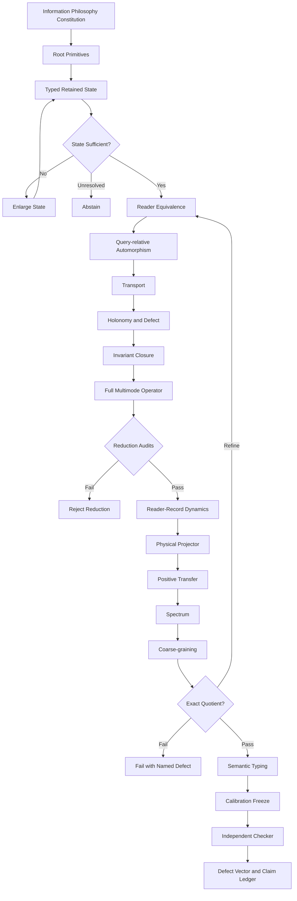

# Readout Genesis Universal Technical Whitepaper

## Standalone Human–AI Executable Specification — English Edition

```yaml
document:
  id: RG-UTW
  title: Readout Genesis Universal Technical Whitepaper
  version: 1.2.0
  release_status: INTERNAL_PEER_REVIEWED_WITH_CONCRETE_REFERENCE_DOMAIN
  language:
    normative_prose: English
    machine_keys: English
    mathematics: LaTeX
  format:
    container: Markdown
    embedded_languages:
      - YAML
      - pseudocode
      - DAG
      - LaTeX
  standalone: true
  intended_users:
    - human_researcher
    - ai_reasoning_system
    - software_implementer
    - independent_checker
  primary_goal:
    - "accept typed inputs"
    - "execute a deterministic procedure"
    - "return reproducible outputs and named defects"
    - "classify PASS, FAIL, or UNRESOLVED without guessing author intent"
  philosophical_governance:
    lead_role: true
    rule: "Information philosophy fixes the order by which meaning becomes admissible and governs every translation"
  use_mode:
    default: calculate_then_check
    debate_required_for_execution: false
    interpretation_is_bounded_by_machine_gates: true
  theory_boundary:
    universal_research_architecture: true
    executable_finite_reference_kernel: true
    complete_final_law_of_nature: false
    unique_end_to_end_domain_derivation: false
    universal_empirical_validation: false
    concrete_reference_domain: true
    frozen_held_out_reference_benchmark: true
  source_lineage:
    primary_architecture:
      id: RG-UMB
      version: 1.0
      role: "newer universal architecture and anti-drift root"
    legacy_superset:
      id: READOUT_GENESIS_CORE
      edition: 3.1
      git_commit: c341162ef06cc37b97b21447dcbfd5b2e2688aef
      role: "older but richer operational, epistemic, computational and provenance material"
  precedence:
    - philosophical_constitution
    - normative_root_contract
    - typed_mathematical_interfaces
    - executable_algorithms
    - verification_and_claim_ledger
    - domain_semantics
    - legacy_interpretations
  peer_review_resolution:
    language: English_only
    duplicate_sections_removed: true
    ambiguous_graph_metric_notation_removed: true
    exact_gate_typing_repaired: true
    inequality_constraints_completed_with_KKT: true
    pseudocode_dependencies_made_explicit: true
    claim_control_requirements_made_status_conditional: true
    coupled_kernel_fixtures_extended: true
    concrete_domain_card_added: true
    concrete_operator_and_encoder_added: true
    calibration_and_held_out_checker_added: true
```

---

# 0. How to Use This Document

This single file is a **technical whitepaper**, **reference specification**, **runtime protocol**, and **anti-drift constitution**.

Normative keywords:

```yaml
normative_keywords:
  MUST: "required; otherwise the result is not admissible"
  MUST_NOT: "forbidden; otherwise the result is INVALID or DRIFT"
  SHOULD: "recommended; any omission requires a recorded reason"
  MAY: "permitted only when claim scope is unchanged"
```

Every normative module MUST expose the following chain:

```text
INPUT
  ↓
TYPE + SUFFICIENCY
  ↓
TRANSFORM / SOLVE
  ↓
OUTPUT
  ↓
INVARIANT + DEFECT
  ↓
PASS / FAIL / UNRESOLVED
  ↓
BOUNDED CLAIM
```

A result missing its `input schema`, `equations`, `algorithm`, `defects`, `controls`, or `claim status` MUST NOT be reported as compliant with this whitepaper.

```yaml
ConformanceLevels:
  NORMATIVE:
    meaning: required for compliance
  REFERENCE:
    meaning: executable default that may be replaced by an equivalent declared implementation
  OPTIONAL:
    meaning: used only when requested by the Domain Card

NumericalConvention:
  exact_arithmetic:
    zero_test: equality
  floating_point:
    norm: MUST_BE_DECLARED_PER_DEFECT
    absolute_tolerance: MUST_BE_FROZEN
    relative_tolerance: MUST_BE_FROZEN
    comparison_rule: MUST_BE_DECLARED
  missing_metric_or_tolerance:
    status: UNRESOLVED
```

---

# 1. Information Philosophy as the System Constitution

## 1.1 Foundational Principles

```yaml
InformationPhilosophyConstitution:
  P1_no_built_in_domain_labels:
    statement: "The root contains no built-in labels such as physics, chemistry, biology, mind, AI, or society."
    machine_consequence:
      - "root schema MUST NOT contain domain-final nouns or laws"
      - "semantic labels attach only after a valid translation"

  P2_difference_before_entity:
    statement: "Difference precedes the name of what differs."
    machine_consequence:
      - "encode distinctions before assigning entity types"
      - "entity identity MUST be a retained/readable equivalence class"

  P3_history_before_container_time:
    statement: "Ordered change precedes time treated as a container."
    machine_consequence:
      - "native runtime uses ordered tape indices"
      - "continuous time is an optional calibrated readout"

  P4_retention_before_persistence_semantics:
    statement: "A state becomes reportable only when some distinction is retained."
    machine_consequence:
      - "every state claim MUST identify retained records"
      - "unretained differences cannot be reconstructed downstream"

  P5_reader_creates_domain_access_not_root_truth:
    statement: "A reader makes structure accessible; it does not retroactively create the root."
    machine_consequence:
      - "reader family MUST be declared"
      - "reader equivalence MUST NOT be promoted to absolute identity"

  P6_domain_is_translation:
    statement: "A domain is a minimal sufficient dynamically closed translation."
    machine_consequence:
      - "a domain MUST pass sufficiency, quotient, dynamics and readout gates"
      - "naming a subject is never enough"

  P7_meaning_after_readout:
    statement: "Meaning arises after readout under context; it is not stored in the root."
    machine_consequence:
      - "semantic report is separated from native output"
      - "same numeric output MAY carry different semantic roles"

  P8_translation_must_account_for_loss:
    statement: "Every non-exact translation must identify where distinctions are lost."
    machine_consequence:
      - "every approximate bridge MUST return a defect vector"
      - "silent equivalence is forbidden"

  P9_claim_cannot_borrow_certainty:
    statement: "A claim at one layer may not borrow certainty from another layer."
    machine_consequence:
      - "formal structure does not certify empirical meaning"
      - "finite tests do not certify continuum or universal claims"

  P10_report_is_last:
    statement: "A report is emitted only after retention, structure, translation, calibration, and checking."
    machine_consequence:
      - "claim emission is the final pipeline stage"
```

## 1.2 Mandatory Derivation Order

\[
\boxed{
\text{Retention}
\rightarrow
\text{Structure}
\rightarrow
\text{Translation}
\rightarrow
\text{Meaning}
\rightarrow
\text{Report}
}
\]

Forbidden order:

\[
\boxed{
\text{Textbook Name}
\rightarrow
\text{Import Final Law}
\rightarrow
\text{Fit Parameters}
\rightarrow
\text{Declare Derived}
}
\]

```yaml
ForbiddenOrderGuard:
  input:
    proposed_root_terms: list
    target_domain: optional
    target_outputs: optional
  fail_when:
    - "a target-domain final law appears as a root premise"
    - "a target answer is inserted as a coefficient or eigenvalue"
    - "semantic naming precedes a passed translation gate"
    - "held-out outcomes influenced model construction"
  output_status:
    detected: DRIFT
    not_detected: CONTINUE
```

## 1.3 Philosophy Is Operational, Not Decorative

Information philosophy performs four binding functions:

1. defines the minimal ontology
2. fixes the derivation order
3. defines what may not enter the root
4. sets the permitted strength of reports

Therefore, every philosophical principle MUST have at least one `machine_consequence`, and every major guard MUST cite the principle it enforces.

---

# 2. Layer Separation Against Claim Drift

```yaml
ArchitectureLayers:
  L0_ontology:
    objects:
      - retained_distinction
      - ordered_history
      - reader_capability
      - admissibility
      - positive_retained_pairing
    question: "What is retained, and what remains distinguishable?"

  L1_structure:
    objects:
      - typed_state
      - equivalence_class
      - automorphism
      - transport
      - holonomy
      - closure
    question: "What structure follows from retention and readout?"

  L2_dynamics:
    objects:
      - action_interface
      - finite_reference_kernel
      - constraints
      - transfer_operator
    question: "How does the structure evolve?"

  L3_translation:
    objects:
      - domain_card
      - sufficiency
      - quotient
      - bridge
      - calibration
    question: "How does a domain read the dynamics?"

  L4_epistemic:
    objects:
      - registrar
      - maker
      - freeze
      - checker
      - controls
    question: "Was the claim checked independently?"

  L5_report:
    objects:
      - claim_ledger
      - scope
      - defect_vector
      - reproducibility_record
    question: "What may actually be claimed?"
```

Binding rules:

```yaml
LayerNonBorrowingRules:
  - "L0 axiom does not prove L3 domain semantics"
  - "L1 mathematical closure does not prove L2 is nature's unique dynamics"
  - "L2 finite execution does not prove continuum existence"
  - "L3 calibration fit does not equal held-out prediction"
  - "L4 clean protocol does not prove the model true"
  - "L5 wording MUST use the weakest load-bearing status"
```

---

# 3. Root, Types, and State Variables

## 3.1 Root primitives

Minimal root primitives admitted by this whitepaper:

```yaml
RootPrimitives:
  distinction_record:
    symbol: delta_R
    meaning: "record that at least one distinction is retained"
    primitive: true

  ordered_tape:
    symbol: T
    meaning: "append-only order of events, rewrites, residues and deviations"
    primitive: true

  reader_family:
    symbol: O
    meaning: "declared maps that can distinguish, store or act on retained records"
    primitive: true

  admissibility_language:
    symbol: C
    meaning: "rules stating admitted, obstructed or unresolved constructions"
    primitive: true

  positive_retained_pairing:
    symbol: G
    meaning: "positive pairing used to measure retained load"
    primitive: true
```

The following are **not root primitives by default**:

```yaml
NotRootByDefault:
  - spacetime
  - particle
  - molecule
  - gene
  - neuron
  - institution
  - physical_energy
  - mass
  - force
  - probability
  - continuum
  - SI_units
  - domain_final_equation
```

## 3.2 Canonical state

To remove earlier ambiguity, the `closure ledger` is distinct from `constraint multipliers`; derived-but-reified operational variables are also distinct from primitives.

\[
\boxed{
Z_n=
\left(
\Phi_n,\Psi_n,\Theta_n,\Sigma_n,
\mathcal T_n,G_n,\mathcal L^{\mathrm{cl}}_n;
U_n,\Gamma_n,\Xi_n
\right)
}
\]

Every canonical slot exists at the schema level. A slot may be inactive only with an explicit
`inactive_with_reason` status and a proof that no declared readout requires it.

The semicolon separates:

- left: primary retained-state slots
- right: derived or reified operational slots retained for reproducibility

```yaml
StateSchema:
  Phi:
    role: proposed_distinction_state
    type: vector_or_typed_record
    required: true

  Psi:
    role: companion_record_response
    type: vector_or_typed_record
    required_when: record_response_or_backreaction_is_load_bearing
    inactive_status_allowed: true
    zero_allowed: true

  Theta:
    role: relational_geometry_translation_state
    type: vector_matrix_or_graph_parameters
    required_when: geometry_or_basis_is_dynamic_or_read
    inactive_status_allowed: true

  Sigma:
    role: retained_order_reference
    type: vector_or_structured_record
    required_when: order_or_orientation_is_read
    inactive_status_allowed: true

  Tape:
    role: append_only_history
    type: ordered_sequence
    required: true

  G:
    role: positive_retained_metric
    type: hermitian_positive_definite_operator
    required: true

  L_cl:
    role: closure_and_lineage_ledger
    type: structured_record
    required: true
    legacy_alias: Lambda

  U:
    role: transport
    status: derived_then_reified
    type: family_of_linear_or_typed_maps
    required_when: local_frames_or_path_comparison_is_used
    inactive_status_allowed: true

  Gamma:
    role: orientation_grading
    status: derived_or_declared_with_provenance
    required_when: grading_is_used
    inactive_status_allowed: true
    constraints:
      - "Gamma_dagger = Gamma"
      - "Gamma_squared = I"

  Xi:
    role: orientation_selecting_order
    status: derived_or_declared_with_provenance
    required_when: orientation_selection_is_used
    inactive_status_allowed: true
    constraint: "odd under declared tape reversal"

  lambda_multiplier:
    symbol: lambda_n^a
    role: constraint_multiplier
    status: auxiliary_not_part_of_L_cl
```

## 3.3 Positive retained metric

\[
G_n=G_n^\dagger,\qquad G_n\succ0
\]

\[
\langle x,y\rangle_{G_n}=x^\dagger G_ny,
\qquad
\|x\|_{G_n}^2=x^\dagger G_nx\ge0
\]

```yaml
PositiveMetricGate:
  checks:
    - hermitian_within_tolerance
    - smallest_eigenvalue_above_tolerance
  pass: "both checks true"
  fail: "any check false"
  consequence_on_fail: "INVALID_STATE_METRIC"
```

`retained load` MUST NOT be called energy until a domain-specific semantic calibration has passed.

---

# 4. Readers, Equivalence, and Domain Formation

## 4.1 Reader equivalence

Let the declared reader family be:

\[
\mathcal O_D=\{O_\alpha\}_{\alpha\in\mathscr R_D}
\]

Define local reader equivalence:

\[
x\sim_{\mathcal O_D}y
\iff
O_\alpha(x)=O_\alpha(y)
\quad\forall\alpha
\]

For questions with a horizon and interventions, use the strong form:

\[
q_D(z)=q_D(z')
\Rightarrow
O_{D,n:n+L}(z,u)=O_{D,n:n+L}(z',u)
\quad
\forall u\in\mathcal U_D
\]

The domain-readable state is:

\[
[Z]_{\sim_D}
\]

## 4.2 Domain definition

\[
\boxed{
\mathcal D_D
=
\mathfrak Z_D/\!\sim_D
}
\]

where \(\mathfrak Z_D\) MUST be sufficient before quotienting.

```yaml
DomainDefinition:
  phrase: "minimal sufficient dynamically closed translation"
  required_properties:
    - state_sufficiency
    - readout_factorization
    - dynamic_commutation
    - invariant_preservation
    - declared_context
    - lineage_preservation
  not_sufficient:
    - subject_name
    - equation_shape_similarity
    - dimensional_similarity
    - one_successful_fit
    - one_passing_control
```

## 4.3 Exact domain gate

\[
\boxed{
q_{D,n+1}\circ F_n
=
F^\sharp_{D,n}\circ q_{D,n}
}
\]

\[
\boxed{
O_{D,n}
=
O^\sharp_{D,n}\circ q_{D,n}
}
\]

\[
\boxed{
\mathrm{Inv}_{D,n}
=
\mathrm{Inv}^\sharp_{D,n}\circ q_{D,n}
}
\]

defects:

\[
\epsilon_{\mathrm{dyn}}
=
\|q_{n+1}F_n-F^\sharp_nq_n\|
\]

\[
\epsilon_{\mathrm{read}}
=
\|O_n-O^\sharp_nq_n\|
\]

\[
\epsilon_{\mathrm{inv}}
=
\|\mathrm{Inv}_n-\mathrm{Inv}^\sharp_nq_n\|
\]

```yaml
ExactDomainGate:
  required_declarations:
    - sufficiency_status
    - norm_for_each_defect
    - tolerance_for_each_defect
    - arithmetic_mode
  exact_when:
    - sufficiency_status == ADMITTED
    - epsilon_dyn == 0
    - epsilon_read == 0
    - epsilon_inv == 0
  approximate_when:
    - sufficiency_status == ADMITTED
    - all_required_defects_within_frozen_tolerances
    - at_least_one_required_defect_nonzero
  fail_when:
    - sufficiency_status == OBSTRUCTED
    - any_required_defect_exceeds_frozen_tolerance
  unresolved_when:
    - sufficiency_status == UNRESOLVED
    - norm_or_tolerance_missing
    - identifiability_not_decidable
```

## 4.4 Failure taxonomy

When a commuting square fails, return one or more named causes:

```yaml
TranslationFailure:
  allowed_codes:
    MISTRANSLATION:
      meaning: "map itself is wrong or ill-posed"
    LOST_INFORMATION:
      meaning: "source quotient erased a required distinction"
    INSUFFICIENT_RESOLUTION:
      meaning: "retained resolution is too coarse"
    TARGET_LACKS_VARIABLES:
      meaning: "target state has no slot for required structure"
    NO_CLOSURE:
      meaning: "target has no well-posed update"
    CONTEXT_MISMATCH:
      meaning: "law valid in c but applied in c_prime"
    CALIBRATION_FAILURE:
      meaning: "native output cannot be independently decoded"
    IDENTIFIABILITY_UNRESOLVED:
      meaning: "more than one compatible law remains"
```

A report saying only “the reduction fails” without a failure code is incomplete.

---

# 5. Query-Relative Automorphisms and Transport

## 5.1 Automorphism group

\[
\boxed{
\mathcal A_{D,n}
=
\left\{
h_n:
O_{D,n}h_n=O_{D,n},
\;
h_{n+1}F_n=F_nh_n,
\;
h_n^\dagger G_nh_n=G_n
\right\}
}
\]

This group is relative to the declared question and readers; it is not an absolute symmetry group.

```yaml
AutomorphismDiscovery:
  input:
    - typed_state_space
    - reader_family
    - local_dynamics
    - retained_metric
  output:
    - generators
    - relations
    - numerical_or_exact_certificate
  must_not:
    - "quotient a transformation that changes the declared readout"
    - "assume reflection symmetry when orientation is read"
```

## 5.2 Transport

When labels are local, transport MUST be supplied:

\[
U_{j\leftarrow i}:\mathcal X_i\to\mathcal X_j
\]

\[
\boxed{
U_{j\leftarrow i}'
=
h_jU_{j\leftarrow i}h_i^{-1}
}
\]

compatibility with retained metric:

\[
U_{j\leftarrow i}^{\dagger}
G_j
U_{j\leftarrow i}
=
G_i
\]

Use equality for isometric transport; otherwise report the metric-compatibility defect:

\[
\epsilon_{G,U}
=
\left\|
U^\dagger G_jU-G_i
\right\|
\]

## 5.3 Holonomy and curvature defect

\[
H_C=\prod_{e\in C}^{\rightarrow}U_e
\]

\[
\mathcal K_C=H_C-I
\]

readable invariants:

\[
\operatorname{Tr}(H_C),\qquad
\det(H_C),\qquad
\operatorname{spec}(H_C)
\]

```yaml
HolonomyRun:
  input:
    ordered_cycle: list_of_edges
    edge_transports: map
    tolerance: number
  algorithm:
    - "H = identity"
    - "for edge in ordered_cycle: H = U_edge @ H"
    - "K = H - identity"
    - "compute conjugation invariants"
  output:
    H: matrix
    K: matrix
    defect_norm: number
    trace: number
    determinant: number
    spectrum: list
  status:
    flat_on_cycle: "defect_norm <= tolerance"
    curved_or_drifting: "defect_norm > tolerance"
```

Semantic labels such as curvature, reaction-path defect, reasoning drift, or institutional contradiction may be attached only by a validated Domain Card.

---

# 6. Closure and Interaction Grammar

## 6.1 Invariant closure map

\[
\boxed{
\mathcal I_\alpha:
R_1\otimes\cdots\otimes R_k
\longrightarrow
\mathbf 1
}
\]

\[
\nu_\alpha
=
\dim
\operatorname{Hom}_{\mathcal A}
\left(
R_1\otimes\cdots\otimes R_k,\mathbf 1
\right)
\]

If the Hom-space is zero:

```yaml
closure_status: OBSTRUCTED
interaction_allowed: false
```

## 6.2 Multiplicity discipline

At minimum, separate:

```yaml
MultiplicityLedger:
  invariant_multiplicity:
    meaning: number_of_independent_invariant_closure_maps
  rank_multiplicity:
    meaning: operator_or_matrix_rank_degeneracy
  generation_multiplicity:
    meaning: repeated_retained_response_classes
  raw_ordering_count:
    meaning: number_of_unquotiented_sequences
```

Do not infer physical channel count from raw ordering count before quotienting by:

- cyclic start-point equivalence
- reversal equivalence when the reader is orientation-insensitive
- gauge equivalence
- reader equivalence
- structural sharing without lineage erasure

## 6.3 Three-valued admissibility

\[
\mathcal C(\xi\mid c,\mathcal T)\in\{1,0,\bot\}
\]

```yaml
Admissibility:
  "1":
    status: ADMITTED
    action: construct
  "0":
    status: OBSTRUCTED
    action: append_obstruction_certificate
  "bottom":
    status: UNRESOLVED
    action: abstain_and_request_more_retained_information
```

`UNRESOLVED` is not equivalent to `OBSTRUCTED`.

---

# 7. Universal action interface

## 7.1 Modular action

\[
\boxed{
S_{\mathrm{RG}}
=
S_{\mathrm{DRL}}
+
S_{\mathrm{geo}}
+
S_{\mathrm{tr}}
+
S_{\mathrm{int}}
+
S_{\mathrm{ord}}
+
S_{\mathrm{cut}}
+
S_{\mathrm{tape}}
+
S_{\mathrm{read}}
}
\]

```yaml
ActionContracts:
  S_DRL:
    consumes: [Phi, Psi, G, Tape, declared_coefficients]
    must_be:
      - typed
      - variational_or_explicitly_nonvariational
      - retained_metric_compatible

  S_geo:
    consumes: [Theta, Phi, Psi, Sigma, Tape]
    purpose:
      - relation_update
      - basis_motion
      - backreaction

  S_tr:
    consumes: [U, Theta, G]
    must_be_built_from:
      - relative_transport
      - holonomy
      - retained_mismatch

  S_int:
    consumes: [closure_maps, Phi, Psi, Sigma, U]
    restriction: "only admitted invariant closure channels"

  S_ord:
    consumes: [Sigma, Xi, U, G]
    purpose:
      - retained_reference
      - orientation_selection
      - phase_or_order_transition

  S_cut:
    consumes: [boundary, cut_currents, closure_ledger]
    purpose:
      - unresolved_boundary_obligation
      - information_crossing
      - interface_cost

  S_tape:
    consumes: [Tape, Gamma, Xi]
    purpose:
      - order_sensitivity
      - reversal_status
      - sequence_memory

  S_read:
    consumes: [reader_family, state, coarse_readout]
    purpose:
      - readout_consistency
      - microscopic_to_retained_factorization
```

Status of this action interface:

```yaml
ActionStatus:
  universal_modular_interface: EXACT_WITHIN_ARCHITECTURE
  unique_concrete_action_for_all_domains: OPEN
  finite_reference_realization_below: EXECUTABLE_REFERENCE
```

## 7.2 Constrained equation

Let \(\lambda_n^a\) denote constraint multipliers, distinct from the closure ledger:

\[
\boxed{
P_{\mathrm{phys}}
\left[
\frac{\delta S_{\mathrm{RG}}}{\delta Z_n}
+
\sum_a
\lambda_n^a
\frac{\delta C_a[Z]}{\delta Z_n}
\right]
=0
}
\]

subject to equality constraints \(C_a^{=}[Z]=0\) and inequality constraints
\(C_b^{\le}[Z]\le0\). Inequalities require the Karush–Kuhn–Tucker conditions:

\[
\lambda_b\ge0,
\qquad
C_b^{\le}[Z]\le0,
\qquad
\lambda_b C_b^{\le}[Z]=0.
\]

If \(G\), \(\Theta\), \(U\), \(\Gamma\), or \(\Xi\) is dynamical, it MUST have an equation or update rule. Otherwise it MUST be marked `background`, `externally_prescribed`, or `derived_cache`.

```yaml
VariableEquationCoverageGate:
  for_each_state_slot:
    require_one_of:
      - variational_equation
      - recurrence
      - algebraic_constraint
      - declared_background
      - derived_cache_with_recompute_rule
  fail_code: UNCOVERED_STATE_VARIABLE
```

---

# 8. Reference finite DRL reader–record kernel

This section defines an immediately implementable and fixture-testable reference realization. It is not claimed to be the unique law of every domain.

```yaml
ReferenceCoefficientContract:
  M:
    reference_type: positive_scalar_or_positive_definite_operator
    requirement: M_is_invertible
  D:
    reference_type: nonnegative_scalar_or_positive_semidefinite_operator
  K:
    reference_type: nonnegative_scalar_or_declared_operator
  dt:
    type: positive_scalar
  generalized_noncommuting_coefficients:
    status: CONDITIONAL
    requirement: explicit_ordering_and_adjoint_convention
```

## 8.1 Full operator

\[
\mathbb G_n
=
L_{\mathrm{graph},n}\otimes I_{\mathcal F}
+
I_{\mathrm{graph},n}\otimes C_{\mathcal F}
+
C_{\mathrm{int},n}
\]

metric-adjoint:

\[
A^{\dagger_G}=G^{-1}A^\dagger G
\]

metric symmetric/skew split:

\[
\mathbb G^{(+)}
=
\frac12\left(
\mathbb G+\mathbb G^{\dagger_G}
\right)
\]

\[
\mathbb G^{(-)}
=
\frac12\left(
\mathbb G-\mathbb G^{\dagger_G}
\right)
\]

Required checks:

\[
(\mathbb G^{(+)})^{\dagger_G}=\mathbb G^{(+)},
\qquad
(\mathbb G^{(-)})^{\dagger_G}=-\mathbb G^{(-)}
\]

and:

\[
\langle z,\mathbb G^{(-)}z\rangle_G
\approx0
\]

```yaml
OperatorSplitStatus:
  algebraic_split_for_given_G: DERIVED_EXACT
  universal_physical_interpretation: CONDITIONAL
  state_dependent_endogenous_operator_closure: OPEN_UNLESS_INSTANCE_PROVED
```

## 8.2 Living geometry

\[
\Theta_{n+1}
=
A_\Theta\Theta_n
+
B_{\Theta\Phi}\Phi_n
+
B_{\Theta\Psi}\Psi_n
+
u_{\Theta,n}
\]

\[
\mathbb G[\Theta_n]
=
\mathbb G_0
+
\sum_a\Theta_n^a\mathbb G_a
\]

moving basis:

\[
\Phi_n=V_n\phi_n
\]

\[
\Delta\Phi_n
=
V_{n+1}\Delta\phi_n
+
(V_{n+1}-V_n)\phi_n
\]

geometry-dominance ratio:

\[
R_{\mathrm{geo}}
=
\frac{
\|(V_{n+1}-V_n)\phi_n\|
}{
\|\Delta\Phi_n\|
}
\]

```yaml
MovingBasisGate:
  fixed_basis_allowed_when:
    - "R_geo <= preregistered_tolerance"
  fixed_basis_rejected_when:
    - "R_geo > preregistered_tolerance"
  unresolved_when:
    - "denominator is zero and numerator is nonzero or basis provenance missing"
```

## 8.3 Discrete action

Define:

\[
\delta_t^2X_n
=
\frac{X_{n+1}-2X_n+X_{n-1}}{\Delta t^2}
\]

\[
\delta_t^cX_n
=
\frac{X_{n+1}-X_{n-1}}{2\Delta t}
\]

reference action (real-coordinate form; replace transpose by the declared Hermitian or metric adjoint in complex coordinates):

\[
S_{\mathrm{DRL}}
=
\sum_n\mathbb L^n
\]

\[
\begin{aligned}
\mathbb L^n
=&
\frac1{\Delta t}
\Delta\Phi_n^\top M_n\Delta\Psi_n\\
&+
\frac12
\left(
\Phi_n^\top D_n\Delta\Psi_n
-
\Psi_n^\top D_n\Delta\Phi_n
\right)\\
&-
\Delta t
\left[
K_n\Phi_n^\top\mathbb G_n\Psi_n
+
\Psi_n^\top\nabla V_n(\Phi_n)
-
J_n^\top\Psi_n
\right].
\end{aligned}
\]

## 8.4 Coupled recurrence

Reader:

\[
M\delta_t^2\Phi_n
+
D\delta_t^c\Phi_n
+
K\mathbb G[\Theta_n]\Phi_n
+
\nabla V(\Phi_n)
-
J_n
=
\mathcal R_{\Phi,n}
\]

Record:

\[
M\delta_t^2\Psi_n
-
D\delta_t^c\Psi_n
+
K\mathbb G[\Theta_n]^{\dagger_G}\Psi_n
+
\nabla^2V(\Phi_n)\Psi_n
=
\mathcal R_{\Psi,n}
\]

residual channels:

\[
\mathcal R_\Phi
=
\mathcal J_{\mathrm{cut},\Phi}
+
\mathcal J_{\mathrm{syn}}
+
\mathcal J_{\mathrm{geo}}
\]

\[
\mathcal R_\Psi
=
\mathcal J_{\mathrm{cut},\Psi}
+
\mathcal J_{\mathcal L}
\]

cut current:

\[
\mathcal J_C
=
\mathcal J_{\mathrm{transport}}
+
\mathcal J_{\mathrm{return}}
+
\mathcal J_{\mathrm{readout}}
+
\mathcal J_{\mathrm{tape}}
\]

## 8.5 One-step solve

For scalar \(M,D,K\) multiplying the identity:

\[
A_\Phi
=
\left(
\frac{M}{\Delta t^2}
+
\frac{D}{2\Delta t}
\right)I
\]

\[
\begin{aligned}
b_{\Phi,n}
=&
\mathcal R_{\Phi,n}
+
J_n
-
K\mathbb G_n\Phi_n
-
\nabla V(\Phi_n)\\
&+
\frac{2M}{\Delta t^2}\Phi_n
+
\left(
\frac{D}{2\Delta t}
-
\frac{M}{\Delta t^2}
\right)\Phi_{n-1}
\end{aligned}
\]

\[
A_\Phi\Phi_{n+1}=b_{\Phi,n}
\]

\[
A_\Psi
=
\left(
\frac{M}{\Delta t^2}
-
\frac{D}{2\Delta t}
\right)I
\]

\[
\begin{aligned}
b_{\Psi,n}
=&
\mathcal R_{\Psi,n}
-
K\mathbb G_n^{\dagger_G}\Psi_n
-
\nabla^2V(\Phi_n)\Psi_n\\
&+
\frac{2M}{\Delta t^2}\Psi_n
-
\left(
\frac{M}{\Delta t^2}
+
\frac{D}{2\Delta t}
\right)\Psi_{n-1}
\end{aligned}
\]

\[
A_\Psi\Psi_{n+1}=b_{\Psi,n}
\]

```yaml
LinearSolveGate:
  method:
    reference: partial_pivot_gauss_jordan_or_stable_equivalent
  must_report:
    - pivot_min
    - rank
    - condition_estimate
    - solver_residual
  fail_when:
    - "pivot_min < pivot_tolerance"
    - "rank < expected_rank"
    - "solver_residual > solve_tolerance"
  must_not:
    - "silently regularize"
    - "replace singular solve with guessed output"
```

## 8.6 Reference runtime algorithm

```pseudo
FUNCTION DRL_STEP(run, state_n_minus_1, state_n):

    VALIDATE dt > 0
    VALIDATE G is positive definite
    VALIDATE every state slot has provenance and type

    Theta_next_candidate = UPDATE_GEOMETRY(state_n)
    Gop_n = BUILD_OPERATOR(Theta_n, graph, field_coupling, interaction)

    SPLIT Gop_n into metric-symmetric and metric-skew sectors
    CHECK split residuals

    COMPUTE moving-basis current
    COMPUTE R_geo
    IF fixed_basis_requested AND R_geo > tolerance:
        RETURN FAIL(GEOMETRY_REDUCTION_INVALID)

    COMPUTE closure channels
    APPEND obstruction certificates for rejected channels

    ASSEMBLE R_Phi and R_Psi by named current channels

    BUILD A_Phi, b_Phi
    SOLVE A_Phi * Phi_next = b_Phi using fail-closed solver

    BUILD A_Psi, b_Psi
    SOLVE A_Psi * Psi_next = b_Psi using fail-closed solver

    RECOMPUTE Theta_next if geometry uses implicit backreaction
    RECOMPUTE transport U if local frames changed

    COMPUTE equation residuals
    COMPUTE constraints
    COMPUTE invariants
    APPEND state, residuals, obstructions and deviations to Tape

    IF any hard invariant fails:
        RETURN FAIL
    IF any required fact remains unidentified:
        RETURN UNRESOLVED
    RETURN PASS_WITH_OUTPUT
END
```

---

# 9. Optional legacy single-field stepper

For legacy compatibility, the following reduced reference is permitted:

```pseudo
gamma = 1 / tau_c
D_s = D * Delta_theta

V[n+1] = V[n] + Delta_theta * (
    -gamma * V[n]
    -D_s * (L_R @ X[n])
    + source[n]
    - residual[n]
)

X[n+1] = X[n] + Delta_theta * V[n+1]
```

sufficient stability bound:

\[
\Delta\theta
\le
\frac{2}{
\gamma+
\sqrt{\gamma^2+4\lambda_{\max}D_s}
}
\]

Constraints:

```yaml
LegacyStepperRules:
  status: REDUCED_REFERENCE
  cfl_bound:
    meaning: sufficient_not_necessary
  must_not_claim:
    - "exceeding the bound implies unconditional instability"
    - "single-field stepper is the complete two-field ontology"
    - "scalar eigenmode represents the full operator without discarded-coupling audit"
```

---

# 10. Physical Projector and Positive Transfer

## 10.1 Physical projector

\[
P_{\mathrm{phys}}^\dagger=P_{\mathrm{phys}},
\qquad
P_{\mathrm{phys}}^2=P_{\mathrm{phys}}
\]

Projector construction MUST be traceable to a declared redundancy or constraint sector.

```yaml
PhysicalProjectorGate:
  checks:
    - hermitian
    - idempotent
    - removes_only_declared_redundancy
    - preserves_declared_readout
  fail_code: INVALID_PHYSICAL_PROJECTOR
```

## 10.2 Positive kernel

\[
K(X_+,X_-)
=
\sum_Y
A(Y\mid X_+)
\overline{A(Y\mid X_-)}
\]

\[
K=A^\dagger A\succeq0
\]

\[
T_+
=
P_{\mathrm{phys}}
e^{-\widehat V/2}
K
e^{-\widehat V/2}
P_{\mathrm{phys}}
\succeq0,
\qquad
\widehat V=\widehat V^\dagger
\]

The term `reflection-positive` is permitted only when the following are supplied:

- reflection map
- positive half-algebra
- gluing rule
- compatible measure/action

If only \(A^\dagger A\) is established, use the term `positive midpoint kernel`.

## 10.3 Contraction certificate

Positivity alone does not place eigenvalues in \((0,1]\).

Require:

\[
0\preceq T_{\mathrm{RG}}\preceq I
\]

or:

\[
\|T_{\mathrm{RG}}\|_{\mathrm{op}}\le1
\]

If scaling is used:

\[
T_{\mathrm{RG}}
=
\frac{T_+}{\zeta},
\qquad
\zeta>0,
\qquad
\zeta\ge\lambda_{\max}(T_+)
\]

The normalization \(\zeta\) MUST be declared and recorded; it may not be hidden.

## 10.4 Spectral reader

\[
T_{\mathrm{RG}}|\phi_s\rangle
=
\lambda_s|\phi_s\rangle
\]

For \(a>0\) and \(0<\lambda_s\le1\):

\[
\epsilon_s
=
-\frac1a\log\lambda_s
\]

```yaml
SpectralClassification:
  isolated_eigenvalue:
    root_name: stable_retained_mode
  isolated_below_continuum:
    root_name: bound_or_composite_mode
  zero_edge:
    root_name: scale_free_or_gapless_mode
  positive_continuum_edge:
    root_name: threshold_persistence
  no_projected_support:
    root_name: no_standalone_readout
```

A resonance as a complex pole does not follow directly from a positive self-adjoint spectrum; it requires a declared extension:

```yaml
ResonanceExtension:
  requires:
    - resolvent_or_scattering_object
    - analytic_continuation_rule
    - sheet_and_boundary_conditions
  status_if_absent: NOT_AVAILABLE
```

---

# 11. Order selection

\[
r=\Sigma^\dagger G\Sigma\ge0
\]

\[
V_0(r)=\alpha r+\beta r^2,
\qquad
\beta>0
\]

\[
K_\mu(r)=B_\mu(r)B_\mu(r)^\dagger
\]

\[
Z_\mu(r)=\det(I+K_\mu(r))
\]

\[
V_{\mathrm{eff}}(r)
=
V_0(r)-\sum_\mu\log Z_\mu(r)
\]

For eigenvalues \(\lambda_\mu r\) with multiplicity \(d_\mu\):

\[
V_{\mathrm{eff}}(r)
=
\alpha r+\beta r^2
-
\sum_\mu
d_\mu\log(1+\lambda_\mu r)
\]

\[
V_{\mathrm{eff}}'(0)
=
\alpha-\sum_\mu d_\mu\lambda_\mu
\]

local onset criterion:

\[
\boxed{
\sum_\mu d_\mu\lambda_\mu>\alpha
}
\]

```yaml
OrderSelectionClaim:
  exact_scope:
    - declared_effective_potential
    - local_slope_at_origin
  not_implied:
    - global_uniqueness
    - empirical_phase_identity
    - physical_energy_interpretation
```

---

# 12. Coarse-Graining, Reduction, and Fixed Points

## 12.1 Readout-preserving coarse-graining

\[
Z^{(b)}=\mathcal C_b[Z]
\]

\[
\boxed{
\mathcal O_D^{(b)}
\circ
\mathcal C_b
=
\mathcal O_D
}
\]

defect:

\[
\epsilon_{\mathrm{cg}}
=
\left\|
\mathcal O_D^{(b)}\mathcal C_b-\mathcal O_D
\right\|
\]

optional formal effective action:

\[
S_{\mathrm{RG}}^{(b)}
=
-\log
\int_{\mathcal C_b[Z]=Z^{(b)}}
e^{-S_{\mathrm{RG}}[Z]}\,d\mu[Z]
\]

This expression is `OPTIONAL_FORMAL` unless the Domain Card supplies the measure, domain of
integration, finiteness/integrability conditions, and a computable approximation rule.

fixed point:

\[
\mathcal R_b(\theta_*)=\theta_*
\]

irrelevant distinction certificate:

\[
\|\delta\theta_n\|
\le
\rho^n\|\delta\theta_0\|,
\qquad
\rho<1
\]

## 12.2 No-early-collapse law

If an encoding \(E\) satisfies:

\[
E(z)=E(z')
\quad\text{but}\quad
z\ne z'
\]

no downstream solver can recover the distinction from that input alone.

```yaml
NoEarlyCollapse:
  rule: "compress only after equivalence is audited"
  correction_if_failed:
    - enlarge_candidate_state
    - restore_lineage_or_tape
    - increase_resolution
  forbidden_correction:
    - redefine_output_to_hide_missing_distinction
    - import_target_law
```

## 12.3 Modal reduction audit

For a projector \(P\):

\[
\epsilon_{\mathrm{mode}}
=
\|(I-P)\mathbb GP\|
+
\|P\mathbb G(I-P)\|
\]

A scalar or single-mode reduction is admissible only when:

1. the quotient is valid
2. one mode is sufficient for the declared readout
3. off-diagonal, skew, and moving-basis currents are below tolerance
4. geometry is fixed or externally prescribed
5. no required retained nonlinear transfer exists between modes

```yaml
ModalReductionGate:
  pass_when:
    - "epsilon_mode <= preregistered_tolerance"
    - "all five conditions hold"
  fail_code: SCALAR_EIGENMODE_REDUCTION_ERROR
```

---

# 13. Executable Domain Card

```yaml
DomainCard:
  schema_version: 1.0

  identity:
    domain_id: REQUIRED
    version: REQUIRED
    parent_root_version: REQUIRED
    status: DRAFT

  question:
    target: REQUIRED
    horizon: REQUIRED
    resolution: REQUIRED
    interventions: REQUIRED
    tolerance: REQUIRED
    context: REQUIRED

  candidate_state:
    encoder: REQUIRED
    slot_activation: REQUIRED
    fields:
      count: DISCOVER_OR_JUSTIFY
      types: REQUIRED
    memory_slots: REQUIRED
    boundary_slots: REQUIRED
    lineage_slots: REQUIRED

  carriers:
    types: REQUIRED
    dimensions_or_shapes: REQUIRED
    closure_category_or_representation_rule: REQUIRED_IF_CLOSURE_USED
    primitive_relations: REQUIRED
    provenance_for_each_relation: REQUIRED
    local_frames: REQUIRED_IF_TRANSPORT_USED
    ordered_cycles: REQUIRED_IF_HOLONOMY_USED

  readers:
    family: REQUIRED
    equivalence_rule: REQUIRED
    future_readout_rule: REQUIRED
    physical_outputs: REQUIRED

  invariants:
    set: REQUIRED
    completion_audit: REQUIRED

  symmetries:
    query_relative_group: REQUIRED
    quotient_justification: REQUIRED

  constraints:
    closure_rules: REQUIRED
    admissibility_rules: REQUIRED
    conserved_readouts: OPTIONAL

  dynamics:
    root_kernel: REQUIRED
    graph_operator: REQUIRED
    field_operator: REQUIRED
    interaction_operator: OPTIONAL
    coefficients: REQUIRED
    currents: REQUIRED
    basis_history: REQUIRED_IF_MOVING_BASIS_AUDITED
    requested_projection: OPTIONAL
    allowed_reductions: REQUIRED
    forbidden_reductions: REQUIRED
    context_dependence: REQUIRED
    requests_transfer: REQUIRED
    physical_projector: REQUIRED_IF_TRANSFER_REQUESTED
    midpoint_amplitude: REQUIRED_IF_TRANSFER_REQUESTED
    potential_operator: REQUIRED_IF_TRANSFER_REQUESTED

  calibration:
    native_units: REQUIRED
    target_units: OPTIONAL
    decoder: OPTIONAL
    parameters: DECLARED
    training_data: DECLARED
    freeze_hash: REQUIRED_IF_CALIBRATED
    held_out_outputs: REQUIRED_IF_PREDICTIVE

  semantics:
    labels: ATTACH_AFTER_TRANSLATION
    semantic_lane: REQUIRED_FOR_NAMED_QUANTITY

  defect_metrics:
    norm_for_each_defect: REQUIRED
    tolerance_for_each_defect: REQUIRED
    exact_or_floating_arithmetic: REQUIRED

  evidence:
    positive_controls: REQUIRED_IF_EVIDENTIARY
    negative_controls: REQUIRED_IF_EVIDENTIARY
    exact_proofs: OPTIONAL
    numerical_tests: OPTIONAL
    empirical_tests: OPTIONAL

  provenance:
    root_derived: list
    architecture_declared: list
    empirical_input: list
    calibration_only: list
    external_comparison: list
    open_hypothesis: list

  forbidden_imports:
    - domain_final_law_as_root
    - target_answer_as_parameter
    - semantic_name_before_gate
    - fit_each_output_separately
    - physical_unit_without_calibration
    - checker_outcome_visible_to_maker
```

---

# 14. Seven general domain gates

## Gate 1 — No-Free-Domain-Law

\[
\delta_R+\mathrm{Retention}
\nRightarrow
(F,\mathcal C,V,\theta)_{\mathrm{domain}}
\]

If more than one compatible model remains:

```yaml
status: UNRESOLVED
required_next_input:
  - interaction_tape
  - intervention
  - observation
  - explicit_postulate
```

## Gate 2 — Three-Valued Admissibility

Return only `ADMITTED`, `OBSTRUCTED`, or `UNRESOLVED`; do not guess.

## Gate 3 — Context-Indexed Law

\[
F_n=F_n(Z_n,c_n,\mathcal T_n)
\]

Validity in \(c\) does not imply validity in \(c'\).

## Gate 4 — State Sufficiency

\[
\mathrm{Suff}_{D,L}
(\mathfrak Z_D^{\mathrm{cand}};c,\mathcal T)
\in\{1,0,\bot\}
\]

Audit at least:

- readout sufficiency
- dynamic sufficiency
- intervention sufficiency
- delayed-return/memory sufficiency
- coupling sufficiency
- geometry/basis sufficiency
- boundary sufficiency

## Gate 5 — Invariant Completion

If a quotient merges states separated by a required invariant, refine the partition.

## Gate 6 — Query-Relative Symmetry

\[
\mathcal H_D
=
\{
h:
O_D(hz)=O_D(z),
\;
hF=Fh
\}
\]

## Gate 7 — Calibration Firewall

\[
y_D^{\mathrm{known}}
=
U_D(r_{\mathrm{native}};\theta_D,c,\mathcal C_D^{\mathrm{cal}})
\]

\[
H_{\mathrm{cal}}
=
\mathrm{Hash}
(
U_D,\theta_D,\mathrm{training},
\mathrm{units},\mathrm{protocol}
)
\]

A native informational value is not a physical, chemical, or biological observable before independent calibration.

---

# 15. Domain compilation algorithm

```pseudo
FUNCTION COMPILE_DOMAIN(root, raw_tape, domain_card_draft):

    1. VALIDATE root version and philosophy constitution.
    2. CAPTURE phenomenon without mechanism labels.
    3. STRIP domain vocabulary into retained roles.
    4. FREEZE question, horizon, interventions and tolerance.
    5. BUILD candidate state encoder.
    6. RUN state sufficiency audit.
       IF FAIL: enlarge state and restart with new version.
       IF UNRESOLVED: abstain.
    7. DISCOVER minimal field count and coupling structure.
    8. DISCOVER candidate partition using future readout signatures.
    9. DISCOVER query-relative automorphisms.
   10. BUILD quotient q_D.
   11. BUILD coarse dynamics F_D_sharp.
   12. COMPUTE epsilon_dyn, epsilon_read, epsilon_inv.
   13. REFINE partition until exact, tolerated approximate, or impossible.
   14. ENUMERATE invariant closure channels.
   15. BUILD full operator; do not diagonalize prematurely.
   16. AUDIT modal and moving-basis defects.
   17. RUN native dynamics.
   18. BUILD positive transfer when requested.
   19. CALIBRATE only after native outputs are frozen.
   20. RUN independent held-out checker.
   21. RETURN DomainRunReport + ClaimLedger.
END
```

field count rule:

\[
m_D
=
\min
\left\{
m:
O_D\ \text{ and }\ F_D
\text{ close on }X^{(1:m)}
\right\}
\]

The number of fields is not the number of domains.

---

# 16. Cross-domain bridge

\[
K_{A\leftarrow B}:
\mathcal D_B\times\mathcal T
\to
\widehat{\mathcal D}_A
\]

exact bridge:

\[
K_{A\leftarrow B}F_B^\sharp
=
F_A^\sharp K_{A\leftarrow B}
\]

\[
O_A^\sharp K_{A\leftarrow B}
=
D_{A\leftarrow B}O_B^\sharp
\]

bridge error:

\[
\epsilon_{A\leftarrow B}
=
d_\Delta
(
\mathcal D_A,
\widehat{\mathcal D}_A
)
\]

```yaml
BridgeLevels:
  L0:
    name: surface_analogy
  L1:
    name: shared_variables_or_relations
  L2:
    name: shared_transition_signature
  L3:
    name: readout_preserving_map
  L4:
    name: dynamically_commuting_quotient
  L5:
    name: recoverable_bidirectional_equivalence
```

Equations that merely look alike may be reported at no more than L0/L1 until stronger gates pass.

---

# 17. Defect vector

canonical vector:

\[
\boxed{
\boldsymbol\epsilon_D
=
\begin{pmatrix}
\epsilon_{\mathrm{suff}}\\
\epsilon_{\mathrm{dyn}}\\
\epsilon_{\mathrm{read}}\\
\epsilon_{\mathrm{inv}}\\
\epsilon_{\mathrm{bridge}}\\
\epsilon_{\mathrm{cal}}\\
\epsilon_{\mathrm{mode}}\\
\epsilon_{\mathrm{geo}}\\
\epsilon_{\mathrm{solve}}
\end{pmatrix}
}
\]

```yaml
DefectRules:
  exact:
    condition: "every required component equals zero in exact arithmetic"
  numerical_pass:
    condition: "every required component <= preregistered tolerance"
  fail:
    condition: "any required component > tolerance"
  unresolved:
    condition: "a required component cannot be identified"
  report:
    rule: "never collapse named defects into one scalar without retaining the full vector"
```

---

# 18. Maker–Checker epistemic firewall

## 18.1 Roles

```yaml
Registrar:
  freezes:
    - question
    - allowed_inputs
    - forbidden_inputs
    - metrics
    - thresholds
    - failure_rules
    - dataset_split
    - software_versions

Maker:
  may:
    - propose_state
    - discover_partition
    - build_operator
    - calibrate_on_training_only
    - produce_prediction
  must_not_see:
    - held_out_outputs
    - checker_only_labels
    - answer_derived_threshold
    - post_freeze_report

Freeze:
  hash_contents:
    - model
    - code
    - configuration
    - parameters
    - prediction
    - score_orientation
    - normal_form
    - dependencies

Checker:
  may:
    - verify_hash
    - open_held_out
    - evaluate_controls
    - compute_errors
    - audit_claim_scope
  must_not:
    - swap_model
    - retune_parameters
    - change_threshold
    - flip_metric
    - cherry_pick

Auditor:
  outputs:
    - scope_audit
    - protocol_deviations
    - bounded_claim
```

\[
\mathrm{Info}(\mathrm{Maker};Y_{\mathrm{checker}})=0
\]

This is a protocol condition, not a proof that statistical mutual information is zero merely because a hash exists.

## 18.2 Fail-able gate law

```yaml
FailAbleGateLaw:
  Type_P_evidence_requires:
    - machine_derived_passing_control
    - machine_derived_failing_control
  Type_U_convention_when:
    - only_passing_control_exists
    - failure_case_cannot_change_gate_output
  tier_consequence:
    Type_P_pass: "may support finite or machine-checked status within scope"
    Type_U_pass: "supports at most architecture/conditional wording"
```

This law tests whether a gate can discriminate; Maker–Checker tests leakage and process bias. Both are required.

## 18.3 Protocol deviation

\[
\mathcal T_{n+1}
=
\mathcal T_n
\boxplus
\mathrm{DeviationRecord}
\]

Deviation records are append-only and MUST NOT be overwritten.

---

# 19. Claim ledger

```yaml
Claim:
  id: REQUIRED
  statement: REQUIRED

  status:
    one_of:
      - ROOT_AXIOM
      - DEFINITION
      - DERIVED_EXACT
      - MACHINE_CHECKED_SCOPE
      - EXACT_WITHIN_ARCHITECTURE
      - CONDITIONAL
      - FINITE_FIXTURE
      - NUMERICAL
      - CALIBRATION_ONLY
      - EMPIRICALLY_HELD_OUT
      - OPEN
      - FAILED_CONTROL
      - SUPERSEDED

  layer:
    one_of:
      - ONTOLOGY
      - STRUCTURE
      - DYNAMICS
      - TRANSLATION
      - EPISTEMIC
      - REPORT

  assumptions:
    explicit: REQUIRED

  provenance:
    root_parents: REQUIRED
    imported_inputs: REQUIRED
    calibration_inputs: REQUIRED
    external_comparisons: REQUIRED

  derivation:
    parents: REQUIRED
    equations: REQUIRED
    algorithm_version: REQUIRED

  verification:
    proof_or_derivation_artifact: REQUIRED_IF_DERIVED_OR_MACHINE_CHECKED
    positive_control: REQUIRED_IF_EVIDENTIARY
    negative_control: REQUIRED_IF_EVIDENTIARY
    checker_independent: REQUIRED_IF_HELD_OUT_OR_EMPIRICAL
    defects: REQUIRED_IF_COMPUTED_OR_TRANSLATED

  scope:
    finite_or_continuum: REQUIRED
    exact_or_toleranced: REQUIRED
    local_or_global: REQUIRED
    domain_specific_or_universal: REQUIRED
    context: REQUIRED

  forbidden_upgrade:
    text: REQUIRED
```

## 19.1 Legacy tier mapping

```yaml
LegacyTierMapping:
  Ax: ROOT_AXIOM
  Df: DEFINITION
  Th_coqc: MACHINE_CHECKED_SCOPE
  finite_diagnostic: FINITE_FIXTURE
  Dr: CONDITIONAL
  Open: OPEN
```

A legacy `Th` without a proof artifact is not promoted automatically. Map it to `CONDITIONAL` or `DERIVED_EXACT` according to the derivation actually verified.

---

# 20. Mandatory Human–AI Run Report

```yaml
DomainRunReport:
  document_version: REQUIRED
  root_hash: REQUIRED
  domain_card_hash: REQUIRED
  input_hash: REQUIRED
  code_or_algorithm_hash: REQUIRED

  philosophy_guards:
    forbidden_import_check: PASS_FAIL
    semantic_order_check: PASS_FAIL
    lineage_preservation_check: PASS_FAIL

  types:
    state_shapes: REQUIRED
    units: REQUIRED
    semantic_lanes: REQUIRED

  solver:
    algorithm: REQUIRED
    time_step: OPTIONAL
    pivot_min: OPTIONAL
    condition_estimate: OPTIONAL
    convergence: REQUIRED
    iterations: REQUIRED

  quotient:
    partition: REQUIRED
    epsilon_suff: REQUIRED
    epsilon_dyn: REQUIRED
    epsilon_read: REQUIRED
    epsilon_inv: REQUIRED

  operator:
    full_operator_used: REQUIRED
    epsilon_mode: REQUIRED
    epsilon_geo: REQUIRED
    holonomy_defects: OPTIONAL

  transfer:
    positivity_certificate: OPTIONAL
    contraction_certificate: OPTIONAL
    eigenvalues: OPTIONAL
    persistence_costs: OPTIONAL

  controls:
    positive: REQUIRED
    negative: REQUIRED
    expected_vs_observed: REQUIRED

  calibration:
    used: REQUIRED
    freeze_hash: OPTIONAL
    held_out_score: OPTIONAL
    epsilon_cal: REQUIRED

  final:
    status:
      one_of: [PASS_EXACT, PASS_TOLERANCED, FAIL, UNRESOLVED, PROTOCOL_FAIL, DRIFT]
    failure_codes: list
    claim_ids: list
    reproducibility_command: REQUIRED
```

---

# 21. Global runtime DAG

```text
PHILOSOPHY CONSTITUTION
        │
        ├── no built-in domain labels
        ├── retention before structure
        ├── translation before meaning
        └── report last
        │
        ▼
ROOT PRIMITIVES
(delta_R, Tape, Reader, Admissibility, G)
        │
        ▼
TYPED RETAINED STATE
(Phi, Psi, Theta, Sigma, L_cl)
        │
        ▼
STATE SUFFICIENCY AUDIT
        │
        ├── FAIL ──► enlarge state
        └── UNRESOLVED ──► abstain
        │ PASS
        ▼
READER EQUIVALENCE
        │
        ▼
QUERY-RELATIVE AUTOMORPHISM
        │
        ▼
TRANSPORT U
        │
        ▼
HOLONOMY H_C + DEFECT K_C
        │
        ▼
CLOSURE INTERTWINERS
        │
        ▼
FULL MULTIMODE OPERATOR
        │
        ├── modal defect audit
        └── moving-basis defect audit
        │
        ▼
DRL READER–RECORD STEP
        │
        ▼
PHYSICAL PROJECTOR
        │
        ▼
POSITIVE TRANSFER
        │
        ├── positivity certificate
        └── contraction certificate
        │
        ▼
SPECTRUM / PERSISTENCE
        │
        ▼
COARSE-GRAINING
        │
        ▼
EXACT QUOTIENT AUDIT
        │
        ▼
DOMAIN SEMANTICS + CALIBRATION
        │
        ▼
MAKER FREEZE
        │
        ▼
INDEPENDENT CHECKER
        │
        ▼
DEFECT VECTOR
        │
        ├── PASS
        ├── FAIL
        └── UNRESOLVED
        │
        ▼
BOUNDED CLAIM LEDGER
```

## 21.1 Mermaid DAG



---

# 22. Top-Level Execution Pseudocode

```pseudo
FUNCTION RG_EXECUTE(root_config, domain_card, observations, checker_bundle):

    # A. Philosophy-led validation
    philosophy_result = CHECK_INFORMATION_PHILOSOPHY(root_config, domain_card)
    IF philosophy_result == DRIFT:
        RETURN FAIL(DRIFT)

    # B. Capture and type
    tape = CAPTURE_ORDERED(observations)
    candidate_state = ENCODE_RETAINED_STATE(
        tape=tape,
        encoder=domain_card.candidate_state.encoder,
        slot_activation=domain_card.candidate_state.slot_activation
    )

    suff = AUDIT_SUFFICIENCY(candidate_state, domain_card.question)
    IF suff.status == OBSTRUCTED:
        RETURN FAIL(INSUFFICIENT_STATE, suff)
    IF suff.status == UNRESOLVED:
        RETURN UNRESOLVED(IDENTIFIABILITY_UNRESOLVED, suff)

    # C. Discover readable structure
    readers = BUILD_READERS(domain_card.readers)
    partition = FIX_REFINE(
        state=candidate_state,
        dynamics=root_config.reference_dynamics,
        readers=readers,
        interventions=domain_card.question.interventions
    )
    automorphisms = DISCOVER_AUTOMORPHISMS(
        partition=partition,
        readers=readers,
        dynamics=root_config.reference_dynamics,
        metric=candidate_state.G
    )
    transport = IDENTITY_OR_NOT_REQUESTED
    holonomy_report = NOT_REQUESTED
    IF domain_card.carriers.local_frames is declared:
        transport = BUILD_TRANSPORT(
            local_frames=domain_card.carriers.local_frames,
            automorphisms=automorphisms,
            metric=candidate_state.G
        )
    IF domain_card.carriers.ordered_cycles is declared:
        holonomy_report = COMPUTE_HOLONOMY(
            transport=transport,
            ordered_cycles=domain_card.carriers.ordered_cycles
        )

    # D. Build admissible dynamics
    closures = ENUMERATE_CLOSURES(
        carriers=domain_card.carriers,
        automorphisms=automorphisms,
        admissibility=domain_card.constraints.admissibility_rules
    )
    operator = BUILD_FULL_OPERATOR(
        graph_operator=domain_card.dynamics.graph_operator,
        field_operator=domain_card.dynamics.field_operator,
        closures=closures,
        interaction_operator=domain_card.dynamics.interaction_operator,
        geometry=candidate_state.Theta,
        metric=candidate_state.G
    )

    modal_report = NOT_REQUESTED
    IF domain_card.dynamics.requested_projection is declared:
        modal_report = AUDIT_MODAL_REDUCTION(
            operator=operator,
            requested_projection=domain_card.dynamics.requested_projection,
            metrics=domain_card.defect_metrics
        )

    geometry_report = NOT_REQUESTED
    IF domain_card.dynamics.basis_history is declared:
        geometry_report = AUDIT_MOVING_BASIS(
            geometry=candidate_state.Theta,
            basis_history=domain_card.dynamics.basis_history,
            metrics=domain_card.defect_metrics
        )
    IF modal_report.fail OR geometry_report.fail:
        DISABLE_REQUESTED_REDUCTION()

    native_run = RUN_DRL_KERNEL(
        state_history=candidate_state,
        operator=operator,
        coefficients=domain_card.dynamics.coefficients,
        currents=domain_card.dynamics.currents,
        tape=tape
    )
    IF native_run.hard_fail:
        RETURN FAIL(native_run.failure_codes, native_run)

    # E. Quotient and coarse-grain
    quotient_report = AUDIT_EXACT_QUOTIENT(
        native_run=native_run,
        partition=partition,
        readers=readers,
        invariants=domain_card.invariants,
        metrics=domain_card.defect_metrics
    )
    IF quotient_report.fail:
        RETURN FAIL(quotient_report.failure_codes, quotient_report)
    IF quotient_report.unresolved:
        RETURN UNRESOLVED(quotient_report.failure_codes, quotient_report)

    # F. Optional transfer and spectrum
    transfer_report = NOT_REQUESTED
    IF domain_card.dynamics.requests_transfer:
        transfer_report = BUILD_AND_CHECK_TRANSFER(
            native_run=native_run,
            projector=domain_card.dynamics.physical_projector,
            midpoint_amplitude=domain_card.dynamics.midpoint_amplitude,
            potential_operator=domain_card.dynamics.potential_operator
        )

    # G. Freeze native output, then calibrate, then attach semantics
    native_hash = HASH(native_run, quotient_report, transfer_report)
    calibrated = CALIBRATE_IF_DECLARED(
        native_output=native_run.output,
        calibration=domain_card.calibration,
        native_hash=native_hash
    )
    semantic_output = ATTACH_SEMANTICS(
        calibrated_or_native_output=calibrated.output,
        semantics=domain_card.semantics
    )

    # H. Independent evidence
    freeze_hash = FREEZE_ALL(
        root_config=root_config,
        domain_card=domain_card,
        native_hash=native_hash,
        predictions=semantic_output.predictions
    )
    checker_report = INDEPENDENT_CHECK(
        freeze_hash=freeze_hash,
        predictions=semantic_output.predictions,
        held_out_data=checker_bundle.held_out_data,
        positive_controls=checker_bundle.positive_controls,
        negative_controls=checker_bundle.negative_controls,
        frozen_rules=checker_bundle.frozen_rules
    )

    # I. Bounded report
    defects = ASSEMBLE_DEFECT_VECTOR(
        sufficiency=suff,
        quotient=quotient_report,
        modal=modal_report,
        geometry=geometry_report,
        native=native_run,
        calibration=calibrated,
        checker=checker_report
    )
    status = CLASSIFY(defects, domain_card.defect_metrics)
    claims = BUILD_CLAIM_LEDGER(status, ALL_PROVENANCE())

    RETURN DomainRunReport(
        status=status,
        defects=defects,
        claims=claims,
        reproducibility=BUILD_REPRO_COMMAND()
    )
END
```

---

# 23. Reference fixtures

These fixtures make the file standalone: an implementer can run smoke tests without a real-world domain.

## Fixture A — Exact quotient

```yaml
fixture:
  id: exact_quotient_pass
  fine_states: [0, 1, 2, 3]
  quotient:
    0: A
    1: A
    2: B
    3: B
  fine_dynamics:
    0: 2
    1: 3
    2: 2
    3: 3
  reader: quotient_label
  expected:
    coarse_dynamics:
      A: B
      B: B
    epsilon_dyn: 0
    epsilon_read: 0
    status: PASS
```

Reason: fine states 0 and 1 are both in cell A and both transition to B; states 2 and 3 remain in B.

## Fixture B — Quotient failing control

```yaml
fixture:
  id: exact_quotient_fail
  fine_states: [0, 1, 2, 3]
  quotient:
    0: A
    1: A
    2: B
    3: B
  fine_dynamics:
    0: 2
    1: 0
    2: 2
    3: 3
  expected:
    reason: "states in A have inconsistent coarse successors"
    failure_code: LOST_INFORMATION
    status: FAIL
```

This is the failing control for the exact quotient gate.

## Fixture C — Holonomy

```yaml
fixture:
  id: holonomy_rotation
  representation: 2x2_real_rotation
  cycle:
    - U_2_from_1: rotation_degrees_30
    - U_3_from_2: rotation_degrees_minus_10
    - U_1_from_3: rotation_degrees_minus_20
  expected_pass:
    total_rotation_degrees: 0
    defect_frobenius_approx: 0
    status: PASS

  failing_control:
    replace_U_1_from_3_with: rotation_degrees_minus_15
    expected:
      total_rotation_degrees: 5
      trace_approx: 1.9923893962
      determinant_approx: 1
      defect_frobenius_approx: 0.1233742584
      status: FAIL_IF_FLATNESS_REQUIRED
```

## Fixture D — Positive transfer

```yaml
fixture:
  id: positive_transfer
  A:
    - [0.8, 0.0]
    - [0.0, 0.5]
  V:
    - [0.0, 0.0]
    - [0.0, 0.0]
  P_phys:
    - [1.0, 0.0]
    - [0.0, 1.0]
  a: 1.0
  expected:
    K:
      - [0.64, 0.0]
      - [0.0, 0.25]
    eigenvalues: [0.64, 0.25]
    persistence_costs_approx:
      - 0.4462871026
      - 1.3862943611
    positivity: PASS
    contraction: PASS
```

failing control:

```yaml
fixture:
  id: supplied_kernel_not_positive
  supplied_K:
    - [1.0, 2.0]
    - [2.0, 1.0]
  expected_eigenvalues: [3.0, -1.0]
  expected:
    positivity: FAIL
    failure_code: NON_POSITIVE_KERNEL
```

## Fixture E — Two-node DRL reader step

Use:

\[
L=
\begin{pmatrix}
1&-1\\
-1&1
\end{pmatrix}
\]

```yaml
fixture:
  id: drl_two_node_linear
  parameters:
    M: 1.0
    D: 0.5
    K: 1.0
    dt: 0.1
  operator:
    - [1.0, -1.0]
    - [-1.0, 1.0]
  potential:
    gradient: zero
    hessian: zero
  sources:
    J: [0.0, 0.0]
    R_Phi: [0.0, 0.0]
  initial:
    Phi_minus_1: [1.0, -1.0]
    Phi_0: [1.0, -1.0]
  expected:
    Phi_1_approx:
      - 0.9804878049
      - -0.9804878049
    solver_status: PASS
```

reference continuation:

```yaml
expected_first_values:
  Phi_0: [1.0, -1.0]
  Phi_1: [0.9804878049, -0.9804878049]
  Phi_2: [0.9427959548, -0.9427959548]
  Phi_3: [0.8885467107, -0.8885467107]
  Phi_4: [0.8196062829, -0.8196062829]
```

For the declared discrete energy definition, the implementation SHOULD show a non-increasing trend after a preregistered transient tolerance. This fixture does not support a continuum theorem.

record-channel passing control:

```yaml
fixture:
  id: drl_record_zero_invariant
  parameters: {M: 1.0, D: 0.5, K: 1.0, dt: 0.1}
  Psi_minus_1: [0.0, 0.0]
  Psi_0: [0.0, 0.0]
  R_Psi: [0.0, 0.0]
  potential_hessian: zero
  expected:
    Psi_1: [0.0, 0.0]
    status: PASS
```

fail-closed record solve control:

```yaml
fixture:
  id: drl_record_singular_step
  parameters: {M: 1.0, D: 20.0, dt: 0.1}
  derived_A_Psi_scalar: 0.0
  expected:
    status: FAIL
    failure_code: SINGULAR_RECORD_SOLVE
    silent_regularization_allowed: false
```

## Fixture F — Modal reduction

```yaml
fixture:
  id: modal_reduction_pass
  operator:
    - [2.0, 0.0]
    - [0.0, 5.0]
  projector:
    - [1.0, 0.0]
    - [0.0, 0.0]
  expected:
    epsilon_mode: 0
    status: PASS
```

failing control:

```yaml
fixture:
  id: modal_reduction_fail
  operator:
    - [2.0, 1.0]
    - [-1.0, 5.0]
  projector:
    - [1.0, 0.0]
    - [0.0, 0.0]
  expected:
    epsilon_mode_positive: true
    failure_code: SCALAR_EIGENMODE_REDUCTION_ERROR
    status: FAIL_IF_SCALAR_REDUCTION_REQUESTED
```

## Fixture G — Geometry dominance

```yaml
fixture:
  id: moving_basis_no_motion
  V_n: identity_2
  V_next: identity_2
  expected:
    R_geo: 0
    fixed_basis: ALLOWED

fixture:
  id: moving_basis_sign_flip
  V_n: identity_2
  V_next:
    rotation_matrix:
      cos: 0.6
      sin: 0.8
  phi_n: [2.0, 1.0]
  delta_phi_n: [0.5, -0.25]
  expected:
    true_delta_Phi:
      - -1.1
      - 1.45
    dropped_basis_term_first_component: 0.5
    R_geo_approx: 1.0988845116
    fixed_basis: REJECTED
```

---

# 24. Concrete Reference Domain, Encoding, Calibration, and Held-Out Evidence

This section closes the gap between an executable architecture and a complete worked run. It instantiates one finite reference domain from raw observations through a frozen held-out decision.

```yaml
ConcreteReferenceStatus:
  benchmark_id: RG-RP4C-001
  name: Four-Node Retained Pulse Chain
  purpose:
    - exercise a complete Domain Card
    - expose a concrete operator and data encoder
    - calibrate unknown native coefficients without target leakage
    - evaluate recursively on a frozen held-out segment
    - require a passing positive control and a failing negative control
  epistemic_scope:
    data_type: deterministic_synthetic_benchmark_with_frozen_measurement_noise
    parameter_fit: finite_numerical_calibration
    evidence_type: held_out_synthetic_evidence
    external_instrument_calibration: synthetic_independent_fixture
    empirical_real_world_validation: false
    universal_theory_validation: false
  admissible_claim:
    - "the declared finite pipeline is reproducible"
    - "the declared operator coefficients are identifiable on this training split"
    - "the frozen model predicts the declared held-out segment within preregistered tolerances"
  forbidden_claim:
    - "this benchmark proves a universal law of nature"
    - "synthetic held-out evidence is external empirical validation"
    - "the four-node interpretation is present in the root"
```

## 24.1 Concrete Domain Card

```yaml
DomainCard:
  schema_version: 1.0

  identity:
    domain_id: RG-RP4C-001
    version: 1.0.0
    parent_root_version: RG-UTW-1.2.0
    status: FROZEN_REFERENCE

  question:
    target: "predict the next seven four-component retained readouts after tape index 10"
    horizon: 7_tape_steps
    resolution: 1_tape_step
    interventions: []
    tolerance:
      held_out_rmse_max: 0.015
      held_out_mae_max: 0.012
      held_out_max_abs_error_max: 0.030
      operator_symmetry_max: 1.0e-12
      operator_row_sum_max: 1.0e-12
      solve_residual_max: 1.0e-12
    context:
      topology: fixed_four_node_path
      boundary: closed_endpoints
      source: zero
      potential: zero

  candidate_state:
    encoder: affine_channel_decoder_v1
    slot_activation:
      Phi: ACTIVE
      Psi:
        status: INACTIVE_WITH_REASON
        reason: "the declared question reads only the reader field; no record-response or backreaction claim is made"
      Theta:
        status: FIXED_BACKGROUND
        value: four_node_path
      Sigma:
        status: INACTIVE_WITH_REASON
        reason: "no orientation-sensitive readout is requested"
      Tape: ACTIVE_APPEND_ONLY
      G:
        status: ACTIVE
        value: identity_4
      L_cl: ACTIVE_EMPTY_CLOSURE_LEDGER
      U:
        status: INACTIVE_WITH_REASON
        reason: "all nodes use one fixed frame"
      Gamma:
        status: INACTIVE_WITH_REASON
        reason: "no grading is requested"
      Xi:
        status: INACTIVE_WITH_REASON
        reason: "no orientation selection is requested"
    fields:
      count: 1
      types:
        Phi: real_vector_length_4
    memory_slots:
      - Phi_n_minus_1
      - Phi_n
    boundary_slots:
      - endpoint_0
      - endpoint_3
    lineage_slots:
      - dataset_sha256
      - calibration_certificate_sha256
      - freeze_hash

  carriers:
    types:
      - retained_node_0
      - retained_node_1
      - retained_node_2
      - retained_node_3
    dimensions_or_shapes:
      Phi: [4]
      graph_operator: [4, 4]
      retained_metric: [4, 4]
    closure_category_or_representation_rule: NOT_USED
    primitive_relations:
      - [0, 1]
      - [1, 2]
      - [2, 3]
    provenance_for_each_relation: "declared benchmark topology; not inferred from held-out outputs"
    local_frames: NOT_USED
    ordered_cycles: NOT_USED

  readers:
    family:
      - id: node_vector_reader
        map: "O_vector(Phi_n) = Phi_n"
      - id: total_reader
        map: "O_total(Phi_n) = sum_i Phi_n[i]"
    equivalence_rule: "x is equivalent to y iff O_vector(x) equals O_vector(y) within 1.0e-12"
    future_readout_rule: "identity reader makes the quotient the identity partition"
    physical_outputs: "none before calibration; calibrated label is attached only after the decoder and checker pass"

  invariants:
    set:
      - "L_graph equals its transpose"
      - "L_graph times the all-ones vector equals zero"
      - "L_graph is positive semidefinite"
      - "G equals identity_4 and is positive definite"
    completion_audit: PASS_FOR_DECLARED_QUERY

  symmetries:
    query_relative_group:
      elements:
        - identity
      reason: "node labels and endpoint-specific readouts break path reversal for this query"
    quotient_justification: "identity quotient; no readable distinction is removed"

  constraints:
    closure_rules: []
    admissibility_rules:
      - "M > 0"
      - "D >= 0"
      - "K >= 0"
      - "time indices are contiguous integers"
      - "all four raw channels are present at every retained index"
    conserved_readouts: []

  dynamics:
    root_kernel: finite_DRL_reader_equation_with_Psi_inactive
    graph_operator:
      id: path_laplacian_P4
      matrix:
        - [1.0, -1.0, 0.0, 0.0]
        - [-1.0, 2.0, -1.0, 0.0]
        - [0.0, -1.0, 2.0, -1.0]
        - [0.0, 0.0, -1.0, 1.0]
    field_operator: zero_4_by_4
    interaction_operator: NOT_USED
    coefficients:
      dt:
        value: 1.0
        status: FROZEN
      M:
        value: 1.0
        status: FROZEN_GAUGE_CHOICE
      D:
        value: 0.348925
        status: TRAINING_CALIBRATED
      K:
        value: 0.221249
        status: TRAINING_CALIBRATED
    currents:
      source: zero_vector_4
      residual: zero_vector_4
    basis_history: FIXED_IDENTITY_BASIS
    requested_projection: NOT_USED
    allowed_reductions:
      - Psi_inactive_for_reader_only_question
      - fixed_geometry
      - identity_quotient
    forbidden_reductions:
      - scalar_eigenmode_replacement
      - node_averaging_before_prediction
      - fitting_each_node_with_independent_coefficients
    context_dependence: STATIC_FOR_THIS_BENCHMARK
    requests_transfer: false

  calibration:
    native_units: dimensionless_retained_amplitude
    target_units: calibrated_amplitude_unit
    decoder:
      equation: "Phi_n = (r_n - b) / g"
      baseline_counts: [500.0, 500.0, 500.0, 500.0]
      gain_counts_per_native_unit: [100.0, 100.0, 100.0, 100.0]
      canonical_certificate_payload: '{"baseline_counts":[500,500,500,500],"gain_counts_per_native_unit":[100,100,100,100],"method":"two_point_reference_fixture","unit_reference_counts":600,"zero_reference_counts":500}'
      calibration_certificate_sha256: 0ab2b3b56d33cd14eefa90e5a79289c3197fbc389706ae5dbbcd992af9b76de2
    parameters:
      fixed: [M, dt, L_graph, baseline_counts, gain_counts_per_native_unit]
      fitted: [D, K]
    training_data:
      tape_indices_inclusive: [0, 10]
      equation_indices_inclusive: [1, 9]
    freeze_hash: 88b431490789ad33508efa6f09f7b73fce6762423909477fd0ef61abc63f89ec
    held_out_outputs:
      tape_indices_inclusive: [11, 17]
      visibility_during_fit: FORBIDDEN

  semantics:
    labels:
      native: retained_component_amplitude
      calibrated: calibrated_four_channel_amplitude
    semantic_lane: "the benchmark does not assign a physical, chemical, biological, cognitive, or social interpretation"

  defect_metrics:
    norm_for_each_defect:
      equation: componentwise_L2_and_Linf
      held_out: flattened_L2_RMSE_MAE_and_Linf
      operator: matrix_Frobenius_and_row_Linf
    tolerance_for_each_defect:
      equation_training_rmse_max: 0.015
      equation_training_max_abs_max: 0.030
      held_out_rmse_max: 0.015
      held_out_mae_max: 0.012
      held_out_max_abs_error_max: 0.030
      negative_control_rmse_min: 0.050
    exact_or_floating_arithmetic: IEEE_754_float64

  evidence:
    positive_controls:
      - noiseless_recovery_of_D_0.35_and_K_0.22
    negative_controls:
      - zero_coupling_operator_with_K_fixed_to_zero
    exact_proofs:
      - path_laplacian_symmetry
      - path_laplacian_zero_row_sum
    numerical_tests:
      - training_identifiability
      - recursive_held_out_forecast
      - negative_control_failure
    empirical_tests: []

  provenance:
    root_derived:
      - retention_before_semantics
      - ordered_tape
      - reader_equivalence
      - defect_bounded_reporting
      - maker_checker_separation
    architecture_declared:
      - four_node_path_topology
      - second_order_reader_recurrence
      - fixed_M_and_dt
    empirical_input: []
    calibration_only:
      - affine_raw_count_decoder
      - fitted_D
      - fitted_K
    external_comparison: []
    open_hypothesis: []

  forbidden_imports:
    - domain_final_law_as_root
    - target_answer_as_parameter
    - semantic_name_before_gate
    - fit_each_output_separately
    - physical_unit_without_calibration
    - checker_outcome_visible_to_maker
```

## 24.2 Concrete Operator and Data Encoding

The raw observation at tape index \(n\) is a four-channel count vector:

\[
r_n=(r_{n,0},r_{n,1},r_{n,2},r_{n,3})^\top.
\]

The independently frozen affine decoder is:

\[
\Phi_n
=
\frac{r_n-500\mathbf 1}{100}.
\]

The retained metric and graph operator are:

\[
G=I_4,
\qquad
L_{P_4}
=
\begin{bmatrix}
1&-1&0&0\\
-1&2&-1&0\\
0&-1&2&-1\\
0&0&-1&1
\end{bmatrix}.
\]

The concrete reader recurrence is:

\[
M\delta_t^2\Phi_n
+
D\delta_t^c\Phi_n
+
K L_{P_4}\Phi_n
=0,
\qquad
M=1,
\quad
\Delta t=1.
\]

Equivalently:

\[
\left(M+\frac D2\right)\Phi_{n+1}
=
-KL_{P_4}\Phi_n
+2M\Phi_n
+\left(\frac D2-M\right)\Phi_{n-1}.
\]

```yaml
ConcreteOperatorChecks:
  symmetry:
    expression: "norm(L - transpose(L), Frobenius)"
    expected: 0.0
  zero_row_sum:
    expression: "max_abs(L @ ones_4)"
    expected: 0.0
  positive_semidefinite:
    expression: "min_eigenvalue(L)"
    expected_lower_bound: -1.0e-12
  retained_metric:
    expression: "min_eigenvalue(G)"
    expected_lower_bound: 1.0
  quotient:
    map: identity
    epsilon_dyn_expected: 0.0
    epsilon_read_expected: 0.0
    epsilon_inv_expected: 0.0
```

Frozen raw dataset:

```csv
# canonical_data_sha256: 43b1aa7081ce1fbf71fa05f45dd35e24b09720479b1afa1f128b93852fbd5231
# hash_scope: UTF-8 bytes from the header row through the final data row, including the final LF and excluding these comment lines
t,r0,r1,r2,r3
0,599.581,500.136,499.999,500.098
1,591.851,506.946,501.094,500.008
2,570.814,526.804,502.640,499.936
3,547.004,544.174,507.854,500.569
4,530.193,550.468,516.884,502.271
5,521.895,544.752,527.265,506.185
6,520.811,532.943,533.248,512.941
7,521.638,522.809,534.315,521.523
8,522.476,517.428,529.914,529.725
9,522.563,517.021,524.435,535.508
10,521.172,519.330,522.198,537.443
11,520.241,522.215,522.021,536.028
12,519.571,523.288,525.064,532.338
13,519.630,523.714,527.776,528.488
14,520.470,524.379,529.400,525.409
15,521.714,525.122,528.584,523.936
16,523.484,525.770,526.765,524.020
17,524.490,526.098,524.749,524.455
```

```pseudo
FUNCTION ENCODE_RP4C(raw_rows, certificate):
    REQUIRE SHA256(raw_rows) == declared_dataset_sha256
    REQUIRE tape_index == consecutive_integers(0, 17)
    REQUIRE no_missing_values(raw_rows[r0:r3])
    REQUIRE certificate_hash == declared_calibration_certificate_sha256

    baseline = [500, 500, 500, 500]
    gain = [100, 100, 100, 100]

    FOR each row n:
        r_n = [r0, r1, r2, r3]
        Phi_n = elementwise_divide(r_n - baseline, gain)
        APPEND Phi_n with raw-row lineage to Tape

    RETURN Phi[0:17]
END
```

## 24.3 Domain Calibration

Only \(D\) and \(K\) are fitted. The mass scale \(M=1\), tape interval \(\Delta t=1\), topology, decoder, split, solver, and tolerances are frozen before fitting.

For each training equation index \(n=1,\ldots,9\), define:

\[
y_n=-M\delta_t^2\Phi_n,
\qquad
X_n=
\begin{bmatrix}
\delta_t^c\Phi_n & L_{P_4}\Phi_n
\end{bmatrix}.
\]

After stacking all four components and all training indices:

\[
\widehat\theta
=
\begin{bmatrix}
\widehat D\\
\widehat K
\end{bmatrix}
=
(X^\top X)^{-1}X^\top y.
\]

```yaml
CalibrationProtocol:
  split:
    training_observations: [0, 10]
    training_equations: [1, 9]
    held_out_observations: [11, 17]
  fixed_before_fit:
    - dataset_hash
    - calibration_certificate_hash
    - split_indices
    - M
    - dt
    - L_graph
    - zero_source
    - zero_potential
    - no_intercept
    - evaluation_thresholds
    - positive_control
    - negative_control
  fitted_parameters:
    D:
      estimate: 0.348925
      constraint: D_greater_than_or_equal_to_zero
    K:
      estimate: 0.221249
      constraint: K_greater_than_or_equal_to_zero
  solver:
    method: ordinary_least_squares_no_intercept
    arithmetic: float64
    design_rank: 2
    expected_rank: 2
    singular_values: [1.681640, 0.455975]
    condition_number: 3.688012
    residual_variance_estimate: 0.0000208442
    parameter_standard_error:
      D: 0.009894
      K: 0.003119
    approximate_95_percent_interval_under_iid_residual_assumption:
      D: [0.329533, 0.368318]
      K: [0.215135, 0.227363]
    uncertainty_note: "descriptive calibration uncertainty only; not a universal probabilistic claim"
  training_fit:
    equation_rmse: 0.004437
    equation_max_abs_error: 0.010863
    status: PASS_TOLERANCED
  freeze:
    canonical_payload: '{"M":1.0,"dataset_sha256":"43b1aa7081ce1fbf71fa05f45dd35e24b09720479b1afa1f128b93852fbd5231","dt":1.0,"fit":["D","K"],"holdout_range":"11:17","solver":"OLS_no_intercept","thresholds":{"mae":0.012,"max_abs":0.03,"rmse":0.015},"train_range":"0:10"}'
    sha256: 88b431490789ad33508efa6f09f7b73fce6762423909477fd0ef61abc63f89ec
```

```pseudo
FUNCTION CALIBRATE_RP4C(Phi_train, L, M=1, dt=1):
    X_rows = []
    y_rows = []

    FOR n IN 1..9:
        d2 = (Phi[n+1] - 2*Phi[n] + Phi[n-1]) / dt^2
        dc = (Phi[n+1] - Phi[n-1]) / (2*dt)
        lap = L @ Phi[n]

        FOR component IN 0..3:
            APPEND [dc[component], lap[component]] TO X_rows
            APPEND -M*d2[component] TO y_rows

    REQUIRE rank(X_rows) == 2
    [D_hat, K_hat] = OLS_NO_INTERCEPT(X_rows, y_rows)
    REQUIRE D_hat >= 0 AND K_hat >= 0

    RETURN D_hat, K_hat, calibration_diagnostics
END
```

## 24.4 Held-Out and Control Evidence

The maker receives only tape indices \(0\) through \(10\). After the calibration payload is frozen, the checker recursively predicts indices \(11\) through \(17\), starting from the observed states at indices \(9\) and \(10\). No held-out state is inserted during recursion.

| Tape index | Observed \(\Phi_0\) | Predicted \(\Phi_0\) | Observed \(\Phi_1\) | Predicted \(\Phi_1\) | Observed \(\Phi_2\) | Predicted \(\Phi_2\) | Observed \(\Phi_3\) | Predicted \(\Phi_3\) |
|---:|---:|---:|---:|---:|---:|---:|---:|---:|
| 11 | 0.202410 | 0.198473 | 0.222150 | 0.218403 | 0.220210 | 0.229572 | 0.360280 | 0.359312 |
| 12 | 0.195710 | 0.192915 | 0.232880 | 0.234398 | 0.250640 | 0.257245 | 0.323380 | 0.324245 |
| 13 | 0.196300 | 0.196824 | 0.237140 | 0.242130 | 0.277760 | 0.285015 | 0.284880 | 0.286974 |
| 14 | 0.204700 | 0.208106 | 0.243790 | 0.247109 | 0.294000 | 0.296824 | 0.254090 | 0.260408 |
| 15 | 0.217140 | 0.223384 | 0.251220 | 0.252627 | 0.285840 | 0.288899 | 0.239360 | 0.248594 |
| 16 | 0.234840 | 0.239631 | 0.257700 | 0.257829 | 0.267650 | 0.268903 | 0.240200 | 0.247883 |
| 17 | 0.244900 | 0.254480 | 0.260980 | 0.260144 | 0.247490 | 0.248801 | 0.244550 | 0.251343 |

```yaml
HeldOutCheckerReport:
  freeze_hash_verified: true
  recursive_forecast:
    held_out_indices: [11, 17]
    observed_values_used_during_recursion: false
  metrics:
    rmse: 0.004945
    mae: 0.004030
    max_abs_error: 0.009580
  thresholds:
    rmse_max: 0.015
    mae_max: 0.012
    max_abs_error_max: 0.030
  positive_control:
    description: "fit the same declared operator to the noiseless generator trace"
    recovered_D: 0.350000
    recovered_K: 0.220000
    expected: exact_within_float_tolerance
    status: PASS
  negative_control:
    description: "remove graph coupling by forcing K=0, refit D on the same training split, and forecast the same holdout"
    refitted_D: 0.016637
    held_out_rmse: 0.123705
    required_rmse_min: 0.050
    status: FAIL_AS_REQUIRED
  final_status: PASS_TOLERANCED
  claim_status: finite_diagnostic
  cannot_claim:
    - external_empirical_validation
    - universal_domain_law
    - unique_root_derivation_of_the_operator
```

Because the held-out values are printed in this archival whitepaper, they now support reproduction but no longer constitute untouched evidence for future revisions. Any parameter, operator, encoder, or threshold change MUST use a new unrevealed checker bundle and a new freeze hash.

```yaml
ArchivalDisclosureRule:
  original_run:
    held_out_status: UNSEEN_BEFORE_FREEZE
    evidence_status: VALID_FOR_RECORDED_VERSION
  after_publication:
    held_out_status: PUBLIC
    evidence_status: REPRODUCTION_ONLY
  model_revision:
    required:
      - new_domain_card_version
      - new_freeze_hash
      - new_hidden_held_out_bundle
      - repeated_positive_and_negative_controls
```

## 24.5 External Evidence Adapter

A real external dataset MAY replace the synthetic benchmark only through the following contract. The root, encoder provenance, split rule, operator provenance, calibration lane, and checker firewall remain mandatory.

```yaml
ExternalEvidenceBundle:
  bundle_id: REQUIRED
  source_manifest:
    producer: REQUIRED
    acquisition_protocol: REQUIRED
    acquisition_time: REQUIRED
    raw_file_sha256: REQUIRED
    schema: REQUIRED
    access_or_license_status: REQUIRED
  calibration_certificate:
    certificate_id: REQUIRED
    calibration_method: REQUIRED
    valid_range: REQUIRED
    uncertainty: REQUIRED
    certificate_sha256: REQUIRED
  split_manifest:
    rule_frozen_before_fit: REQUIRED_TRUE
    training_ids: REQUIRED
    held_out_ids_or_commitment_hash: REQUIRED
    maker_visibility: TRAINING_ONLY
    checker_visibility: HELD_OUT_ONLY
  model_freeze:
    root_version: REQUIRED
    domain_card_hash: REQUIRED
    code_hash: REQUIRED
    parameter_hash: REQUIRED
    prediction_hash: REQUIRED
  checker:
    independent_identity_or_process: REQUIRED
    preregistered_metrics: REQUIRED
    preregistered_thresholds: REQUIRED
    positive_control: REQUIRED
    negative_control: REQUIRED
  empirical_claim_gate:
    PASS_when:
      - provenance_complete
      - no_train_test_leakage
      - calibration_valid_for_observed_range
      - held_out_thresholds_pass
      - positive_control_passes
      - negative_control_fails_as_required
    otherwise: FAIL_OR_UNRESOLVED
```

## 24.6 Concrete Execution DAG

```text
INFORMATION PHILOSOPHY CONSTITUTION
  ↓ forbids semantic and target leakage
RAW FOUR-CHANNEL COUNTS + DATASET HASH
  ↓ verify order, completeness, and lineage
INDEPENDENT AFFINE CALIBRATION CERTIFICATE
  ↓ decode only by frozen baseline and gain
ENCODED RETAINED TAPE Phi[0:17]
  ↓ fixed split before fitting
TRAIN Phi[0:10] ───────────────┐
                              │
DECLARED P4 LAPLACIAN          │
FIXED M=1, dt=1                │
  ↓                           │
BUILD LINEAR CALIBRATION SYSTEM X theta = y
  ↓ rank and conditioning gate
FIT D, K
  ↓ freeze payload and SHA-256
RECURSIVE PREDICTION Phi_hat[11:17]
  ↓ checker reveals held-out values
RMSE + MAE + MAX-ERROR
  ↓
POSITIVE CONTROL ── must PASS
NEGATIVE CONTROL ── must FAIL
  ↓
PASS_TOLERANCED / FAIL / UNRESOLVED
  ↓
FINITE, BOUNDED CLAIM ONLY
```

```pseudo
FUNCTION RUN_CONCRETE_REFERENCE_DOMAIN(raw_csv, calibration_certificate, checker_bundle):
    card = LOAD_FROZEN_DOMAIN_CARD("RG-RP4C-001@1.0.0")
    Phi = ENCODE_RP4C(raw_csv, calibration_certificate)

    maker_view = SELECT_INDICES(Phi, start=0, stop=10, inclusive=true)
    [D_hat, K_hat, cal_report] = CALIBRATE_RP4C(maker_view, L_P4, M=1, dt=1)
    REQUIRE cal_report.rank == 2
    REQUIRE cal_report.training_status == PASS_TOLERANCED

    freeze_hash = HASH(card, dataset_hash, certificate_hash, D_hat, K_hat, thresholds)
    REQUIRE freeze_hash == declared_freeze_hash

    predictions = RECURSIVE_FORECAST(
        initial_pair=[Phi[9], Phi[10]],
        steps=7,
        M=1,
        D=D_hat,
        K=K_hat,
        L=L_P4,
        dt=1
    )

    checker = CHECK_HELD_OUT(
        freeze_hash=freeze_hash,
        predictions=predictions,
        held_out=SELECT_INDICES(checker_bundle.Phi, start=11, stop=17, inclusive=true),
        metrics=[RMSE, MAE, MAX_ABS],
        thresholds=card.question.tolerance
    )

    positive = RUN_NOISELESS_RECOVERY_CONTROL()
    negative = RUN_ZERO_COUPLING_CONTROL()

    IF NOT positive.pass:
        RETURN FAIL(POSITIVE_CONTROL_FAILED)
    IF NOT negative.fail_as_required:
        RETURN FAIL(NEGATIVE_CONTROL_DID_NOT_FAIL)
    IF checker.any_metric_exceeds_threshold:
        RETURN FAIL(HELD_OUT_THRESHOLD_EXCEEDED)

    RETURN PASS_TOLERANCED(
        parameters=[D_hat, K_hat],
        checker=checker,
        claim="finite synthetic held-out prediction only"
    )
END
```

```yaml
ConcreteDomainRunReport:
  run_id: RG-RP4C-001-RUN-001
  root_version: RG-UTW-1.2.0
  domain_card_version: RG-RP4C-001-1.0.0
  dataset_sha256: 43b1aa7081ce1fbf71fa05f45dd35e24b09720479b1afa1f128b93852fbd5231
  calibration_certificate_sha256: 0ab2b3b56d33cd14eefa90e5a79289c3197fbc389706ae5dbbcd992af9b76de2
  freeze_hash: 88b431490789ad33508efa6f09f7b73fce6762423909477fd0ef61abc63f89ec
  state_dimensions:
    Phi: 4
    memory_depth: 2
    active_dynamic_fields: 1
  operator:
    id: path_laplacian_P4
    shape: [4, 4]
    symmetry_defect: 0.0
    row_sum_defect: 0.0
  calibration:
    D_hat: 0.348925
    K_hat: 0.221249
    design_rank: 2
    condition_number: 3.688012
    training_equation_rmse: 0.004437
  held_out:
    horizon: 7
    rmse: 0.004945
    mae: 0.004030
    max_abs_error: 0.009580
  controls:
    positive_control: PASS
    negative_control: FAIL_AS_REQUIRED
  defects:
    epsilon_suff: 0.0
    epsilon_dyn: 0.0
    epsilon_read: 0.0
    epsilon_inv: 0.0
    epsilon_bridge: NOT_REQUESTED
    epsilon_cal: 0.004437
    epsilon_held_out: 0.004945
  final_status: PASS_TOLERANCED
  claim:
    tier: finite_diagnostic
    statement: "The frozen finite benchmark pipeline predicts its seven-step held-out trace within preregistered tolerances."
    exclusions:
      - empirical_real_world_validation
      - continuum_claim
      - universal_domain_claim
      - unique_operator_derivation
```

---

# 25. PASS / FAIL / UNRESOLVED Decision Table

Status precedence is fail-closed:

```text
DRIFT or PROTOCOL_FAIL > FAIL > UNRESOLVED > PASS_TOLERANCED > PASS_EXACT
```

A higher-precedence status overrides every lower-precedence status.

| Situation | Status | Required action |
|---|---|---|
| All required exact defects are zero | PASS_EXACT | emit exact-within-scope claim |
| All required numerical defects are within frozen tolerance | PASS_TOLERANCED | emit numerical/finite claim |
| A required defect exceeds tolerance | FAIL | name defect and failure code |
| Candidate state is insufficient | FAIL_STATE | enlarge state; do not patch output |
| Identifiability rank is deficient | UNRESOLVED | abstain; acquire more distinctions |
| Positive control passes but no failing control exists | TYPE_U_ONLY | at most conditional wording |
| Maker saw held-out answer | PROTOCOL_FAIL | invalidate independent evidence claim |
| Root contains domain-final law | DRIFT | reject run before calculation |
| Calibration absent for named physical quantity | UNCALIBRATED | return native value only |
| Scalar reduction drops coupling | REDUCTION_FAIL | use full operator |
| Projector is not Hermitian/idempotent | FAIL_PROJECTOR | rebuild physical sector |
| Transfer is positive but not contraction-certified | POSITIVE_ONLY | do not claim nonnegative persistence costs |
| Resonance requested without analytic extension | NOT_AVAILABLE | report missing extension |

---

# 26. Anti-drift rules

```yaml
DriftRules:
  DRIFT_01_ROOT_IMMUTABILITY:
    rule: "Do not alter root to match one domain answer."

  DRIFT_02_NO_SEMANTIC_PREMISE:
    rule: "Attach domain names only after a passed translation."

  DRIFT_03_NO_IMPORTED_FINAL_LAW:
    rule: "Imported law must be EXTERNAL_COMPARISON or CALIBRATION_ONLY."

  DRIFT_04_NO_FIT_BACK:
    rule: "Held-out target cannot become a parameter, eigenvalue or closure weight."

  DRIFT_05_EXACT_SCOPE:
    rule: "Exact must name axioms, architecture, arithmetic and domain scope."

  DRIFT_06_FINITE_NOT_CONTINUUM:
    rule: "Finite verifier is not a continuum proof."

  DRIFT_07_HESSIAN_NOT_PHYSICAL_POLE:
    rule: "Local curvature is not mass or resonance without spectral calibration."

  DRIFT_08_MULTIPLICITY_SEPARATION:
    rule: "Keep invariant, rank, generation and ordering multiplicities distinct."

  DRIFT_09_POSITIVE_KERNEL:
    rule: "Cross-midpoint interaction needs Gram or positive-type certificate."

  DRIFT_10_NEGATIVE_CONTROL:
    rule: "Every evidentiary gate needs a genuine failing control."

  DRIFT_11_SUPERSEDED_FENCED:
    rule: "Old formulas remain only with SUPERSEDED status and replacement pointer."

  DRIFT_12_ONE_ROOT_MANY_READOUTS:
    rule: "Domain-specific action requires a declared parent map to S_RG."

  DRIFT_13_NO_SILENT_REGULARIZATION:
    rule: "A failing solve must fail visibly."

  DRIFT_14_NO_PREMATURE_DIAGONALIZATION:
    rule: "Audit discarded coupling before scalar mode use."

  DRIFT_15_CALIBRATION_SEPARATION:
    rule: "Native output, unit conversion and semantic report are distinct stages."

  DRIFT_16_PHILOSOPHY_TRACE:
    rule: "Every major implementation gate must cite the constitution principle it enforces."
```

---

# 27. Legacy migration ledger

Legacy CORE material is retained when it makes the architecture executable or testable; claims exceeding the newer root are downgraded.

```yaml
LegacyMigration:
  carried_forward_as_normative:
    - commuting_square
    - failure_taxonomy
    - state_sufficiency_before_partition
    - no_early_collapse
    - maker_checker_firewall
    - prediction_freeze
    - fail_able_gate_law
    - defect_vector
    - full_multimode_operator
    - reader_record_pair
    - living_geometry
    - moving_basis_current
    - explicit_fail_closed_linear_solver
    - modal_reduction_audit
    - unit_and_semantic_lane_separation
    - append_only_tape_and_deviation_record

  carried_forward_as_reference_realization:
    - discrete_DRL_stepper
    - telegraph_like_reduction
    - two_field_action
    - finite_fixture_guards

  not_promoted_to_universal_root:
    - tau_c_equals_hbar_over_2mc2
    - mass_as_universal_memory_identity
    - four_forces_as_gauge_faces
    - classical_quantum_identity_from_damping_regime
    - turbulence_domain_interpretations
    - Standard_Model_specific_claims
    - black_hole_specific_claims
    - biological_or_chemical_semantics
    - SI_constants
    - named_physical_equations

  treatment:
    rule: "Keep as DomainCard hypothesis, external comparison, calibration or open frontier."
```

---

# 28. Minimal implementation interfaces

```yaml
ReferenceAPI:
  validate_root:
    input: [root_config]
    output: [guard_report]

  encode_state:
    input: [ordered_tape, encoder]
    output: [candidate_state, provenance]

  audit_sufficiency:
    input: [candidate_state, question]
    output: [ADMITTED_OBSTRUCTED_UNRESOLVED, epsilon_suff]

  discover_partition:
    input: [candidate_state, dynamics, readers, interventions]
    output: [partition, refinement_trace]

  audit_quotient:
    input: [partition, fine_dynamics, coarse_dynamics, readers, invariants]
    output: [epsilon_dyn, epsilon_read, epsilon_inv]

  discover_automorphisms:
    input: [reader, dynamics, G]
    output: [group_generators, certificates]

  build_transport:
    input: [local_frames, automorphisms]
    output: [U]

  compute_holonomy:
    input: [U, ordered_cycles]
    output: [H, K, invariants]

  enumerate_closure:
    input: [representations, automorphism_group]
    output: [intertwiners, multiplicities, obstructions]

  build_operator:
    input: [graph_operator, field_operator, interaction, Theta, G]
    output: [full_operator, symmetric_part, skew_part]

  run_drl:
    input: [state_history, operator, coefficients, currents]
    output: [next_state, residuals, solve_report]

  build_transfer:
    input: [midpoint_amplitude, potential, projector]
    output: [T_positive, positivity, contraction]

  spectral_read:
    input: [T, scale_a]
    output: [spectrum, persistence, support_report]

  coarse_grain:
    input: [state, coarse_map, readers]
    output: [coarse_state, epsilon_cg]

  calibrate:
    input: [native_output, frozen_decoder, training_calibration]
    output: [named_output, epsilon_cal]

  check:
    input: [freeze_hash, held_out, controls]
    output: [checker_report]

  report:
    input: [all_reports]
    output: [DomainRunReport, ClaimLedger]
```

---

# 29. AI execution contract

An AI executing this whitepaper MUST:

```yaml
AIContract:
  before_run:
    - freeze_root_primitives
    - state_question_and_tolerance
    - declare_available_and_forbidden_information
    - strip_early_domain_semantics

  during_run:
    - preserve_full_operator_until_reduction_is_audited
    - preserve_lineage_and_tape
    - return_named_defects
    - distinguish_zero_obstructed_unresolved
    - fail_closed_on_singular_or_untyped_operations
    - separate_native_output_from_calibration

  after_run:
    - include_positive_and_negative_controls
    - use_weakest_load_bearing_claim_status
    - state_finite_continuum_scope
    - state_simulated_empirical_status
    - output_reproducibility_record

  forbidden:
    - invent_missing_constants
    - call_analogy_derivation
    - call_synthetic_data_empirical_validation
    - call_machine_checked_structure_physical_truth
    - hide_nonzero_residual
    - silently_change_domain_card
```

AI output template:

```yaml
AIResult:
  interpretation_order:
    retention: REQUIRED_SUMMARY
    structure: REQUIRED_SUMMARY
    translation: REQUIRED_SUMMARY
    meaning: REQUIRED_SUMMARY
    report: REQUIRED_SUMMARY

  calculation:
    inputs: REQUIRED_TYPED_LIST
    equations_used: REQUIRED_LIST
    steps: REQUIRED_ORDERED_LIST
    outputs: REQUIRED_TYPED_LIST

  verification:
    invariants: REQUIRED_MAP
    defects: REQUIRED_VECTOR
    positive_control: REQUIRED_IF_EVIDENTIARY
    negative_control: REQUIRED_IF_EVIDENTIARY
    checker_status: REQUIRED

  claim:
    status: REQUIRED_ENUM
    scope: REQUIRED_MAP
    cannot_claim: REQUIRED_LIST
    next_bottleneck: REQUIRED_OR_NONE
```

---

# 30. Human execution checklist

```yaml
HumanChecklist:
  philosophy:
    - "Did I begin from retained distinctions rather than a domain name?"
    - "Did I separate readout from reality and meaning from phenomenon?"

  model:
    - "Are all variables typed?"
    - "Does every state slot have an update, constraint or background declaration?"
    - "Did I preserve lineage and order?"

  translation:
    - "Was sufficiency checked before quotient?"
    - "Does the square commute?"
    - "Which defect is nonzero?"
    - "Is the symmetry query-relative?"

  computation:
    - "Was the full operator used?"
    - "Was scalar reduction audited?"
    - "Did the solver fail visibly when invalid?"
    - "Is positivity distinct from contraction?"

  evidence:
    - "Is there a failing control?"
    - "Was the prediction frozen?"
    - "Was the checker independent?"
    - "Are calibration and held-out evaluation separate?"

  report:
    - "Is the claim no stronger than its weakest support?"
    - "Are finite, continuum, simulated and empirical scopes explicit?"
```

---

# 31. Official status

```yaml
OfficialStatus:
  name: Readout_Genesis_Universal_Technical_Whitepaper
  version: 1.2.0
  language: English_only
  peer_review_status: INTERNAL_TECHNICAL_REVIEW_RESOLVED

  closed:
    - philosophy_led_translation_order
    - anti_drift_constitution
    - typed_root_and_state_contract
    - reader_equivalence_contract
    - exact_quotient_and_defect_contract
    - automorphism_transport_holonomy_contract
    - closure_grammar
    - modular_action_interface
    - executable_finite_reader_record_reference
    - positive_transfer_requirements
    - coarse_graining_and_reduction_gates
    - domain_compilation_protocol
    - maker_checker_firewall
    - claim_and_run_report_schemas
    - standalone_reference_fixtures
    - concrete_reference_domain_card
    - concrete_operator_and_data_encoding
    - frozen_parameter_calibration
    - held_out_checker_with_controls

  conditional_or_open:
    - unique_concrete_universal_action
    - unique_domain_emergence_from_root
    - generalized_machine_checked_operator_theory
    - full_endogenous_geometry_backreaction
    - universal_continuum_limit
    - universal_empirical_calibration
    - measurement_and_probability_foundations
    - spin_statistics
    - complete_cross_domain_predictions
    - primitive_constants_from_root

  final_boundary:
    valid_description:
      - "Universal Research and Derivation Architecture"
      - "Philosophy-Governed Human–AI Executable Specification"
      - "Finite Reference Kernel with Fail-Closed Verification"
    invalid_description:
      - "Complete Final Law of Nature"
      - "Empirically Proven Theory of Every Domain"
```

---

# 32. One-box summary

\[
\boxed{
\begin{gathered}
\textbf{Information Philosophy}
\\
\Downarrow
\\
\delta_R,\mathcal T,\mathcal O,\mathcal C,G
\\
\Downarrow
\\
Z_n=
(\Phi,\Psi,\Theta,\Sigma,\mathcal T,G,\mathcal L^{cl};U,\Gamma,\Xi)_n
\\
\Downarrow
\\
\text{Sufficiency}
\rightarrow
\text{Equivalence}
\rightarrow
\text{Automorphism}
\rightarrow
\text{Transport}
\rightarrow
\text{Closure}
\\
\Downarrow
\\
P_{\mathrm{phys}}
\left[
\delta S_{\mathrm{RG}}
+
\lambda\,\delta C
\right]
=0
\\
\Downarrow
\\
T_+
=
P_{\mathrm{phys}}e^{-V/2}A^\dagger A e^{-V/2}P_{\mathrm{phys}}
\succeq0
\\
\Downarrow
\\
\text{Quotient}
+
\boldsymbol\epsilon_D
+
\text{Calibration Freeze}
+
\text{Independent Checker}
\\
\Downarrow
\\
\textbf{PASS / FAIL / UNRESOLVED}
\\
\Downarrow
\\
\textbf{Bounded Claim}
\end{gathered}
}
\]

Summary:

> **Differences are retained before they are named. Structure is checked before it is translated. Meaning follows readout. Claims are emitted only after computation, defect control, freezing, and independent checking.**

This principle makes information philosophy the governing logic of equation construction, computation, translation, and reporting—not an external commentary on them.
