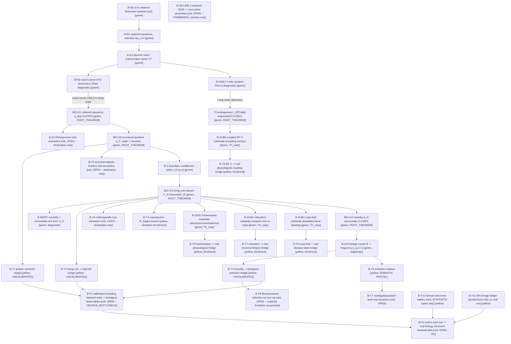

# Root DAG Master — Biology v0.1

**Standalone rule:** this file contains the complete 36-node Minimal Root-Native Biology DAG, not a
pointer elsewhere. Every node below corresponds to a `rule_id` in `RULE_REGISTRY.json`. Root `B-R0`
(`a != b`) is the master retained distinction — the SAME root as `../relativity/` and `../quantum/`,
nothing here is a new axiom. This DAG is a readout of `source_root/READOUT_GENESIS_CORE_SNAPSHOT.md`.

**The overriding discipline (do not blur this):** *TWO LINES THAT MUST NEVER BE MIXED* (founder,
2026-07-21). **LINE-1 ROOT-NATIVE** (this DAG) grows only from the retained-difference root — no DNA,
cell, enzyme, fitness, or external biology equation as a premise anywhere in this graph. **LINE-2
TEXTBOOK** (the curriculum 45/45 checklist) is a calculator for existing formulas, used only as a
checker/calibration reference — it carries no node in this DAG and must never be read as raising the
score below. Mixing the two would make the project look like it "closed biology 100%" when it only
"computes imported formulas."

Tier legend: `green` structurally closed (`ROOT_THEOREM`, exact-rational finite witness or `Th_coqc`) ·
`yellow` `PARTIAL_UNCALIBRATED` / `YELLOW_BRIDGE_PARTIAL` (formal-closed, semantic bridge open) ·
`red` `OPEN` (destination only, no witness yet) · `gray` measured/calibration adapter (none active in
this domain yet — that adapter is exactly what `B-X1` names as missing).



## The 36-node closure count (matches `biology_closure_v0_1.py` exactly)

| Tier | Count | Nodes |
|---|---|---|
| **green** | 17 | B-R0, B-R1, B-R2, B-R3, BIO-G1, BIO-G2, B-Z, BIO-G3, B-MORT, BIO-G4, B-LIN, T2, B-IONLY, B-SUB1, B-SUB2, B-SUB3, B-SUB4 |
| **yellow (partial)** | 11 | B-Y1, B-Y2, B-Y3, B-Y4, B-Y5, B-Y6, B-Y7, B-Y8, B-Y9, B-Y10, B-Y11 |
| **red (open)** | 8 | B-X1, B-X2, B-X3, B-X4, B-X5, B-X6, B-X7, B-X8 |
| **total** | **36** | strict green `17/36=47.2%` · weighted `(17+11/2)/36=22.5/36=62.5%` |

## The founder's post-closure reading (root -> ... -> real-calibration OPEN)

```
root (a!=b) -> ordered tape (B-R2) -> count-gate: N^G FAILS (B-R3)
  -> q_seq CLOSES (BIO-G1) -> q_F CLOSES, order!=function (BIO-G2)
    -> [protein semantic OPEN, B-Y1] -> enzyme semantics OPEN (B-X5)
  -> boundary-conditioned z_A (B-Z) -> V_A fixed point CLOSES (BIO-G3)
    -> {reproduction R_kappa declared (B-Y3), endogenous L(Theta) augmented CLOSES (T2)}
    -> [real-cell semantic OPEN, B-Y2] -> cell semantics OPEN (B-X4)
    -> mortality = exit from V_A (B-MORT)
    -> homeostasis/relax/cusp/EP-3 substrate GREEN (Coq), clinical bridges YELLOW (Dr)
  -> heredity q_H CLOSES (BIO-G4) -> lineage counts -> frequency (B-LIN, NO fitness var)
    -> evolution readout [SEMANTIC PARTIAL, B-Y5] -> ecology OPEN (B-X7)
    -> selection/fitness bridge UNCALIBRATED (B-Y4) -> fitness-as-root-var OPEN (B-X6)
-> real calibration [B-X1, CENTRAL OPEN BOTTLENECK] -> end-to-end real biology [B-X2, OPEN, 0%]
LINE-2 textbook 45/45 (B-X8): permanently red boundary, checker-only, NEVER promoted into this DAG.
```

## Non-drift rule

Every node above is composed **only** from the root's own retained-distinction structure (`B-R0`
through `B-R3`), the five bottleneck root theorems (`BIO-G1..G4`, `T2`), and the four re-verified
axiom-clean Coq substrate theorems (`B-SUB1..4`) — no DNA, gene, cell, enzyme, protein, fitness, or
named biology equation (Hodgkin-Huxley, Michaelis-Menten, Lotka-Volterra, Hardy-Weinberg) is imported
as a premise anywhere in this graph; each appears only as a still-`red`/`OPEN` destination node
(`B-X3..X7`) or an explicitly `yellow` bridge-partial connective (`B-Y1..Y11`). `B-X8` is kept in the
DAG solely as a permanent, explicit boundary marker so `LINE-2` can never silently drift into the
`LINE-1` score.
