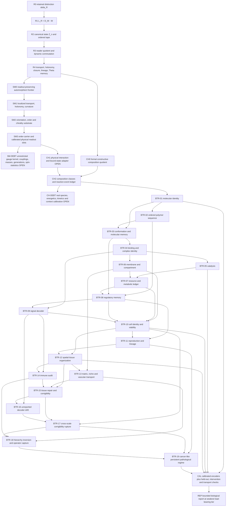

# Root-to-Biological Semantics DAG v0.2

> **Status:** semantic-compiler architecture, not end-to-end biological closure.
>
> The DAG preserves four non-interchangeable layers: root-native structure, Standard Model frontier,
> formal chemistry, and calibrated biological semantics. A downstream label never upgrades an upstream tier.

## Full DAG



## Critical non-borrowing cuts

1. `R4 -> SM0` does not mean the Standard Model is derived end-to-end.
2. `SM3 -> CH1` is an explicit open physical bridge, not free chemistry.
3. `CH2 -> BTR-01` does not identify a real molecule until a calibrated species encoder passes.
4. `BTR-10` does not identify a real cell from the fixed-point equation alone.
5. `BTR-19` is not a cancer diagnosis; it is a destination requiring pathology calibration and controls.

## Biological onset path

```text
measured regulatory-memory change
  -> tissue-visible report remains aliased
  -> same tissue signal produces a different cellular action
  -> epsilon_meta exceeds threshold
  -> orchestration no longer commutes
  -> joint admissible actions disappear
  -> measured tissue repair set becomes empty
  -> cellular viability persists
  -> n_star: cross-scale corrigibility rupture
  -> lineage-dependent matrix/stromal/vascular/immune rewriting
  -> local viability expands while tissue viability contracts
  -> hierarchy inversion and operator capture
  -> persistent pathological regime candidate
```

## Root equation to biological report

```text
delta_R
 -> L_R
 -> Z_{n+1}=F_n(Z_n)
 -> q_D F = F_D^sharp q_D
 -> ordered and functional assemblies
 -> bounded self-maintaining units
 -> lineage and composite viability
 -> emitted signals, decoder memory and reports
 -> cross-scale commutation and repair
 -> onset n_star
 -> operator capture
 -> calibrated biological report
```

## Honest status

- Root structure: mixed `Th_coqc`, `finite_diagnostic`, and `Dr`.
- Standard Model: frontier with node-level closures; unrestricted end-to-end closure remains open.
- Chemistry: formal composition quotient; real chemistry remains calibration-dependent.
- Biology compiler: architecture complete enough to name the missing observables and gates.
- Real biological semantics: open until calibrated against event-resolved measured data.
