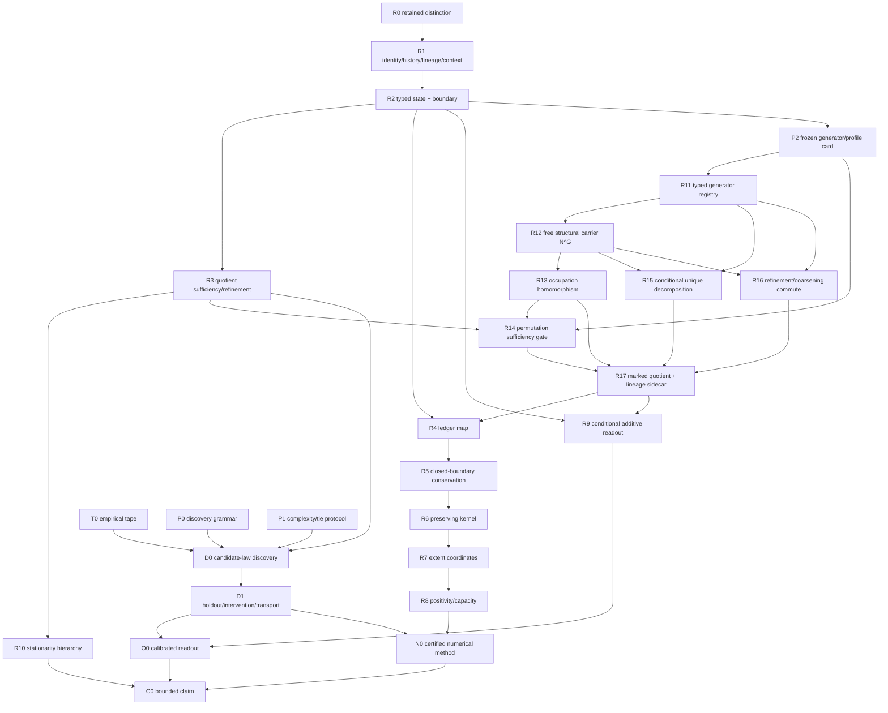

# Root DAG Master v0.910

**Standalone rule:** this file contains the complete DAG, not a pointer to v0.901. The byte-complete v0.901 release is also embedded under `anchor_v0_901/`.

## v0.910 non-drift rule

The mathematical carrier \(\mathbb N^G\) is commutative by construction. **The source domain is not declared commutative for free.** A source-to-count quotient is admitted only when every same-count pair has identical registered readout and successor signatures under every frozen context/intervention profile.

## Structural versus marked state

- Structural projection: occupation vector \(c\in\mathbb N^G\).
- Marked state: \((c,\lambda)\), where \(\lambda\) retains append-only lineage.
- Two histories may share structural projection while remaining distinct marked states.
