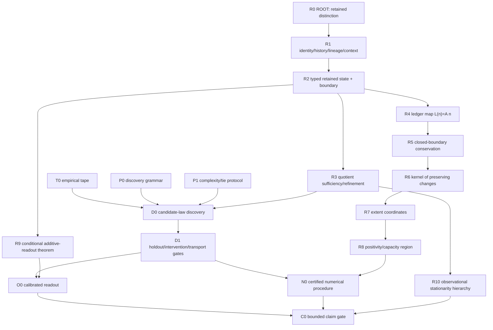

# Root DAG Master v0.901

**Status:** frozen for every descendant release.  A later release may add nodes only through an explicit delta; it may not delete, silently rename, or retype these nodes.

## Mandatory path labels

- **R:** root primitive or root theorem
- **P:** protocol chosen by the project, never called a law of nature
- **T:** empirical tape
- **D:** discovered domain law after independent gates
- **O:** calibrated readout
- **N:** numerical procedure

The forbidden shortcut is:

\[
R_0 \not\Rightarrow \text{a specific chemistry law without }T_0.
\]
