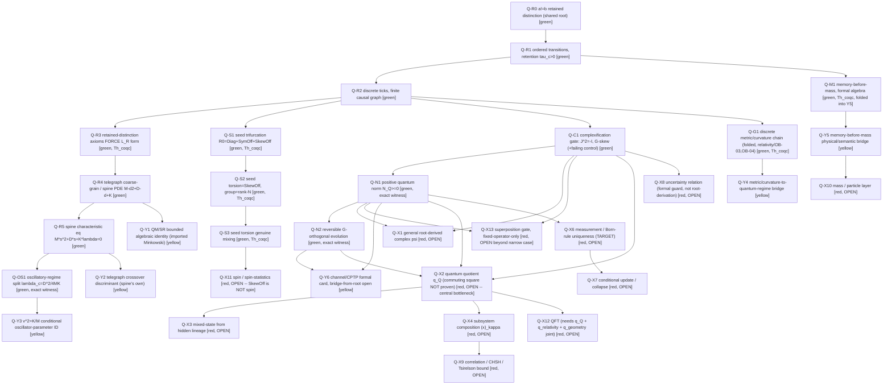
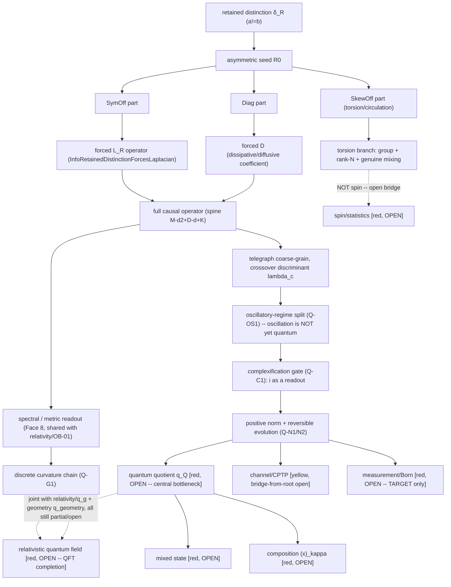

# Root DAG Master — Quantum v0.1

**Standalone rule:** this file contains the complete 32-node Quantum DAG, not a pointer elsewhere.
Every node below corresponds to a `rule_id` in `RULE_REGISTRY.json`. Root `Q-R0` (`a != b`) is the
master retained distinction — the SAME root as `relativity/`, nothing here is a new axiom. This DAG
is a readout of `source_root/READOUT_GENESIS_CORE_SNAPSHOT.md`.

**The overriding discipline (do not blur this):** *"oscillation is NOT yet quantum."* None of
`{i, psi, Hilbert space H, Born rule p=|psi|^2, tensor product ⊗, [A,B]=i*hbar, spin, particles,
creation/annihilation, vacuum, coupling constants}` is a premise anywhere in this graph — each is a
**destination** reached only by passing its own gate (see `RULE_REGISTRY.json` → `gates`). The word
"quantum" is licensed only when state + norm + composition + channel + measurement close **together**
— they do not, here. This DAG is 43.75% strict green / 53.1% weighted of *this 32-node DAG only*.

Tier legend: `green` Coq/formal-closed (`Th_coqc` or exact-rational finite witness) ·
`yellow` formal-closed / bridge-partial · `red` open · `gray` measured/calibration adapter (none
active in this domain yet).

## The 32-node closure count (matches `quantum_closure_v0_1.py` exactly)

| Tier | Count | Nodes |
|---|---|---|
| **green** | 14 | Q-R0, Q-R1, Q-R2, Q-R3, Q-R4, Q-R5, Q-OS1, Q-S1, Q-S2, Q-S3, Q-C1, Q-N1, Q-N2, Q-G1 |
| **yellow** | 6 | Q-Y1, Q-Y2, Q-Y3, Q-Y4, Q-Y5, Q-Y6 |
| **red (open)** | 12 | Q-X1, Q-X2, Q-X3, Q-X4, Q-X6, Q-X7, Q-X8, Q-X9, Q-X10, Q-X11, Q-X12, Q-X13 |
| **total** | **32** | strict green `14/32=43.75%` · weighted `(14+6/2)/32=17/32=53.1%` |

`Q-M1` (memory-before-mass, formal) is cited but **not** counted as an independent 33rd node — it is
the supporting Coq witness folded into `Q-Y5`'s yellow accounting (its physical-mass bridge is what
stays open/declared, matching the verifier's own inline accounting).

## Corrected unified causal-QG DAG (retained distinction → quantum completion)

The second view below is the founder's corrected unified DAG showing how the *same* root that feeds
`relativity/` also feeds the quantum branch, through the shared asymmetric-seed trifurcation and
forced-operator machinery — ending at the still-open relativistic-quantum-field node.

## Non-drift rule

Every node above is composed **only** from the root's own retained-distinction structure (`Q-R0`
through `Q-R5`), the asymmetric-seed trifurcation (`Q-S1..S3`), and the complexification/norm gates
(`Q-C1/N1/N2`) — no `i`, `psi`, Hilbert space, Born rule, tensor product, canonical commutator, spin,
particle, creation/annihilation operator, vacuum, or coupling constant is imported as a premise
anywhere in this graph; each appears only as a still-`red`/`OPEN` destination node or an explicitly
`yellow` bridge-partial connective. The one node folded in from `relativity/` (`Q-G1`, discrete
metric/curvature chain) is cited, not re-derived — it shares the same underlying `L_R` operator.

The `Q-Y1` (QM/SR bounded identity) node is explicitly never promoted past `yellow`: it inherits an
imported Minkowski signature from `relativity/`'s refused `InfoLorentzInvariance.v` chain (see
`PROVENANCE_CAUSAL_QG.md`) and must never be cited as "QM derived from one root."
