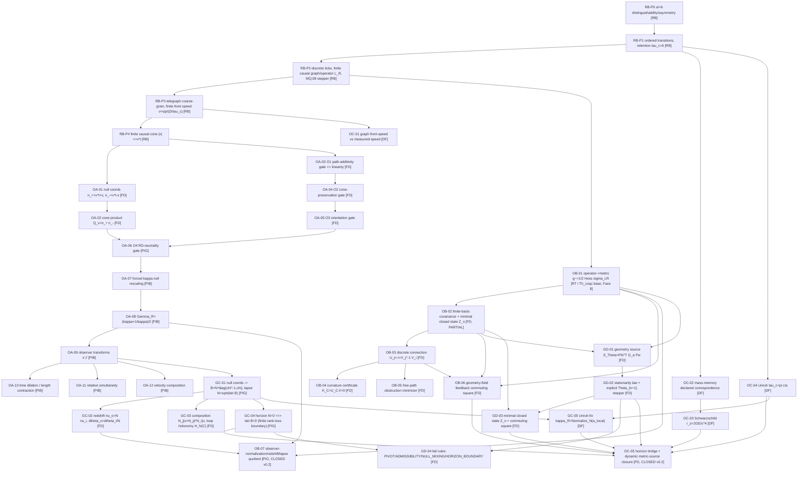
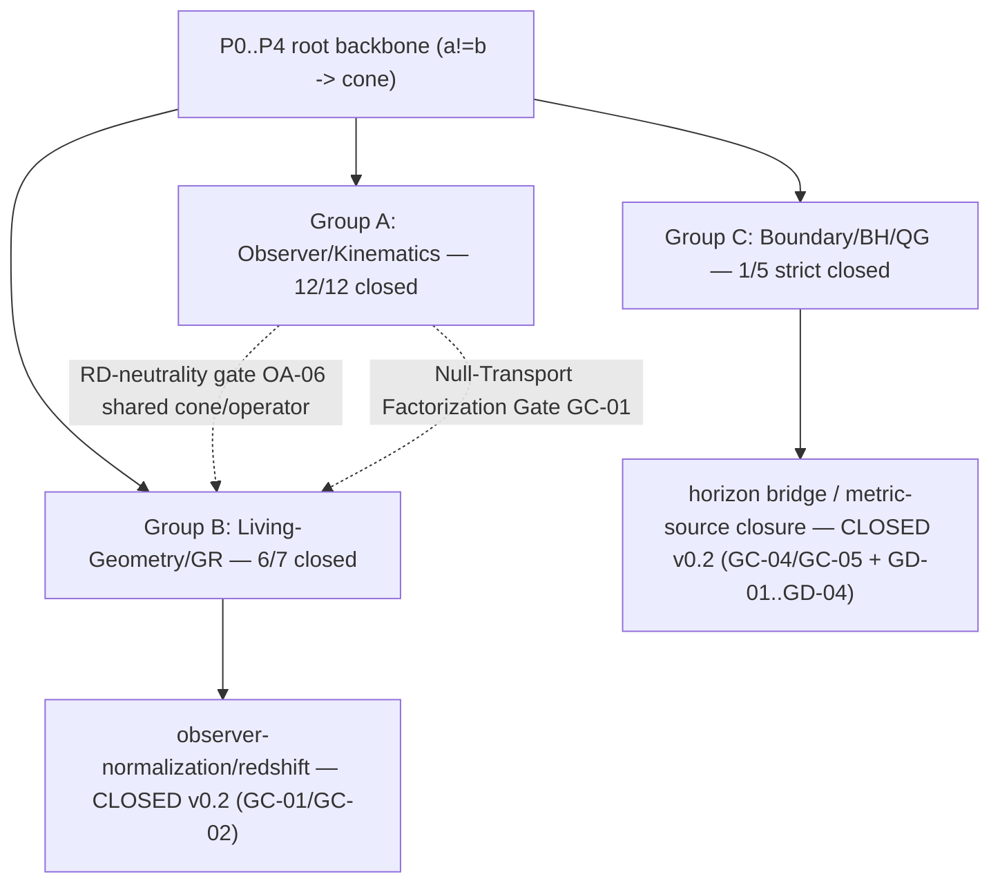

# Root DAG Master — Relativity v0.2

**Standalone rule:** this file contains the complete DAG for the relativity domain, not a pointer
elsewhere. Every node below corresponds to a `rule_id` in `RULE_REGISTRY.json`. Root `P0`
(`a != b`) is the master retained distinction; nothing here is a new axiom — this DAG is a readout
of `source_root/READOUT_GENESIS_CORE_SNAPSHOT.md`.

Tier legend: `[RB]` ROOT_BACKBONE · `[RT]` ROOT_THEOREM · `[FD]` FINITE_DIAGNOSTIC ·
`[PIG]` PROPOSED_INTERNAL_GATE · `[PIB]` PROPOSED_INTERNAL_BRIDGE · `[DF]` DECLARED_FORMULA ·
`[OPEN]` unresolved bottleneck.

**v0.2 note:** OB-07 and OC-05, shown `[OPEN]` in v0.1, are now `[closed]` via two new internal
gates — `GC-*` (Null-Transport Factorization Gate, `[PIG]`/`[FD]`) and `GD-*` (Geometry
Stationarity Gate, `[FD]`) — added below as new DAG nodes, each with its own `rule_id` in
`RULE_REGISTRY.json`. Both gates are FINITE INTERNAL CLOSURE (algebraic), never `[Th_coqc]` and
never real physics.

## Post-closure summary DAG (audit view)

The 24-node **Minimal Relativity DAG** used for the closure audit (`CLOSURE_AUDIT.json`) is the
coarser grouping of the graph above into three arms sharing the root cone/operator:

v0.2 lift on this DAG: strict `17/24=70.8% -> 19/24=79.2%`, weighted `19.5/24=81.25% -> 21.5/24=89.6%`.
The five nodes still `partial` (OB-02, OC-01, OC-02, OC-03, OC-04) are exactly the real-physics
calibration gaps — see `CLOSURE_AUDIT.json` → `remaining_bottlenecks_for_real_physics_tier`.

## Non-drift rule

The cone product `Q_v` and every downstream observer-cone node are composed **only** from the root's
own two null edges (`n_+`, `n_-`); no Minkowski interval, Lorentz transformation, or any other named
relativity/geometry law is imported as a premise anywhere in this graph. The one exception admitted
into `[Th_coqc]` is the single operator-to-metric direction of `OB-01`, inherited verbatim from the
master core's Face 8 — the reverse direction (spectrum alone determining the metric) stays forbidden.

The `GC-*` and `GD-*` nodes added in v0.2 are built the same way: `GC-01`'s lapse `N=sqrt(det B)` is
composed only from the diagonal observer map's own determinant (no named lapse function imported);
`GD-01`'s geometry source `S_Theta=Phi^T G_a Psi` is composed only from the root's own reader/record
fields and the geometry operator's own `Theta`-derivative (no named stress-energy tensor imported).
No new node in this file is tagged `[Th_coqc]`; the only `[Th_coqc]` node in the whole DAG remains
`OB-01`'s forward direction.
